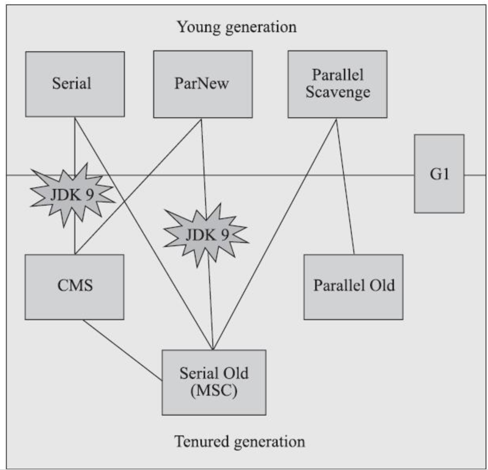
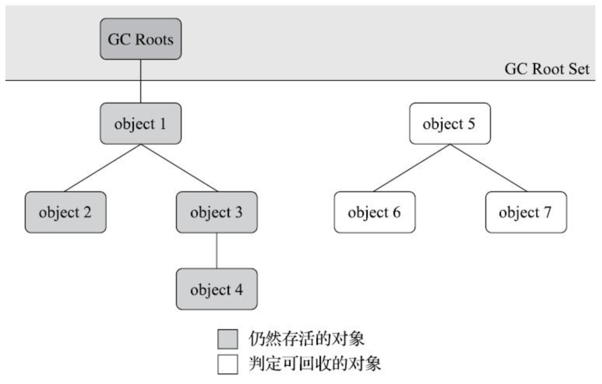

## Java面试题库
### 一、数据库
#### 1. 请你说说MySQL索引，以及它们的好处和坏处
**得分点**： 检索效率、存储资源、索引维护
**标准回答**： 索引就像指向表行的指针,是一种允许查询操作快速确定哪些行符合`WHERE`子句中的条件,并检索到这些行的其他列值的数据结构； 索引主要有普通索引、唯一索引、主键索引、外键索引、全文索引、复合索引几种； 在大数据量的查询中,合理使用索引的优点非常明显,不仅能大幅提高匹配`WHERE`条件的检索效率,还能用于排序和分组操作的加速。 当然索引如果使用不当也有比较大的坏处：比如索引必定会增加存储资源的消耗；同时也增大了插入、更新和删除操作的维护成本,因为每个增删改操作后相应列的索引都必须被更新。
**加分回答**： 只要创建了索引,就一定会走索引吗？ 不一定。 比如,在使用组合索引的时候,如果没有遵从“最左前缀”的原则进行搜索,则索引是不起作用的。 举例,假设在`id、name、age`字段上已经成功建立了一个名为`MultiIdx`的组合索引。索引行中按`id、name、age`的顺序存放,索引可以搜索`id、(id,name)、(id, name, age)`字段组合。如果列不构成索引最左面的前缀,那么MySQL不能使用局部索引,如`(age)`或者`(name,age)`组合则不能使用该索引查询。
#### 2. 请你说说乐观锁和悲观锁
**得分点**： 乐观锁、悲观锁定义及使用场景
**标准回答**： **乐观锁**：乐观锁总是假设最好的情况,每次去拿数据的时候都认为别人不会修改,所以不会上锁,但是在更新的时候会判断一下在此期间别人有没有去更新这个数据,可以使用版本号机制和CAS算法实现。乐观锁适用于多读的应用类型,这样可以提高吞吐量,像数据库提供的类似于`write_condition`机制,其实都是提供的乐观锁。 **悲观锁**：悲观锁总是假设最坏的情况,每次去拿数据的时候都认为别人会修改,所以每次在拿数据的时候都会上锁,这样别人想拿这个数据就会阻塞直到它拿到锁（共享资源每次只给一个线程使用,其它线程阻塞,用完后再把资源转让给其它线程）。传统的关系型数据库里边就用到了很多这种锁机制,比如行锁,表锁等,读锁,写锁等,都是在做操作之前先上锁。
**加分回答**: 两种锁的使用场景 乐观锁： `git, svn, cvs`等代码版本控制管理器,就是一个乐观锁使用很好的场景,例如：A、B程序员,同时从SVN服务器上下载了`code.html`文件,当A完成提交后,此时B再提交,那么会报版本冲突,此时需要B进行版本处理合并后,再提交到服务器。这其实就是乐观锁的实现全过程。如果此时使用的是悲观锁,那么意味者所有程序员都必须一个一个等待操作提交完,才能访问文件,这是难以接受的。 悲观锁： 悲观锁的好处在于可以减少并发,但是当并发量非常大的时候,由于锁消耗资源、锁定时间过长等原因,很容易导致系统性能下降,资源消耗严重。因此一般我们可以在并发量不是很大,并且出现并发情况导致的异常用户和系统都很难以接受的情况下,会选择悲观锁进行。
#### 3. 请你说说MySQL的事务隔离级别
**得分点**： 未提交读、已提交读、可重复读、可串行化
**标准回答**： $SQL$标准定义了四种隔离级别,这四种隔离级别分别是：读未提交(`READ UNCOMMITTED`)；读提交(`READ COMMITTED`)；可重复读(`REPEATABLE READ`)；串行化(`SERIALIZABLE`)。 事务隔离是为了解决脏读、不可重复读、幻读问题,下表展示了 4 种隔离级别对这三个问题的解决程度：
| 隔离级别 | 脏读 | 不可重复读 | 幻读 |
| ----- | ----- | ----- | ----- |
| READ UNCOMMITTED | 可能 | 可能 | 可能 |
| READ COMMITTED | 不可能 | 可能 | 可能 |
| REPEATABLE READ | 不可能 | 不可能 | 可能 |
| SERIALIZABLE | 不可能 | 不可能 | 不可能 |

上述4种隔离级别$MySQL$都支持,并且$InnoDB$存储引擎默认的支持隔离级别是`REPEATABLE READ`,但是与标准$SQL$不同的是, $InnoDB$存储引擎在`REPEATABLE READ`事务隔离级别下,使用$Next-Key `Lock`$的锁算法,因此避免了幻读的产生。所以, $InnoDB$存储引擎在默认的事务隔离级别下已经能完全保证事务的隔离性要求,即达到$SQL$标准的`SERIALIZABLE`隔离级别；
**加分回答**： `READ UNCOMMITTED`： 它是性能最好、也最野蛮的方式,因为它压根儿就不加锁,所以根本谈不上什么隔离效果,可以理解为没有隔离。 `SERIALIZABLE`： 读的时候加共享锁,其他事务可以并发读,但是不能写。写的时候加排它锁,其他事务不能并发写也不能并发读。 `REPEATABLE READ & READ COMMITTED`： 为了解决不可重复读,$MySQL$采用了$MVCC$(多版本并发控制) 的方式。 我们在数据库表中看到的一行记录可能实际上有多个版本,每个版本的记录除了有数据本身外,还要有一个表示版本的字段,记为`row trx_id`,而这个字段就是使其产生的事务的`id`,事务`ID`记为`transaction id`,它在事务开始的时候向事务系统申请,按时间先后顺序递增。
#### 4. 请你说说聚簇索引和非聚簇索引
**得分点**： 索引即数据、二次查询
**标准回答**： 两者主要区别是数据和索引是否分离。聚簇索引是将数据与索引存储到一起,找到索引也就找到了数据；而非聚簇索引是将数据和索引存储分离开,索引树的叶子节点存储了数据行的地址。 在$InnoDB$中,一个表有且仅有一个聚簇索引（因为原始数据只留一份,而数据和聚簇索引在一起）,并且该索引是建立在主键上的,即使没有指定主键,也会特殊处理生成一个聚簇索引；其他索引都是辅助索引,使用辅助索引访问索引外的其他字段时都需要进行二次查找。 而在$MyISAM$中,所有索引都是非聚簇索引,叶子节点存储着数据的地址,对于主键索引和普通索引在存储上没有区别。
**加分回答**: 在$InnoDB$存储引擎中,可以将B+树索引分为聚簇索引和辅助索引（非聚簇索引）。无论是何种索引,每个页的大小都为$16KB$,且不能更改。 聚簇索引是根据主键创建的一棵B+树,聚簇索引的叶子节点存放了表中的所有记录。辅助索引是根据索引键创建的一棵B+树,与聚簇索引不同的是,其叶子节点仅存放索引键值,以及该索引键值指向的主键。也就是说,如果通过辅助索引来查找数据,那么当找到辅助索引的叶子节点后,很有可能还需要根据主键值查找聚簇索引来得到数据,这种查找方式又被称为书签查找。因为辅助索引不包含行记录的所有数据,这就意味着每页可以存放更多的键值,因此其高度一般都要小于聚簇索引。
#### 5. 数据库为什么不用红黑树而用B+树
**得分点**： 磁盘IO
**标准回答**： 首先,红黑树是一种近似平衡二叉树（不完全平衡）,结点非黑即红的树,它的树高最高不会超过$2log(n)$,因此查找的时间复杂度为$O(log(n))$,无论是增删改查,它的性能都十分稳定； 但是,红黑树本质还是二叉树,在数据量非常大时,需要访问判断的节点数还是会比较多,同时数据是存在磁盘上的,访问需要进行磁盘IO,导致效率较低； 而B+树是多叉的,可以有效减少磁盘IO次数；同时B+树增加了叶子结点间的连接,能保证范围查询时找到起点和终点后快速取出需要的数据。
**加分回答**： 红黑树做索引底层数据结构的缺陷 试想一下,以红黑树作为底层数据结构在面对在些表数据动辄数百万数千万的场景时,创建的索引它的树高得有多高？ 索引从根节点开始查找,而如果我们需要查找的数据在底层的叶子节点上,那么树的高度是多少,就要进行多少次查找,数据存在磁盘上,访问需要进行磁盘IO,这会导致效率过低； 那么红黑树作为索引数据结构的弊端即是：树的高度过高导致查询效率变慢。
#### 6. 请你说说$InnoDB$和$MyISAM$的区别
**得分点**： 事务、锁、读写性能、存储结构
**标准回答**： InnoDB是具有事务、回滚和崩溃修复能力的事务安全型引擎,它可以实现行级锁来保证高性能的大量数据中的并发操作；MyISAM是具有默认支持全文索引、压缩功能及较高查询性能的非事务性引擎。具体来说,可以在以下角度上形成对比：
| 引擎 | InnoDB | MyISAM |
|-----| -----  | -----  |
| 事务 | 支持    | 不支持  |
| 数据锁| 行级锁 | 表级锁 |
| 读写性能| 增删改更优 | 查询更优|
| 全文索引 | 不支持（可通过插件支持）| 默认支持|
| 外键 | 支持 | 不支持|
| 存储结构 | 一个文件 | 三个文件（表定义、数据、索引）|
| 存储空间 | 需要更多内存和存储 | 静态表（默认）、动态表、压缩表|
| 移植 | 数据量小时可通过拷贝数据文件、备份`binlog`、`mysqldump`工具移植 | 可单独对某个表通过拷贝表文件移植|
| 崩溃恢复 | 有崩溃恢复机制 | 无 |
默认推荐：InnoDB是`MySQL5.5`之后的默认引擎。
**加分回答**： InnoDB中行级锁是怎么实现的？ InnoDB行级锁是通过给索引上的索引项加锁来实现的。只有通过索引条件检索数据,InnoDB才使用行级锁,否则,InnoDB将使用表锁。 当表中锁定其中的某几行时,不同的事务可以使用不同的索引锁定不同的行。另外,不论使用主键索引、唯一索引还是普通索引,InnoDB都会使用行锁来对数据加锁。
#### 7. 请你说说索引怎么实现的B+树,为什么选这个数据结构
**得分点**： B+树、叶子节点建立连接
**标准回答**： 索引本质上就是通过预排序+树型结构来加快检索的效率,而MySQL中使用InnoDB和MyISAM引擎时都使用了B+树实现索引。 它是一棵平衡多路查找树,是在二叉查找树基础上的改进数据结构。在二叉查找树上查找一个数据时,最坏情况的查找次数为树的深度,当数据量很大时,查询次数可能还是很大,造成大量的磁盘IO,从而影响查询效率； 为了减少磁盘IO的次数,必须降低树的深度,因此在二叉查找树基础上将树改成了多叉加上一些限制条件,就形成了B树； B+树中所有叶子节点值的总集就是全部关键字集合；B+树为所有叶子节点增加了链接,从而实现了快速的范围查找； 在B+树中,所有记录节点都是按键值的大小顺序存放在同一层的叶子节点上,由各叶子节点指针进行连接。在数据库中,B+树的高度一般都在2～4层,这也就是说查找某一键值的行记录时最多只需要2到4次IO。这很不错,因为当前一般的机械磁盘每秒至少可以做$100$次IO,2～4次的IO意味着查询时间只需$0.02～0.04$秒。 在数据库中,B+树索引还可以分为聚集索引和辅助索引,但不管是聚集索引还是辅助索引,其内部都是B+树的,即高度平衡的,叶子节点存放着所有的数据。聚集索引与辅助索引不同的是,叶子节点存放的是否是一整行的信息。
#### 8. 请你说说数据库引擎有哪些,各自有什么区别
**得分点**： InnoDB、MyISAM、Memory
**标准回答**： InnoDB 引擎是 MySQL 的事务安全（ACID 兼容）存储引擎,具有提交、回滚和崩溃恢复功能来保护用户数据；行级锁定读取增加了多用户并发性和性能；将用户数据存储在聚集索引中,以减少基于主键的常见查询的I/O；还支持 `FOREIGN KEY `维护数据完整性。 MyISAM引擎的表占用空间较小,表级锁定限制了读/写工作负载的性能,因此它通常用于只读或以读取为主的场景。 Memory引擎是将所有数据存储在 RAM 中,以便在需要快速查找非关键数据的环境中进行快速访问,以前被称为 HEAP 引擎。 Archive引擎非常适合存储大量的独立的,作为历史记录的数据,因为它们不经常被读取。它 拥有高效的插入速度,但其对查询的支持相对较差。 Cluster/NDB是高冗余的存储引擎,用多台数据机器联合提供服务以提高整体性能和安全性。适合数据量大,安全和性能要求高的应用。 Federated引擎提供连接单独的 MySQL 服务器,从多个物理服务器创建一个逻辑数据库的能力,非常适合分布式或数据集市环境。
#### 9. 请你说说数据库索引的底层数据结构
**得分点**： B+树
**标准答案**： 索引可选的底层数据机构包括：二叉树、红黑树、`hash`、`B-tree`. 但mysql索引的底层用的并不是二叉树和红黑树。因为二叉树和红黑树在某些场景下都会暴露出一些缺陷。 首先,二叉树在某些场景下会退化成链表,而链表的查找需要从头部开始遍历,而这就失去了加索引的意义。 不使用红黑树的原因是：红黑树作为底层数据结构在面对在些表数据动辄数百万数千万的场景时,会导致索引树的层数很高。索引从根节点开始查找,而如果我们需要查找的数据在底层的叶子节点上,那么树的高度是多少,就要进行多少次查找,数据存在磁盘上,访问需要进行磁盘IO,这会导致效率过低； 而B+树由B树和索引顺序访问方法演化而来,它是为磁盘或其他直接存取辅助设备设计的一种平衡查找树,在B+树中,所有记录节点都是按键值的大小顺序存放在同一层的叶子节点,各叶子节点通过指针进行链接。 B+树索引在数据库中的一个特点就是高扇出性,例如在InnoDB存储引擎中,每个页的大小为$16KB$。在数据库中,B+树的高度一般都在2～4层,这意味着查找某一键值最多只需要2到4次IO操作,这还不错。因为现在一般的磁盘每秒至少可以做$100$次IO操作,2～4次的IO操作意味着查询时间只需$0.02～0.04$秒。
#### 10. 请你讲讲B树和B+树
**得分点**： 平衡多路查找树、磁盘IO
**标准回答**： 它们都是平衡多路查找树,是在二叉查找树基础上的改进数据结构。在二叉查找树上查找一个数据时,最坏情况的查找次数为树的深度,当数据量很大时,查询次数可能还是很大,造成大量的磁盘IO,从而影响查询效率； 为了减少磁盘IO的次数,必须降低树的深度,因此在二叉查找树基础上将树改成了多叉加上一些限制条件,就形成了B树； B+树是B树的变种,区别主要是：对于$k$阶的B树,每个中间节点只存$k-1$个值$k$个指针,而B+树存$k$个值和$k$个指针；B树中所有节点中值的总集是全部关键字集合,而B+树中所有叶子节点值的总集就是全部关键字集合；B+树为所有叶子节点增加了链接,从而实现了快速的范围查找；
**加分回答**： B+树由B树和索引顺序访问方法演化而来,它是为磁盘或其他直接存取辅助设备设计的一种平衡查找树,在B+树中,所有记录节点都是按键值的大小顺序存放在同一层的叶子节点,各叶子节点通过指针进行链接。 B+树索引在数据库中的一个特点就是高扇出性,例如在InnoDB存储引擎中,每个页的大小为$16KB$。在数据库中,B+树的高度一般都在2～4层,这意味着查找某一键值最多只需要2到4次IO操作,这还不错。因为现在一般的磁盘每秒至少可以做$100$次IO操作,2～4次的IO操作意味着查询时间只需$0.02～0.04$秒。
#### 11. MySQL主从同步是如何实现的
**标准答案**： 复制（replication）是MySQL数据库提供的一种高可用高性能的解决方案,一般用来建立大型的应用。总体来说,replication的工作原理分为以下3个步骤： 1. 主服务器（master）把数据更改记录到二进制日志（binlog）中。 2. 从服务器（slave）把主服务器的二进制日志复制到自己的中继日志（relay log）中。 3. 从服务器重做中继日志中的日志,把更改应用到自己的数据库上,以达到数据的最终一致性。 复制的工作原理并不复杂,其实就是一个完全备份加上二进制日志备份的还原。不同的是这个二进制日志的还原操作基本上实时在进行中。这里特别需要注意的是,复制不是完全实时地进行同步,而是异步实时。这中间存在主从服务器之间的执行延时,如果主服务器的压力很大,则可能导致主从服务器延时较大。
#### 12. 请你介绍一下数据库的ACID
**得分点**： 原子性、一致性、隔离性、持久性
**标准回答**： 事务可由一条非常简单的`SQL`语句组成,也可以由一组复杂的`SQL`语句组成。在事务中的操作,要么都执行修改,要么都不执行,这就是事务的目的,也是事务模型区别于文件系统的重要特征之一。 事务需遵循ACID四个特性：
- $A$（$atomicity$）,原子性。原子性指整个数据库事务是不可分割的工作单位。只有使事务中所有的数据库操作都执行成功,整个事务的执行才算成功。事务中任何一个`SQL`语句执行失败,那么已经执行成功的`SQL`语句也必须撤销,数据库状态应该退回到执行事务前的状态。
- $C$（$consistency$）,一致性。一致性指事务将数据库从一种状态转变为另一种一致的状态。在事务开始之前和事务结束以后,数据库的完整性约束没有被破坏。
- $I$（$isolation$）,隔离性。事务的隔离性要求每个读写事务的对象与其他事务的操作对象能相互分离,即该事务提交前对其他事务都不可见,这通常使用锁来实现。
- $D$（$durability$） ,持久性。事务一旦提交,其结果就是永久性的,即使发生宕机等故障,数据库也能将数据恢复。持久性保证的是事务系统的高可靠性,而不是高可用性。

**加分回答**： 事务可以分为以下几种类型：
- 扁平事务：是事务类型中最简单的一种,而在实际生产环境中,这可能是使用最为频繁的事务。在扁平事务中,所有操作都处于同一层次,其由`BEGIN WORK`开始,由`COMMIT WORK`或`ROLLBACK WORK`结束。处于之间的操作是原子的,要么都执行,要么都回滚。
- 带有保存点的扁平事务：除了支持扁平事务支持的操作外,允许在事务执行过程中回滚到同一事务中较早的一个状态,这是因为可能某些事务在执行过程中出现的错误并不会对所有的操作都无效,放弃整个事务不合乎要求,开销也太大。保存点（savepoint）用来通知系统应该记住事务当前的状态,以便以后发生错误时,事务能回到该状态。
- 链事务：可视为保存点模式的一个变种。链事务的思想是：在提交一个事务时,释放不需要的数据对象,将必要的处理上下文隐式地传给下一个要开始的事务。注意,提交事务操作和开始下一个事务操作将合并为一个原子操作。这意味着下一个事务将看到上一个事务的结果,就好像在一个事务中进行的。
- 嵌套事务：是一个层次结构框架。有一个顶层事务（top-level transaction）控制着各个层次的事务。顶层事务之下嵌套的事务被称为子事务（subtransaction）,其控制每一个局部的变换。
- 分布式事务：通常是一个在分布式环境下运行的扁平事务,因此需要根据数据所在位置访问网络中的不同节点。对于分布式事务,同样需要满足ACID特性,要么都发生,要么都失效。

对于MySQL的InnoDB存储引擎来说,它支持扁平事务、带有保存点的扁平事务、链事务、分布式事务。对于嵌套事务,MySQL数据库并不是原生的,因此对于有并行事务需求的用户来说MySQL就无能为力了,但是用户可以通过带有保存点的事务来模拟串行的嵌套事务。
#### 13. 请你说说数据库的索引是什么结构,为什么不用哈希表
**得分点**: B+树、内存资源
**标准回答**: MySQL中的索引B+树实现的； 哈希表的查询效率的确最高,时间复杂度$O(1)$,但是它要求将所有数据载入内存,而数据库存储的数据量级可能会非常大,全部载入内存基本上是不可能实现的； B+树可以分段加载需要的节点数据,可以在内存资源有限的前提下,极大提高查询效率
#### 14. 请你说说InnoDB的MVCC
**得分点**： 无锁并发
**标准回答**： 全称 Multi-Version Concurrency Control ,即多版本并发控制,逻辑是维持一个数据的多个版本,使得读写操作没有冲突。MVCC主要是为了提高数据库并发性能,用更好的方式去处理读-写冲突,做到即使有读写冲突时,也能做到不加锁,非阻塞并发读。 它是一种用来解决读-写冲突的无锁并发控制机制。在并发读写数据库时,可以做到在读操作时不用阻塞写操作,写操作也不用阻塞读操作,提高了数据库并发读写的性能,还可以解决脏读、幻读、不可重复读等事务隔离问题,但不能解决更新丢失问题。
**加分回答**： InnoDB默认的隔离级别是RR（`REPEATABLE READ`）,RR解决脏读、不可重复读、幻读等问题,使用的是MVCC。MVCC全称Multi-Version Concurrency Control,即多版本的并发控制协议。它最大的优点是读不加锁,因此读写不冲突,并发性能好。InnoDB实现MVCC,多个版本的数据可以共存,主要基于以下技术及数据结构：
1. 隐藏列：InnoDB中每行数据都有隐藏列,隐藏列中包含了本行数据的事务id、指向undo log的指针等。
2. 基于`undo log`的版本链：每行数据的隐藏列中包含了指向`undo log`的指针,而每条`undo log`也会指向更早版本的`undo log`,从而形成一条版本链。
3. `ReadView`：通过隐藏列和版本链,MySQL可以将数据恢复到指定版本。但是具体要恢复到哪个版本,则需要根据`ReadView`来确定。所谓`ReadView`,是指事务（记做事务A）在某一时刻给整个事务系统（`trx_sys`）打快照,之后再进行读操作时,会将读取到的数据中的事务`id`与`trx_sys`快照比较,从而判断数据对该ReadView是否可见,即对事务A是否可见。

### 设计模式
#### 1. 设计模式了解么
**得分点**： 单例模式、工厂模式
**标准回答**： 创建型包括：单例模式、工厂方法模式、抽象工厂模式、建造者模式和原型模式； 结构型包括：代理模式、装饰模式、适配器模式、组合模式、桥梁模式、外观模式和享元模式； 行为型包括：模板方法模式、命令模式、责任链模式、策略模式、迭代器模式、中介者模式、观察者模式、备忘录模式、访问者模式、状态模式和解释器模式。 面试中不要求23种设计模式全部了解,但至少应掌握单例模式和工厂模式。
**加分回答**： 可以说出知道的框架所用到的设计模式或底层设计模式,例如Spring中的单例模式、工厂模式,AQS的模板模式等等。
#### 2. 请你讲讲单例模式、请你手写一下单例模式
**得分点**： 饿汉式单例模式、懒汉式单例模式、线程安全的懒汉式单例模式
**标准回答**： 单例模式（Singleton Pattern）是最简单的创建型设计模式。它会确保一个类只有一个实例存在。单例模式最重要的特点就是构造函数私有,从而避免外界直接使用构造函数直接实例化该类的对象。 单例模式在`Java`中通常有两种表现形式：
- 饿汉式：类加载时就进行对象实例化
- 懒汉式：第一次引用类时才进行对象实例化

饿汉式单例模式：
```cpp
class Singleton {
private:
    static Singleton* instance;
    Singleton() {} // 私有构造函数，防止外部创建对象

public:
    static Singleton* getInstance() {
        if (instance == `null`ptr) {
            instance = new Singleton();
        }
        `return` instance;
    }
};

Singleton* Singleton::instance = nullptr; // 初始化静态成员变量

int main() {
    Singleton* obj1 = Singleton::getInstance();
    Singleton* obj2 = Singleton::getInstance();

    if (obj1 == obj2) {
        std::cout << "obj1 and obj2 are the same instance." << std::endl;
    } else {
        std::cout << "obj1 and obj2 are different instances." << std::endl;
    }

    return 0;
}
```
懒汉式单例模式：
```java
public class Singleton {
    private static Singleton instance = new Singleton(); // 静态私有成员变量，直接创建实例对象

    private Singleton() {} // 私有构造函数，防止外部创建对象

    public static Singleton getInstance() {
        return instance;
    }
}

public class Main {
    public static void main(String[] args) {
        Singleton obj1 = Singleton.getInstance();
        Singleton obj2 = Singleton.getInstance();

        if (obj1 == obj2) {
            System.out.println("obj1 and obj2 are the same instance.");
        } else {
            System.out.println("obj1 and obj2 are different instances.");
        }
    }
}
```

**加分回答**： 单例模式的优点：
- 在一个对象需要频繁的销毁、创建,而销毁、创建性能又无法优化时,单例模式的优势尤其明显
- 在一个对象的产生需要比较多资源时,如读取配置、产生其他依赖对象时,则可以通过在启用时直接产生一个单例对象,然后用永久驻留内存的方式来解决
- 单例模式可以避免对资源的多重占用,因为只有一个实例,避免了对一个共享资源的并发操作
- 单例模式可以在系统设置全局的访问点,优化和共享资源访问

单例模式的缺点：
- 单例模式无法创建子类,扩展困难,若要扩展,除了修改代码基本上没有第二种途径可以实现
- 单例模式对测试不利。在并行开发环境中,如果采用单例模式的类没有完成,是不能进行测试的
- 单例模式与单一职责原则有冲突。一个类应该只实现一个逻辑,而不关心它是否是单例的,是不是要用单例模式取决于环境

#### 3. 请你讲讲工厂模式，手写实现工厂模式
**得分点**： 简单工厂、工厂方法、抽象工厂
**标准回答**： 工厂模式（Factory Method Pattern）也叫虚拟构造函数模式或多态性工厂模式,其用意是定义一个创建产品对象的工厂接口,将实际创建性工作推迟到子类中。 工厂模式可以分为简单工厂、工厂方法和抽象工厂模式
- 简单工厂模式严格来讲并不算是一种设计模式,更多的时候是一种编程习惯。简单工厂的实现思路是,定义一个工厂类,根据传入的参数不同返回不同的实例,被创建的实例具有共同的父类或接口。简单工厂适用于需要创建的对象较少或客户端不关心对象的创建过程的情况。代码如下：
```java
// 抽象产品类
interface Product {
    void operation();
}

// 具体产品类A
class ConcreteProductA implements Product {
    public void operation() {
        System.out.println("ConcreteProductA::operation()");
    }
}

// 具体产品类B
class ConcreteProductB implements Product {
    public void operation() {
        System.out.println("ConcreteProductB::operation()");
    }
}

// 简单工厂类
class SimpleFactory {
    // 根据传入的参数创建对应的产品对象
    public static Product createProduct(int productType) {
        if (productType == 1) {
            return new ConcreteProductA();
        } else if (productType == 2) {
            return new ConcreteProductB();
        } else {
            return null;
        }
    }
}

public class Main {
    public static void main(String[] args) {
        // 使用简单工厂创建具体产品对象
        Product productA = SimpleFactory.createProduct(1);
        Product productB = SimpleFactory.createProduct(2);

        // 调用产品对象的操作方法
        productA.operation();
        productB.operation();
    }
}
```

- 工厂方法模式：工厂方法模式具有良好的封装性,代码结构清晰,一个对象创建是有条件约束的,如果一个调用者需要一个具体的产品对象,只要知道这个产品的类名或约束字符串即可,不用知道创建对象的过程如何,降低了模块间的耦合。工厂模式还拥有优秀的可扩展性,在增加产品类的情况下,只要适当地修改具体的工厂类或扩展一个工厂类,就可以适应变化。工厂方法模式是典型的解耦框架,高层模块只需要知道产品的抽象类或接口,其他的实现类都不用关心。代码如下：
```java
interface Product {
    void operation();
}

class ConcreteProductA implements Product {
    @Override
    public void operation() {
        System.out.println("Concrete Product A");
    }
}

class ConcreteProductB implements Product {
    @Override
    public void operation() {
        System.out.println("Concrete Product B");
    }
}

interface Factory {
    Product createProduct();
}

class ConcreteFactoryA implements Factory {
    @Override
    public Product createProduct() {
        return new ConcreteProductA();
    }
}

class ConcreteFactoryB implements Factory {
    @Override
    public Product createProduct() {
        return new ConcreteProductB();
    }
}

public class Client {
    public static void main(String[] args) {
        Factory factoryA = new ConcreteFactoryA();
        Product productA = factoryA.createProduct();
        productA.operation();

        Factory factoryB = new ConcreteFactoryB();
        Product productB = factoryB.createProduct();
        productB.operation();
    }
}
```

- 抽象工厂模式（Abstract Factory Pattern）是一种比较常用的模式。为创建一组相关或相互依赖的对象提供一个接口,而且无须指定它们的具体类。抽象工厂模式是工厂方法模式的升级版本。在有多个业务品种、业务分类时,通过抽象工厂模式产生需要的对象是一种非常好的解决方式,抽象方法适用于下和工厂方法一样客户端不需要知道它所创建的对象的类,需要一组对象共同完成某种功能,可能存在多组对象完成不同功能以及系统结构稳定,不会频繁的增加对象的情况。代码如下：
```java
interface AbstractProductA {
    void operationA();
}

class ConcreteProductA1 implements AbstractProductA {
    @Override
    public void operationA() {
        System.out.println("Concrete Product A1");
    }
}

class ConcreteProductA2 implements AbstractProductA {
    @Override
    public void operationA() {
        System.out.println("Concrete Product A2");
    }
}

interface AbstractProductB {
    void operationB();
}

class ConcreteProductB1 implements AbstractProductB {
    @Override
    public void operationB() {
        System.out.println("Concrete Product B1");
    }
}

class ConcreteProductB2 implements AbstractProductB {
    @Override
    public void operation B() {
        System.out.println("Concrete Product B2");
    }
}

interface AbstractFactory {
    AbstractProductA createProductA();
    AbstractProductB createProductB();
}

class ConcreteFactory1 implements AbstractFactory {
    @Override
    public AbstractProductA createProductA() {
        return new ConcreteProductA1();
    }

    @Override
    public AbstractProductB createProductB() {
        return new ConcreteProductB1();
    }
}

class ConcreteFactory2 implements AbstractFactory {
    @Override
    public AbstractProductA createProductA() {
        return new ConcreteProductA2();
    }

    @Override
    public AbstractProductB createProductB() {
        return new ConcreteProductB2();
    }
}

public class Client {
    public static void main(String[] args) {
        AbstractFactory factory1 = new ConcreteFactory1();

        AbstractProductA productA1 = factory1.createProductA();
        AbstractProductB productB1 = factory1.createProductB();

        productA1.operationA();
        productB1.operationB();

        AbstractFactory factory2 = new ConcreteFactory2();

        AbstractProductA productA2 = factory2.createProductA();
        AbstractProductB productB2 = factory2.createProductB();

        productA2.operationA();
        productB2.operationB();
    }
}
```

### 三、计算机网络
#### 1. 请你说说TCP和UDP的区别
**得分点**： TCP 提供面向连接的可靠传输，UDP 提供面向无连接的不可靠传输。UDP 在很多实时性要求高的场景有很好的表现，而TCP在要求数据准确、对速度没有硬性要求的场景有很好的表现。
**标准回答**： 首先 UDP 协议和 TCP 协议都是运输层协议，都是为应用层程序服务，都具有复用（不同的应用层协议可以共用 UDP 协议和 TCP 协议）和分用（将数据报解析之后分发给不同的应用层程序）的功能。UDP 提供面向无连接基于数据报的不可靠传输，TCP 提供面向连接基于字节流的可靠传输。UDP 在很多实时性要求高的场景有很好的表现，而 TCP 在要求数据准确、对速度没有硬性要求的场景有很好的表现。
**加分回答**： 具体的区别详细描述可以是：
- UDP协议：面向无连接（不需要三次握手和四次挥手）、尽最大努力交付、面向报文（每次收发都是一整个报文段）、没有拥塞控制不可靠（只管发不管过程和结果）、支持一对一、一对多、多对一和多对多的通信方式、首部开销很小（8字节）。优点是快，没有TCP各种机制，少了很多首部信息和重复确认的过程，节省了大量的网络资源。缺点是不可靠不稳定，只管数据的发送不管过程和结果，网络不好的时候很容易造成数据丢失。又因为网络不好的时候不会影响到主机数据报的发送速率，这对很多实时的应用程序很重要，因为像语音通话、视频会议等要求源主机要以恒定的速率发送数据报，允许网络不好的时候丢失一些数据，但不允许太大的延迟，UDP很适合这种要求。
- TCP协议：是TCP/IP体系中非常复杂的一个协议，面向连接（需要三次握手四次挥手）、单播（只能端对端的连接）、可靠交付（有大量的机制保护TCP连接数据的可靠性）、全双工通讯（允许双方同时发送信息，也是四次挥手的原由）、面向字节流（不保留数据报边界的情况下以字节流的方式进行传输，这也是长连接的由来。）、头部开销大（最少20字节）。优点是可靠、稳定，有确认、窗口、重传、拥塞控制机制，在数据传完之后，还会断开连接用来节约系统资源。缺点是慢，效率低，占用系统资源高，在传递数据之前要先建立连接，这会消耗时间，而且在数据传递时，确认机制、重传机制、拥塞机制等都会消耗大量的时间，而且要在每台设备上维护所有的传输连接。在要求数据准确、对速度没有硬性要求的场景有很好的表现，比如在FTP（文件传输）、HTTP/HTTPS（超文本传输），TCP很适合这种要求。
#### 2. 请你说说 TCP 三次握手四次挥手过程
**得分点**：第一、二次分别包含数据通讯初始序号。第三次是必须的，为了防止已经失效的连接请求报文突然又被传送给了服务器端，然后产生错误。TCP是全双工通讯，客户端和服务器端都需要释放连接和接受确认，所以必须是四次挥手。
**标准回答**： 三次握手过程：
- 第一次握手：客户端向服务器端发送连接请求报文段，包含自身数据通讯初始序号，进入`SYN-SENT`状态。
- 第二次握手：服务器端收到连接请求报文段后，如果同意，发送应答，包含自身数据通讯初始序号，进入`SYN-RECEIVED`状态。
- 第三次握手：客户端收到应答，最后向服务器端发送确认报文，进入`ESTABLISHED`状态，此时成功建立长连接。

四次挥手过程：
- 第一次挥手：客户端认为数据发送完毕，需要向服务器端发送连接释放请求。
- 第二次挥手：服务器收到连接释放请求，告诉应用层释放TCP连接。然后发送ACK包，进入`CLOSE-WT`状态，此时表明客户端到服务器端的连接已经释放，不再接受客户端的数据。因为TCP是全双工的，所以服务器仍可以发送数据。
- 第三次挥手：当服务器端数据发送完毕，向客户端发送连接释放请求，进入`LAST-ACK`状态。
- 第四次挥手：客户端收到连接释放请求，向服务器端发送确认应答报文，此时客户端进入`TIME-WT`状态，持续2倍的MSL（最长报文段寿命），若期间没有收到服务器端的数据报文，进入`CLOSED`状态。服务器端收到确认应答后，也进入`CLOSED`状态。

**加分回答**： 以下是客户端向服务器端发起TCP连接的详细过程：
1. 客户端和服务器端刚开始都是处于`CLOSED`（关闭）状态。
2. 要注意的是客户端主动打开连接，而服务器端是被动打开连接的。
3. 服务器端的进程先创建TCB（传输控制块）准备接受客户端的连接请求。
4. 客户端的进程也是先创建TCB（传输控制块），然后向服务器端发出连接请求报文段，这个报文段中的同步位SYN置为1，同时选择一个初始序号`seq=x`。TCP协议规定了`SYN=1`的报文段不可以携带数据，但是要消耗掉一个序号。这个时候客户端进入`SYN-SENT`状态。
5. 服务器端收到连接请求报文之后，如果同意连接，就给客户端发送确认响应。在确认报文中应该将同步位`SYN`和`ACK`都置为1，而确认号是`ACK+1`。这时候服务器端也需要给自己选一个初始序号`seq=y`。值得注意的是这个确认报文也不能携带数据，同样要消耗掉一个序号。这时服务器端进入`SYN-RECEIVED`状态。
6. 客户端进程收到服务器端的确认报文，最后还要向服务器端给出确认。确认报文段的`ACK`置为1，确认号是`y+1`，而自己的序号`seq=x+1`。TCP标准规定，ACK报文段可以携带数据，但是如果不携带数据就不消耗序号。在这个情况下，下一个数据报文的序号仍然是`seq=x+1`。到这时，TCP连接已经成功建立，A进入`ESTABLISHED`（已建立连接）状态。 到此TCP连接三次握手的过程就全部结束了。

***但是为什么一定要三次握手而不是两次，为什么客户端最后还需要发送一次确认报文呢？***
其实主要是为了防止已经失效的连接请求报文突然又被传送给了服务器端，然后产生错误。假设现在有一种情况，客户端发出的第一个连接请求报文段并没有丢失而是在某些网络节点上被滞留了，直到客户端和服务器端的新连接已经释放后的某个时间点，第一个连接请求报文段才到了服务器端，这时候服务器端以为客户端又发起了一次请求，于是服务器端向客户端发起了确认连接报文段，同意连接。假设不采用三次握手，这时候连接已经建立了，但是客户端并不知道这个情况，服务器端会一直等待客户端的数据报文，这样服务器端的资源就会被浪费，占用大量的资源。所以采用三次握手可以防止这种现象，保护网络和系统资源。
TCP连接释放的过程比较复杂，客户端和服务器端都可以主动释放连接。下面是从客户端主动释放连接为例讲解四次挥手的详细过程：
1. 客户端的应用进程先向TCP发出一个连接释放报文段，然后停止发送数据报，主动关闭TCP连接。客户端需要将连接释放报文段首部的终止控制`FIN`置为1，序号设置为u，u相当于前面传输的数据报文段的最后一个字节的序号加1。这时候客户端进入`FIN-WT-1`（终止等待1）状态，等待服务器端的确认。需要注意的是，FIN报文段也是即使不携带数据，它也消耗一个序号。
2. 服务器在收到客户端发来的连接释放报文段请求之后就发出确认，确认号`ack=u+1`，这个报文段自己的序号是v，v相当于之前已经传送出去的最后一个报文段的序号加1。这时候服务器端进入`CLOSE-WT`（关闭等待）状态，这时候服务器端的TCP进程就要通知应用进程，客户端到服务器端的连接已经关闭了。需要注意的是，这个时候的TCP连接就处于一个半关闭（half-close）的状态，尽管客户端已经没有数据要发送了，但是服务器端还是可以向客户端发送数据的，服务器端到客户端的连接并没有被释放掉。
3. 如果服务器端也没有数据要发送给客户端了，那么应用进程就通知TCP释放连接。这时候服务器端发出的连接释放报文段请求的终止指令`FIN`也置为1。这时候服务器端的序号已经是w了，因为在半关闭状态服务器端可能又发送了一些数据，服务器也必须重复上次已经发送过的确认号`ack=u+1`。这时候服务器端进入`LAST-ACK`（最后确认）状态，等待客户端的确认。
4. 客户端收到服务器端的连接释放请求报文段之后，必须发出确认。在确认报文段中把ACK置为1，确认号`ack=w+1`，而自己的序号是`seq=u+1`（根据TCP标准，`FIN`消耗了一个序号），然后进入`TIME-WT`（时间等待）状态，这时候连接并没有释放掉，必须等到2倍的MSL（最长报文段寿命）之后，连接才会释放。

#### 3. 请你说说 GET 和 POST 的区别
**得分点**： 用法不一样、参数显隐式、参数长度。
**标准回答**： get主要用来获取数据，而post是提交或修改数据。get有长度限制（2048字节）而post没有。get的参数是显式的，而post是隐式的。
**加分回答**：
- get主要用来获取数据，post主要用来提交数据。
- get的参数有长度限制，最长2048字节，而post没有限制。
- get的参数会附加在url之 ，以 "?"分割url和传输数据，多个参数用 "&"连接，而post会把参数放在http请求体中。
- get是明文传输，可以直接通过url看到参数信息，post是放在请求体中，除非用工具才能看到。
- get请求会保存在浏览器历史记录中，也可以保存在web服务器日志中。
- get在浏览器回退时是无害的，而post会再次提交请求。 - get请求会被浏览器主动缓存，而post不会，除非手动设置。
- get请求只能进行url编码，而post支持多种编码方式。
- get请求的参数数据类型只接受ASCII字符，而post没有限制。

#### 4. 浏览器从输入 URL 开始到页面显示内容，中间发生了什么？
**得分点**：DNS解析、TCP握手、HTTP缓存、重定向、服务器状态码、渲染引擎和JS引擎互斥、渲染过程、浏览器进程、网络进程、渲染进程
**标准回答**:
1. DNS解析：浏览器首先需要将URL中的主机名解析为IP地址，这个过程叫做DNS解析。浏览器会先从自己的缓存中查找IP地址，如果没有找到，就会向本地DNS服务器发出请求，如果本地DNS服务器也没有该域名对应的IP地址，就会向根DNS服务器查询。
2. 建立TCP连接：一旦浏览器获得了服务器的IP地址，就会向该IP地址的服务器发送一个TCP连接请求。建立TCP连接需要经历三次握手过程。
3. 发送HTTP请求：一旦TCP连接建立成功，浏览器就会向服务器发送一个HTTP请求。HTTP请求中包含请求头和请求体，请求头包含请求方式（GET、POST等）、请求路径、请求参数等信息。
4. 服务器处理请求并返回HTTP响应：服务器接收到浏览器发送的HTTP请求后，会根据请求的内容进行相应的处理，并将处理结果以HTTP响应的形式返回给浏览器。HTTP响应中包含响应头和响应体，响应头包含响应状态码、响应头信息等。
5. 浏览器渲染页面：一旦浏览器收到HTTP响应，就会根据响应中的`HTML、CSS、JavaScript`等内容解析出网页的结构和样式，并开始渲染页面。
6. 断开TCP连接：一旦页面渲染完成，浏览器会向服务器发送一个TCP连接释放请求，服务器收到释放请求后，会向浏览器发送一个TCP连接释放响应，从而断开TCP连接。
7. 渲染过程就是先将HTML转换成dom树，再将CSS样式转换成stylesheet，根据dom树和stylesheet创建布局树，对布局树进行分层，为每个图层生成绘制列表，再将图层分成图块，紧接着光栅化将图块转换成位图，最后合成绘制生成页面。

#### 5. 请你说说HTTP状态码极其含义
**得分点**：1xx、2xx、3xx、4xx、5xx。
**标准回答**：HTTP状态码有：1xx代表服务器端已经接受了请求。2xx代表请求已经被服务器端成功接收，最常见的有200、201状态码。3xx代表路径被服务器端重定向到了一个新的URL，最常见的有301、302状态码。4xx代表客户端的请求发生了错误，最常见的有401、404状态码。5xx代表服务器端的响应出现了错误。
**加分回答**：
- 1xx：指定客户端相应的某些动作，代表请求已被接受，需要继续处理。由于 HTTP/1.0 协议中没有定义任何 1xx 状态码，所以除非在某些试验条件下，服务器禁止向此类客户端发送 1xx 响应。
- 2xx：代表请求已成功被服务器接收、理解、并接受。这系列中最常见的有200、201状态码。
    - 200（成功）：服务器已成功处理了请求。 通常，这表示服务器提供了请求的网页。
    - 201（已创建）：请求成功并且服务器创建了新的资源。
    - 202（已接受）：服务器已接受请求，但尚未处理。
    - 203（非授权信息）：服务器已成功处理了请求，但返回的信息可能来自另一来源。
    - 204（无内容）：服务器成功处理了请求，但没有返回任何内容。
    - 205（重置内容）：服务器成功处理了请求，但没有返回任何内容。
    - 206（部分内容）：服务器成功处理了部分 GET 请求。
- 3xx：代表需要客户端采取进一步的操作才能完成请求，这些状态码用来重定向，后续的请求地址（重定向目标）在响应头Location字段中指明。这系列中最常见的有301、302状态码。
    - 300（多种选择）：针对请求，服务器可执行多种操作。 服务器可根据请求者 (user agent) 选择一项操作，或提供操作列表供请求者选择。
    - 301（永久移动）：请求的网页已永久移动到新位置。 服务器返回此响应（对 GET 或 HEAD 请求的响应）时，会自动将请求者转到新位置。
    - 302（临时移动）：服务器目前从不同位置的网页响应请求，但请求者应继续使用原有位置来进行以后的请求。
    - 303（查看其他位置）：请求者应当对不同的位置使用单独的 GET 请求来检索响应时，服务器返回此代码。
    - 304（未修改）：自从上次请求后，请求的网页未修改过。 服务器返回此响应时，不会返回网页内容。
    - 305（使用代理）：请求者只能使用代理访问请求的网页。 如果服务器返回此响应，还表示请求者应使用代理。
    - 307（临时重定向）：服务器目前从不同位置的网页响应请求，但请求者应继续使用原有位置来进行以后的请求。
- 4xx：表示请求错误。代表了客户端看起来可能发生了错误，妨碍了服务器的处理。常见有：401、404状态码。
    - 400（错误请求）：服务器不理解请求的语法。
    - 401（未授权）：请求要求身份验证。 对于需要登录的网页，服务器可能返回此响应。
    - 403（禁止）：服务器拒绝请求。
    - 404（未找到）：服务器找不到请求的网页。
    - 405（方法禁用）：禁用请求中指定的方法。
    - 406（不接受）：无法使用请求的内容特性响应请求的网页。
    - 407（需要代理授权）：此状态代码与 401（未授权）类似，但指定请求者应当授权使用代理。
    - 408（请求超时）：服务器等候请求时发生超时。
    - 409（冲突）：服务器在完成请求时发生冲突。 服务器必须在响应中包含有关冲突的信息。
    - 410（已删除）：如果请求的资源已永久删除，服务器就会返回此响应。
    - 411（需要有效长度）：服务器不接受不含有效内容长度标头字段的请求。
    - 412（未满足前提条件）：服务器未满足请求者在请求中设置的其中一个前提条件。
    - 413（请求实体过大）：服务器无法处理请求，因为请求实体过大，超出服务器的处理能力。
    - 414（请求的 URI 过长）：请求的 URI（通常为网址）过长，服务器无法处理。
    - 415（不支持的媒体类型）：请求的格式不受请求页面的支持。
    - 416（请求范围不符合要求）：如果页面无法提供请求的范围，则服务器会返回此状态代码。
    - 417 （未满足期望值）：服务器未满足"期望"请求标头字段的要求。
- 5xx：代表了服务器在处理请求的过程中有错误或者异常状态发生，也有可能是服务器意识到以当前的软硬件资源无法完成对请求的处理。常见有500、503状态码。
    - 500（服务器内部错误）：服务器遇到错误，无法完成请求。
    - 501（尚未实施）：服务器不具备完成请求的功能。 例如，服务器无法识别请求方法时可能会返回此代码。
    - 502（错误网关）：服务器作为网关或代理，从上游服务器收到无效响应。
    - 503（服务不可用）：服务器目前无法使用（由于超载或停机维护）。 通常，这只是暂时状态。
    - 504（网关超时）：服务器作为网关或代理，但是没有及时从上游服务器收到请求。
    - 505（HTTP 版本不受支持）：服务器不支持请求中所用的 HTTP 协议版本。

#### 6. 请你说说HTTP和HTTPS的区别
**得分点**： 协议、连接方式、耗时、端口、安全性皆不同
**标准回答**： 由于HTTP简单快速的特性，当客户端向服务器端请求数据的时候，只需要传送请求方法和路径就可以取到结果，基于TCP，默认端口号为80，耗时可以简略计算为1RTT，传递的数据全部是明文传输，几乎没有安全性。 HTTPS是基于TLS的，而TLS又基于TCP，当客户端向服务器端请求数据的时候，服务器大概率会将客户端重定向到该服务器的443端口，进行新的TCP连接，此时服务器会返回一个证书文件，而不是响应报文体。此时客户端验证证书文件紧接创建对称密钥，之后重新和服务器建立TLS连接，当服务器返回ACK确认之后，连接正式建立，此时上方整个过程耗时为3RTT，并且之后和服务器的通信数据都是通过对称密钥加密过的，几乎无法破解。
HTTP和HTTPS的不同点总结如下：
- HTTP是基于TCP的，而HTTPS是基于TLS的
- HTTP的往返时间为1RTT，而HTTPS的往返时间为3RTT
- HTTP只需要创建一次TCP连接，而HTTPS需要创建两次TCP连接
- HTTP的默认端口号为80，而HTTPS的默认端口号为443
- HTTP的安全性很差，而HTTPS的安全性很强

**加分回答**： HTTPS虽然在安全方面有很大的优势，但是缺点也很明显，如下：
- HTTPS握手阶段耗费时间，几乎是HTTP的数倍，会延长页面的首次绘制时间和增加耗电
- HTTPS的效率没有HTTP高，如果部分数据内容实际上并不需要加密，会平白浪费计算机资源
- HTTPS的证书需要购买，功能越强大的证书价格更高
- HTTPS的加密并不能阻止某些网络攻击，如黑客攻击、拒绝服务攻击等

#### 7. 请你说说 TCP 如何实现可靠传输
**得分点**： 序列号、检验和、确认应答信号、重发机制、连接管理、窗口控制、流量控制、拥塞控制
**标准回答**： 可靠传输就是通过TCP连接传送的数据是没有差错、不会丢失、不重复并且按序到达的。TCP是通过序列号、检验和、确认应答信号、重发机制、连接管理、窗口控制、流量控制、拥塞控制一起保证TCP传输的可靠性的。
**加分回答**： 可靠传输的具体实现是：
- 应用层的数据会被分割成TCP认为最适合发送的数据块。
- 序列号：TCP给发送的每一个包都进行编号，接收方对数据包进行排序，把有序数据传送给应用层，TCP的接收端会丢弃重复的数据。
- 检验和：TCP将保持它首部和数据的检验和。这是一个端到端的检验和，目的是检测数据在传输过程中的任何变化。
- 确认应答：如果收到的数据报报文段的检验和没有差错，就确认收到，如果有差错，TCP就丢弃这个报文段和不确认收到此报文段。
- 流量控制：TCP 连接的每一方都有固定大小的缓冲空间，TCP的接收端只允许发送端发送接收端缓冲区能接纳的数据。当接收方来不及处理发送方的数据，能提示发送方降低发送的速率，防止包丢失。TCP 使用的流量控制协议是可变大小的滑动窗口协议。
- 拥塞控制：当网络拥塞时，减少数据的发送。
- 停止等待协议：它的基本原理就是每发完一个分组就停止发送，等待对方确认。在收到确认后再发下一个分组。
- 超时重传： 当 TCP 发出一个段后，它启动一个定时器，等待目的端确认收到这个报文段。如果不能及时收到一个确认，将重发这个报文段。

#### 8. 请你说说`TIME_WAIT`
**得分点**： 四次挥手结束，主动方进入TIME_WT状态。
**标准回答**： TCP连接第四次挥手结束时，主动发起连接释放请求的一方进入`TIME_WT`状态，此时主动发起连接释放请求的一方会等待2MSL（最大报文生存期）才会回到初始状态`CLOSED`。
**加分回答**： 产生`TIME_WT`的原因主要是为了实现TCP全双工连接的可靠释放，当主动发起连接释放请求的一方最后发送`ACK`确认数据包在网络中丢失时，由于TCP的重传机制，被动关闭的一方会重新发送`FIN`，在`FIN`到达主动关闭的一方之前，主动关闭的一方需要维持这条连接，也就是主动的一方TCP资源不可以释放，直到被动关闭一方的`FIN`到达之后，主动关闭方重新发送`ACK`确认数据包，经过2MSL时间周期没有再收到被动关闭一方的`FIN`之后，才会恢复到`CLOSED`状态，如果没有`TIME_WT`这个状态，当`FIN`到达时，主动方会用`RST`来响应，在被动关闭的一方看来似乎是一个错误，实际上是正常的连接释放过程。

#### 9. 请你说说拥塞控制机制
**得分点**： 防止太多的数据进入到网络中，四个算法：慢开始、拥塞避免、快重传、快恢复。
**标准回答**： 拥塞控制就是防止太多的数据进入到网络中，这样可以使网络中的路由器或者链路不会过载，首先要求当前的网络可以承受住现有的网络负荷，它是一个全局性的过程，拥塞控制的算法有以下四种：慢开始、拥塞避免、快重传、快恢复。
**加分回答**： 在计算机网络中，宽带、每个路由器节点中的缓存和处理机等，都是网络资源。当在某个时间段中，某一个网络资源的需求量超过了这个资源所能提供的量，网络性能就会变差，这种情况就是拥塞。网络拥塞是由许许多多的因素引起的，比如当某个节点的缓存容量太小时、或者处理机处理的速率太慢等，如果只是简单的扩大缓存和提高处理及处理速率，虽然可以暂时的解决部分问题，但是整个网络生态的瓶颈却无法突破。只有整个网络所有的部分都平衡加强，问题才能解决。拥塞控制就是防止太多的数据进入到网络中，这样可以使网络中的路由器或者链路不会过载，首先要求当前的网络可以承受住现有的网络负荷，它是一个全局性的过程。
拥塞控制的算法有以下四种：
- 慢启动（slow-start）：当客户端发送数据的时候，如果一次性把大量的数据字节发送到网络中，就有可能引起网络拥塞，因为并不清楚网络的负荷状态。所以较好的方法是先探测一下，由小到大逐渐增大发送窗口，也就是慢慢地增大窗口数值。通常刚开始发送报文段时先把拥塞窗口cwnd设置为一个最大报文段MSS的值，每收到一对新的报文段确认后，把拥塞窗口的数值再加一个MSS。
- 拥塞避免（congestion avoidance）：让拥塞窗口cwnd缓缓地增大，即每经过一个往返时间RTT就把发送方的拥塞窗口cwnd加1，而不是加倍，让拥塞窗口按照线性规律慢慢增长，比慢开始算法的拥塞窗口增长速率慢很多。
- 快重传（fast retransmit）：要求接收方每收到一个失序的报文段之后就立即发出重复确认而不是等待自己发送数据时捎带确认，为的就是让发送方能尽早地知道有报文段没有到达接收方。
- 快恢复（fast recovery）：两个要点，一是当发送方连续收到三个重复确认时，就执行”乘法减小“算法，把慢开始门限ssthresh减半，这是为了预防网络发生拥塞。二是发送方认为网络很可能没有发生阻塞，因此不会执行慢开始算法，而是把cwnd值设置成慢开始门限ssthresh减半之后的数值，然后执行拥塞避免算法，使拥塞窗口呈线性增长。

#### 10. 请你说说TCP/IP五层模型
**得分点**： 协议栈自上而下依次为：应用层、运输层、网络层、数据链路层、物理层。
**标准回答**： 五层协议体系结构结合了OSI模型和TCP/IP模型的优点，既简洁又能将每一层描述清楚。在计算机网络中要做到正确的数据交换，就必须提前约定好相应的规则。它是一个协议栈，就是为了统一计算机网络标准，方便数据的交换。它自上而下依次为：应用层，定义是应用进程间通信和交互的规则。运输层，负责给两个计算机进程的通信提供传输服务。网络层，任务是负责为网络上不同的主机提供通信服务。数据链路层，将网络层交下来的数据报组装成帧。物理层，最底层的数据传输，以比特流的形式进行。
**加分回答**： 五层协议体系结构结合了OSI模型和TCP/IP模型的优点，既简洁又能将每一层描述清楚。在计算机网络中要做到正确的数据交换，就必须提前约定好相应的规则。它是一个协议栈，就是为了统一计算机网络标准，方便数据的交换。
它自上而下依次为：
1. 应用层：应用层是体系结构中的最高层，定义了应用进程间通信和交互的规则。本层任务就是通过应用进程间的信息数据流通完成特定的网络应用（软件、Web应用等）。因为不同的应用程序都需要不同的应用层协议，所以应用层协议较多，如万维网应用的HTTP协议、电子邮件的SMTP协议、文件传送的DTP协议等。请将应用层交互的数据称为报文，以免产生概念的混淆。 协议：HTTP、HTTPS、FTP、TFTP、SMTP等
2. 运输层：运输层的任务是负责向两个计算机中进程之间的通信提供一种通用的数据传输服务，应用层通过运输层可以传输报文。通用是指不会针对特定的应用层协议进行详细的划分，多种应用层协议公用同一个运输层服务，所以运输层有复用的功能。当然也有分发的功能，指将接受到的信息分别交付到应用层不同的进程中。 协议：UDP、TCP
3. 网络层：网络层的任务是负责为网络上不同的主机提供通信服务。在发送数据时，网络层将运输层产生的报文段或者用户数据报封装成分组或者包（packet）进行传送。由于网络层使用IP协议，所以分组或包（packet）也叫IP数据报，简称数据报。网络层还需要寻找合适的路由路线，让源主机运输层发送下来的数据报能通过路由器找到目的主机。 协议：ICMP、IGMP、IP（IPv4、IPv6）、ARP、RARP
4. 数据链路层：数据链路层简称链路层。两个节点传输数据时，链路层将网络层交下来的数据报组装成帧，在链路上传送帧。每一帧都包括数据和控制信息（同步信息、地址信息、差错控制等）。
5. 物理层：物理层上数据的单位是Bit比特，数据的传输都是通过0（或1）比特流来实现的，而0（或1）比特流与电压的高低有关。物理层中比特流的传输不再加控制信息，需要注意的是比特流应从首部开始传送。

#### 11. 请你说说TCP粘包
**得分点**： TCP基于字节流，无法判断发送方报文段边界
**标准回答**： 多个数据包被连续存储于连续的缓存中，在对数据包进行读取时由于无法确定发生方的发送边界，而采用某一估测值大小来进行数据读出，若发送方发送数据包的长度和接收方在缓存中读取的数据包长度不一致，就会发生粘包，发送端可能堆积了两次数据，每次100字节一共在发送缓存堆积了200字节的数据，而接收方在接收缓存中一次读取120字节的数据，这时候接收端读取的数据中就包括了下一个报文段的头部，造成了粘包。
解决粘包的方法：
1. 发送方关闭`Nagle`算法，使用`TCP_NODELAY`选项关闭`Nagle`功能
2. 发送定长的数据包。每个数据包的长度一样，接收方可以很容易区分数据包的边界
3. 数据包末尾加上`\r\n`标记，模仿FTP协议，但问题在于如果数据正文中也含有`\r\n`，则会误判为消息的边界
4. 数据包头部加上数据包的长度。数据包头部定长4字节，可以存储数据包的整体长度
5. 应用层自定义规则

**加分回答**： 造成粘包的因素有很多，有可能是发送方造成的，也有可能是接收方造成的。比如接收方在接收缓存中读取数据不及时，在下一个数据包到达之前没有读取上一个，可能也会造成读取到超过一个数据包的情况。

#### 12. 请你说说滑动窗口
**得分点**： 流量控制中的窗口长度会持续的向前滑动，因此这个窗口被称为滑动窗口。
**标准回答**： 在流量控制中那些已经被客户端发送但是还未被确认的分组的许可序号范围可以被看成是一个在序号范围内长度为N的窗口，随着TCP协议的运行、数据的运输，这个窗口在序号空间向前滑动，因此这个窗口被称为滑动窗口。
**加分回答**： 定义一个基序号（base）为最早未确认分组的序号，将下一个序号（nextseqnum）定义为最小的未使用序号（即下一个待分发的分组），那么就可以将整个报文段分为四组，即：
- 已被确认的分组
- 已发送但未被确认的分组
- 下一个可以分发的分组
- 超出窗口长度之后的待使用的分组

#### 13. 请你说说OSI七层模型
**得分点**： 协议栈自上而下依次为：应用层、表示层、会话层、传输层、网络层、数据链路层、物理层。
**标准回答**： 在计算机网络中要做到正确的数据交换，就必须提前约定好相应的规则。OSI七层模型是一个协议栈，就是为了统一计算机网络标准，方便数据的交换。它自上而下依次为：应用层，管理应用进程间的通信规则。表示层，对数据进行处理。会话层，用来管理进程。传输层，提供数据的传输服务。网络层，进行逻辑地址的查询。数据链路层，建立节点的连接和信息校验。物理层，负责最底层的数据传输。
**加分回答**： 在计算机网络中要做到正确的数据交换，就必须提前约定好相应的规则。OSI七层模型是一个协议栈，就是为了统一计算机网络标准，方便数据的交换。它自上而下依次为：
1. 应用层：应用层是体系结构中的最高层，是应用进程间通信和交互的规则，进程指计算机中运行的程序。也是用户与应用程序之间的一个接口，操作程序（软件，Web应用），进而触发更下层的服务。 协议：HTTP、HTTPS、FTP、TFTP、SMTP等
2. 表示层：对从应用层获取到的数据报文数据进行格式处理、安全处理和压缩处理。 格式：JPEG、ASCll、加密格式等
3. 会话层：对当前主机进程和目标主机进程会话的建立、管理和终止行为。
4. 传输层：对两台主机进程也就是应用层提供数据传输服务。定义了传输数据的进程端口号，负责数据包的排序、差错检验和流量控制等。 协议：UDP、TCP
5. 网络层：主要进行逻辑地址的查询。 协议： ICMP、IGMP、IP（IPv4、IPv6）
6. 数据链路层：建立相邻节点的逻辑连接，进行逻辑地址寻址、差错校验等。 协议：ARP、RARP、PPP 等
7. 物理层：物理层上数据的单位是Bit比特，数据的传输都是通过0（或1）比特流来实现的，而0（或1）比特流与电压的高低有关。负责了最底层数据传输的建立、传输和断开。

#### 14. 请你说说TCP和UDP的使用场景
**得分点**： UDP：语音、视频、寻址、游戏、广播。TCP：邮件、远程登陆、超文本、文件、身份信息、重要内容
**标准回答**: UDP的优点是快，没有TCP各种机制，少了很多首部信息和重复确认的过程，节省了大量的网络资源。缺点是不可靠不稳定，只管数据的发送不管过程和结果，网络不好的时候很容易造成数据丢失。又因为网络不好的时候不会影响到主机数据报的发送速率，这对很多实时的应用程序很重要，因为像语音通话、视频会议等要求源主机要以恒定的速率发送数据报，允许网络不好的时候丢失一些数据，但不允许太大的延迟。DNS和ARP协议也是基于UDP实现的，要求快速获取IP、MAC地址，如果基于TCP那么对整个因特网的资源占用过大且速度慢。还有游戏应用程序也是通过UDP来传输报文段，允许出现丢帧导致的卡顿，但是对游戏的整体体验不会产生严重的影响。所以UDP在语音、视频、寻址、游戏、广播方面有很好的应用前景，实时性高，允许部分的数据丢失。 TCP的优点是面向连接提供可靠交付，即对数据有保证、无差错的进行运输。当需要数据准确无误的运输给对方时，如浏览器中需要获取服务器资源使用的HTTP/HTTPS协议，需要保证文件准确、无差错，邮件服务器中使用的SMTP协议，保证邮件内容准确无误的传递给对方，或者是大型应用程序文件，这些都要保证文件的准确、无差错的运输给对方，所以一定要基于TCP来运输，而不是UDP。
**加分回答**: UDP的应用场景是根据它的部分特性决定的，如下：
- 面向无连接 - 尽最大努力交付
- 面向报文
- 一对多

TCP的应用场景是根据它的部分特性决定的，如下：
- 面向连接
- 单播，一对一
- 可靠交付（确认机制、重传机制、流量控制、拥塞控制等）

#### 15. 请你说说 DNS 解析过程以及 DNS 劫持
**得分点**： 接收到错误的IP地址
**标准回答**： DNS查询的过程简单描述就是：主机向本地域名服务器发起某个域名的DNS查询请求，如果本地域名服务器查询到对应IP，就返回结果，否则本地域名服务器直接向根域名服务器发起DNS查询请求，要么返回结果，要么告诉本地域名服务器下一次的请求服务器IP地址，下一次的请求服务器可能是顶级域名服务器也可能还是根域名服务器，然后继续查询。循环这样的步骤直到查询到结果，本地域名服务器拿到结果返回给主机。 在完成整个域名解析的过程之后，并没有收到本该收到的IP地址，而是接收到了一个错误的IP地址。比如输入的网址是百度，但是却进入了奇怪的网址，并且地址栏依旧是百度。在这个过程中，攻击者一般是修改了本地路由器的DNS地址，从而访问了一个伪造的DNS服务器，这个伪造的服务器解析域名的时候返回了一个攻击者精心设计的网站，这个网站可能和目标网站一模一样，当用户输入个人账户时，数据会发送给攻击者，从而造成个人财产的丢失。
**加分回答**： 预防DNS劫持可以通过以下几种方法：
1. 准备多个域名，当某个域名被劫持时，暂时使用另一个
2. 手动修改DNS，在地址栏输入[http://192.168.1.1](http://192.168.1.1)，进入路由器配置，填写主DNS服务器为114.114.114.114，填写备用DNS服务器为8.8.8.8
3. 修改路由器密码，
4. 给运营商打投诉电话，讲明被劫持的情况

#### 16. 请你说说TCP的流量控制
**得分点**： 流量控制就是让发送方的发送速率不要过快，让接收方来得及接收所有的数据。
**标准回答**： 如果发送方把数据发送得过快，接收方可能就来不及接受到所有的数据，中间可能会丢失数据报。流量控制就是让发送方的发送速率不要过快，让接收方来得及接收所有的数据。
**加分回答**： 一般都希望数据能传输得越快越好，但是如果发送方把数据发送得过快，接收方可能就来不及接受到所有的数据，中间可能会丢失数据报。而流量控制就是让发送方的发送速率不要过快，让接收方来得及接收所有的数据，利用滑动窗口这个机制可以很方便的实现在TCP连接上控制对方发送数据报的速率。例如：客户端和服务器端建立TCP连接的时候，客户端告诉服务器`“我的接收窗口，rwnd= 400”`，这时候服务器端的发送窗口发送的数据报总大小不能超过客户端给出的接收窗口的数值，这里要注意的是，这个数值的单位是字节，而不是报文段。当客户端可以继续接收新的数据报时，发送`ACK=1, ack=（上一个报文段序号）+1, rwnd = 100`，再接收100个字节的数据报。

#### 17. 请你说说ARP协议，协议是怎么实现的，是怎么找到MAC地址的
**得分点**: IP地址获取MAC地址、ARP查询分组、广播
**标准回答**: 地址解析协议，即ARP（Address Resolution Protocol），是根据IP地址获取物理地址的一个TCP/IP协议。主机发送信息时将包含目标IP地址的ARP请求广播到局域网络上的所有主机，并接收返回消息，以此确定目标的物理地址。收到返回消息后将该IP地址和物理地址存入本机ARP缓存中并保留一定时间，下次请求时直接查询ARP缓存以节约资源。
**加分回答**: ARP提供了将IP地址转换为链路层地址的机制，而且只为在同一个子网上的主机和路由器接口解析IP地址。
ARP寻址的具体过程如下：
1. 发送数据到子网中，每台主机都有一个IP对应MAC地址的映射表，每个映射都有一个TTL值，即寿命。
2. 主机发送一个数据报，该数据报要IP寻址到本子网上另一台主机或路由器。发送主机需要获得给定IP地址的目的主机的MAC地址。如果发送方的ARP表具有该目的结点的表现，这个任务是很容易完成的。如果ARP表中当前没有该目的主机的表项，在这种情况下，发送方用ARP协议来解析这个地址。首先，发送方构造一个称为ARP分组（ARP packet）的特殊分组。一个ARP分组有几个字段，包括发送和接收IP地址及MAC地址。ARP查询分组和响应分组都具有相同的格式。ARP查询分组的目的是询问子网上所有其他主机和路由器，以确定对应于要解析的IP地址的那个MAC地址。
3. 主机向它的适配器传递一个ARP查询分组，并且指示适配器应该用MAC广播地址（即FF-FF-FF-FF-FF-FF）来发送这个分组。适配器在链路层帧中封装这个ARP分组，用广播地址作为帧的目的地址，并将该帧传输进子网中。包含该ARP查询的帧能被子网上的所有其他适配器接收到，并且（由于广播地址）每个适配器都把在该帧中的ARP分组向上传递给ARP模块。这些ARP模块中的每个都检查它的IP地址是否与ARP分组中的目的IP地址相匹配。与之匹配的一个给查询主机发送回一个带有所希望映射的响应ARP分组。然后查询主机能够更新它的ARP表，并发送它的IP数据报，该数据报封装在一个链路层帧中，并且该帧的目的MAC就是对先前ARP请求进行响应的主机或路由器的MAC地址。

#### 18. 请你说说`CLOSE_WT`
**得分点**： TCP连接中对方释放连接，自身未发送FIN时。
**标准回答**： 在TCP四次挥手阶段，当对方提出连接释放请求时，自身给予响应`ACK`确认应答，但是TCP连接是全双工的，也需要自身发送连接释放请求，即`FIN`。但是自身并没有立即发送`FIN`，进入`CLOSE_WT`状态。
**加分回答**： 产生`CLOSE_WT`的原因一般是对方关闭了连接，但是自身还在读取数据或者传输数据，没有关闭连接。需要查看代码是否书写规范，是否向对方发送了`FIN`，一般是出现`CLOSE_WT`的一方出现问题。

#### 19. 请你说说对称加密和非对称加密
**得分点**： 密钥、公钥、私钥
**标准回答**：
- 对称加密：对称加密指的就是加密和解密使用同一个秘钥，所以叫做对称加密。对称加密只有一个秘钥，作为私钥。常见的对称加密算法有：DES、AES、3DES等。
- 非对称加密：非对称加密指的是：加密和解密使用不同的秘钥，一把作为公开的公钥，另一把作为私钥。公钥加密的信息，只有私钥才能解密。私钥加密的信息，只有公钥才能解密。常见的非对称加密算法：RSA，ECC等。

**加分回答**： 对称加密和非对称加密相比安全性低，因为加密和解密是同一个密钥，数据包被拦截之后不安全。而非对称加密中，公钥用来加密，私钥用来解密。公钥可以公开给任何用户进行加密，私钥永远在服务器或某个客户端手里，非常安全，数据被拦截也没用，因为私钥未公开就永远无法打开数据包。

#### 20. 请你说说HTTPS
**得分点**： HTTP的基础上加入了TLS/SSL，特点：内容加密、身份验证、数据完整性。
**标准回答**： HTTPS（Hyper Text Transfer Protocol over SecureSocket Layer），是以安全为目标的HTTP通道，在HTTP的基础上通过身份认证和传输加密阶段保证了传输过程的安全性。HTTPS 在HTTP 的基础下加入TLS（Transport Layer Security 安全传输层协议）/SSL（Secure Sockets Layer 安全套接层协议），HTTPS 的安全基础是 TLS/SSL，因此加密就需要TLS/ SSL。HTTPS的特点是：内容加密、身份验证、数据完整性。
**加分回答**： HTTPS（Hyper Text Transfer Protocol over SecureSocket Layer），是以安全为目标的HTTP通道，在HTTP的基础上通过身份认证和传输加密阶段保证了传输过程的安全性。HTTPS 在HTTP 的基础下加入TLS（Transport Layer Security 安全传输层协议）/SSL（Secure Sockets Layer 安全套接层协议），HTTPS 的安全基础是 TLS/SSL，因此加密就需要TLS/ SSL。 SSL的全称为Secure Sockets Layer，安全套接层协议。是为网络通信提供安全及数据完整性的一种安全协议。SSL协议在1994年被Netscape发明，后来各个浏览器均支持SSL。 TLS的全称是Transport Layer Security，安全传输层协议。是SSL3.0的后续版本。在TLS与SSL3.0之间存在着显著的差别，主要是它们所支持的加密算法不同，所以TLS与SSL3.0不能互操作。虽然TLS与SSL3.0在加密算法上不同，但是在我们理解HTTPS的过程中，我们可以把SSL和TLS看做是同一个协议。 在HTTPS数据传输的过程中，需要用TLS/SSL对数据进行加密，然后通过HTTP对加密后的密文进行传输，可以看出HTTPS的通信是由HTTP和TLS/SSL配合完成的。 HTTPS的特点：
1. 内容加密：混合加密方式，对称加密和非对称加密。
2. 验证身份：通过证书认证客户端访问的是正确的服务器。
3. 数据完整性：防止传输的数据被中间人篡改。

#### 21. 请你说说TCP超时重传机制，时间是多少
**得分点**： $RTO$、$RTT$、$RTTs$、$RTTd$
**标准回答**： TCP可靠性中最重要的一个机制是处理数据超时和重传。TCP协议要求在发送端每发送一个报文段，就启动一个定时器并等待确认信息。接收端成功接收新数据后返回确认信息。若在定时器超时前数据未能被确认，TCP就认为报文段中的数据已丢失或损坏，需要对报文段中的数据重新组织和重传。
**加分回答**： 影响超时重传机制协议效率的一个关键参数是重传超时时间$（RTO）$。$RTO$的值被设置过大过小都会对协议造成不利影响。如果$RTO$设置过大将会使发送端经过较长时间的等待才能发现报文段丢失，降低了连接数据传输的吞吐量。另一方面，若$RTO$过小，发送端尽管可以很快地检测出报文段的丢失，但也可能将一些延迟大的报文段误认为是丢失，造成不必要的重传，浪费了网络资源。 TCP协议使用自适应算法以适应互联网分组传输时延的变化。这种算法的基本要点是TCP监视每个连接的性能（即传输时延），由此每一个TCP连接推算出合适的$RTO$值，当连接时延性能变化时，TCP也能够相应地自动修改$RTO$的设定，以适应这种网络的变化。 TCP协议采用自适应算法记录数据包的往返时延，并根据往返时延设定$RTO$的取值。一般来说，$RTO$的取值会略大于RTT以保证数据包的正常传输。`RFC[2988]`中建议$RTO$的计算方式为： $RTO = RTTs + 4 \times RTTd$ 其中$RTTs$为加权平均往返时间，$RTTd$是偏差的加权平均值。 第一次测量往返时间时，$SRTT$值就取所测量到的RTT样本值，但以后每测量到一个新的往返时间样本，就按下面的式子重新计算一次平滑往返时间$SRTT$： $SRTT = α \times（旧SRTT）+（1-α）\times（新RTT）$

#### 22. UDP怎么样可以实现可靠的传输
**得分点**： 将运输层TCP的可靠传输机制在应用层实现。
**标准回答**： UDP不是面向连接的协议，因此资源消耗小，处理速度快的优点，所以通常音频、视频和普通数据在传送时使用UDP较多，因为它们即使偶尔丢失一两个数据包，也不会对接收结果产生太大影响。如果想要使用UDP还要保证数据的可靠传输，就只能通过应用层来做文章。实现的方式可以参考TCP的可靠传输机制，差别就是将TCP传输层功能，如确认机制、重传功能、流量控制、拥塞控制等功能实现在了应用层。
**加分回答**： 在应用层实现可靠传输关键点有两个，从应用层角度考虑分别是：
1. 提供超时重传机制，能避免数据报丢失的问题。
2. 提供确认序列号，保证数据拼接时候的正确排序。

请求端：首先在UDP数据报定义一个首部，首部包含确认序列号和时间戳，时间戳是用来计算RTT(数据报传输的往返时间)，计算出合适的RTO(重传的超时时间)。然后以等-停的方式发送数据报，即收到对端的确认之后才发送下一个的数据报。当时间超时，本端重传数据报，同时RTO扩大为原来的两倍，重新开始计时。 响应端：接受到一个数据报之后取下该数据报首部的时间戳和确认序列号，并添加本端的确认数据报首部之后发送给对端。根据此序列号对已收到的数据报进行排序并丢弃重复的数据报。

#### 23. 请你说说 HTTP1.x 和 HTTP2.0 的区别是什么？
**得分点**： HTTP2.0特点：二进制、多路复用、头部压缩、服务器推送。
**标准回答**： HTTP1.x和HTTP2.0主要的区别主要HTTP2.0使用了二进制的数据传输方式、多路复用机制、头部缓存和服务器推送特点。
**加分回答**：HTTP1.x和HTTP2.0主要的区别主要有以下四点：
- 二进制格式（Binary Format）：HTTP1.x的解析是基于文本，但是基于文本协议的格式解析存在天然缺陷。文本的表现形式应该具有多样性，要做到健壮性考虑的场景必然很多，二进制则不同，只认0和1的组合。基于这种考虑HTTP2.0的协议解析决定采用二进制格式，实现方便且健壮。
- 多路复用（MultiPlexing）：连接共享，每一个请求都是是用作连接共享机制的。一个请求对应一个id，这样一个连接上可以有多个请求，每个连接的请求可以随机的混杂在一起，接收方可以根据请求的 id将请求再归属到各自不同的服务端请求里面。
- 头部压缩：HTTP1.x的头部带有大量信息，而且每次都要重复发送，HTTP2.0使用encoder来减少需要传输的头部大小，通讯双方各自缓存一份头部表，既避免了重复头部的传输，又减小了需要传输的大小。
- 服务端推送（server push）：如果请求了`index.html`文件，服务器端会主动将它的依赖文件一起返回。

#### 24. 请你说说 HTTPS 加解密的过程是怎么样的？
**得分点**： 对数据进行对称加密，对称加密所要使用的密钥通过非对称加密传输。
**标准回答**： HTTPS数据加解密过程中数据进行对称加密，对称加密所要使用的密钥通过非对称加密传输。HTTPS协议加密的过程可以分为两个阶段，分别是：
- 证书的认证阶段：使用非对称加解密算法对数据传送阶段的对称加解密密钥进行加密和解密。
- 数据传送阶段：通过证书认证阶段获取到目标服务器的对称加解密密钥，对数据进行加密传送给服务器。

**加分回答**： HTTPS为了兼顾安全与效率，同时使用了对称加密和非对称加密。数据是被对称加密传输的，对称加密过程需要客户端的一个密钥，为了确保能把该密钥安全传输到服务器端，采用非对称加密对该密钥进行加密传输。总的来说，对数据进行对称加密，对称加密所要使用的密钥通过非对称加密传输。 在整个HTTPS数据传输的过程中一共会涉及到四个密钥：
1. CA机构的公钥，用来验证数字证书是否可信任
2. 服务器端的公钥
3. 服务器端的私钥
4. 客户端生成的随机密钥

一个HTTPS请求可以分为两个阶段，证书认证阶段和数据传送阶段。又可以细分为六个步骤：
1. 客户端第一次向服务器发起HTTPS请求，连接到服务器的443（默认）端口。
2. 服务器端有一个密钥对，公钥和私钥。用来进行非对称加密使用，服务器端保存私钥，不能泄露，公钥可以发送给任何人。服务器将自己的数字证书（包含公钥）发送给客户端。
3. 客户端收到服务器端的数字证书之后，会对数字证书进行检查，验证合法性。如果发现数字证书有问题，那么HTTPS传输就中断。如果数字证书合格，那么客户端生成一个随机值，这个随机值是数据传输阶段时给数据对称加密的密钥，然后用数字证书中的公钥加密这个随机值密钥，这样就生成了加密数据使用的密钥的密文。到这时，HTTPS中的第一次HTTP请求就结束了。
4. 客户端第二次向服务器发起HTTP请求，将对称加密密钥的密文发送给服务器。
5. 服务器接收到客户端发来的密文之后，通过使用非对称加密中的私钥解密密文，得到数据传送阶段使用的对称加密密钥。然后对需要返回给客户端的数据通过这个对称加密密钥加密，生成数据密文，最后将这个密文发送给客户端。
6. 客户端收到服务器端发送过来的密文，通过本地密钥对密文进行解密，得到数据明文。到这时，HTTPS中的第二次HTTP请求结束，整个HTTPS传输完成。

### 四、操作系统
#### 1. 请你介绍一下死锁，产生的必要条件，产生的原因，怎么预防死锁
**得分点**： 争夺共享资源、相互等待、互斥条件、请求和保持条件、不剥夺条件、环路等待条件、竞争资源、进程间推进顺序非法、有序资源分配法、银行家算法
**标准回答**：
1. 死锁 两个或两个以上的进程在执行过程中，因争夺共享资源而造成的一种互相等待的现象，若无外力作用，它们都将无法推进下去。此时称系统处于死锁状态或系统产生了死锁。这些永远在互相等待的进程称为死锁进程。
2. 产生死锁的必要条件 虽然进程在运行过程中，可能发生死锁，但死锁的发生也必须具备一定的条件，死锁的发生必须具备以下四个必要条件：
    - 互斥条件：指进程对所分配到的资源进行排它性使用，即在一段时间内某资源只由一个进程占用。如果此时还有其它进程请求资源，则请求者只能等待，直至占有资源的进程用毕释放；
    - 请求和保持条件：指进程已经保持至少一个资源，但又提出了新的资源请求，而该资源已被其它进程占有，此时请求进程阻塞，但又对自己已获得的其它资源保持不放；
    - 不剥夺条件：指进程已获得的资源，在未使用完之前，不能被剥夺，只能在使用完时由自己释放；
    - 环路等待条件：指在发生死锁时，必然存在一个进程——资源的环形链，即进程集合 {P0，P1，P2，···，Pn} 中的 P0 正在等待一个 P1 占用的资源；P1 正在等待 P2 占用的资源，……，Pn 正在等待已被 P0 占用的资源。
3. 产生死锁的原因 - 竞争资源 - 进程间推进顺序非法
4. 预防死锁 - 有序资源分配法 - 银行家算法

#### 2. 说一说进程有哪些通信方式
**得分点**： 管道、命名管道、信号、消息队列、共享内存、内存映射、信号量、Socket
**标准回答**： 进程间通信主要包括：管道、命名管道、信号、消息队列、共享内存、内存映射、信号量、Socket
1. 管道 管道也叫无名（匿名）管道，它是是 UNIX 系统 IPC（进程间通信）的最古老形式，所有的 UNIX 系统都支持这种通信机制。管道本质其实是内核中维护的一块内存缓冲区，Linux 系统中通过 pipe() 函数创建管道，会生成两个文件描述符，分别对应管道的读端和写端。无名管道只能用于具有亲缘关系的进程间的通信。
2. 命名管道 匿名管道由于没有名字，只能用于亲缘关系的进程间通信。为了克服这个缺点，提出了有名管道（FIFO），也叫命名管道、FIFO文件。有名管道（FIFO）不同于匿名管道之处在于它提供了一个路径名与之关联，以 FIFO 的文件形式存在于文件系统中，并且其打开方式与打开一个普通文件是一样的，这样即使与 FIFO 的创建进程不存在亲缘关系的进程，只要可以访问该路径，就能够彼此通过 FIFO 相互通信，因此，通过 FIFO 不相关的进程也能交换数据。
3. 信号 信号是 Linux 进程间通信的最古老的方式之一，是事件发生时对进程的通知机制，有时也称之为软件中断，它是在软件层次上对中断机制的一种模拟，是一种异步通信的方式。信号可以导致一个正在运行的进程被另一个正在运行的异步进程中断，转而处理某一个突发事件。
4. 消息队列 消息队列就是一个消息的链表，可以把消息看作一个记录，具有特定的格式以及特定的优先级，对消息队列有写权限的进程可以向消息队列中按照一定的规则添加新消息，对消息队列有读权限的进程则可以从消息队列中读走消息，消息队列是随内核持续的。
5. 共享内存 共享内存允许两个或者多个进程共享物理内存的同一块区域（通常被称为段）。由于一个共享内存段会称为一个进程用户空间的一部分，因此这种 IPC 机制无需内核介入。所有需要做的就是让一个进程将数据复制进共享内存中，并且这部分数据会对其他所有共享同一个段的进程可用。与管道等要求发送进程将数据从用户空间的缓冲区复制进内核内存和接收进程将数据从内核内存复制进用户空间的缓冲区的做法相比，这种 IPC 技术的速度更快。
6. 内存映射 内存映射（Memory-mapped I/O）是将磁盘文件的数据映射到内存，用户通过修改内存就能修改磁盘文件。
7. 信号量 信号量主要用来解决进程和线程间并发执行时的同步问题，进程同步是并发进程为了完成共同任务采用某个条件来协调它们的活动。对信号量的操作分为 P 操作和 V 操作，P 操作是将信号量的值减 1，V 操作是将信号量的值加 1。当信号量的值小于等于 0 之后，再进行 P 操作时，当前进程或线程会被阻塞，直到另一个进程或线程执行了 V 操作将信号量的值增加到大于 0 之时。
8. Socket 套接字（Socket），就是对网络中不同主机上的应用进程之间进行双向通信的端点的抽象。一个套接字就是网络上进程通信的一端，提供了应用层进程利用网络协议交换数据的机制。Socket 一般用于网络中不同主机上的进程之间的通信。
#### 3. 请你说说进程和线程的区别
**得分点**： 地址空间、开销、并发性、内存
**标准回答**：进程和线程的主要差别在于它们是不同的操作系统资源管理方式。
1. 进程有独立的地址空间，线程有自己的堆栈和局部变量，但线程之间没有单独的地址空间；
2. 进程和线程切换时，需要切换进程和线程的上下文，进程的上下文切换时间开销远远大于线程上下文切换时间，耗费资源较大，效率要差一些；
3. 进程的并发性较低，线程的并发性较高；
4. 每个独立的进程有一个程序运行的入口、顺序执行序列和程序的出口，但是线程不能够独立执行，必须依存在应用程序中，由应用程序提供多个线程执行控制；
5. 系统在运行的时候会为每个进程分配不同的内存空间；而对线程而言，除了 CPU 外，系统不会为线程分配内存（线程所使用的资源来自其所属进程的资源），线程组之间只能共享资源；
6. 一个进程崩溃后，在保护模式下不会对其他进程产生影响，但是一个线程崩溃整个进程都死掉。所以多进程要比多线程健壮。

#### 4. 说一说 epoll 的原理
**得分点**： `epoll_create`、`epoll_ctrl`、`epoll_wt`、红黑树、双向链表、epoll的两种工作模式
**标准回答**： epoll 是一种更加高效的 IO 复用技术，epoll 的使用步骤及原理如下：
1. 调用 `epoll_create()` 会在内核中创建一个 `eventpoll` 结构体数据，称之为 epoll 对象，在这个结构体中有 2 个比较重要的数据成员，一个是需要检测的文件描述符的信息 `struct_root rbr`（红黑树），还有一个是就绪列表`struct `list`_head rd`list`，存放检测到数据发送改变的文件描述符信息（双向链表）；
2. 调用 `epoll_ctrl()` 可以向 epoll 对象中添加、删除、修改要监听的文件描述符及事件；
3. 调用 `epoll_`wt()` 可以让内核去检测就绪的事件，并将就绪的事件放到就绪列表中并返回，通过返回的事件数组做进一步的事件处理。

epoll 的两种工作模式：
1. LT 模式（水平触发） LT（Level - Triggered）是缺省的工作方式，并且同时支持 B`lock` 和 Nonb`lock` Socket。在这种做法中，内核检测到一个文件描述符就绪了，然后可以对这个就绪的 fd 进行 IO 操作，如果不作任何操作，内核还是会继续通知。
2. ET 模式（边沿触发） ET（Edge - Triggered）是高速工作方式，只支持 Nonb`lock` socket。在这种模式下，当描述符从未就绪变为就绪时，内核通过 epoll 检测到。然后它会假设你知道文件描述符已经就绪，并且不会再为那个文件描述符发送更多的就绪通知，直到你做了某些操作导致那个文件描述符不再为就绪状态了。但是请注意，如果一直不对这个 fd 进行 IO 操作（从而导致它再次变成未就绪），内核不会发送更多的通知（only once）。 ET 模式在很大程度上减少了 epoll 事件被重复触发的次数，因此效率要比 LT 模式高。epoll 工作在 ET 模式的时候，必须使用非阻塞套接口，以避免由于一个文件描述符的阻塞读/阻塞写操作把处理多个文件描述符的任务饿死。
#### 5. 说一说常用的 Linux 命令
**标准回答**： 常用的 Linux 命令有： `cd`：切换当前目录 `ls`：查看当前文件与目录 `grep`：通常与管道命令一起使用，用于对一些命令的输出进行筛选加工 `cp`：复制文件或文件夹 `mv`：移动文件或文件夹 `rm`：删除文件或文件夹 `ps`：查看进程情况 `kill`：向进程发送信号 `tar`：对文件进行打包 `cat`：查看文件内容 `top`：查看操作系统的信息，如进程、CPU占用率、内存信息等（实时） `free`：查看内存使用情况 `pwd`：显示当前工作目录

#### 6. 说一说进程有多少种状态，如何转换
**得分点**：创建、就绪、执行、阻塞、终止
**标准回答**：
1. 进程有五种状态：创建、就绪、执行、阻塞、终止：
    - 创建：一个进程启动，首先进入创建状态，需要获取系统资源创建进程管理块（PCB：Process Control B`lock`）完成资源分配。
    - 就绪状态：在创建状态完成之后，进程已经准备好，处于就绪状态，但是还未获得处理器资源，无法运行。
    - 运行状态：获取处理器资源，被系统调度，当具有时间片开始进入运行状态。如果进程的时间片用完了就进入就绪状态。
    - 阻塞状态：在运行状态期间，如果进行了阻塞的操作，此时进程暂时无法操作就进入到了阻塞状态，在这些操作完成后就进入就绪状态。等待再次获取处理器资源，被系统调度，当具有时间片就进入运行状态。
    - 终止状态：进程结束或者被系统终止，进入终止状态。
2. 进程状态转换图

#### 7. 说一说 select 的原理以及缺点
**得分点**： `fd_`set`、`select`、用户态和内核态切换及数据拷贝、支持的文件描述符数为1024、遍历
**标准回答**： select 是 一种 IO 多路复用技术
它的主旨思想是：
1. 首先要构造一个关于文件描述符的列表，将要监听的文件描述符添加到该列表中，这个文件描述符的列表数据类型为 `fd_`set`，它是一个整型数组，总共是 1024 个比特位，每一个比特位代表一个文件描述符的状态。比如当需要 select 检测时，这一位为 0 就表示不检测对应的文件描述符的事件，为 1 表示检测对应的文件描述符的事件。
2. 调用 `select()` 系统调用，监听该列表中的文件描述符的事件，这个函数是阻塞的，直到这些描述符中的一个或者多个进行 I/O 操作时，该函数才返回，并修改文件描述符的列表中对应的值，0 表示没有检测到该事件，1 表示检测到该事件。函数对文件描述符的检测的操作是由内核完成的。
3. `select()` 返回时，会告诉进程有多少描述符要进行 I/O 操作，接下来遍历文件描述符的列表进行 I/O 操作。

select 的缺点：
1. 每次调用select，都需要把 `fd` 集合从用户态拷贝到内核态，这个开销在 fd 很多时会很大；
2. 同时每次调用 select 都需要在内核遍历传递进来的所有 `fd`，这个开销在 fd 很多时也很大；
3. select 支持的文件描述符数量太小了，默认是 1024（由 fd_`set` 决定）；
4. 文件描述符集合不能重用，因为内核每次检测到事件都会修改，所以每次都需要重置；
5. 每次 select 返回后，只能知道有几个 `fd` 发生了事件，但是具体哪几个还需要遍历文件描述符集合进一步判断。
#### 8. 请你介绍一下 I/O 多路复用
**得分点**： 概念、select、poll、epoll
**标准回答**： I/O 多路复用是一种使得程序能同时监听多个文件描述符的技术，从而提高程序的性能。I/O 多路复用能够在单个线程中，通过监视多个 I/O 流的状态来同时管理多个 I/O 流，一旦检测到某个文件描述符上我们关心的事件发生（就绪），能够通知程序进行相应的处理（读写操作）。 Linux 下实现 I/O 复用的系统调用主要有 select、poll 和 epoll。
#### 9. 简述一下堆和栈的区别
**得分点**： 管理方式、空间大小、是否产生内存碎片、生长方向、分配方式、分配效率
**标准回答**： 堆和栈主要有如下几点区别：管理方式、空间大小、是否产生内存碎片、生长方向、分配方式、分配效率。
1. 管理方式 对于栈来讲，是由编译器自动管理，无需手动控制；对于堆来说，分配和释放都是由程序员控制的。
2. 空间大小 总体来说，栈的空间是要小于堆的。堆内存几乎是没有什么限制的；但是对于栈来讲，一般是有一定的空间大小的。
3. 碎片问题 对于堆来讲，由于分配和释放是由程序员控制的（利用new/delete 或 malloc/free），频繁的操作势必会造成内存空间的不连续，从而造成大量的内存碎片，使程序效率降低。对于栈来讲，则不会存在这个问题，因为栈是先进后出的数据结构，在某一数据弹出之前，它之前的所有数据都已经弹出。
4. 生长方向 对于堆来讲，生长方向是向上的，也就是沿着内存地址增加的方向，对于栈来讲，它的生长方式是向下的，也就是沿着内存地址减小的方向增长。
5. 分配方式 堆都是动态分配的，没有静态分配的堆。栈有两种分配方式：静态分配和动态分配，静态分配是编译器完成的，比如局部变量的分配；动态分配由alloca函数进行分配，但是栈的动态分配和堆是不同的，它的动态分配是由编译器实现的，无需我们手工实现。
6. 分配效率 栈是机器系统提供的数据结构，计算机会在底层对栈提供支持，分配专门的寄存器存放栈的地址，压栈出栈都有专门的指令执行，这就决定了栈的效率很高。堆则是 C/C++ 函数提供的，它的机制是很复杂的，例如为了分配一块内存，库函数会按照一定的算法在堆内存中搜索可用的足够大小的空间，如果没有足够大小的空间（可能是由于碎片太多），就有可能调用系统功能去增加程序数据段的内存空间，这样就有机会分到足够大小的内存，然后进行返回。显然，堆的效率要比栈底的多。
#### 10. 请你说说线程和协程的区别
**标准回答**：线程和协程的区别如下：
1. 线程是操作系统的资源，线程的创建、切换、停止等都非常消耗资源，而创建协程不需要调用操作系统的功能，编程语言自身就能完成，所以协程也被称为用户态线程，协程比线程轻量很多；
2. 线程在多核环境下是能做到真正意义上的并行，而协程是为并发而产生的；
3. 一个具有多个线程的程序可以同时运行几个线程，而协同程序却需要彼此协作的运行；
4. 线程进程都是同步机制，而协程则是异步；
5. 线程是抢占式，而协程是非抢占式的，所以需要用户自己释放使用权来切换到其他协程，因此同一时间其实只有一个协程拥有运行权，相当于单线程的能力；
6. 操作系统对于线程开辟数量限制在千的级别，而协程可以达到上万的级别。
#### 11. 简述一下GDB常见的调试命令
**得分点**：gdb 常见的调试命令
**标准回答**： gdb 常见的调试命令如下： 启动和退出：`gdb 可执行程序 quit/q` 给程序设置参数/获取设置参数：`set` args 10 20 show args` GDB 使用帮助：`help` 查看当前文件代码：`list`/l` （从默认位置显示）`list`/l 行号` （从指定的行显示）`list`/l 函数名`（从指定的函数显示） 查看非当前文件代码：`list`/l 文件名:行号` `list`/l 文件名:函数名` 设置显示的行数：`show `list`/`list`size `set` `list`/`list`size 行数` 设置断点：`b/break 行号` `b/break 函数名` `b/break 文件名:行号` `b/break 文件名:函数` 查看断点：`i/info b/break` 删除断点：`d/del/delete 断点编号` 设置断点无效：`dis/disable 断点编号` 设置断点生效：`ena/enable 断点编号` 设置条件断点（一般用在循环的位置） `b/break 10 if i==5` 运行GDB程序：`start`（程序停在第一行） `run`（遇到断点才停） 继续运行，到下一个断点停：`c/continue` 向下执行一行代码（不会进入函数体）：`n/next` 变量操作：`p/print 变量名`（打印变量值） `ptype` 变量名（打印变量类型） 向下单步调试（遇到函数进入函数体）：`s/step finish`（跳出函数体） 自动变量操作：`display 变量名`（自动打印指定变量的值） `i/info display undisplay 编号` 查看 `follow-fork-mode mode` 选项的值：`show follow-fork-mode` 查看 detach-on-fork 选项的值：`show detach-on-fork` 设置 `follow-fork-mode mode` 选项的值：`set` follow-fork-mode [parent \ child]` 设置 `detach-on-fork` 选项的值：`show detach-on-fork [on \ off]` 查看当前调试环境中有多少个进程：`info inferiors` 切换到指定 ID 编号的进程对其进行调试：`inferior id` 其它操作：`set` var 变量名=变量值` （循环中用的较多） `until` （跳出循环）
#### 12. 说一说进程调度算法有哪些
**得分点**：先来先服务（FCFS）调度算法、短作业优先（SJF）调度算法、优先级调度算法、高响应比优先调度算法、时间片轮转调度算法、多级反馈队列调度算法
**标准回答**： 调度算法是指根据系统的资源分配策略所规定的资源分配算法。常见的进程调度算法有：
1. 先来先服务（FCFS）调度算法 先来先去服务调度算法是一种最简单的调度算法，也称为先进先出或严格排队方案。每次调度都是从后备作业（进程）队列中选择一个或多个最先进入该队列的作业（进程），将它们调入内存，为它们分配资源、创建进程，当每个进程就绪后，它加入就绪队列。当前正运行的进程停止执行，选择在就绪队列中存在时间最长的进程运行。
2. 短作业优先（SJF）调度算法 短作业优先（SJF）的调度算法是从后备队列中选择一个或若干个估计运行时间最短的作业（进程），将它们调入内存运行，短进程优先（SPF）调度算法从就绪队列中选择一个估计运行时间最短的进程，将处理机分配给它，使之立即执行，直到完成或者发生某件事而阻塞时，才释放处理机。
3. 优先级调度算法 优先级调度算法又称优先权调度算法，该算法既可以用于作业调度，也可以用于进程调度，该算法中的优先级用于描述作业运行的紧迫程度。在作业调度中，优先级调度算法每次从后备作业队列中选择优先级最髙的一个或几个作业，将它们调入内存，分配必要的资源，创建进程并放入就绪队列；在进程调度中，优先级调度算法每次从就绪队列中选择优先级最高的进程，将处理机分配给它，使之投入运行。 4. 高响应比优先调度算法 高响应比优先调度算法主要用于作业调度，该算法是对 FCFS 调度算法和 SJF 调度算法的一种综合平衡，同时考虑每个作业的等待时间和估计的运行时间。在每次进行作业调度时，先计算后备作业队列中每个作业的响应比，从中选出响应比最高的作业投入运行。
5. 时间片轮转调度算法 时间片轮转调度算法主要适用于分时系统。每次调度时，把 CPU 分配给队首进程，并令其执行一个时间片。时间片的大小从几 ms 到几百 ms。当执行的时间片用完时，由一个计时器发出时钟中断请求，调度程序便据此信号来停止该进程的执行，并将它送往就绪队列的末尾；然后，再把处理机分配给就绪队列中新的队首进程，同时也让它执行一个时间片。
6. 多级反馈队列调度算法 多级反馈队列调度算法是时间片轮转调度算法和优先级调度算法的综合和发展，通过动态调整进程优先级和时间片大小，多级反馈队列调度算法可以兼顾多方面的系统目标。
#### 13. 说一说什么是内存泄露，如何检测
**得分点**： 概念、避免内存泄露、检测
**标准回答**：
1. 内存泄漏（Memory Leak）是指程序中已动态分配的堆内存由于某种原因程序未释放或无法释放，造成系统内存的浪费，导致程序运行速度减慢甚至系统崩溃等严重后果。
2. 避免内存泄露的方法主要就是要有良好的编码习惯，动态开辟内存空间，及时释放内存。也可以采用智能指针来避免内存泄露。
3. 可以采用静态分析技术、源代码插装技术等进行检测。常见的一些检测工作有：LCLink、ccmalloc、Dmalloc、Electric Fence、Leaky、LeakTracer、MEMWATCH、Valgrind、KCachegrind等等。

#### 14. 请你说说线程的通信方式
**得分点**： 信号、互斥锁、读写锁、自旋锁、条件变量、信号量
**标准回答**：线程间无需特别的手段进行通信，因为线程间可以共享一份全局内存区域，其中包括初始化数据段、未初始化数据段，以及堆内存段等，所以线程之间可以方便、快速地共享信息。只需要将数据复制到共享（全局或堆）变量中即可。
不过，要考虑线程的同步和互斥，应用到的技术有：
1. 信号 Linux 中使用 `p`thread`_kill()` 函数对线程发信号。
2. 互斥锁、读写锁、自旋锁 互斥锁确保同一时间只能有一个线程访问共享资源，当锁被占用时试图对其加锁的线程都进入阻塞状态（释放 CPU 资源使其由运行状态进入等待状态），当锁释放时哪个等待线程能获得该锁取决于内核的调度。 读写锁当以写模式加锁而处于写状态时任何试图加锁的线程（不论是读或写）都阻塞，当以读状态模式加锁而处于读状态时“读”线程不阻塞，“写”线程阻塞。读模式共享，写模式互斥。 自旋锁上锁受阻时线程不阻塞而是在循环中轮询查看能否获得该锁，没有线程的切换因而没有切换开销，不过对 CPU 的霸占会导致 CPU 资源的浪费。 所以自旋锁适用于并行结构（多个处理器）或者适用于锁被持有时间短而不希望在线程切换产生开销的情况。
3. 条件变量 条件变量可以以原子的方式阻塞进程，直到某个特定条件为真为止。对条件的测试是在互斥锁的保护下进行的，条件变量始终与互斥锁一起使用。
4. 信号量 信号量实际上是一个非负的整数计数器，用来实现对公共资源的控制。在公共资源增加的时候，信号量就增加；公共资源减少的时候，信号量就减少；只有当信号量的值大于0的时候，才能访问信号量所代表的公共资源。

#### 15. 请你说一说虚拟内存与物理内存
**标准回答**: 操作系统有虚拟内存与物理内存的概念。
1. 物理内存 以前，还没有虚拟内存概念的时候，程序寻址用的都是物理地址。程序能寻址的范围是有限的，这取决于 CPU 的地址线条数。比如在 32 位平台下，寻址的范围是 2^32 也就是 4G。并且这是固定的，如果没有虚拟内存，且每次开启一个进程都给 4G 物理内存，就可能会出现很多问题：
    - 因为物理内存是有限的，当有多个进程要执行的时候，都要给 4G 内存，很显然内存不够，这很快就分配完了，于是没有得到分配资源的进程就只能等待。当一个进程执行完了以后，再将等待的进程装入内存。这种频繁的装入内存的操作效率很低
    - 由于指令都是直接访问物理内存的，那么任何进程都可以修改其他进程的数据，甚至会修改内核地址空间的数据，这是不安全的
2. 虚拟内存 由于物理内存有很多问题，所以出现了虚拟内存。虚拟内存是计算机系统内存管理的一种技术。它使得应用程序认为它拥有连续的可用的内存（一个连续完整的地址空间），而实际上，它通常是被分隔成多个物理内存碎片，还有部分暂时存储在外部磁盘存储器上，在需要时进行数据交换。

#### 16. 请你说说分段和分页
**得分点**：分段、分页、段页式
**标准回答**：
1. 分段
将用户程序地址空间分成若干个大小不等的段，每段可以定义一组相对完整的逻辑信息。存储分配时，以段为单位，段与段在内存中可以不相邻接，实现了离散分配。分段主要是为了使程序和数据可以被划分为逻辑上独立的地址空间并且有助于共享和保护。
2. 分页
用户程序的地址空间被划分成若干固定大小的区域，称为“页”，相应地，内存空间分成若干个物理块，页和块的大小相等。可将用户程序的任一页放在内存的任一块中，实现了离散分配。分页主要用于实现虚拟内存，从而获得更大的地址空间。
3. 段页式
页式存储管理能有效地提高内存利用率（解决内存碎片），而分段存储管理能反映程序的逻辑结构并有利于段的共享。将这两种存储管理方法结合起来，就形成了段页式存储管理方式。
段页式存储管理方式即先将用户程序分成若干个段，再把每个段分成若干个页，并为每一个段赋予一个段名。在段页式系统中，为了实现从逻辑地址到物理地址的转换，系统中需要同时配置段表和页表，利用段表和页表进行从用户地址空间到物理内存空间的映射。
系统为每一个进程建立一张段表，每个分段有一张页表。段表表项中至少包括段号、页表长度和页表始址，页表表项中至少包括页号和块号。在进行地址转换时，首先通过段表查到页表始址，然后通过页表找到页帧号，最终形成物理地址。

#### 17. 什么是孤儿进程，什么是僵尸进程，如何解决僵尸进程
**得分点**： 父进程先结束、占用系统资源、`wt()`、`wtpid()`
**标准回答**：
1. 孤儿进程 孤儿进程是指一个父进程退出后，而它的一个或多个子进程还在运行，那么这些子进程将成为孤儿进程。孤儿进程将被 init 进程（进程号为1）所收养，并且由 init 进程对它们完整状态收集工作，孤儿进程一般不会产生任何危害。
2. 僵尸进程 僵尸进程是指一个进程使用 `fork()` 函数创建子进程，如果子进程退出，而父进程并没有调用 `wt()` 或者`wtpid()` 系统调用取得子进程的终止状态，那么子进程的进程描述符仍然保存在系统中，占用系统资源，这种进程称为僵尸进程。
3. 解决僵尸进程 一般，为了防止产生僵尸进程，在 `fork()` 子进程之后我们都要及时在父进程中使用 `wt()` 或者 `wtpid()` 系统调用，等子进程结束后，父进程回收子进程 PCB 的资源。 同时，当子进程退出的时候，内核都会给父进程一个 `SIGCHLD` 信号，所以可以建立一个捕获 `SIGCHLD` 信号的信号处理函数，在函数体中调用 `wt()` 或 `wtpid()`，就可以清理退出的子进程以达到防止僵尸进程的目的。

#### 18. 说一说什么是大端、小端，如何判断大端和小端
**得分点**：字节序
**标准回答**：大端和小端指的是字节序，顾名思义字节的顺序，就是大于一个字节类型的数据在内存中的存放顺序。字节序分为大端字节序（Big-Endian） 和小端字节序（Little-Endian）。
1. 大端字节序：是指一个整数的最高位字节（23 ~ 31 bit）存储在内存的低地址处，低位字节（0 ~ 7 bit）存储在内存的高地址处
2. 小端字节序：是指整数的高位字节存储在内存的高地址处，而低位字节则存储在内存的低地址处
3. 如何判断大端还是小端：可以定义一个联合体，联合体中有一个 short 类型的数据，有一个 char 类型的数组，数组大小为 short 类型的大小。给 short 类型成员赋值一个十六进制数 0x0102，然后输出根据数组第一个元素和第二个元素的结果来判断是大端还是小端。

##### 19. 请你说说共享内存
**得分点**： 原理、优点、缺点
**标准回答**：
1. 什么是共享内存 共享内存是进程间通信的一种方式。不同进程之间共享的内存通常为同一段物理内存，进程可以将同一段物理内存连接到他们自己的地址空间中，所有的进程都可以访问共享内存中的地址。如果某个进程向共享内存写入数据，所做的改动将立即影响到可以访问同一段共享内存的任何其他进程。
2. 共享内存的优点 因为所有进程共享同一块内存，共享内存在各种进程间通信方式中具有最高的效率。访问共享内存区域和访问进程独有的内存区域一样快，并不需要通过系统调用或者其它需要切入内核的过程来完成。同时它也避免了对数据的各种不必要的复制。
3. 共享内存的缺点 共享内存没有提供同步机制，这使得我们在使用共享内存进行进程之间的通信时，往往需要借助其他手段来保证进程之间的同步工作。

#### 20. 请你说说写时拷贝
**标准回答**：写时拷贝顾名思义就是“写的时候才分配内存空间”，这实际上是一种拖延战术。传统的 `fork()` 系统调用直接把所有的资源复制给新创建的进程，这种实现过于简单并且效率低下，因为它拷贝的数据或许可以共享，或者有时候 `fork()` 创建新的子进程后，子进程往往要调用一种 `exec` 函数以执行另一个程序。而 `exec` 函数会用磁盘上的一个新程序替换当前子进程的正文段、数据段、堆段和栈段，如果之前 `fork()` 时拷贝了内存，则这时被替换了，这是没有意义的。 Linux 的 `fork()` 使用写时拷贝（Copy-on-write）页实现。写时拷贝是一种可以推迟甚至避免拷贝数据的技术。内核此时并不复制整个进程的地址空间，而是让父子进程共享同一个地址空间。只用在需要写入的时候才会复制地址空间，从而使各个进行拥有各自的地址空间。也就是说，资源的复制是在需要写入的时候才会进行，在此之前，只有以只读方式共享。这种技术使地址空间上的页的拷贝被推迟到实际发生写入的时候，大大提高了效率。
#### 21. 请你说说互斥锁和自旋锁
**标准回答**：
1. 互斥锁 互斥锁也称为互斥量（Mutex），是一种用来保护临界区的特殊变量， 它可以处于锁定（`lock`ed） 状态， 也可以处于解锁（un`lock`ed） 状态：
    - 如果互斥锁是锁定的， 就是某个特定的线程正持有这个互斥锁
    - 如果没有线程持有这个互斥锁，那么这个互斥锁就处于解锁状态

    每个互斥锁内部有一个线程等待队列，用来保存等待该互斥锁的线程。当互斥锁处于解锁状态时， 如果某个线程试图获取这个互斥锁， 那么这个线程就可以得到这个互斥锁而不会阻塞；当互斥锁处于锁定状态时， 如果某个线程试图获取这个互斥锁， 那么这个线程将阻塞在互斥锁的等待队列内。

2. 自旋锁 自旋锁与互斥锁类似，但它不是通过休眠使进程阻塞，而是在获取锁之前一直处于忙等（自旋）阻塞状态。自旋锁可以用于以下情况：锁被持有的时间短，而且线程并不希望在重新调度上花费太多的成本。 自旋锁最多只能被一个可执行线程持有，如果一个执行线程试图获得一个已经被持有的自旋锁，那么该线程就会一直进行忙循环
    - 旋转
    - 等待锁重新可用。

#### 22. 请你说说动态库静态库的区别和优缺点
**得分点**： 命名方式、链接、内存、更新
**标准回答**： 静态库和动态库的区别：
1. 命令方式不同
    - 静态库命名
    Linux : libxxx.a lib : 前缀（固定） xxx : 库的名字，自己起 .a : 后缀（固定）
    Windows : libxxx.lib
    - 动态库命名
    Linux : libxxx.so lib : 前缀（固定） xxx : 库的名字，自己起 .so : 后缀（固定）
    Windows : libxxx.dll
2. 链接时间和方式不同
    - 静态库的链接是将整个函数库的所有数据在编译时都整合进了目标代码
    - 动态库的链接是程序执行到哪个函数链接哪个函数的库

静态库和动态库的优缺点：
1. 静态库优缺点
    - 优点：发布程序时无需提供静态库，移植方便，运行速度相对快些
    - 缺点：静态链接生成的可执行文件体积较大，消耗内存，如果所使用的静态库发生更新改变，程序必须重新编译，更新麻烦。
2. 动态库优缺点
    - 优点：更加节省内存并减少页面交换，动态库改变并不影响使用的程序，动态函数库升级比较方便
    - 缺点：发布程序时需要提供动态库

#### 23. 请你说说条件变量
**得分点**：线程同步、阻塞、唤醒

**标准回答**：条件变量是利用线程间共享的全局变量进行同步的一种机制，主要包括两个动作：一个线程等待"条件变量的条件成立"而挂起；另一个线程使"条件成立"（给出条件成立信号）。为了防止竞争，条件变量的使用总是和一个互斥锁结合在一起。 使用条件变量可以以原子方式阻塞线程，直到某个特定条件为真为止。条件变量始终与互斥锁一起使用，对条件的测试是在互斥锁（互斥）的保护下进行的。如果条件为假，线程通常会基于条件变量阻塞，并以原子方式释放等待条件变化的互斥锁。如果另一个线程更改了条件，该线程可能会向相关的条件变量发出信号，从而使一个或多个等待的线程执行以下操作： 唤醒 再次获取互斥锁 重新评估条件

### 五、语言特性
#### 1. 请你说说多线程
**得分点**： 线程和进程的关系、为什么使用多线程
**标准回答**： 线程是操作系统调度的最小单元,它可以让一个进程并发地处理多个任务,也叫轻量级进程。所以,在一个进程里可以创建多个线程,这些线程都拥有各自的计数器、堆栈、局部变量,并且能够共享进程内的资源。由于共享资源,处理器便可以在这些线程之间快速切换,从而让使用者感觉这些线程在同时执行。 总的来说,操作系统可以同时执行多个任务,每个任务就是一个进程。进程可以同时执行多个任务,每个任务就是一个线程。一个程序运行之后至少有一个进程,而一个进程可以包含多个线程,但至少要包含一个线程。 使用多线程会给开发人员带来显著的好处,而使用多线程的原因主要有以下几点：
1. 更多的CPU核心 现代计算机处理器性能的提升方式,已经从追求更高的主频向追求更多的核心发展,所以处理器的核心数量会越来越多,充分地利用处理器的核心则会显著地提高程序的性能。而程序使用多线程技术,就可以将计算逻辑分配到多个处理器核心上,显著减少程序的处理时间,从而随着更多处理器核心的加入而变得更有效率。
2. 更快的响应时间 我们经常要针对复杂的业务编写出复杂的代码,如果使用多线程技术,就可以将数据一致性不强的操作派发给其他线程处理（也可以是消息队列）,如上传图片、发送邮件、生成订单等。这样响应用户请求的线程就能够尽快地完成处理,大大地缩短了响应时间,从而提升了用户体验。
3. 更好的编程模型 Java为多线程编程提供了良好且一致的编程模型,使开发人员能够更加专注于问题的解决,开发者只需为此问题建立合适的业务模型,而无需绞尽脑汁地考虑如何实现多线程。一旦开发人员建立好了业务模型,稍作修改就可以将其方便地映射到Java提供的多线程编程模型上。

#### 2. 说说怎么保证线程安全
**得分点**： 原子类、`volatile`、锁
**标准回答**： Java保证线程安全的方式有很多,其中较为常用的有三种,按照资源占用情况由轻到重排列,这三种保证线程安全的方式分别是原子类、`volatile`、锁。 JDK从1.5开始提供了`java.util.concurrent.atomic`包,这个包中的原子操作类提供了一种用法简单、性能高效、线程安全地更新一个变量的方式。在`atomic`包里一共提供了17个类,按功能可以归纳为4种类型的原子更新方式,分别是原子更新基本类型、原子更新引用类型、原子更新属性、原子更新数组。无论原子更新哪种类型,都要遵循“比较和替换”规则,即比较要更新的值是否等于期望值,如果是则更新,如果不是则失败。 `volatile`是轻量级的`synchronized`,它在多处理器开发中保证了共享变量的“可见性”,从而可以保证单个变量读写时的线程安全。可见性问题是由处理器核心的缓存导致的,每个核心均有各自的缓存,而这些缓存均要与内存进行同步。`volatile`具有如下的内存语义：当写一个`volatile`变量时,该线程本地内存中的共享变量的值会被立刻刷新到主内存；当读一个`volatile`变量时,该线程本地内存会被置为无效,迫使线程直接从主内存中读取共享变量。 原子类和`volatile`只能保证单个共享变量的线程安全,锁则可以保证临界区内的多个共享变量的线程安全,Java中加锁的方式有两种,分别是`synchronized`关键字和`Lock`接口。`synchronized`是比较早期的API,在设计之初没有考虑到超时机制、非阻塞形式,以及多个条件变量。若想通过升级的方式让它支持这些相对复杂的功能,则需要大改它的语法结构,不利于兼容旧代码。因此,JDK的开发团队在1.5新增了`Lock`接口,并通过`Lock`支持了上述的功能,即：支持响应中断、支持超时机制、支持以非阻塞的方式获取锁、支持多个条件变量（阻塞队列）。
**加分回答**: 实现线程安全的方式有很多,除了上述三种方式之外,还有如下几种方式：
1. 无状态设计 线程安全问题是由多线程并发修改共享变量引起的,如果在并发环境中没有设计共享变量,则自然就不会出现线程安全问题了。这种代码实现可以称作“无状态实现”,所谓状态就是指共享变量。
2. 不可变设计 如果在并发环境中不得不设计共享变量,则应该优先考虑共享变量是否为只读的,如果是只读场景就可以将共享变量设计为不可变的,这样自然也不会出现线程安全问题了。具体来说,就是在变量前加`final`修饰符,使其不可被修改,如果变量是引用类型,则将其设计为不可变类型（参考`String`类）。
3. 并发工具 `java.util.concurrent`包提供了几个有用的并发工具类,一样可以保证线程安全：
    - `Semaphore`：就是信号量,可以控制同时访问特定资源的线程数量。
    - `CountDownLatch`：允许一个或多个线程等待其他线程完成操作。
    - `CyclicBarrier`：让一组线程到达一个屏障时被阻塞,直到最后一个线程到达屏障时,屏障才会打开,所有被屏障拦截的线程才会继续运行。
4. 本地存储 我们也可以考虑使用`ThreadLocal`存储变量,`ThreadLocal`可以很方便地为每一个线程单独存一份数据,也就是将需要并发访问的资源复制成多份。这样一来,就可以避免多线程访问共享变量了,它们访问的是自己独占的资源,它从根本上隔离了多个线程之间的数据共享。

#### 3. 请说说你对反射的了解
**得分点**： 反射概念,通过反射机制可以实现什么
**标准回答**： Java程序中,许多对象在运行时都会有编译时异常和运行时异常两种,例如多态情况下`Car c = new Audi();` 这行代码运行时会生成一个`c`变量,在编译时该变量的类型是`Car`,运行时该变量类型为`Audi`；另外还有更极端的情况,例如程序在运行时接收到了外部传入的一个对象,这个对象的编译时类型是`Object`,但程序又需要调用这个对象运行时类型的方法,这种情况下,有两种解决方法：第一种做法是假设在编译时和运行时都完全知道类型的具体信息,在这种情况下,可以先使用`instanceof`运算符进行判断,再利用强制类型转换将其转换成其运行时类型的变量。第二种做法是编译时根本无法预知该对象和类可能属于哪些类,程序只依靠运行时信息来发现该对象和类的真实信息,这就必须使用反射。 具体来说,通过反射机制,我们可以实现如下的操作：
- 程序运行时,可以通过反射获得任意一个类的Class对象,并通过这个对象查看这个类的信息；
- 程序运行时,可以通过反射创建任意一个类的实例,并访问该实例的成员；
- 程序运行时,可以通过反射机制生成一个类的动态代理类或动态代理对象。

**加分回答**: Java的反射机制在实际项目中应用广泛,常见的应用场景有：
- 使用JDBC时,如果要创建数据库的连接,则需要先通过反射机制加载数据库的驱动程序；
- 多数框架都支持注解/XML配置,从配置中解析出来的类是字符串,需要利用反射机制实例化；
- 面向切面编程（AOP）的实现方案,是在程序运行时创建目标对象的代理类,这必须由反射机制来实现。

#### 4. 请你说说`ArrayList`和Linked`List`的区别
**得分点**： 数据结构、访问效率
**标准回答**：
1. `ArrayList`的实现是基于数组,Linked`List`的实现是基于双向链表。
2. 对于随机访问`ArrayList`要优于Linked`List`,`ArrayList`可以根据下标以$O(1)$时间复杂度对元素进行随机访问,而Linked`List`的每一个元素都依靠地址指针和它后一个元素连接在一起,查找某个元素的时间复杂度是$O(N)$。
3. 对于插入和删除操作,Linked`List`要优于`ArrayList`,因为当元素被添加到Linked`List`任意位置的时候,不需要像`ArrayList`那样重新计算大小或者是更新索引。
4. Linked`List`比`ArrayList`更占内存,因为Linked`List`的节点除了存储数据,还存储了两个引用,一个指向前一个元素,一个指向后一个元素。

#### 5. 你知道哪些线程安全的集合？
**得分点**: `Collections、java.util.concurrent (JUC)`
**标准回答**: `java.util`包下的集合类中,大部分都是非线程安全的,但也有少数的线程安全的集合类,例如Vector、Hashtable,它们都是非常古老的API。虽然它们是线程安全的,但是性能很差,已经不推荐使用了。对于这个包下非线程安全的集合,可以利用`Collections`工具类,该工具类提供的`synchronizedXxx()`方法,可以将这些集合类包装成线程安全的集合类。 从JDK 1.5开始,并发包下新增了大量高效的并发的容器,这些容器按照实现机制可以分为三类。第一类是以降低锁粒度来提高并发性能的容器,它们的类名以`Concurrent`开头,如`ConcurrentHashMap`。第二类是采用写时复制技术实现的并发容器,它们的类名以`CopyOnWrite`开头,如`CopyOnWriteArrayList`。第三类是采用`Lock`实现的阻塞队列,内部创建两个`Condition`分别用于生产者和消费者的等待,这些类都实现了`BlockingQueue`接口,如`ArrayBlockingQueue`。
**加分回答**: `Collection`s`还提供了如下三类方法来返回一个不可变的集合,这三类方法的参数是原有的集合对象,返回值是该集合的“只读”版本。通过`Collection`s`提供的三类方法,可以生成“只读”的`Collection`或`Map`。 `emptyXxx()`：返回一个空的不可变的集合对象 `singletonXxx()`：返回一个只包含指定对象的不可变的集合对象 `unmodifiableXxx()`：返回指定集合对象的不可变视图

#### 6. 请你说说ConcurrentHashMap
**得分点**: 数组+链表+红黑树、锁的粒度
**标准回答**： 在JDK8中,ConcurrentHashMap的底层数据结构与HashMap一样,也是采用“数组+链表+红黑树”的形式。同时,它又采用锁定头节点的方式降低了锁粒度,以较低的性能代价实现了线程安全。底层数据结构的逻辑可以参考HashMap的实现,下面我重点介绍它的线程安全的实现机制。
1. 初始化数组或头节点时,ConcurrentHashMap并没有加锁,而是CAS的方式进行原子替换（原子操作,基于Unsafe类的原子操作API）。
2. 插入数据时会进行加锁处理,但锁定的不是整个数组,而是槽中的头节点。所以,ConcurrentHashMap中锁的粒度是槽,而不是整个数组,并发的性能很好。
3. 扩容时会进行加锁处理,锁定的仍然是头节点。并且,支持多个线程同时对数组扩容,提高并发能力。每个线程需先以CAS操作抢任务,争抢一段连续槽位的数据转移权。抢到任务后,该线程会锁定槽内的头节点,然后将链表或树中的数据迁移到新的数组里。
4. 查找数据时并不会加锁,所以性能很好。另外,在扩容的过程中,依然可以支持查找操作。如果某个槽还未进行迁移,则直接可以从旧数组里找到数据。如果某个槽已经迁移完毕,但是整个扩容还没结束,则扩容线程会创建一个转发节点存入旧数组,届时查找线程根据转发节点的提示,从新数组中找到目标数据。
**加分回答**： ConcurrentHashMap实现线程安全的难点在于多线程并发扩容,即当一个线程在插入数据时,若发现数组正在扩容,那么它就会立即参与扩容操作,完成扩容后再插入数据到新数组。在扩容的时候,多个线程共同分担数据迁移任务,每个线程负责的迁移数量是 `(数组长度 >>> 3) / CPU核心数`。 也就是说,为线程分配的迁移任务,是充分考虑了硬件的处理能力的。多个线程依据硬件的处理能力,平均分摊一部分槽的迁移工作。另外,如果计算出来的迁移数量小于16,则强制将其改为16,这是考虑到目前服务器领域主流的CPU运行速度,每次处理的任务过少,对于CPU的算力也是一种浪费。

#### 7. 说说你了解的线程同步方式
**得分点**： `synchronized`、`Lock`
**标准回答**： Java主要通过加锁的方式实现线程同步,而锁有两类,分别是`synchronized`和`Lock`。 `synchronized`可以加在三个不同的位置,对应三种不同的使用方式,这三种方式的区别是锁对象不同：
1. 加在普通方法上,则锁是当前的实例（`this`）。
2. 加在静态方法上,则锁是当前类的`Class`对象。
3. 加在代码块上,则需要在关键字后面的小括号里,显式指定一个对象作为锁对象。

不同的锁对象,意味着不同的锁粒度,所以我们不应该无脑地将它加在方法前了事,尽管通常这可以解决问题。而是应该根据要锁定的范围,准确的选择锁对象,从而准确地确定锁的粒度,降低锁带来的性能开销。 `synchronized`是比较早期的API,在设计之初没有考虑到超时机制、非阻塞形式,以及多个条件变量。若想通过升级的方式让`synchronized`支持这些相对复杂的功能,则需要大改它的语法结构,不利于兼容旧代码。因此,JDK的开发团队在1.5引入了`Lock`接口,并通过`Lock`支持了上述的功能。`Lock`支持的功能包括：支持响应中断、支持超时机制、支持以非阻塞的方式获取锁、支持多个条件变量（阻塞队列）。

**加分回答**: `synchronized`采用“CAS+`Mark Word`”实现,为了性能的考虑,并通过锁升级机制降低锁的开销。在并发环境中,`synchronized`会随着多线程竞争的加剧,按照如下步骤逐步升级：无锁、偏向锁、轻量级锁、重量级锁。 `Lock`则采用“CAS+`volatile`”实现,其实现的核心是AQS。AQS是线程同步器,是一个线程同步的基础框架,它基于模板方法模式。在具体的`Lock`实例中,锁的实现是通过继承AQS来实现的,并且可以根据锁的使用场景,派生出公平锁、不公平锁、读锁、写锁等具体的实现。

#### 8. String、StringBuffer、Stringbuilder有什么区别
**得分点**: 字符串是否可变,StringBuffer、StringBuilder线程安全问题
**标准回答**: Java中提供了String,StringBuffer两个类来封装字符串,并且提供了一系列方法来操作字符串对象。 String是一个不可变类,也就是说,一个String对象创建之后,直到这个对象销毁为止,对象中的字符序列都不能被改变。 StringBuffer对象则代表一个字符序列可变的字符串,当一个StringBuffer对象被创建之后,我们可以通过StringBuffer提供的`append()、insert()、reverse()、`set`CharAt()、`set`Length()`、等方法来改变这个字符串对象的字符序列。当通过StringBuffer得到期待中字符序列的字符串时,就可以通过`toString()`方法将其转换为String对象。 StringBuilder类是JDK1.5中新增的类,他也代表了字符串对象。和StringBuffer类相比,它们有共同的父类`AbstractStringBuilder`,二者无论是构造器还是方法都基本相同,不同的一点是,StringBuilder没有考虑线程安全问题,也正因如此,StringBuilder比StringBuffer性能略高。因此,如果是在单线程下操作大量数据,应优先使用StringBuilder类；如果是在多线程下操作大量数据,应优先使用StringBuilder类。

#### 9. 请你说说HashMap底层原理
**得分点**: 数据结构、`put()`流程、扩容机制
**标准回答**: 数据结构 在JDK8中,HashMap底层是采用“数组+链表+红黑树”来实现的。 HashMap是基于哈希算法来确定元素的位置（槽）的,当我们向集合中存入数据时,它会计算传入的Key的哈希值,并利用哈希值取余来确定槽的位置。如果元素发生碰撞,也就是这个槽已经存在其他的元素了,则HashMap会通过链表将这些元素组织起来。如果碰撞进一步加剧,某个链表的长度达到了8,则HashMap会创建红黑树来代替这个链表,从而提高对这个槽中数据的查找的速度。 HashMap中,数组的默认初始容量为16,这个容量会以2的指数进行扩容。具体来说,当数组中的元素达到一定比例的时候HashMap就会扩容,这个比例叫做负载因子,默认为0.75。自动扩容机制,是为了保证HashMap初始时不必占据太大的内存,而在使用期间又可以实时保证有足够大的空间。采用2的指数进行扩容,是为了利用位运算,提高扩容运算的效率。 `put()`流程 `put()`方法的执行过程中,主要包含四个步骤：
1. 判断数组,若发现数组为空,则进行首次扩容。
2. 判断头节点,若发现头节点为空,则新建链表节点,存入数组。
3. 判断头节点,若发现头节点非空,则将元素插入槽内。
4. 插入元素后,判断元素的个数,若发现超过阈值则再次扩容。

其中,第3步又可以细分为如下三个小步骤：
1. 若元素的key与头节点一致,则直接覆盖头节点。
2. 若元素为树型节点,则将元素追加到树中。
3. 若元素为链表节点,则将元素追加到链表中。追加后,需要判断链表长度以决定是否转为红黑树。若链表长度达到8、数组容量未达到64,则扩容。若链表长度达到8、数组容量达到64,则转为红黑树。

扩容机制 向HashMap中添加数据时,有三个条件会触发它的扩容行为：
1. 如果数组为空,则进行首次扩容。
2. 将元素接入链表后,如果链表长度达到8,并且数组长度小于64,则扩容。
3. 添加后,如果数组中元素超过阈值,即比例超出限制（默认为0.75）,则扩容。 并且,每次扩容时都是将容量翻倍,即创建一个2倍大的新数组,然后再将旧数组中的数组迁移到新数组里。

由于HashMap中数组的容量为$2^N$,所以可以用位移运算计算新容量,效率很高。
**加分回答**: HashMap是非线程安全的,在多线程环境下,多个线程同时触发HashMap的改变时,有可能会发生冲突。所以,在多线程环境下不建议使用HashMap,可以考虑使用`Collection`s将HashMap转为线程安全的HashMap,更为推荐的方式则是使用`ConcurrentHashMap`。

#### 10. 说说你了解的JVM内存模型
**得分点**: 类加载子系统、执行引擎、运行时数据区
**标准回答**: JVM由三部分组成：类加载子系统、执行引擎、运行时数据区。
1. 类加载子系统,可以根据指定的全限定名来载入类或接口。
2. 执行引擎,负责执行那些包含在被载入类的方法中的指令。
3. 当程序运行时,JVM需要内存来存储许多内容,例如：字节码、对象、参数、返回值、局部变量、运算的中间结果,等等,JVM会把这些东西都存储到运行时数据区中,以便于管理。

而运行时数据区又可以分为方法区、堆、虚拟机栈、本地方法栈、程序计数器。
**加分回答**: 运行时数据区是开发者重点要关注的部分,因为程序的运行与它密不可分,很多错误的排查也需要基于对运行时数据区的理解。在运行时数据区所包含的几块内存空间中,方法区和堆是线程之间共享的内存区域,而虚拟机栈、本地方法栈、程序计数器则是线程私有的区域,就是说每个线程都有自己的这个区域。

#### 11. 说说JVM的垃圾回收机制
**得分点**: 新生代收集、老年代收集、混合收集、整堆收集
**标准回答**: 当前商业虚拟机的垃圾收集器,大多数都遵循了“分代收集”的理论进行设计,分代收集名为理论,实质是一套符合大多数程序运行实际情况的经验法则。而分代收集理论,建立在如下三个分代假说之上,即弱分代假说、强分代假说、跨代引用假说。
依据分代假说理论,垃圾回收可以分为如下几类：
1. 新生代收集：目标为新生代的垃圾收集。
2. 老年代收集：目标为老年代的垃圾收集,目前只有CMS收集器会有这种行为。
3. 混合收集：目标为整个新生代及部分老年代的垃圾收集,目前只有G1收集器会有这种行为。
4. 整堆收集：目标为整个堆和方法区的垃圾收集。

**加分回答**: HotSpot虚拟机内置了很多垃圾收集器,其中针对新生代的垃圾收集器有Serial、ParNew、Parallel Scavenge,针对老年代的垃圾收集器有CMS、Serial Old、Parallel Old。此外,HotSpot还内置了面向整堆的G1收集器。
在上述收集器中,常见的组合方式有：
1. Serial + Serial Old,是客户端模式下常用的收集器。
2. ParNew + CMS,是服务端模式下常用的收集器。
3. Parallel Scavenge + Parallel Old,适用于后台运算而不需要太多交互的分析任务。

#### 12. 说说类加载机制
**得分点**
加载、验证、准备、解析、初始化

**标准回答**
一个类型从被加载到虚拟机内存中开始，到卸载出内存为止，它的整个生命周期将会经历加载、验证、准备、解析、初始化、使用、卸载七个阶段，其中验证、准备、解析三个部分统称为连接，而前五个阶段则是类加载的完整过程。

1. 在加载阶段JVM需要在内存中生成一个代表这个类的Class对象，作为方法区这个类的各种数据的访问入口。
2. 验证阶段大致上会完成下面四个阶段的检验动作：文件格式验证、元数据验证、字节码验证、符号引用验证。
3. 准备阶段是正式为类中定义变量（静态变量）分配到内存并设置类变量初始值的阶段，这些变量所使用的内存都应当在方法区中进行分配，但必须注意到方法区本身是一个逻辑上的区域。
4. 解析阶段是Java虚拟机将常量池内的符号替换为直接引用的过程，符号引用以一组符号来描述所引用的目标，直接引用是可以直接指向目标的指针、相对偏移量或者一个能间接定位到目标的句柄。
5. 类的初始化阶段是类加载过程的最后一个步骤，直到初始化阶段，Java虚拟机才真正开始执行类中编写的Java程序代码，将主导权移交给应用程序。本质上，初始化阶段就是执行类构造器`<clinit>()`的过程。`<clinit>()`并不是程序员在Java代码中直接编写的方法，它是Javac编译器的自动生成物

**加分回答**
关于在什么情况下需要开始类加载过程的第一个阶段“加载”，《Java虚拟机规范》中并没有进行强制约束，这点可以交给虚拟机的具体实现来自由把握。但是对于初始化阶段，《Java虚拟机规范》则是严格规定了有且只有六种情况必须立即对类进行“初始化”：
1. 使用`new`实例化对象、读写类的静态字段、调用类的静态方法时。
2. 使用`java.lang.reflect`包的方法对类型进行反射调用时。
3. 当初始化类时，若发现其父类还没有进行过初始化，则先初始化这个父类。
4. 虚拟机启动时，需要指定一个要执行的主类，虚拟机会先初始化这个主类。
5. 当使用JDK 7新加入的动态语言支持时，如果一个`java.lang.invoke.MethodHandle`实例最后的解析结果为`REF_getStatic、REF_putStatic、REF_invokeStatic、REF_newInvokeSpecial`四种类型的方法句柄，并且这个方法句柄对应的类没有进行过初始化，则需要先触发其初始化。
6. 当一个接口中定义了JDK 8新加入的默认方法（被`default`关键字修饰的接口方法）时，如果有这个接口的实现类发生了初始化，那该接口要在其之前被初始化。

#### 13. 请你说一下抽象类和接口的区别
**得分点** 接口与抽象类的方法,接口与抽象类的常量与变量,单继承多实现 

**标准答案** 
接口和抽象类相同点有： 
- 接口和抽象类都不能被实例化,它们都位于继承树的顶端,用于被其它类实现和继承 
- 接口和抽象类都可以有抽象方法,实现接口或继承抽象类的普通子类都必须实现这些抽象方法 
 
在用法上,接口和抽象类也有如下差异： 
- 接口里只能包含抽象方法和默认方法,不能为普通方法提供方法实现；抽象类则可以包含普通方法。 
- 接口里只能定义静态常量,不能定义普通成员变量；抽象类里既可以定义普通成员变量,也可以定义静态常量 
- 接口里不包含构造器；抽象类可以包含构造器,但抽象类的构造器并不是用于创建对象,而是让其子类调用这些构造器来完成属于抽象类的初始化操作 
- 接口里不能包含初始化块,抽象类则可以包含初始化块 
- 一个类最多只能有一个父类,包括抽象类；但一个类可以直接实现多个接口,通过实现多个接口可以弥补Java单继承的不足 
 
总之,接口通常是定义允许多个实现的类型的最佳途径,但当演变的容易性比灵活性和功能更加重要时,应该使用抽象类来定义类型。 

**加分回答**
在二者的设计目的上,接口作为系统与外界交互的窗口,体现了一种规范。对于接口的实现者来说,接口规定了实现者必须向外提供哪些服务；对于接口的调用者而言,接口规定了调用者可以调用哪些服务,以及如何调用这些服务。当在一个程序中使用接口时,接口是多个模块间的耦合标准；当在多个应用程序之间使用接口时,接口是多个程序之间的通信标准。 抽象类则不一样,抽象类作为系统中多个子类的共同父类,它体现的是一种模板式设计。抽象类作为多个子类的父类,它可以被当作系统实现过程中的中间产品,这个中间产品已经实现了系统的部分功能,但这个产品依然不能当作最终产品,必须要有更进一步的完善。这种完善可能有几种不同方式。

#### 14. 请你说说==与`equals()`的区别
**得分点** ==和`equals()`比较基本变量用法,==和`equals()`对比引用变量的用法 

**标准回答** \==和`EQUALS`都是JAVA中判断两个变量是否相等的方式,如果判断的是两个基本类型的变量,并且两者都是数值类型(不一定要求数据类型完全相同),只要两个变量的值相等就会返回TRUE。对于两个引用变量只有他们指向同一个引用时,\==才会返回TRUE。\==不能用于比较类型上没有父子关系的两个对象。 `EQUALS()`方法是OBJECT类提供的一个实例方法,所以所有的引用变量都能调用`EQUALS()`方法来判断他是否与其他引用变量相等,但使用这个方法来判断两个引用对象是否相等的判断标准与使用==运算符没有区别,它同样要求两个引用变量指向同一个对象才会返回TRUE,但如果这样的话`EQUALS()`方法就没有了存在的意义,所以如果我们希望自定义判断相等的标准时,可以通过重写EQUALS方法来实现。重写`EQUALS()`方法时,相等条件是由业务要求决定的,因此`EQUALS()`方法的实现是由业务要求决定的。

#### 15. 说说synchronize的用法及原理
**得分点** 作用于三个位置、对象头、锁升级 

**标准回答** 用法 `synchronized`可以作用在三个不同的位置,对应三种不同的使用方式,这三种方式的区别是锁对象不同。不同的锁对象,意味着不同的锁粒度,所以我们不应该无脑地将它加在方法前了事,尽管通常这可以解决问题。而是应该根据要锁定的范围,准确的选择锁对象,从而准确地确定锁的粒度,降低锁带来的性能开销。
1. 作用在静态方法上,则锁是当前类的Class对象。
2. 作用在普通方法上,则锁是当前的实例（this）。
3. 作用在代码块上,则需要在关键字后面的小括号里,显式指定一个对象作为锁对象。 

原理： `synchronized`的底层是采用Java对象头来存储锁信息的,并且还支持锁升级。 Java对象头包含三部分,分别是`Mark Word`、Class `Metadata Address`、`Array length`。其中,`Mark Word`用来存储对象的`hashCode`及锁信息,`Class Metadata Address`用来存储对象类型的指针,而`Array length`则用来存储数组对象的长度。如果对象不是数组类型,则没有`Array length`信息。`synchronized`的锁信息包括锁的标志和锁的状态,这些信息都存放在对象头的`Mark Word`这一部分。 Java 6为了减少获取锁和释放锁带来的性能消耗,引入了偏向锁和轻量级锁。所以,在Java 6中,锁一共被分为4种状态,级别由低到高依次是：无锁状态、偏向锁状态、轻量级锁状态、重量级锁状态。随着线程竞争情况的升级,锁的状态会从无锁状态逐步升级到重量级锁状态。锁可以升级却不能降级,这种只能升不能降的策略,是为了提高效率。 `synchronized`的早期设计并不包含锁升级机制,所以性能较差,那个时候只有无锁和有锁之分。是为了提升性能才引入了偏向锁和轻量级锁,所以需要重点关注这两种状态的原理,以及它们的区别。 偏向锁,顾名思义就是锁偏向于某一个线程。当一个线程访问同步块并获取锁时,会在对象头和栈帧中的锁记录里存储锁偏向的线程ID,以后该线程再进入和退出同步块时就不需要做加锁和解锁操作了,只需要简单地测试一下`Mark Word`里是否存储着自己的线程ID即可。 轻量级锁,就是加锁时JVM先在当前线程栈帧中创建用于存储锁记录的空间,并将`Mark Word`复制到锁记录中,官方称之为`Displaced `Mark Word`。然后线程尝试以CAS方式将`Mark Word`替换为指向锁记录的指针,如果成功则当前线程获得锁,如果失败则表示其他线程竞争锁,此时当前线程就会通过自旋来尝试获取锁。 
 
**加分回答**
下面,我们再从实际场景出发,来具体说说锁升级的过程： 
1. 开始,没有任何线程访问同步块,此时同步块处于无锁状态。
2. 然后,线程1首先访问同步块,它以CAS的方式修改`Mark Word`,尝试加偏向锁。由于此时没有竞争,所以偏向锁加锁成功,此时`Mark Word`里存储的是线程1的ID。
3. 然后,线程2开始访问同步块,它以CAS的方式修改`Mark Word`,尝试加偏向锁。由于此时存在竞争,所以偏向锁加锁失败,于是线程2会发起撤销偏向锁的流程（清空线程1的ID）,于是同步块从偏向线程1的状态恢复到了可以公平竞争的状态。
4. 然后,线程1和线程2共同竞争,它们同时以CAS方式修改`Mark Word`,尝试加轻量级锁。由于存在竞争,只有一个线程会成功,假设线程1成功了。但线程2不会轻易放弃,它认为线程1很快就能执行完毕,执行权很快会落到自己头上,于是线程2继续自旋加锁。
5.  最后,如果线程1很快执行完,则线程2就会加轻量级锁成功,锁不会晋升到重量级状态。也可能是线程1执行时间较长,那么线程2自旋一定次数后就放弃自旋,并发起锁膨胀的流程。届时,锁被线程2修改为重量级锁,之后线程2进入阻塞状态。而线程1重复加锁或者解锁时,CAS操作都会失败,此时它就会释放锁并唤醒等待的线程。 总之,在锁升级的机制下,锁不会一步到位变为重量级锁,而是根据竞争的情况逐步升级的。当竞争小的时候,只需以较小的代价加锁,直到竞争加剧,才使用重量级锁,从而减小了加锁带来的开销。

#### 16. 说说你对AQS的理解
**得分点** 模板方法、同步队列、同步状态 

**标准回答** AQS（AbstractQueuedSynchronizer）是队列同步器,是用来构建锁的基础框架,`Lock`实现类都是基于AQS实现的。AQS是基于模板方法模式进行设计的,所以锁的实现需要继承AQS并重写它指定的方法。AQS内部定义了一个FIFO的队列来实现线程的同步,同时还定义了同步状态来记录锁的信息。 AQS的模板方法,将管理同步状态的逻辑提炼出来形成标准流程,这些方法主要包括：独占式获取同步状态、独占式释放同步状态、共享式获取同步状态、共享式释放同步状态。以独占式获取同步状态为例,它的大致流程是：
1. 尝试以独占方式获取同步状态。
2. 如果状态获取失败,则将当前线程加入同步队列。
3. 自旋处理同步状态,如果当前线程位于队头,则唤醒它并让它出队,否则使其进入阻塞状态。 
 
其中,有些步骤无法在父类确定,则提炼成空方法留待子类实现。例如,第一步的尝试操作,对于公平锁和非公平锁来说就不一样,所以子类在实现时需要按照场景各自实现这个方法。 AQS的同步队列,是一个双向链表,AQS则持有链表的头尾节点。对于尾节点的设置,是存在多线程竞争的,所以采用CAS的方式进行修改。对于头节点设置,则一定是拿到了同步状态的线程才能处理,所以修改头节点不需要采用CAS的方式。 AQS的同步状态,是一个`int`类型的整数,它在表示状态的同时还能表示数量。通常情况下,状态为0时表示无锁,状态大于0时表示锁的重入次数。另外,在读写锁的场景中,这个状态标志既要记录读锁又要记录写锁。于是,锁的实现者就将状态表示拆成高低两部分,高位存读锁、低位存写锁。 

**加分回答**
同步状态需要在并发环境下修改,所以需要保证其线程安全。由于AQS本身就是锁的实现工具,所以不适合用锁来保证其线程安全,因为如果你用一个锁来定义另一个锁的话,那干脆直接用`synchronized`算了。实际上,同步状态是被`volatile`修饰的,该关键字可以保证状态变量的内存可见性,从而解决了线程安全问题。 

#### 17. Java哪些地方使用了CAS
**得分点** 原子类、AQS、并发容器 

**标准回答** Java提供的API中使用CAS的地方有很多,比较典型的使用场景有原子类、AQS、并发容器。 对于原子类,以`AtomicInteger`为例,它的内部提供了诸多原子操作的方法。如原子替换整数值、增加指定的值、加1,这些方法的底层便是采用操作系统提供的CAS原子指令来实现的。 对于AQS,在向同步队列的尾部追加节点时,它首先会以CAS的方式尝试一次,如果失败则进入自旋状态,并反复以CAS的方式进行尝试。此外,在以共享方式释放同步状态时,它也是以CAS方式对同步状态进行修改的。 对于并发容器,以`ConcurrentHashMap`为例,它的内部多次使用了CAS操作。在初始化数组时,它会以CAS的方式修改初始化状态,避免多个线程同时进行初始化。在执行put方法初始化头节点时,它会以CAS的方式将初始化好的头节点设置到指定槽的首位,避免多个线程同时设置头节点。在数组扩容时,每个线程会以CAS方式修改任务序列号来争抢扩容任务,避免和其他线程产生冲突。在执行get方法时,它会以CAS的方式获取头指定槽的头节点,避免其他线程同时对头节点做出修改。 

**加分回答** CAS的实现离不开操作系统原子指令的支持,Java中对原子指令封装的方法集中在Unsafe类中,包括：原子替换引用类型、原子替换int型整数、原子替换long型整数。这些方法都有四个参数：`var1、var2、var4、var5`,其中var1代表要操作的对象,var2代表要替换的成员变量,var4代表期望的值,var5代表更新的值。 
`java
`public` `final` native boolean compareAndSwapObject( Object var1, long var2, Object var4, Object var5); 
`public` `final` native boolean compareAndSwapInt( Object var1, long var2, int var4, int var5); 
`public` `final` native boolean compareAndSwapLong( Object var1, long var2, long var4, long var6);
`

#### 18. 说说JVM的垃圾回收算法
**得分点** 标记清除、标记复制、标记整理 

**标准回答** 常用的垃圾回收算法有：标记清除算法、标记复制算法、标记整理算法。 
1. 标记清除算法 算法分为“标记”和“清除”两个阶段,首先标记出所有需要回收的对象,在标记完成后,统一回收掉所有被标记的对象,也可以反过来,标记存活的对象,统一回收所有未被标记的对象。它主要有如下两个缺点： 第一个是执行效率不稳定,如果Java堆中包含大量对象,而且其中大部分是需要被回收的,这时必须进行大量标记和清除的动作,导致标记和清除两个过程的执行效率都随对象数量增长而降低。 第二个是内存空间碎片化问题,标记、清除之后会产生大量不连续的内存碎片,空间碎片太多可能会导致当程序在运行过程中需要分配较大对象时无法找到足够的连续的内存而不得不提前触发另一次垃圾收集。 
1. 标记复制算法 将可用内存按容量划分为大小相等的两块,每次只使用其中的一块。当这一块的内存用完了,就将还存活着的对象复制到另外一块上面,然后再把已使用过的内存空间一次清理掉。对于多数对象都是可回收的情况,算法需要复制的就是占少数的存活对象,而且每次都是针对整个半区进行内存回收,分配内存时也就不用考虑有空间碎片的复杂情况,只要移动堆顶指针,按顺序分配即可。 这种复制回收算法的代价是将可用内存缩小为了原来的一半,空间浪费未免太多了一点。另外,如果内存中多数对象都是存活的,这种算法将会产生大量的内存间复制的开销。所以,现在的商用Java虚拟机大多都优先采用了这种收集算法去回收新生代。 
1. 标记整理算法 针对老年代对象的存亡特征,1974年Edward Lueders提出了另外一种有针对性的“标记-整理”算法,其中的标记过程仍然与“标记-清除”算法一样,但后续步骤不是直接对可回收对象进行清理,而是让所有存活的对象都向内存空间一端移动,然后直接清理掉边界以外的内存。 如果移动存活对象,尤其是在老年代这种每次回收都有大量对象存活区域,移动存活对象并更新所有引用这些对象的地方将会是一种极为负重的操作,而且这种对象移动操作必须全程暂停用户应用程序才能进行,像这样的停顿被最初的虚拟机设计者形象地描述为“Stop The World”。 
 
**加分回答** 目前,新生代的垃圾回收采用标记复制算法比较多,老年代的垃圾回收采用标记整理算法比较多。而标记复制算法浪费一半内存的缺点长期以来被人诟病,所以业界也有人针对该算法给出了改进的方案。 IBM公司曾有一项专门研究对新生代“朝生夕灭”的特点做了更量化的诠释——新生代中的对象有98%熬不过第一轮收集。因此并不需要按照1∶1的比例来划分新生代的内存空间。在1989年,Andrew Appel针对具备“朝生夕灭”特点的对象,提出了一种更优化的半区复制分代策略,现在称为“Appel式回收”。 Appel式回收的具体做法是把新生代分为一块较大的Eden空间和两块较小的Survivor空间,每次分配内存只使用Eden和其中一块Survivor。发生垃圾搜集时,将Eden和Survivor中仍然存活的对象一次性复制到另外一块Survivor空间上,然后直接清理掉Eden和已用过的那块Survivor空间。 ​HotSpot虚拟机的Serial、ParNew等新生代收集器均采用了这种策略来设计新生代的内存布局。HotSpot虚拟机默认Eden和Survivor的大小比例是8:1:1,也即每次新生代中可用内存空间为整个新生代容量的90%（Eden的80%加上一个Survivor的10%）,只有一个Survivor空间,即10%的新生代是会被“浪费”的。 ​98%的对象可被回收仅仅是“普通场景”下测得的数据,任何人都没有办法百分百保证每次回收都只有不多于10%的对象存活,因此Appel式回收还有一个充当罕见情况的“逃生门”的安全设计,当Survivor空间不足以容纳一次Minor GC之后存活的对象时,就需要依赖其他内存区域（实际上大多就是老年代）进行分配担保。

#### 19. 说说static修饰符的用法
**得分点** `static`可以修饰什么,`static`的重要规则

**标准答案** Java类中包含了成员变量、方法、构造器、初始化块和内部类（包括接口、枚举）5种成员,`static`关键字可以修饰除了构造器外的其他4种成员。`static`关键字修饰的成员被称为类成员。类成员属于整个类,不属于单个对象。 `static`关键字有一条非常重要的规则,即类成员不能访问实例成员,因为类成员属于类的,类成员的作用域比实例成员的作用域更大,很容易出现类成员初始化完成时,但实例成员还没被初始化,这时如果类成员访问实力成员就会引起大量错误。 

**加分回答** `static`修饰的部分会和类同时被加载。被`static`修饰的成员先于对象存在,因此,当一个类加载完毕,即使没有创建对象也可以去访问被`static`修饰的部分。 静态方法中没有`this`关键词,因为静态方法是和类同时被加载的,而`this`是随着对象的创建存在的。静态比对象优先存在。也就是说,静态可以访问静态,但静态不能访问非静态而非静态可以访问静态。

#### 20. 说说线程的状态
**得分点** NEW、`RUNNABLE`、BLOCKED、WTING、TIMED_WTING、TERMINATED 

**标准回答** Java线程在运行的生命周期中,在任意给定的时刻,只能处于下列6种状态之一： NEW ：初始状态,线程被创建,但是还没有调用start方法。 `RUNNABLE`：可运行状态,线程正在JVM中执行,但是有可能在等待操作系统的调度。 BLOCKED ：阻塞状态,线程正在等待获取监视器锁。 WTING ：等待状态,线程正在等待其他线程的通知或中断。 TIMED_WTING：超时等待状态,在WTING的基础上增加了超时时间,即超出时间自动返回。 TERMINATED：终止状态,线程已经执行完毕。 线程在创建之后默认为初始状态,在调用start方法之后进入可运行状态,可运行状态不代表线程正在运行,它有可能正在等待操作系统的调度。进入等待状态的线程需要其他线程的通知才能返回到可运行状态,而超时等待状态相当于在等待状态的基础上增加了超时限制,除了他线程的唤醒,在超时时间到达时也会返回运行状态。此外,线程在执行同步方法时,在没有获取到锁的情况下,会进入到阻塞状态。线程在执行完run方法之后,会进入到终止状态。 

**加分回答** Java将操作系统中的就绪和运行两个状态合并为可运行状态（`RUNNABLE`）。线程阻塞于`synchronized`的监视器锁时会进入阻塞状态,而线程阻塞于`Lock`锁时进入的却是等待状态,这是因为`Lock`接口实现类对于阻塞的实现均使用了LockSupport类中的相关方法。

#### 21. 说说你对ThreadLocal的理解
**得分点** 作用、实现机制 

**标准回答** `ThreadLocal`,即线程变量,它将需要并发访问的资源复制多份,让每个线程拥有一份资源。由于每个线程都拥有自己的资源副本,从而也就没有必要对该变量进行同步了。`ThreadLocal`提供了线程安全的共享机制,在编写多线程代码时,可以把不安全的变量封装进`ThreadLocal`。 在实现上,`Thread`类中声明了`threadLocals`变量,用于存放当前线程独占的资源。`ThreadLocal`类中定义了该变量的类型（`ThreadLocalMap`）,这是一个类似于`Map`的结构,用于存放键值对。`ThreadLocal`类中还提供了`set`和`get`方法,`set`方法会初始化`ThreadLocalMap`并将其绑定到`Thread`.`threadLocals`,从而将传入的值绑定到当前线程。在数据存储上,传入的值将作为键值对的value,而key则是`ThreadLocal`对象本身（`this`）。`get`方法没有任何参数,它会以当前`ThreadLocal`对象（`this`）为key,从`Thread.threadLocals`中获取与当前线程绑定的数据。 

**加分回答** 注意,`ThreadLocal`不能替代同步机制,两者面向的问题领域不同。同步机制是为了同步多个线程对相同资源的并发访问,是多个线程之间进行通信的有效方式。而`ThreadLocal`是为了隔离多个线程的数据共享,从根本上避免多个线程之间对共享资源（变量）的竞争,也就不需要对多个线程进行同步了。 一般情况下,如果多个线程之间需要共享资源,以达到线程之间的通信功能,就使用同步机制。如果仅仅需要隔离多个线程之间的共享冲突,则可以使用`ThreadLocal`。

#### 22. `synchronized`和`Lock`有什么区别
**得分点** 使用方式、主要特性、实现机制 

**标准回答** `synchronized`和`Lock`都是锁,都是线程同步的手段,它们的区别主要体现在如下三个方面： 
1. 使用方式的区别 `synchronized`关键字可以作用在静态方法、实例方法和代码块上,它是一种隐式锁,即我们无需显式地获取和释放锁,所以使用起来十分的方便。在这种同步方式下,我们需要依赖Monitor（同步监视器）来实现线程通信。若关键字作用在静态方法上,则Monitor就是当前类的Class对象；若关键字作用在实例方法上,则Monitor就是当前实例（this）；若关键字作用在代码块上,则需要在关键字后面的小括号里显式指定一个对象作为Monitor。 `Lock`接口是显式锁,即我们需要调用其内部定义的方法显式地加锁和解锁,相对于`synchronized`来说这显得有些繁琐,但是却提供了更大的灵活性。在这种同步方式下,我们需要依赖Condition对象来实现线程通信,该对象是由`Lock`对象创建出来的,依赖于`Lock`。每个Condition代表一个等待队列,而一个`Lock`可以创建多个Condition对象。相对而言,每个Monitor也代表一个等待队列,但`synchronized`只能有一个Monitor。所以,在实现线程通信方面,`Lock`接口具备更大的灵活性。 
1. 功能特性的区别 `synchronized`是早期的API,`Lock`则是在JDK 1.5时引入的。在设计上,`Lock`弥补了`synchronized`的不足,它新增了一些特性,均是`synchronized`不具备的,这些特性包括： 
   - 可中断地获取锁：线程在获取锁的过程中可以被中断。 
   - 非阻塞地获取锁：该方法在调用后立刻返回,若能取到锁则返回true,否则返回false。 
   - 可超时地获取锁：若线程在到达超时时间后仍未获得锁,并且线程也没有被中断,则返回false。 
2. 实现机制的区别   `synchronized`的底层是采用Java对象头来存储锁信息的,对象头包含三部分,分别是`Mark Word`、Class `Metadata Address`、`Array length`。其中,`Mark Word`用来存储对象的`hashCode`及锁信息,`Class `Metadata Address`用来存储对象类型的指针,而`Array length`则用来存储数组对象的长度。 AQS是队列同步器,是用来构建锁的基础框架,`Lock`实现类都是基于AQS实现的。AQS是基于模板方法模式进行设计的,所以锁的实现需要继承AQS并重写它指定的方法。AQS内部定义了一个FIFO的队列来实现线程的同步,同时还定义了同步状态来记录锁的信息。 
 
**加分回答** 早期的`synchronized`性能较差,不如`Lock`。后来`synchronized`在实现上引入了锁升级机制,性能上已经不输给`Lock`了。所以,`synchronized`和`Lock`的区别主要不在性能上,因为二者性能相差无几。 Java 6为了减少获取锁和释放锁带来的性能消耗,引入了偏向锁和轻量级锁。所以,从Java 6开始,锁一共被分为4种状态,级别由低到高依次是：无锁、偏向锁、轻量级锁、重量级锁。随着线程竞争情况的升级,锁的状态会从无锁状态逐步升级到重量级锁状态。锁可以升级却不能降级,这种只能升不能降的策略,是为了提高效率。 `synchronized`的早期设计并不包含锁升级机制,那个时候只有无锁和有锁之分。是为了提升性能才引入了偏向锁和轻量级锁,所以需要重点关注这两种状态的原理,以及它们的区别。 偏向锁,顾名思义就是锁偏向于某一个线程。当一个线程访问同步块并获取锁时,会在对象头和栈帧中的锁记录里存储锁偏向的线程ID,以后该线程再进入和退出同步块时就不需要做加锁和解锁操作了,只需要简单地测试一下`Mark Word`里是否存储着自己的线程ID即可。 轻量级锁,就是加锁时JVM先在当前线程栈帧中创建用于存储锁记录的空间,并将`Mark Word`复制到锁记录中,官方称之为Displaced `Mark Word`。然后线程尝试以CAS方式将`Mark Word`替换为指向锁记录的指针,如果成功则当前线程获得锁,如果失败则表示其他线程竞争锁,此时当前线程就会通过自旋来尝试获取锁。

#### 23. 说说`volatile`的用法及原理
**得分点** 特性、内存语义、实现机制 

**标准回答** `volatile`是轻量级的`synchronized`,它在多处理器开发中保证了共享变量的“可见性”。可见性的意思是当一个线程修改一个共享变量时,另外一个线程能读到这个修改的值。如果`volatile`使用恰当的话,它比`synchronized`的执行成本更低,因为它不会引起线程上下文的切换和调度。简而言之,`volatile`变量具有以下特性： 
- 可见性：对一个`volatile`变量的读,总是能看到（任意线程）对这个`volatile`变量最后的写入。 
- 原子性：对单个`volatile`变量的读写具有原子性,对“`volatile`变量++”这种复合操作则不具有原子性。 

`volatile`通过影响线程的内存可见性来实现上述特性,它具备如下的内存语义。其中,JMM是指Java内存模型,而本地内存只是JMM的一个抽象概念,它涵盖了缓存、写缓冲区、寄存器以及其他的硬件和编译器优化。在本文中,大家可以将其简单理解为缓存。 
- 写内存语义：当写一个`volatile`变量时,JMM会把该线程本地内存中的共享变量的值刷新到主内存中。 
- 读内存语义：当读一个`volatile`变量时,JMM会把该线程本地内存置为无效,使其从主内存中读取共享变量。 

`volatile`的底层是采用内存屏障来实现的,就是在编译器生成字节码时,会在指令序列中插入内存屏障来禁止特定类型的处理器重排序。内存屏障就是一段与平台相关的代码,Java中的内存屏障代码都在`Unsafe`类中定义,共包含三个方法：`LoadFence()、storeFence()、fullFence()`。 

**加分回答** 从内存语义的角度来说,`volatile`的读/写,与锁的获取/释放具有相同的内存效果。即`volatile`读与锁的获取有相同的内存语义,`volatile`写与锁的释放有相同的内存语义。 `volatile`只能保证单个变量读写的原子性,而锁则可以保证对整个临界区的代码执行具有原子性。所以,在功能上锁比`volatile`更强大,在可伸缩性和性能上`volatile`更优优势。

#### 24. 请你说一下`final`关键字
**得分点** `final`类,`final`方法,`final`变量 

**标准答案** `final`关键字可以用来标志其修饰的类,方法和变量不可变。 当`final`修饰类时,该类不能被继承,例如`java.lang.Math`类就是一个`final`类,它不能被继承。 `final`修饰的方法不能被重写,如果出于某些原因你不希望子类重写父类的某个方法,就可以用`final`关键字修饰这个方法。 当`final`用来修饰变量时,代表该变量不可被改变,一旦获得了初始值,该`final`变量的值就不能被重新赋值。 `final`既可以修饰成员变量（包括类变量和实例变量）,也可以修饰局部变量、形参。 

**加分回答** 对于`final`修饰的成员变量而言,一旦有了初始值就不能被重新赋值,如果既没有在定义成员变量时指定初始值,也没有在初始化块,构造器中为成员变量指定初始值,那么这个成员变量的值将一直是系统默认分配的`0`、`'\u0000'`、`false`或者是`null`,那么这个成员变量就失去了存在的意义,所以Java语法规定：`final`修饰的成员变量必须由程序员显示的指定初始值。 `final`修饰的实例变量,要么在定义该实例变量时指定初始值,要么在普通初始化块或构造器中为该实例变量指定初始值。但要注意的是,如果普通初始化块已经为某个实例变量指定了初始值,则不能再在构造器中为该实例变量指定初始值；`final`修饰的类变量,要么在定义该变量时指定初始值,要么在静态初始化块中为该类变量指定初始值。 实例变量不能在静态初始化块中指定初始值,因为静态初始化块是静态成员,不可以访问实例变量；类变量不能在普通初始化块中指定初始值,因为类变量在类初始化阶段已经被初始化了,普通的初始化块不能为其重新赋值。 系统不会为局部变量进行初始化,所以局部变量必须由程序员显示的初始化。因此使用`final`修饰局部变量时,既可以在定义时指定默认值,也可以不指定默认值。如果`final`修饰的局部变量在定义是没有指定默认值,则可以在后面的代码中对该`final`变量赋初始值,但只能一次,不能重复赋值；如果`final`修饰的局部变量在定义时已经指定默认值,则后面代码中不能再对该变量赋值。

#### 25. 请你说说String类
**得分点** String常用方法简单介绍,String能否被继承,创建字符串的两种方式 

**标准回答** String类是Java最常用的API,它包含了大量处理字符串的方法,比较常用的有： 
- `char charAt(int index)`：返回指定索引处的字符； 
- `String substring(int beginIndex, int endIndex)`：从此字符串中截取出一部分子字符串； 
- `String[] split(String regex)`：以指定的规则将此字符串分割成数组； 
- `String trim()`：删除字符串前导和后置的空格； 
- `int indexOf(String str)`：返回子串在此字符串首次出现的索引； 
- `int lastIndexOf(String str)`：返回子串在此字符串最后出现的索引； 
- `boolean startsWith(String prefix)`：判断此字符串是否以指定的前缀开头； 
- `boolean endsWith(String suffix)`：判断此字符串是否以指定的后缀结尾； 
- `String toUpperCase()`：将此字符串中所有的字符大写； 
- `String toLowerCase()`：将此字符串中所有的字符小写； 
- `String replaceFirst(String regex, String replacement)`：用指定字符串替换第一个匹配的子串； 
- `String replaceAll(String regex, String replacement)`：用指定字符串替换所有的匹配的子串。 

String类是由`final`修饰的,所以他不能被继承。 创建字符串有两种方式,一种是使用字符串直接量,另一种是使用`new`关键字,当使用字符串直接量的方式来创建字符串时,JVM会使用常量池来管理这个字符串,当使用`new`关键字来创建字符串时,JVM会先使用常量池来管理字符串直接量,再调用String类的构造器来创建一个新的String对象,新创建的String对象会被保存在堆内存中。对比来说,采用`new`的方式会多创建出一个对象来,占用了更多的内存 ,所以建议采用直接量的方式来创建字符串。

#### 26. 请你说说`hashCode()`和`equals()`的区别,为什么重写`equals()`就要重写`hashcode()`
**得分点** `hashCode()`用途,`equals()`用途,`hashCode()`、`equals()`约定 

**标准回答** `hashCode()`方法的主要用途是获取哈希码,`equals()`主要用来比较两个对象是否相等。二者之间有两个约定,如果两个对象相等,它们必须有相同的哈希码；但如果两个对象的哈希码相同,他们却不一定相等。也就是说,`equals()`比较两个对象相等时`hashCode()`一定相等,`hashCode()`相等的两个对象`equals()`不一定相等。 

**加分回答** `Object`类提供的`equals()`方法默认是用==来进行比较的,也就是说只有两个对象是同一个对象时,才能返回相等的结果。而实际的业务中,我们通常的需求是,若两个不同的对象它们的内容是相同的,就认为它们相等。鉴于这种情况,`Object`类中`equals()`方法的默认实现是没有实用价值的,所以通常都要重写。 由于`hashCode()`与`equals()`具有联动关系,所以`equals()`方法重写时,通常也要将`hashCode()`进行重写,使得这两个方法始终满足相关的约定。

#### 27. 说说线程的创建方式
**得分点** `Thread`、`Runnable`、`Callable` 

**标准回答** 创建线程有三种方式,分别是继承`Thread`类、实现`Runnable`接口、实现`Callable`接口。 
1. 通过继承`Thread`类来创建线程的步骤如下 
   - 定义`Thread`类的子类,并重写该类的run()方法,该方法将作为线程执行体。 
  - 创建`Thread`子类的实例,即创建了线程对象。   
  - 调用线程对象的start()方法来启动该线程。 
2. 通过实现`Runnable`接口来创建线程的步骤如下 
   - 定义`Runnable`接口的实现类,并实现该接口的run()方法,该方法将作为线程执行体。 
   - 创建`Runnable`实现类的实例,并将其作为参数来创建`Thread`对象,`Thread`对象为线程对象。 
   - 调用线程对象的start()方法来启动该线程。 

3. 通过实现`Callable`接口来创建线程的步骤如下 
   - 定义`Callable`接口的实现类,并实现call()方法,该方法将作为线程执行体。 
   - 创建`Callable`实现类的实例,并以该实例作为参数,创建`FutureTask`对象。 
   - 使用`FutureTask`对象作为参数,创建`Thread`对象,然后启动线程。 
   - 调用`FutureTask`对象的`get()`方法,获得子线程执行结束后的返回值。 
 
归纳起来,创建线程的方式实际只有两种：继承父类和实现接口。而使用`Runnable`接口和`Callable`接口的方式,区别在于前者不能获得线程执行结束的返回值,后者可以获得线程执行结束的返回值。而继承父类和实现接口这两种方式的优缺点是： 
- 采用接口的方式创建线程,优点是线程类还可以继承于其他类,并且多个线程可以共享一个线程体,适合多个线程处理同一份资源的情况。缺点是编程稍微麻烦一点点。 
- 采用继承的方式创建线程,优点是编程稍微简单一点点。缺点是因为线程类已经继承了`Thread`类,所以就不能继承其他的父类了。 所以,通常情况下,更推荐采用接口的方式来创建线程。如果需要返回值,就使用`Callable`接口,否则使用`Runnable`接口即可。

#### 28. 说说你对`ArrayList`的理解
**得分点** 数组实现、默认容量10、每次扩容1.5倍 

**标准回答** `ArrayList`是基于数组实现的,它的内部封装了一个Object[]数组。 通过默认构造器创建容器时,该数组先被初始化为空数组,之后在首次添加数据时再将其初始化成长度为10的数组。我们也可以使用有参构造器来创建容器,并通过参数来显式指定数组的容量,届时该数组被初始化为指定容量的数组。 如果向`ArrayList`中添加数据会造成超出数组长度限制,则会触发自动扩容,然后再添加数据。扩容就是数组拷贝,将旧数组中的数据拷贝到新数组里,而新数组的长度为原来长度的1.5倍。 `ArrayList`支持缩容,但不会自动缩容,即便是`ArrayList`中只剩下少量数据时也不会主动缩容。如果我们希望缩减`ArrayList`的容量,则需要自己调用它的trimToSize()方法,届时数组将按照元素的实际个数进行缩减。 

**加分回答** `Set`、`List`、Queue都是`Collection`的子接口,它们都继承了父接口的iterator()方法,从而具备了迭代的能力。但是,相比于另外两个接口,`List`还单独提供了`listIterator()`方法,增强了迭代能力。iterator()方法返回Iterator迭代器,`listIterator()`方法返回`ListIterator`迭代器,并且`ListIterator`是Iterator的子接口。`ListIterator`在Iterator的基础上,增加了向前遍历的支持,增加了在迭代过程中修改数据的支持。

#### 29. 请你说说BIO、NIO、O
**得分点** 阻塞IO模型、非阻塞IO模型、异步IO模型 

**标准回答** 根据UNIX网络编程对I/O模型的分类,UNIX提供了5种I/O模型,分别是阻塞I/O模型、非阻塞I/O模型、I/O复用模型、信号驱动I/O模型、异步I/O模型。BIO、NIO、O这五种模型中的三种,它们分别是阻塞I/O模型、非阻塞I/O模型、异步I/O模型的缩写。 阻塞I/O模型（blocking I/O）：是最常用的I/O模型,缺省情形下,所有文件操作都是阻塞的。我们以套接字接口为例来理解此模型,即在进程空间中调用recvfrom,其系统调用直到数据包到达且被复制到应用进程的缓冲区中或者发生错误时才返回,在此期间一直会等待,进程在从调用recvfrom开始到它返回的整段时间内都是被阻塞的,因此被称为阻塞I/O模型。 非阻塞I/O模型（nonblocking I/O）：recvfrom从应用层到内核的时候,如果该缓冲区没有数据的话,就直接返回一个`EWOULDBLOCK`错误,一般都对非阻塞I/O模型进行轮询检查这个状态,看内核是不是有数据到来。 异步I/O模型（asynchronous I/O）：告知内核启动某个操作,并让内核在整个操作完成后（包括将数据从内核复制到用户自己的缓冲区）通知我们。这种模型与信号驱动模型的主要区别是：信号驱动I/O由内核通知我们何时可以开始一个I/O操作,异步I/O模型由内核通知我们I/O操作何时已经完成。 

**加分回答** I/O复用模型（I/O multiplexing）：Linux提供select/poll,进程通过将一个或多个fd传递给select或poll系统调用,阻塞在select操作上,这样select/poll可以帮我们侦测多个fd是否处于就绪状态。select/poll是顺序扫描fd是否就绪,而且支持的fd数量有限,因此它的使用受到了一些制约。Linux还提供了一个epoll系统调用,epoll使用基于事件驱动方式代替顺序扫描,因此性能更高。当有fd就绪时,立即回调函数rollback。 信号驱动I/O模型（signal-driven I/O）：首先开启套接口信号驱动I/O功能,并通过系统调用sigaction执行一个信号处理函数（此系统调用立即返回,进程继续工作,它是非阻塞的）。当数据准备就绪时,就为该进程生成一个SIGIO信号,通过信号回调通知应用程序调用recvfrom来读取数据,并通知主循环函数处理数据。

#### 30. 说说垃圾收集器
**得分点**
Serial、Serial Old、PawNew、CMS、Parallel Scavenge、Parallel Old、G1

**标准回答**
《Java虚拟机规范》中对垃圾收集器应该如何实现并没有做出任何规定，因此不同的厂商、不同版本的虚拟机所包含的垃圾收集器都可能会有很大差别，不同的虚拟机一般也都会提供各种参数供用户根据自己的应用特点和要求组合出各个内存分代所使用的收集器。下图是HotSpot虚拟机中包含的垃圾收集器，图中展示了七种作用于不同分代的收集器，如果两个收集器之间存在连线，就说明它们可以搭配使用，图中收集器所处的区域，则表示它是属于新生代收集器抑或是老年代收集器。

Serial收集器是最基础、历史最悠久的收集器，曾经是HotSpot虚拟机新生代收集器的唯一选择。这个收集器是一个单线程工作的收集器，但它的“单线程”的意义并不仅仅是说明它只会使用一个处理器或一条收集线程去完成垃圾收集工作，更重要的是强调在它进行垃圾收集时，必须暂停其他所有工作线程，直到它收集结束。也就是说它在进行垃圾收集时，会发生“Stop The World”。
ParNew收集器实质上是Serial收集器的多线程并行版本，除了同时使用多条线程进行垃圾收集之外，其余的行为包括Serial收集器可用的所有控制参数、收集算法、Stop The World、对象分配规则、回收策略等都与Serial收集器完全一致，在实现上这两种收集器也共用了相当多的代码。
Parallel Scavenge收集器也是一款新生代收集器，它同样是基于标记-复制算法实现的收集器，也是能够并行收集的多线程收集器。它的关注点与其他收集器不同，CMS等收集器的关注点是尽可能地缩短垃圾收集时用户线程的停顿时间，而Parallel Scavenge收集器的目标则是达到一个可控制的吞吐量。
Serial Old是Serial收集器的老年代版本，它同样是一个单线程收集器，使用标记-整理算法，这个收集器的主要意义也是供客户端模式下的HotSpot虚拟机使用。
Parallel Old是Parallel Scavenge收集器的老年代版本，支持多线程并发收集，基于标记-整理算法实现。直到Parallel Old收集器出现后，“吞吐量优先”收集器终于有了比较名副其实的搭配组合，在注重吞吐量或者处理器资源较为稀缺的场合，都可以优先考虑Parallel Scavenge加Parallel Old收集器这个组合。
CMS（Concurrent Mark Sweep）收集器是一种以获取最短回收停顿时间为目标的收集器，从名字上就可以看出CMS收集器是基于标记-清除算法实现的，它的运作过程相对于前面几种收集器来说要更复杂一些，整个过程分为四个步骤，包括：初始标记、并发标记、重新标记、并发清除。
Garbage First（简称G1）收集器是垃圾收集器技术发展历史上的里程碑式的成果，它开创了收集器面向局部收集的设计思路和基于Region的内存布局形式。到了JDK 8 Update 40的时候，G1提供并发的类卸载的支持，补全了其计划功能的最后一块拼图。这个版本以后的G1收集器才被Oracle官方称为“全功能的垃圾收集器”。

**加分回答**
通常，Serial收集器搭配Serial Old使用，ParNew收集器搭配CMS使用，Parallel Scavenge收集器搭配Parallel Old使用。此外，G1是整堆收集器，它无需搭配其他的垃圾收集器。

#### 31. 请你说说Java的特点和优点,为什么要选择Java？
**得分点** Java与C++的区别,Java的优点 

**标准回答** Java是一门非常纯粹的面向对象的编程语言,它在吸收C++语言的各种优点的同时去除了C++语言中令人难以理解的多继承、指针等概念。所以Java语言在保证了强大的功能性的基础上,还比C++语言更为简单易用。Java语言极好地实现了面向对象理论,是静态面向对象编程语言的代表,它的存在保证了程序员可以用优雅的思维方式进行复杂的编程 。 Java还拥有平台独立性,可以做到"一次编译,到处运行"。java还提供了很多内置的类库,通过这些类库,简化了开发人员的程序设计工作,缩短了项目的开发时间,最重要的是Java提供了垃圾回收器,这也将开发人员从对内存的管理中解脱出来。同时Java拥有良好的安全性和健壮性,java语言经常被用在网络环境中,为了增强程序的安全性,java语言提供了一个防止恶意代码攻击的安全机制（数组边界检测和`Bytecode`校验等）。java的强类型机制、垃圾回收器、异常处理和安全检查机制使得用java语言编写的程序有很好的健壮性。此外,Java还提供了对Web应用开发的支持：例如`Applet、Servlet`和`JSP`可以用来开发Web应用程序；`Socket、RMI`可以用来开发分布式应用程序的类库。 

**加分回答** Java为什么可以跨平台： JVM（Java虚拟机）是Java跨平台的关键。 在运行程序之前,Java源代码（`.java`）需要经过编译器,将源代码翻译成字节码（`.class`）,但字节码不能直接运行,所以必须通过JVM将字节码翻译成特定平台的机器码运行程序。但跨平台的是Java程序、而不是JVM,所以需要在不同平台下安装不同版本的JVM。

#### 32. 介绍一下包装类的自动拆装箱与自动装箱
**得分点** 包装类的作用,应用场景 

**标准回答** 自动装箱、自动拆箱是JDK1.5提供的功能。 自动装箱是指把一个基本类型的数据直接赋值给对应的包装类型；自动拆箱是指把一个包装类型的对象直接赋值给对应的基本类型；通过自动装箱、自动拆箱功能,可以大大简化基本类型变量和包装类对象之间的转换过程。比如,某个方法的参数类型为包装类型,调用时我们所持有的数据却是基本类型的值,则可以不做任何特殊的处理,直接将这个基本类型的值传入给方法。 

**加分回答** Java是一门非常纯粹的面向对象的编程语言,其设计理念是“一切皆对象”。但8种基本数据类型却不具备对象的特性。Java之所以提供8种基本数据类型,主要是为了照顾程序员的传统习惯。这8种基本数据类型的确带来了一定的方便性,但在某些时候也会受到一些制约。比如,所有的引用类型的变量都继承于`Object`类,都可以当做`Object`类型的变量使用,但基本数据类型却不可以。如果某个方法需要`Object`类型的参数,但实际传入的值却是数字的话,就需要做特殊的处理了。有了包装类,这种问题就可以得以简化。 不同包装类不能直接进行比较,这包括： 
- 不能用==进行直接比较,因为它们是不同的数据类型； 
- 不能转为字符串进行比较,因为转为字符串后,浮点值带小数点,整数值不带,这样它们永远都不相等； 
- 不能使用`compareTo`方法进行比较,虽然它们都有`compareTo`方法,但该方法只能对相同类型进行比较。 整数、浮点类型的包装类,都继承于Number类型,而Number类型分别定义了将数字转换为`byte、short、int、long、float、double`的方法。所以,可以将`Integer、Double`先转为转换为相同的基本数据类型（如`double`）,然后使用==进行比较。

#### 33. 说说`wt()`和`sleep()`的区别
**得分点** 所属的类型不同、对锁的依赖不同、返回的条件不同 

**标准回答** `wt()`和`sleep()`方法主要有如下三个区别： 
1. 所属的类型不同 
   - `wt()`是`Object`类的实例方法,调用该方法的线程将进入WTING状态。 
   - `sleep()`是`Thread`类的静态方法,调用该方法的线程将进入TIMED_WTING状态。 
2. 对锁的依赖不同 
   - `wt()`依赖于`synchronized`锁,它必须通过监视器进行调用,在调用后线程会释放锁。 
   - `sleep()`不依赖于任何锁,所以在调用后它也不会释放锁。 
3. 返回的条件不同 
   - 调用`wt()`进入等待状态的线程,需要由`notify()/notifyAll()`唤醒,从而返回。 
   - 调用`sleep()`进入超时等待的线程,需要在超时时间到达后自动返回。 
 
**加分回答** `wt()`方法也支持超时参数,线程调用带有超时参数的`wt()`会进入TIMED_WTING状态,在此状态下的线程可以通过`notify()/notifyAll()`唤醒从而返回,若在达到超时时间后仍然未被唤醒则自动返回。 如果采用Lock进行线程同步,则不存在同步监视器,此时需要使用`Condition`的方法实现等待。`Condition`对象是通过`Lock`对象创建出来的,它的a`wt()`方法会导致线程进入WTING状态,它的带超时参数的a`wt()`方法会导致线程进入TIMED_WTING状态,当调用它的`signal()/signalAll()`方法时,线程会被唤醒从而返回。

#### 34. 说说你对线程池的理解
**得分点** 核心参数、处理流程、拒绝策略 

**标准回答** 线程池可以有效地管理线程：它可以管理线程的数量,可以避免无节制的创建线程,导致超出系统负荷直至崩溃。它还可以让线程复用,可以大大地减少创建和销毁线程所带来的开销。 线程池需要依赖一些参数来控制任务的执行流程,其中最重要的参数有：`corePoolSize（核心线程数）、workQueue（等待队列）、maxinumPoolSize（最大线程数）、handler（拒绝策略）、keepAliveTime（空闲线程存活时间）`。当我们向线程池提交一个任务之后,线程池按照如下步骤处理这个任务： 
1. 判断线程数是否达到corePoolSize,若没有则新建线程执行该任务,否则进入下一步。 
1. 判断等待队列是否已满,若没有则将任务放入等待队列,否则进入下一步。 
1. 判断线程数是否达到maxinumPoolSize,如果没有则新建线程执行任务,否则进入下一步。 
1. 采用初始化线程池时指定的拒绝策略,拒绝执行该任务。 
1. 新建的线程处理完当前任务后,不会立刻关闭,而是继续处理等待队列中的任务。
 
如果线程的空闲时间达到了`keepAliveTime`,则线程池会销毁一部分线程,将线程数量收缩至`corePoolSize`。 第2步中的队列可以有界也可以无界。若指定了无界的队列,则线程池永远无法进入第3步,相当于废弃了`maxinumPoolSize`参数。这种用法是十分危险的,如果任务在队列中产生大量的堆积,就很容易造成内存溢出。JDK为我们提供了一个名为`Executors`的线程池的创建工具,该工具创建出来的就是带有无界队列的线程池,所以一般在工作中我们是不建议使用这个类来创建线程池的。 第4步中的拒绝策略主要有4个：让调用者自己执行任务、直接抛出异常、丢弃任务不做任何处理、删除队列中最老的任务并把当前任务加入队列。这4个拒绝策略分别对应着`RejectedExecutionHandler`接口的4个实现类,我们也可以基于这个接口实现自己的拒绝策略。 在Java中,线程池的实际类型为`ThreadPoolExecutor`,它提供了线程池的常规用法。该类还有一个子类,名为Scheduled`ThreadPoolExecutor`,它对定时任务提供了支持。在子类中,我们可以周期性地重复执行某个任务,也可以延迟若干时间再执行某个任务。 

**加分回答** 线程池的生命周期包含5个状态：`RUNNING、SHUTDOWN、STOP、TIDING、TERMINATED`。这5种状态的状态值分别是：`-1、0、1、2、3`。在线程池的生命周期中,它的状态只能由小到大迁移,是不可逆的。 
1. RUNNING：表示线程池正在运行。 
1. SHUTDOWN：执行`shutdown()`时进入该状态,此时队列不会清空,线程池会等待任务执行完毕。 
1. STOP：执行`shutdownNow()`时进入该状态,此时现线程池会清空队列,不再等待任务的执行。 
1. TIDING：当线程池及队列为空时进入该状态,此时线程池会执行钩子函数,目前该函数是一个空的实现。 
1. TERMINATED：钩子函数执行完毕后,线程进入该状态,表示线程池已经死亡。

#### 35. 简单说下你对JVM的了解
**得分点** 跨平台、HotSpot、内存模型 

**标准回答** JVM是Java语言跨平台的关键,Java在虚拟机层面隐藏了底层技术的复杂性以及机器与操作系统的差异性。运行程序的物理机千差万别,而JVM则在千差万别的物理机上面建立了统一的运行平台,实现了在任意一台JVM上编译的程序,都能在任何其他JVM上正常运行。这一极大的优势使得Java应用的开发比传统C/C++应用的开发更高效快捷,程序员可以把主要精力放在具体业务逻辑,而不是放在保障物理硬件的兼容性上。通常情况下,一个程序员只要了解了必要的Java类库、Java语法,学习适当的第三方开发框架,就已经基本满足日常开发的需要了,JVM会在用户不知不觉中完成对硬件平台的兼容及对内存等资源的管理工作。 HotSpot是Sun/OracleJDK和OpenJDK中的默认Java虚拟机,也是目前使用范围最广的Java虚拟机。HotSpot既继承了Sun之前两款商用虚拟机的优点,也有许多自己新的技术优势,如它名称中的HotSpot指的就是它的热点代码探测技术。HotSpot的热点代码探测能力可以通过执行计数器找出最具有编译价值的代码,然后通知即时编译器以方法为单位进行编译。如果一个方法被频繁调用,或方法中有效循环次数很多,将会分别触发标准即时编译和栈上替换编译行为。通过编译器与解释器恰当地协同工作,可以在最优化的程序响应时间与最佳执行性能中取得平衡,而且无须等待本地代码输出才能执行程序,即时编译的时间压力也相对减小,这样有助于引入更复杂的代码优化技术,输出质量更高的本地代码。 JVM由三部分组成：类加载子系统、执行引擎、运行时数据区。 
1. 类加载子系统,可以根据指定的全限定名来载入类或接口。 
1. 执行引擎,负责执行那些包含在被载入类的方法中的指令。 
1. 当程序运行时,JVM需要内存来存储许多内容,例如：字节码、对象、参数、返回值、局部变量、运算的中间结果,等等,JVM会把这些东西都存储到运行时数据区中,以便于管理。而运行时数据区又可以分为方法区、堆、虚拟机栈、本地方法栈、程序计数器。

#### 36. 说说Java运行时数据区
**得分点** 程序计数器、虚拟机栈、本地方法栈、堆、方法区 

**标准回答** 当程序运行时,JVM需要内存来存储许多内容,例如：字节码、对象、参数、返回值、局部变量、运算的中间结果,等等,JVM会把这些东西都存储到运行时数据区中,以便于管理。而运行时数据区又可以分为程序计数器、虚拟机栈、本地方法栈、堆、方法区。 
1. 程序计数器 程序计数器是一块较小的内存空间,它可以看作是当前线程所执行的字节码的行号指示器。在Java虚拟机的概念模型里,字节码解释器工作时就是通过改变这个计数器的值来选取下一条需要执行的字节码指令,它是程序控制流的指示器,分支、循环、跳转、异常处理、线程恢复等基础功能都需要依赖这个计数器来完成。 由于Java虚拟机的多线程是通过线程轮流切换、分配处理器执行时间的方式来实现的,在任何一个确定的时刻,一个处理器都只会执行一条线程中的指令。因此,为了线程切换后能恢复到正确的执行位置,每条线程都需要有一个独立的程序计数器,各条线程之间计数器互不影响,独立存储,我们称这类内存区域为“线程私有”的内存。 
1. 虚拟机栈 虚拟机栈也是线程私有的,它的生命周期与线程相同。虚拟机栈描述的是Java方法执行的线程内存模型：每个方法被执行的时候,Java虚拟机都会同步创建一个栈帧用于存储局部变量表、操作数栈、动态连接、方法出口等信息。每一个方法被调用直至执行完毕的过程,就对应着一个栈帧在虚拟机栈中从入栈到出栈的过程。 经常有人把Java内存区域笼统地划分为堆和栈,这种划分方式直接继承自传统的C、C++程序的内存布局结构,在Java语言里就显得有些粗糙了,实际的内存区域划分要比这更复杂。不过这种划分方式的流行也间接说明了程序员最关注的、与对象内存分配关系最密切的区域是堆和栈两块。其中,栈通常就是指这里讲的虚拟机栈,或者更多的情况下只是指虚拟机栈中局部变量表部分。 在Java虚拟机规范中,对这个内存区域规定了两类异常状况：如果线程请求的栈深度大于虚拟机所允许的深度,将抛出`StackOverflowError`异常。如果Java虚拟机栈容量可以动态扩展,当栈扩展时无法申请到足够的内存会抛出`OutOfMemoryError`异常。 
1. 本地方法栈 本地方法栈与虚拟机栈所发挥的作用是非常相似的,其区别只是虚拟机栈为虚拟机执行Java方法服务,而本地方法栈则是为虚拟机使用到的本地方法服务。 Java虚拟机规范对本地方法栈中方法使用的语言、使用方式与数据结构并没有任何强制规定,因此具体的虚拟机可以根据需要自由实现它,甚至有的Java虚拟机直接就把本地方法栈和虚拟机栈合二为一。 与虚拟机栈一样,本地方法栈也会在栈深度溢出或者栈扩展失败时分别抛出`StackOverflowError`和`OutOfMemoryError`异常。 
1. 堆 堆是虚拟机所管理的内存中最大的一块。Java堆是被所有线程共享的一块内存区域,在虚拟机启动时创建。此内存区域的唯一目的就是存放对象实例,Java世界里“几乎”所有的对象实例都在这里分配内存。堆是垃圾收集器管理的内存区域,因此一些资料中它也被称作“GC堆”。 堆既可以被实现成固定大小的,也可以是可扩展的,不过当前主流的Java虚拟机都是按照可扩展来实现的。如果在Java堆中没有内存完成实例分配,并且堆也无法再扩展时,JVM将会抛出`OutOfMemoryError`异常。 
1. 方法区 方法区与堆一样,是各个线程共享的内存区域,它用于存储已被虚拟机加载的类型信息、常量、静态变量、即时编译器编译后的代码缓存等数据。虽然Java虚拟机规范中把方法区描述为堆的一个逻辑部分,但是它却有一个别名叫作“非堆”,目的是与堆区分开来。 运行时常量池是方法区的一部分。Class文件中除了有类的版本、字段、方法、接口等描述信息外,还有一项信息是常量池表,用于存放编译期生成的各种字面量与符号引用。 根据Java虚拟机规范的规定,如果方法区无法满足新的内存分配需求时,将抛出`OutOfMemoryError`异常。

#### 37. 请你讲下CMS垃圾回收器
**得分点** 老年代、低停顿、标记清除、四个步骤 

**标准回答** CMS收集器是一种以获取最短回收停顿时间为目标的收集器,从名字上就可以看出CMS收集器是基于标记清除算法实现的,它的运作过程相对于前面几种收集器来说要更复杂一些,整个过程分为四个步骤,包括：初始标记、并发标记、重新标记、并发清除。其中初始标记、重新标记这两个步骤仍然需要“Stop The World”。 
 1. 初始标记仅仅只是标记一下GC Roots能直接关联到的对象,速度很快。
 2. 并发标记阶段就是从GC Roots的直接关联对象开始遍历整个对象图的过程,这个过程耗时较长但是不需要停顿用户线程,可以与垃圾收集线程一起并发运行。
 3. 重新标记阶段则是为了修正并发标记期间,因用户程序继续运作而导致标记产生变动的那一部分对象的标记记录,这个阶段的停顿时间通常会比初始标记阶段稍长一些,但也远比并发标记阶段的时间短。
 4. 并发清除阶段,清理删除掉标记阶段判断的已经死亡的对象,由于不需要移动存活对象,所以这个阶段也是可以与用户线程同时并发的。 
 
**加分回答** CMS是一款优秀的收集器,它最主要的优点在名字上已经体现出来：并发收集、低停顿,一些官方公开文档里面也称之为“并发低停顿收集器”。CMS收集器是HotSpot虚拟机追求低停顿的第一次成功尝试,但是它还远达不到完美的程度,至少有以下三个明显的缺点：
 1. 并发阶段,它虽然不会导致用户线程停顿,却因为占用一部分线程而导致应用程序变慢,降低总吞吐量。
 7. 它无法处理“浮动垃圾”,有可能会出现“并发失败”进而导致另一次Full GC的发生。
 8. 它是一款基于标记清除算法实现的收集器,这意味着收集结束时会有大量空间碎片产生。

#### 38. 说说JVM的双亲委派模型
**得分点** 启动类加载器、扩展类加载器、应用程序类加载器 

**标准回答** 对于JDK 8及其之前版本的Java应用,都会使用到以下3个系统提供的类加载器来进行加载： 
1. 启动类加载器 这个类加载器负责加载存放在`<java_home>\lib`目录,或者被`-Xbootclasspath`参数所指定的路径中存放的,而且是Java虚拟机能够识别的类库加载到虚拟机的内存中。注意,Java虚拟机会按照文件名识别类库,例如rt.jar、tools.jar,对于名字不符合的类库即使放在lib目录中也不会被加载。启动类加载器无法被Java程序直接引用,用户在编写自定义类加载器时,如果需要把加载请求委派给引导类加载器去处理,那直接使用`null`代替即可,即让`java.lang.ClassLoader.getClassLoader()`返回`null`。 
1. 扩展类加载器 这个类加载器是在类`sun.misc.Launcher.ExtClassLoader`中以Java代码的形式实现的。它负责加载`<java_home>\lib\ext`目录中,或者被`java.ext.dirs`系统变量所指定的路径中所有的类库。由于扩展类加载器是由Java代码实现的,开发者可以直接在程序中使用扩展类加载器来加载Class文件。 
1. 应用程序类加载器 这个类加载器由`sun.misc.Launcher.AppClassLoader`来实现。它负责加载用户类路径（ClassPath）上所有的类库,开发者同样可以直接在代码中使用这个类加载器。 

用户还可以加入自定义的类加载器来进行拓展,这些类加载器之间的协作关系“通常”如下图所示。图中展示的各种类加载器之间的层次关系被称为类加载器的“双亲委派模型”。双亲委派模型要求除了顶层的启动类加载器外,其余的类加载器都应有自己的父类加载器。不过这里类加载器之间的父子关系一般不是以继承的关系来实现的,而是通常使用组合关系来复用父加载器的代码。 双亲委派模型的工作过程是,如果一个类加载器收到了类加载的请求,它首先不会自己去尝试加载这个类,而是把这个请求委派给父类加载器去完成,每一个层次的类加载器都是如此,因此所有的加载请求最终都应该传送到最顶层的启动类加载器中,只有当父加载器反馈自己无法完成这个加载请求时,子加载器才会尝试自己去完成加载。 使用双亲委派模型来组织类加载器之间的关系,一个显而易见的好处就是Java中的类随着它的类加载器一起具备了一种带有优先级的层次关系。例如类`java.lang.Object`,它存放在`rt.jar`之中,无论哪一个类加载器要加载这个类,最终都是委派给处于模型最顶端的启动类加载器进行加载,因此`Object`类在程序的各种类加载器环境中都能够保证是同一个类。 反之,如果没有使用双亲委派模型,都由各个类加载器自行去加载的话,如果用户自己也编写了一个名为`java.lang.Object`的类,并放在程序的ClassPath中,那系统中就会出现多个不同的`Object`类,Java类型体系中最基础的行为也就无从保证,应用程序将会变得一片混乱。 
 
**加分回答** 双亲委派模型并不是一个具有强制性约束的模型,而是Java设计者推荐给开发者们的类加载器实现方式。在Java的世界中大部分的类加载器都遵循这个模型,但也有例外的情况,双亲委派模型主要出现过3次较大规模的“被破坏”的情况。 
1. 双亲委派模型的第一次“被破坏”发生在双亲委派模型出现之前 双亲委派模型在JDK 1.2之后才被引入,但是类加载器的概念和抽象类`ClassLoader`则在Java的第一个版本中就已经存在,面对已经存在的用户自定义类加载器的代码,Java设计者们引入双亲委派模型时不得不做出一些妥协。为了兼容这些已有代码,只能在之后的`ClassLoader`中添加一个`protected`方法`findClass()`,并引导用户编写的类加载逻辑时尽可能去重写这个方法,而不是在`loadClass()`中编写代码。双亲委派的具体逻辑就实现在这里面,按照`loadClass()`的逻辑,如果父类加载失败,会自动调用自己的`findClass()`来完成加载,这样既不影响用户按照自己的意愿去加载类,又可以保证新写出来的类加载器符合双亲委派规则。 
1. 双亲委派模型的第二次“被破坏”是由这个模型自身的缺陷导致的 双亲委派很好地解决了各个类加载器协作时基础类型的一致性问题,基础类型之所以被称为“基础”,是因为它们总是作为被用户代码继承、调用的API存在,但程序设计往往没有绝对不变的完美规则,如果有基础类型又要调用回用户的代码,那该怎么办呢？ 一个典型的例子便是JNDI服务,JNDI现在已经是Java的标准服务,它的代码由启动类加载器来完成加载,肯定属于Java中很基础的类型了。但JNDI存在的目的就是对资源进行查找和集中管理,它需要调用由其他厂商实现并部署在应用程序的ClassPath下的JNDI服务提供者接口的代码,现在问题来了,启动类加载器是绝不可能认识、加载这些代码的,那该怎么办？ 为了解决这个困境,Java的设计团队只好引入了一个不太优雅的设计：线程上下文类加载器（`Thread Context ClassLoader`）。这个类加载器可以通过`Thread`类的`set`ContextClassLoader()`方法进行设置,如果创建线程时还未设置,它将会从父线程中继承一个,如果在应用程序的全局范围内都没有设置过的话,那这个类加载器默认就是应用程序类加载器。 有了线程上下文类加载器,程序就可以做一些“舞弊”的事情了。JNDI服务使用这个线程上下文类加载器去加载所需的SPI服务代码,这是一种父类加载器去请求子类加载器完成类加载的行为,这种行为实际上是打通了双亲委派模型的层次结构来逆向使用类加载器,已经违背了双亲委派模型的一般性原则,但也是无可奈何的事情。 
1. 双亲委派模型的第三次“被破坏”是由于用户对程序动态性的追求而导致的 这里所说的“动态性”指的是一些非常“热”门的名词：代码热替换、模块热部署等。说白了就是希望Java应用程序能像我们的电脑外设那样,接上鼠标、U盘,不用重启机器就能立即使用,鼠标有问题或要升级就换个鼠标,不用关机也不用重启。 早在2008年,在Java社区关于模块化规范的第一场战役里,由Sun/Oracle公司所提出的JSR-294、JSR-277规范提案就曾败给以IBM公司主导的JSR-291（即OSGi R4.2）提案。尽管Sun/Oracle并不甘心就此失去Java模块化的主导权,随即又再拿出Jigsaw项目迎战,但此时OSGi已经站稳脚跟,成为业界“事实上”的Java模块化标准。 OSGi实现模块化热部署的关键是它自定义的类加载器机制的实现,每一个程序模块（OSGi中称为Bundle）都有一个自己的类加载器,当需要更换一个Bundle时,就把Bundle连同类加载器一起换掉以实现代码的热替换。在OSGi环境下,类加载器不再双亲委派模型推荐的树状结构,而是进一步发展为更加复杂的网状结构。

#### 39. 请你说说Java基本数据类型和引用类型
**得分点** Java中数据类型分类、八大数据类型 

**标准答案** Java的数据类型分为基本数据类型和引用数据类型两大类。 基本数据类型共有八大类,这八大数据类型又可分为四小类,分别是整数类型（`byte/short/int/long`）、浮点类型（`float、double`）、字符类型（`char`）和布尔类型（`boolean`）。其中,`int`是最常用的整数类型, `double`是最为常用的浮点类型,除了布尔类型之外的其他7个类型,都可以看做是数字类型,它们相互之间可以进行类型转换。 引用类型包括数组、类、接口类型,还有一种特殊的null类型,所谓引用数据类型就是对一个对象的引用,对象包括实例和数组两种。 

**加分回答** 对于基本数据类型,你需要了解每种类型所占据的内存空间,这是面试官喜欢追问的问题： 
- `byte`：1字节（8位）,数据范围是 $-2^7 \sim 2^7-1$。
- `short`：2字节（16位）,数据范围是 $-2^{15} \sim 2^{15}-1$。 
- `int`：4字节（32位）,数据范围是 $-2^{31} \sim 2^{31}-1$。 
- `long`：8字节（64位）,数据范围是 $-2^{63} \sim 2^{63}-1$。 
- `float`：4字节（32位）,数据范围大约是 $-3.4*10^{38} \sim 3.4*10^{38}$。 
- `double`：8字节（64位）,数据范围大约是 $-1.8*10^{308} \sim 1.8*10^{308}$。 
- `char`：2字节（16位）,数据范围是 `\u0000 ~ \uffff`。 
- `boolean`：Java规范没有明确的规定,不同的JVM有不同的实现机制。

#### 40. 请你说说Java的异常处理机制
**得分点** 异常处理、抛出异常、异常跟踪栈 

**标准回答** 异常处理机制可以让程序具有极好的容错性和健壮性,当程序运行出现了意料之外的状况时,系统会生成一个`Exception`对象来通知程序,从而实现“业务功能实现部分代码”与“错误处理部分代码”分离,使程序获得更好的可读性。 Java的异常机制可以分成异常处理、抛出异常和异常跟踪栈问题三个部分。 处理异常的语句由`try`、`catch`、`finally`三部分组成。`try`块用于包裹业务代码,`catch`块用于捕获并处理某个类型的异常,`finally`块则用于回收资源。如果业务代码发生异常,系统就会创建一个异常对象,并将这个异常对象提交给JVM,然后由JVM寻找可以处理这个异常的`catch`块,并将异常对象交给这个`catch`块处理。如果JVM没有找到可以处理异常的`catch`代码块,那么运行环境会终止,Java程序也会退出。若业务代码打开了某项资源,则可以在`finally`块中关闭这项资源,因为无论是否发生异常,`finally`块一定会执行（一般情况下）。 当程序出现错误时,系统会自动抛出异常。除此以外,Java也允许程序主动抛出异常。当业务代码中,判断某项错误的条件成立时,可以使用`throw`关键字向外抛出异常。在这种情况下,如果当前方法不知道该如何处理这个异常,可以在方法签名上通过`throws`关键字声明抛出异常,则该异常将交给JVM处理。 程序运行时,经常会发生一系列方法调用,从而形成方法调用栈。异常机制会导致异常在这些方法之间传播,而异常传播的顺序与方法的调用相反。异常从发生异常的方法向外传播,首先传给该方法的调用者,再传给上层调用者,以此类推。最终会传到mn方法,若依然没有得到处理,则JVM会终止程序,并打印异常跟踪栈的信息。 

**加分回答** `throw`、`throws`区别 `throws`： 
- 只能在方法签名中使用 
- 可以声明抛出多个异常,多个一场之间用逗号隔开 
- 表示当前方法不知道如何处理这个异常,这个异常由该方法的调用者处理（如果mn方法也不知该怎么处理异常,这个异常就会交给JVM处理,JVM处理异常的方式是,打印异常跟踪栈信息并终止程序运行,这也就是为什么程序遇到异常会自动结束的的原因） 
- `throws`表示出现异常的一种可能性,并不一定会发生这些异常 `throw`： 
- 表示方法内抛出某种异常对象,`throw`语句可以单独使用。 
- `throw`语句抛出的是一个异常实例,不是一个异常类,而且每次只能抛出一个异常实例 
- 执行`throw`一定抛出了某种异常 
 
关于`finally`的问题 当Java程序执行`try`块、`catch`块时遇到了`return`或`throw`语句,这两个语句都会导致该方法立即结束,但是系统执行这两个语句并不会结束该方法,而是去寻找该异常处理流程中是否包含`finally`块,如果没有`finally`块,程序立即执行`return`或`throw`语句,方法终止；如果有`finally`块,系统立即开始执行`finally`块。只有当`finally`块执行完成后,系统才会再次跳回来执行`try`块、`catch`块里的`return`或`throw`语句；如果`finally`块里也使用了`return`或`throw`等语句,`finally`块会终止方法,系统将不会跳回去执行`try`块、`catch`块里的任何代码。这将会导致`try`块、`catch`块中的`return`、`throw`语句失效,所以,我们应该尽量避免在`finally`块中使用`return`或`throw`。 `finally`代码块不执行的几种情况： 
- 如果当一个线程在执行 `try` 语句块或者`catch`语句块时被打断`interrupted`或者被终止`killed`,与其相对应的 `finally` 语句块可能不会执行。 
- 如果在`try`块或`catch`块中使用 `System.exit(1);` 来退出虚拟机,则`finally`块将失去执行的机会。

#### 41. 说说你对面向对象的理解
**得分点** 封装,继承,多态 

**标准回答** 面向对象的三大基本特征是：封装、继承、多态。其中,封装是指将对象的状态信息隐藏在对象内部,不允许外部程序直接访问对象内部信息,让外部程序通过该类提供的方法来实现对内部信息的操作和访问,这种做法有助于规范使用者的行为,让使用者只能通过事先预定的方法访问数据,提高了代码的可维护性；继承是面向对象实现代码复用的重要手段,Java通过`extends`作为关键字实现类的继承,实现继承的类被称为子类,被继承的类称为父类（有的也被称为基类和超类）,父类和子类的关系是一种一般和特殊的关系；多态的实现离不开继承,在设计程序时,我们可以将参数的类型定义为父类型。在调用程序时,则可以根据实际情况,传入该父类型的某个子类型的实例,这样就实现了多态。对于父类型,可以有三种形式,即普通的类、抽象类、接口。对于子类型,则要根据它自身的特征,重写父类的某些方法,或实现抽象类/接口的某些抽象方法。 

**加分回答** 通过封装可以实现这些优点： 
- 隐藏类的成员变量和实现细节,不允许外部直接访问 
- 规范使用者的行为,让使用者只能通过事先预定的方法访问数据,通过在这个方法中加入逻辑控制,限制使用者对成员变量的不合理访问 
- 可进行数据检查,从而有利于保证对象信息的完整性； 
- 便于修改,提高代码的可维护性 
 
使用继承的优点包括： 
- 代码共享,减少创建类的工作量,每个子类都拥有父类的方法和属性,提高了代码复用 - 提高代码的可扩展性,很多开源框架的扩展接口都是通过继承父类来完成的 

但同时继承也有很多缺点： 
- 继承是侵入性的。只要继承,就必须拥有父类的所有属性和方法； 
- 降低代码的灵活性,子类必须拥有父类的属性和方法。 
- 增强了耦合性。当父类的常量、变量和方法被修改时,需要考虑子类的修改,而且在缺乏规范的环境下,这种修改可能会导致大段的代码需要重构。 
 
那么多态也有这些优点： 
- 提高了代码的维护性 
- 提高了代码的扩展性 
 
java中实现多态需要三个条件： 1. 需要有继承关系的存在。 2. 需要有方法的重写。 3. 需要有父类的引用指向子类对象。

#### 42. 请介绍一下访问修饰符
**得分点** `private`、`default`、`protected`、`public` 

**标准回答** Java除了提供的三个访问修饰符分别代表三个访问级别之外还有一个不加修饰符的访问级别,它们访问级别控制从小到大为： `private`->`default`->`protected`->`public` 他们访问级别分别如下： `private`：类中被`private`修饰的成员只能在当前类的内部被访问。根据这点,我们可以使用它来修饰成员变量,从而将成员变量隐藏在这个类的内部。 `default`：如果类中的成员或者一个外部类不使用任何访问修饰符来进行修饰,那么他就是`default`级别的,`default`访问控制的类成员或者外部类可以被相同包下的其他类访问。 `protected`：如果一个类成员被`protected`访问修饰符修饰,那么这个成员不但可以被同一个包下的其他类访问,还可以被其他包下的子类访问。一般来讲,如果一个方法被`protected`修饰,那么通常是希望它的子类来重写它。 `public`：这是Java中最宽松的访问级别,如果类成员被这个修饰符修饰,那么无论访问类和被访问类在不在一个包下,有没有父子关系,这个类成员都可以被访问到。 

**加分回答** 对于局部变量而言,它的作用域就是他所在的方法,不可能被其它类所访问,所以不能使用访问修饰符来修饰。 对于外部类而言,它只有两种控制级别：`public`和默认,外部类之所以不能用`protected`和`private`修饰,是因为外部类没有处于任何类的内部,所以就没有它所在类的内部,所在类的子类两个范围,`protected`和`private`没有意义。使用`public`声明的外部类可以被所有类引用；不使用访问修饰符创建的外部类只有同一个包内的类能引用。

#### 43. 说说Java中常用的锁及原理
**得分点** 对象头、AQS 

**标准回答** Java中加锁有两种方式,分别是`synchronized`关键字和Lock接口,而Lock接口的经典实现是`ReentrantLock`。另外还有ReadWriteLock接口,它的内部设计了两把锁分别用于读写,这两把锁都是Lock类型,它的经典实现是`ReentrantReadWriteLock`。其中,`synchronized`的实现依赖于对象头,Lock接口的实现则依赖于AQS。 `synchronized`的底层是采用Java对象头来存储锁信息的,对象头包含三部分,分别是`Mark Word`、`Class Metadata Address`、`Array length`。其中,`Mark Word`用来存储对象的`hashCode`及锁信息,`Class Metadata Address`用来存储对象类型的指针,而`Array length`则用来存储数组对象的长度。 AQS是队列同步器,是用来构建锁的基础框架,Lock实现类都是基于AQS实现的。AQS是基于模板方法模式进行设计的,所以锁的实现需要继承AQS并重写它指定的方法。AQS内部定义了一个FIFO的队列来实现线程的同步,同时还定义了同步状态来记录锁的信息。 

**加分回答** `ReentrantLock`通过内部类Sync定义了锁,它还定义了Sync的两个子类`FrSync`和`NonfrSync`,这两个子类分别代表公平锁和非公平锁。Sync继承自AQS,它不仅仅使用AQS的同步状态记录锁的信息,还利用同步状态记录了重入次数。同步状态是一个整数,当它为0时代表无锁,当它为N时则代表线程持有锁并重入了N次。 `ReentrantReadWriteLock`支持重入的方式与`ReentrantLock`一致,它也定义了内部类Sync,并定义出两个子类`FrSync`和`NonfrSync`来实现公平锁和非公平锁。此外,`ReentrantReadWriteLock`内部包含读和写两把锁,这两把锁都是由Sync来实现的。区别在于读锁支持共享,即多个线程可以同时加读锁成功,而写锁是互斥的,即只能有一个线程加锁成功。

#### 44. 请你说说`List`与`Set`的区别
**得分点** 有序可重复、无序可重复 

**标准回答** `List`和`Set`都是`Collection`接口的子接口,它们的主要区别在于元素的有序性和重复性： `List`代表有序的元素可以重复的集合,集合中每个元素都有对应的顺序索引,它默认按元素的添加顺序设置元素的索引,并且可以通过索引来访问指定位置的集合元素。另外,`List`允许使用重复元素。 `Set`代表无序的元素不可重复的集合,它通常不能记住元素的添加顺序。`Set`集合不允许包含相同的元素,如果试图把两个相同的元素加入同一个`Set`,则会引发失败,添加方法将会返回false。 

**加分回答** 虽然`Set`代表无序的集合,但是它有支持排序的实现类,即`TreeSet`。`TreeSet`可以确保集合元素处于排序状态,并支持自然排序和定制排序两种排序方式,它的底层是由`TreeMap`实现的。`TreeSet`也是非线程安全的,但是它内部元素的值不能为`null`。

#### 45. 请你讲一下Java NIO
**得分点** Buffer、Channel、Selector 

**标准回答** 新的输入/输出（NIO）库是在JDK 1.4中引入的。NIO弥补了原来同步阻塞I/O的不足,它在标准Java代码中提供了高速的、面向块的I/O。通过定义包含数据的类,以及通过以块的形式处理这些数据。NIO包含三个核心的组件：Buffer（缓冲区）、Channel（通道）、Selector（多路复用器）。 Buffer是一个对象,它包含一些要写入或者要读出的数据。在NIO类库中加入Buffer对象,体现了新库与原I/O的一个重要区别。在面向流的I/O中,可以将数据直接写入或者将数据直接读到`Stream`对象中。在NIO库中,所有数据都是用缓冲区处理的。在读取数据时,它是直接读到缓冲区中的。在写入数据时,写入到缓冲区中。任何时候访问NIO中的数据,都是通过缓冲区进行操作。 Channel是一个通道,可以通过它读取和写入数据,它就像自来水管一样,网络数据通过Channel读取和写入。通道与流的不同之处在于通道是双向的,流只是在一个方向上移动而且通道可以用于读、写或者同时用于读写。因为Channel是全双工的,所以它可以比流更好地映射底层操作系统的API。特别是在UNIX网络编程模型中,底层操作系统的通道都是全双工的,同时支持读写操作。 Selector会不断地轮询注册在其上的Channel,如果某个Channel上面有新的TCP连接接入、读和写事件,这个Channel就处于就绪状态,会被Selector轮询出来,然后通过SelectionKey可以获取就绪Channel的集合,进行后续的I/O操作。一个多路复用器Selector可以同时轮询多个Channel,由于JDK使用了`epoll()`代替传统的select实现,所以它并没有最大连接句柄1024/2048的限制。这也就意味着只需要一个线程负责Selector的轮询,就可以接入成千上万的客户端,这确实是个非常巨大的进步。 

**加分回答** Java 7的NIO2提供了异步Channel支持,这种异步Channel可以提供更高效的IO,这种基于异步Channel的IO机制也被称为异步IO（AsynchronousIO）。NIO2为O提供了两个接口和三个实现类,其中`AsynchronousSocketChannel`和`AsynchronousServerSocketChannel`是支持TCP通信的异步Channel。

#### 46. 说说GC的可达性分析
**得分点**
GC Roots、引用链

**标准回答**
当前主流的商用程序语言的内存管理子系统，都是通过可达性分析算法来判定对象是否存活的。这个算法的基本思路就是通过一系列称为“GC Roots”的根对象作为起始节点集，从这些节点开始，根据引用关系向下搜索，搜索过程所走过的路径称为“引用链”，如果某个对象到GC Roots间没有任何引用链相连，或者用图论的话来说就是从GC Roots到这个对象不可达时，则证明此对象是不可能再被使用的。

在Java技术体系里面，固定可作为GC Roots的对象包括以下几种：
- 在虚拟机栈中引用的对象，譬如各个线程被调用的方法堆栈中使用到的参数、局部变量、临时变量等；
- 在方法区中类静态属性引用的对象，譬如Java类的引用类型静态变量；
- 在方法区中常量引用的对象，譬如字符串常量池里的引用；
- 在本地方法栈中引用的对象；
- JVM内部的引用，如基本数据类型对应的Class对象，常驻的异常对象，以及系统类加载器；
- 所有被同步锁持有的对象；
- 反映Java虚拟机内部情况的JMXBean、JVMTI中注册的回调、本地代码缓存等。

**加分回答**
真正宣告一个对象死亡，至少要经历两次标记过程：
1. 第一次标记
如果对象在进行可达性分析后发现没有与GC Roots相连接的引用链，那它将会被第一次标记，随后进行一次筛选，筛选的条件是此对象是否有必要执行`finalize()`方法。假如对象没有覆盖`finalize()`方法，或者`finalize()`方法已经被虚拟机调用过，那么虚拟机将这两种情况都视为“没有必要执行”。反之，该对象将会被放置在一个名为F-Queue的队列之中，并在稍后由一条由虚拟机自动建立的、低调度优先级的Finalizer线程去执行它们的`finalize()`方法。
2. 第二次标记
稍后，收集器将对F-Queue中的对象进行第二次小规模的标记。如果对象要在`finalize()`中成功拯救自己——只要重新与引用链上的任何一个对象建立关联即可，譬如把自己（`this`）赋值给某个类变量或者对象的成员变量，那在第二次标记时它将被移出“即将回收”的集合。如果对象这时候还没有逃脱，那基本上它就真的要被回收了。`finalize()`方法是对象逃脱死亡命运的最后一次机会，需要注意的是，任何一个对象的`finalize()`方法都只会被系统自动调用一次，如果对象面临下一次回收，它的`finalize()`方法不会被再次执行。另外，`finalize()`方法的运行代价高昂，不确定性大，无法保证各个对象的调用顺序，如今已被官方明确声明为不推荐使用的语法。

#### 47. 说说类的实例化过程
**得分点** 类加载、分配内存、初始化零值、状态设置、构造函数 

**标准回答** 在JVM中,对象的创建遵循如下过程： 当JVM遇到一条字节码`new`指令时,首先将去检查这个指令的参数是否能在常量池中定位到一个类的符号引用,并且检查这个符号引用代表的类是否已被加载、解析和初始化过。如果没有,那必须先执行相应的类加载过程。 在类加载检查通过后,接下来虚拟机将为新生对象分配内存。对象所需内存的大小在类加载完成后便可完全确定,为对象分配空间的任务实际上便等同于把一块确定大小的内存块从Java堆中划分出来。 内存分配完成之后,虚拟机必须将分配到的内存空间都初始化为零值,如果使用了TLAB的话,这一项工作也可以提前至TLAB分配时顺便进行。这步操作保证了对象的实例字段在Java代码中可以不赋初始值就直接使用,使程序能访问到这些字段的数据类型所对应的零值。 接下来,虚拟机还要对对象进行必要的设置,例如这个对象是哪个类的实例、如何才能找到类的元数据信息、对象的哈希码、对象的GC分代年龄等信息。这些信息存放在对象的对象头之中。根据虚拟机当前运行状态的不同,如是否启用偏向锁等,对象头会有不同的设置方式。 在上面工作都完成之后,从虚拟机的视角来看,一个新的对象已经产生了。但是从Java程序的视角看来,对象创建才刚刚开始——构造函数,即Class文件中的`<init>()`方法还没有执行,所有的字段都为默认的零值,对象需要的其他资源和状态信息也还没有按照预定的意图构造好。 一般来说,`new`指令之后会接着执行`<init>()`方法,按照程序员的意愿对对象进行初始化,这样一个真正可用的对象才算完全被构造出来。

### 六、中间件
#### 1. 详细的说说Redis的数据类型
**得分点** Redis5种数据结构 

**标准回答** Redis主要提供了5种数据结构：字符串(string)、哈希(hash)、列表(list)、集合(set)、有序集合(zset)。Redis还提供了Bitmap、HyperLogLog、Geo类型,但这些类型都是基于上述核心数据类型实现的。5.0版本中,Redis新增加了Streams数据类型,它是一个功能强大的、支持多播的、可持久化的消息队列。 string可以存储字符串、数字和二进制数据,除了值可以是String以外,所有的键也可以是string,string最大可以存储大小为2M的数据。 list保证数据线性有序且元素可重复,它支持lpush、blpush、rpop、brpop等操作,可以当作简单的消息队列使用,一个list最多可以存储2^32-1个元素 hash的值本身也是一个键值对结构,最多能存储2^32-1个元素 set是无序不可重复的,它支持多个set求交集、并集、差集,适合实现共同关注之类的需求,一个set最多可以存储2^32-1个元素 zset是有序不可重复的,它通过给每个元素设置一个分数来作为排序的依据,一个zset最多可以存储2^32-1个元素。 

**加分回答** 每种类型支持多个编码,每一种编码采取一个特殊的结构来实现 各类数据结构内部的编码及结构： string：编码分为int、raw、embstr；int底层实现为long,当数据为整数型并且可以用long类型表示时可以用long存储；embstr底层实现为占一块内存的SDS结构,当数据为长度不超过32字节的字符串时,选择以此结构连续存储元数据和值；raw底层实现为占两块内存的SDS,用于存储长度超过32字节的字符串数据,此时会在两块内存中分别存储元数据和值。 list：编码分为ziplist、linkedlist和quicklist（3.2以前版本没有quicklist）。ziplist底层实现为压缩列表,当元素数量小于2且所有元素长度都小于64字节时,使用这种结构来存储；linkedlist底层实现为双端链表,当数据不符合ziplist条件时,使用这种结构存储；3.2版本之后list一般采用quicklist的快速列表结构来代替前两种。 hash：编码分为ziplist、hashtable两种,其中ziplist底层实现为压缩列表,当键值对数量小于2,并且所有的键值长度都小于64字节时使用这种结构进行存储；hashtable底层实现为字典,当不符合压缩列表存储条件时,使用字典进行存储。 set：编码分为inset和hashtable,intset底层实现为整数集合,当所有元素都是整数值且数量不超过2个时使用该结构存储,否则使用字典结构存储。 zset：编码分为ziplist和skiplist,当元素数量小于128,并且每个元素长度都小于64字节时,使用ziplist压缩列表结构存储,否则使用skiplist的字典+跳表的结构存储。

#### 2. 说说Redis的持久化策略
**得分点** RDB、AOF 

**标准回答** Redis4.0之后,Redis有RDB持久化、AOF持久化、RDB-AOF混合持久化这三种持久化方式。 RDB持久化是将当前进程数据以生成快照的方式保存到硬盘的过程,也是Redis默认的持久化机制。RDB会创建一个经过压缩的二进制文件,这个文件以’.rdb‘结尾,内部存储了各个数据库的键值对等信息。RDB持久化过程有手动触发和自动触发两种方式。手动触发是指通过SAVE或BGSAVE命令触发RDB持久化操作,创建“.rdb”文件；自动触发是指通过配置选项,让服务器在满足指定条件时自动执行BGSAVE命令。RDB持久化的优点是其生成的紧凑压缩的二进制文件体积小,使用该文件恢复数据的速度非常快；缺点则是BGSAVE每次运行都要执行fork操作创建子进程,这属于重量级操作,不宜频繁执行,因此,RBD没法做到实时的持久化。 AOF以独立日志的方式记录了每次写入的命令,重启时再重新执行AOF文件中的命令来恢复数据。AOF持久化的优点是与RDB持久化可能丢失大量的数据相比,AOF持久化的安全性要高很多。通过使用everysec选项,用户可以将数据丢失的时间窗口限制在1秒之内。其缺点则是,AOF文件存储的是协议文本,它的体积要比二进制格式的”.rdb”文件大很多。AOF需要通过执行AOF文件中的命令来恢复数据库,其恢复速度比RDB慢很多。AOF在进行重写时也需要创建子进程,在数据库体积较大时将占用大量资源,会导致服务器的短暂阻塞。AOF解决了数据持久化的实时性,是目前Redis主流的持久化方式。 RDB-AOF混合持久化模式是Redis4.0开始引入的,这种模式是基于AOF持久化构建而来的。用户可以通过配置文件中的“aof-use-rdb-preamble yes”配置项开启AOF混合持久化。Redis服务器在执行AOF重写操作时,会像执行BGSAVE命令一样,根据数据库当前的状态生成相应的RDB数据,并将其写入AOF文件中；对于重写之后执行的Redis命令,则以协议文本的方式追加到AOF文件的末尾,即RDB数据之后。 通过使用RDB-AOF混合持久化,用户可以同时获得RDB持久化和AOF持久化的优点,服务器既可以通过AOF文件包含的RDB数据来实现快速的数据恢复操作,又可以通过AOF文件包含的AOF数据来将丢失数据的时间窗口限制在1s之内 

**加分回答** RDB手动触发分别对应save和bgsave命令： 
- save 命令会一直阻塞当前Redis服务器到RBD过程完成为止,所以这种方式在操作内存比较大的实例时会造成长时间阻塞,因此线上环境不建议使用,该命令已经被废弃。 
- bgsave命令会让Redis进程执行fork创建子进程,由子进程负责RBD持久化过程,完成后自动结束,因此只在fork阶段发生阻塞,一般阻塞的时间也不会很长。因此Redis内部所涉及的几乎所有RDB操作都采用了bgsave的方式。 
 
除了执行命令手动触发之外,Redis内部还存在自动触发RDB的持久化机制,例如以下场景： 
1. 使用save相关配置,如“save m n”。表示m秒内数据集存在n次修改 时,自动触发bgsave。 
1. 如果从节点执行全量复制操作,主节点自动执行bgsave生成RDB文件并发送给从节点。 
1. 执行debug reload命令重新加载Redis时,也会自动触发save操作。 
1. 默认情况下执行shutdown命令时,如果没有开启AOF持久化功能则 自动执行bgsave。 
 
AOF默认不开启,需要修改配置项来启用它： 
```bash
appendonly yes # 启用AOF 
appendfilename "appendonly.aof" # 设置文件名
```
AOF以文本协议格式写入命令,如： `*3\r\n$3\r\nset\r\n$5\r\nhello\r\n$5\r\nworld\r\n` 
文本协议格式具有如下的优点： 1. 文本协议具有很好的兼容性； 2. 直接采用文本协议格式,可以避免二次处理的开销； 3. 文本协议具有可读性,方便直接修改和处理。 
AOF持久化的文件同步机制： 为了提高程序的写入性能,现代操作系统会把针对硬盘的多次写操作优化为一次写操作。 1. 当程序调用write对文件写入时,系统不会直接把书记写入硬盘,而是先将数据写入内存的缓冲区中； 2. 当达到特定的时间周期或缓冲区写满时,系统才会执行flush操作,将缓冲区中的数据冲洗至硬盘中； 这种优化机制虽然提高了性能,但也给程序的写入操作带来了不确定性。 1. 对于AOF这样的持久化功能来说,冲洗机制将直接影响AOF持久化的安全性； 2. 为了消除上述机制的不确定性,Redis向用户提供了appendfsync选项,来控制系统冲洗AOF的频率； 3. Linux的glibc提供了fsync函数,可以将指定文件强制从缓冲区刷到硬盘,上述选项正是基于此函数。

#### 3. 如何利用Redis实现一个分布式锁？
**得分点** 为什么要实现分布式锁、实现分布式锁的方式 

**标准回答** 在分布式的环境下,会发生多个server并发修改同一个资源的情况,这种情况下,由于多个server是多个不同的JRE环境,而Java自带的锁局限于当前JRE,所以Java自带的锁机制在这个场景下是无效的,那么就需要我们自己来实现一个分布式锁。 采用Redis实现分布式锁,我们可以在Redis中存一份代表锁的数据,数据格式通常使用字符串即可。 首先加锁的逻辑可以通过`setnx key value`来实现,但如果客户端忘记解锁,那么这种情况就很有可能造成死锁,但如果直接给锁增加过期时间即新增`expire key seconds`又会发生其他问题,即这两个命令并不是原子性的,那么如果第二步失败,依然无法避免死锁问题。考虑到如上问题,我们最终可以通过`set...nx...`命令,将加锁、过期命令编排到一起,把他们变成原子操作,这样就可以避免死锁。写法为`set key value nx ex seconds` 。 解锁就是将代表锁的那份数据删除,但不能用简单的`del key`,因为会出现一些问题。比如此时有进程A,如果进程A在任务没有执行完毕时,锁被到期释放了。这种情况下进程A在任务完成后依然会尝试释放锁,因为它的代码逻辑规定它在任务结束后释放锁,但是它的锁早已经被释放过了,那这种情况它释放的就可能是其他线程的锁。为解决这种情况,我们可以在加锁时为key赋一个随机值,来充当进程的标识,进程要记住这个标识。当进程解锁的时候进行判断,是自己持有的锁才能释放,否则不能释放。另外判断,释放这两步需要保持原子性,否则如果第二步失败,就会造成死锁。而获取和删除命令不是原子的,这就需要采用Lua脚本,通过Lua脚本将两个命令编排在一起,而整个Lua脚本的执行是原子的。综上所述,优化后的实现分布式锁命令如下： `# 加锁 set key random-value nx ex seconds # 解锁 if redis.call("get",KEYS[1]) == ARGV[1] then return redis.call("del",KEYS[1]) else return 0 end` 

**加分回答** 上述的分布式锁实现方式是建立在单节点之上的,它可能存在一些问题,比如有一种情况,进程A在主节点加锁成功,但主节点宕机了,那么从节点就会晋升为主节点。那如果此时另一个进程B在新的主节点上加锁成功而原主节点重启了,成为了从节点,系统中就会出现两把锁,这违背了锁的唯一性原则。 总之,就是在单个主节点的架构上实现分布式锁,是无法保证高可用的。若要保证分布式锁的高可用,则可以采用多个节点的实现方案。这种方案有很多,而Redis的官方给出的建议是采用RedLock算法的实现方案。该算法基于多个Redis节点,它的基本逻辑如下： 
- 这些节点相互独立,不存在主从复制或者集群协调机制； 
- 加锁：以相同的KEY向N个实例加锁,只要超过一半节点成功,则认定加锁成功； 
- 解锁：向所有的实例发送DEL命令,进行解锁； 我们可以自己实现该算法,也可以直接使用Redisson框架。

#### 4. 请你说说Redis的数据类型
**得分点** string、hash、list、set、zset 

**标准回答** Redis主要提供了5种数据结构：字符串(String)、哈希(Hash)、列表(List)、集合(set)、有序集合(zset)。 String是一组字节。在 Redis 数据库中,字符串是二进制安全的。这意味着它们具有已知长度,并且不受任何特殊终止字符的影响。可以在一个字符串中存储最多 2 兆字节的内容。 Redis 列表定义为字符串列表,按插入顺序排序。可以将元素添加到 Redis 列表的头部或尾部。列表的最大长度为 $2^{32} – 1$ 个元素（超过 40 亿个元素）。 哈希是键值对的集合。在 Redis 中,哈希是字符串字段和字符串值之间的映射。因此,它们适合表示对象。每个哈希可以存储多达 $2^{32} – 1$ 个字段-值对。 集合（set）是 Redis 数据库中的无序字符串集合。在 Redis 中,在redis sorted sets里面当items内容大于64的时候同时使用了和skiplist两种设计实现。这也会为了排序和查找性能做的优化。关于时间复杂度：添加和删除都需要修改skiplist,所以复杂度为$O(log(n))$。 但是如果仅仅是查找元素的话可以直接使用hash,其复杂度为$O(1)$ ,其他的range操作复杂度一般为$O(log(n))$,当然如果是小于64的时候,因为是采用了ziplist的设计,其时间复杂度为$O(n)$集合中的最大成员数为 $2^{32} – 1$ 个元素（超过 40 亿个元素）。 Redis 有序集合类似于 Redis 集合,也是一组非重复的字符串集合。但是,排序集的每个成员都与一个分数相关联,该分数用于获取从最小到最高分数的有序排序集。虽然成员是独特的,但可以重复分数。 

**加分回答** Redis还提供了Bitmap、HyperLogLog、Geo类型,但这些类型都是基于上述核心数据类型实现的。5.0版本中,Redis新增加了Streams数据类型,它是一个功能强大的、支持多播的、可持久化的消息队列。

#### 5. 说说缓存穿透、击穿、雪崩的区别
**得分点** 三种问题的发生原因以及解决方式 

**标准回答** 缓存穿透：是指客户端查询了根本不存在的数据,使得这个请求直达存储层,导致其负载过大甚至造成宕机。这种情况可能是由于业务层误将缓存和库中的数据删除造成的,当然也不排除有人恶意攻击,专门访问库中不存在的数据导致缓存穿透。 我们可以通过缓存空对象的方式和布隆过滤器两种方式来解决这一问题。缓存空对象是指当存储层未命中后,仍然将空值存入缓存层 ,当客户端再次访问数据时,缓存层直接返回空值。还可以将数据存入布隆过滤器,访问缓存之前以过滤器拦截,若请求的数据不存在则直接返回空值。 
缓存击穿：当一份访问量非常大的热点数据缓存失效的瞬间,大量的请求直达存储层,导致服务崩溃。 缓存击穿可以通过热点数据不设置过期时间来解决,这样就不会出现上述的问题,这是“物理”上的永不过期。或者为每个数据设置逻辑过期时间,当发现该数据逻辑过期时,使用单独的线程重建缓存。除了永不过期的方式,我们也可以通过加互斥锁的方式来解决缓存击穿,即对数据的访问加互斥锁,当一个线程访问该数据时,其他线程只能等待。这个线程访问过后,缓存中的数据将被重建,届时其他线程就可以直接从缓存中取值。 
缓存雪崩：是指当某一时刻缓存层无法继续提供服务,导致所有的请求直达存储层,造成数据库宕机。可能是缓存中有大量数据同时过期,也可能是Redis节点发生故障,导致大量请求无法得到处理。 缓存雪崩的解决方式有三种；第一种是在设置过期时间时,附加一个随机数,避免大量的key同时过期。第二种是启用降级和熔断措施,即发生雪崩时,若应用访问的不是核心数据,则直接返回预定义信息/空值/错误信息。或者在发生雪崩时,对于访问缓存接口的请求,客户端并不会把请求发给Redis,而是直接返回。第三种是构建高可用的Redis服务,也就是采用哨兵或集群模式,部署多个Redis实例,这样即使个别节点宕机,依然可以保持服务的整体可用。

#### 6. Redis如何与数据库保持双写一致性
**得分点** 四种同步策略及其可能出现的问题,重试机制 

**标准回答** 保证缓存和数据库的双写一致性,共有四种同步策略,即先更新缓存再更新数据库、先更新数据库再更新缓存、先删除缓存再更新数据库、先更新数据库再删除缓存。 
先更新缓存的优点是每次数据变化时都能及时地更新缓存,这样不容易出现查询未命中的情况,但这种操作的消耗很大,如果数据需要经过复杂的计算再写入缓存的话,频繁的更新缓存会影响到服务器的性能。如果是写入数据比较频繁的场景,可能会导致频繁的更新缓存却没有业务来读取该数据。 
删除缓存的优点是操作简单,无论更新的操作复杂与否,都是直接删除缓存中的数据。这种做法的缺点则是,当删除了缓存之后,下一次查询容易出现未命中的情况,那么这时就需要再次读取数据库。 
那么对比而言,删除缓存无疑是更好的选择。 那么我们再来看一下先操作数据库和后操作数据库的区别；先删除缓存再操作数据库的话,如果第二步骤失败可能导致缓存和数据库得到相同的旧数据。先操作数据库但删除缓存失败的话则会导致缓存和数据库得到的结果不一致。出现上述问题的时候,我们一般采用重试机制解决,而为了避免重试机制影响主要业务的执行,一般建议重试机制采用异步的方式执行。当我们采用重试机制之后由于存在并发,先删除缓存依然可能存在缓存中存储了旧的数据,而数据库中存储了新的数据,二者数据不一致的情况。 
所以我们得到结论：先更新数据库、再删除缓存是影响更小的方案。如果第二步出现失败的情况,则可以采用重试机制解决问题。

#### 7. 请你说说Redis数据类型中的zset,它和set有什么区别？底层是怎么实现的？
**得分点** 有序无序、底层结构 

**标准回答** Redis 有序集合和集合一样也是 string 类型元素的集合,且不允许重复的成员。不同的是每个元素都会关联一个 double 类型的分数Redis 正是通过分数来为集合中的成员进行从小到大的排序。有序集合的成员是唯一的,但分数 ( score ) 却可以重复。集合是通过哈希表实现的,所以添加,删除,查找的复杂度都是 $O(1)$。集合中最大的成员数为 $2^{32} – 1 ( 4294967295 ) $, 每个集合可存储 40 多亿个成员。 zset底层的存储结构包括ziplist或skiplist,在同时满足有序集合保存的元素数量小于128个和有序集合保存的所有元素的长度小于64字节的时候使用ziplist,其他时候使用skiplist。 当ziplist作为zset的底层存储结构时候,每个集合元素使用两个紧挨在一起的压缩列表节点来保存,第一个节点保存元素的成员,第二个元素保存元素的分值。 当skiplist作为zset的底层存储结构的时候,使用skiplist按序保存元素及分值,使用dict来保存元素和分值的映射关系。 

**加分回答** 实际上单独使用Hashmap或skiplist也可以实现有序集合,Redis使用两种数据结构组合的原因是如果我们单独使用Hashmap,虽然能以$O(1)$ 的时间复杂度查找成员的分值,但是因为Hashmap是以无序的方式来保存集合元素,所以每次进行范围操作的时候都要进行排序；而如果单独使用skiplist,虽然能执行范围操作,但查找操作的复杂度却由 $O(1)$变为了$O(logN)$。因此Redis使用了两种数据结构来共同实现有序集合

#### 8. 说说Redis的单线程架构
**得分点** 单线程的前提,单线程的优劣,简单的io模型 

**标准回答** Redis的网络IO和键值对读写是由一个线程来完成的,但Redis的其他功能,例如持久化、异步删除、集群数据同步等操作依赖于其他线程来执行。单线程可以简化数据结构和算法的实现,并且可以避免线程切换和竞争造成的消耗。但要注意如果某个命令执行时间过长,会造成其他命令的阻塞。Redis采用了io多路复用机制,这带给了Redis并发处理大量客户端请求的能力。 Redis单线程实现为什么这么快呢？因为对服务端程序来说,线程切换和锁通常是性能杀手,而单线程避免了线程切换和竞争所产生的消耗。另外Redis的大部分操作是在内存上完成的,这是它实现高性能的一个重要原因；Redis还采用了IO多路复用机制,使其在网络IO操作中能并发处理大量的客户端请求,实现高吞吐率。 

**加分回答** Redis的单线程主要是指Redis的网络IO和键值对读写是由一个线程来完成的。而Redis的其他功能,如持久化、异步删除、集群数据同步等,则是依赖其他线程来执行的。所以,说Redis是单线程的只是一种习惯的说法,事实上它的底层不是单线程的。

#### 9. 如何实现Redis高可用
**得分点** 哨兵模式、集群模式 

**标准回答** 主要有哨兵和集群两种方式可以实现Redis高可用。 哨兵： 哨兵模式是Redis的高可用的解决方案,它由一个或多个Sentinel实例组成Sentinel系统,可以监视任意多个主服务器以及这些主服务器属下的所有从服务器。当哨兵节点发现有节点不可达时,会对该节点做下线标识。如果是主节点下线,它还会和其他Sentinel节点进行“协商”,当大多数Sentinel节点都认为主节点不可达时,它们会选举出一个Sentinel节点来完成自动故障转移的工作,同时会将这个变化实时通知给Redis应用方。 哨兵节点包含如下的特征：
1. 哨兵节点会定期监控数据节点,其他哨兵节点是否可达；
2. 哨兵节点会将故障转移的结果通知给应用方；
3. 哨兵节点可以将从节点晋升为主节点,并维护后续正确的主从关系；
 4. 哨兵模式下,客户端连接的是哨兵节点集合,从中获取主节点信息；
 5. 节点的故障判断是由多个哨兵节点共同完成的,可有效地防止误判；
 6. 哨兵节点集合是由多个哨兵节点组成的,即使个别哨兵节点不可用,整个集合依然是健壮的；
 7. 哨兵节点也是独立的Redis节点,是特殊的Redis节点,它们不存储数据,只支持部分命令。 
 
集群： Redis集群采用虚拟槽分区来实现数据分片,它把所有的键根据哈希函数映射到`0-16383`整数槽内,计算公式为`slot=CRC16(key)&16383`,每一个节点负责维护一部分槽以及槽所映射的键值数据。虚拟槽分区具有如下特点：。
1.  解耦数据和节点之间的关系,简化了节点扩容和收缩的难度；
 10. 节点自身维护槽的映射关系,不需要客户端或者代理服务维护槽分区元数据；
 11. 支持节点、槽、键之间的映射查询,用于数据路由,在线伸缩等场景。

#### 10. 说说Redis的主从同步机制
**得分点** psync,全量复制、部分复制 

**标准回答** Redis主从同步是指任意数量的从节点（slave node）都可以从主节点上（master node）同步数据。而除了多个 slave 可以连接到同一个 master 之外,slave 还可以接受其他 slave 的连接,这就形成一个树形结构,使得Redis可执行单层树复制。 从2.8版本开始,当启动一个 slave node 的时候,它会发送一个 `PSYNC` 命令给 master node。如果slave node 是第一次连接到 master node,那么会触发一次全量复制。此时 master 会启动一个后台线程,开始生成一份 `RDB` 快照文件,同时还会将从客户端 client 新收到的所有写命令缓存在内存中。`RDB` 文件生成完毕后, master 会将这个 `RDB` 发送给 slave,slave 会先写入本地磁盘,然后再从本地磁盘加载到内存中,接着 master 会将内存中缓存的写命令发送到 slave,slave 也会同步这些数据。slave node 如果跟 master node 有网络故障,断开了连接,会自动重连,连接之后 master node 仅会复制给 slave 部分缺少的数据。

#### 11. 说说Redis的缓存淘汰策略
**得分点** 惰性删除、定期删除,maxmemory-policy 

**标准回答** Redis有如下两种过期策略： 惰性删除：客户端访问一个key的时候,Redis会先检查它的过期时间,如果发现过期就立刻删除这个key。 定期删除：Redis会将设置了过期时间的key放到一个独立的字典中,并对该字典进行每秒10次的过期扫描, 过期扫描不会遍历字典中所有的key,而是采用了一种简单的贪心策略。该策略的删除逻辑如下： 1. 从过期字典中随机选择20个key； 2. 删除这20个key中已过期的key； 3. 如果已过期key的比例超过25%,则重复步骤1。 当写入数据将导致超出maxmemory限制时,Redis会采用maxmemory-policy所指定的策略进行数据淘汰,该策略一共包含8种选项,其中除了noeviction直接返回错误之外,筛选键的方式分为volatile和allkeys两种,volatile前缀代表从设置了过期时间的键中淘汰数据,allkeys前缀代表从所有的键中淘汰数据关于后缀,ttl代表选择过期时间最小的键,random代表随机选择键,需要我们额外关注的是lru和lfu后缀,它们分别代表采用lru算法和lfu算法来淘汰数据。因为allkeys是筛选所有的键,所以不存在ttl,余下三个后缀二者都有,lfu算法是再Redis4版本才提出来的。 

**加分回答** LRU（Least Recently Used）是按照最近最少使用原则来筛选数据,即最不常用的数据会被筛选出来 
- 标准LRU：把所有的数据组成一个链表,表头和表尾分别表示MRU和LRU端,即最常使用端和最少使用端。刚被访问的数据会被移动到MRU端,而新增的数据也是刚被访问的数据,也会被移动到MRU端。当链表的空间被占满时,它会删除LRU端的数据。 
- 近似LRU：Redis会记录每个数据的最近一次访问的时间戳（LRU）。Redis执行写入操作时,若发现内存超出maxmemory,就会执行一次近似LRU淘汰算法。近似LRU会随机采样N个key,然后淘汰掉最旧的key,若淘汰后内存依然超出限制,则继续采样淘汰。可以通过maxmemory_samples配置项,设置近似LRU每次采样的数据个数,该配置项的默认值为5。 
 
LRU算法的不足之处在于,若一个key很少被访问,只是刚刚偶尔被访问了一次,则它就被认为是热点数据,短时间内不会被淘汰。 LFU算法正式用于解决上述问题,LFU（Least Frequently Used）是Redis4新增的淘汰策略,它根据key的最近访问频率进行淘汰。LFU在LRU的基础上,为每个数据增加了一个计数器,来统计这个数据的访问次数。当使用LFU策略淘汰数据时,首先会根据数据的访问次数进行筛选,把访问次数最低的数据淘汰出内存。如果两个数据的访问次数相同,LFU再比较这两个数据的访问时间,把访问时间更早的数据淘汰出内存。

#### 12. 说说你对Redis的了解
**得分点** Redis概念,Redis优点及用途 

**标准回答** Redis是一款基于键值对的NoSQL数据库,与其他键值对数据库不同的是,Redis中拥有string（字符串）、hash（哈希）、 list（列表）、set（集合）、zset（有序集合）、Bitmaps（位图）、 HyperLogLog、GEO（地理信息定位）等多种数据结构,这给Redis带来了满足多种应用场景的能力,而且,Redis将所有数据放到内存中的做法让它的读写性能十分惊人。不仅如此,Redis的持久化机制保证了在发生类似断电,机械故障等情况时,内存中的数据不会丢失。此外Redis还提供了键过期、发布订阅、事务、流水线、Lua脚本等多个附加功能。总之,在合适的情况下使用Redis会大大增强系统的性能,减少开发人员工作量。 

**加分回答** 适合Redis使用的场景： 
- 热点数据的缓存：redis访问速度块、支持的数据类型丰富,很适合用来存储热点数据。 
- 限时业务：redis中可以使用expire命令设置一个键的生存时间,到时间后redis会删除它。因此,Redis在限时业务中的表现很亮眼。 
- 计数器：incrby命令可以实现原子性的递增,所以可以运用于高并发的秒杀活动、分布式序列号的生成。 
- 排行榜：关系型数据库在排行榜方面查询速度普遍偏慢,所以可以借助redis的SortedSet进行热点数据的排序。 
- 分布式锁：这个主要利用redis的setnx命令进行,在后面的如何用Redis实现一个分布式锁中会进行详解。 
- 延时操作：redis自2.8.0之后版本提供Keyspace Notifications功能,允许客户订阅Pub/Sub频道,以便以某种方式接收影响Redis数据集的事件。 
- 分页查询、模糊查询：edis的set集合中提供了一个zrangebylex方法,通过`ZRANGEBYLEX zset - + LIMIT 0 10` 可以进行分页数据查询,其中- +表示获取全部数据；rangebylex key min max 这个就可以返回字典区间的数据可以利用这个特性可以进行模糊查询功能。 
- 点赞,好友等相互关系的存储：Redis set对外提供的功能与list类似是一个列表的功能,特殊之处在于set是可以自动排重的,我们可以通过这一点实现类似共同好友等功能。 
- 队列：由于redis有list push和list pop这样的命令,所以能够很方便的执行队列操作。

### 七、框架技术
#### 1. 说说你对MVC的理解
**得分点** mvc概念,model、view、controller模块功能 

**标准回答** MVC是一种设计模式,在这种模式下软件被分为三层,即Model（模型）、View（视图）、Controller（控制器）。Model代表的是数据,View代表的是用户界面,Controller代表的是数据的处理逻辑,它是Model和View这两层的桥梁。将软件分层的好处是,可以将对象之间的耦合度降低,便于代码的维护。 
Model：指从现实世界中抽象出来的对象模型,是应用逻辑的反应；它封装了数据和对数据的操作,是实际进行数据处理的地方（模型层与数据库才有交互）。在MVC的三个部件中,模型拥有最多的处理任务。被模型返回的数据是中立的,模型与数据格式无关,这样一个模型能为多个视图提供数据,由于应用于模型的代码只需写一次就可以被多个视图重用,所以减少了代码的重复性。 
View：负责进行模型的展示,一般就是我们见到的用户界面。 
Controller：控制器负责视图和模型之间的交互,控制对用户输入的响应、响应方式和流程；它主要负责两方面的动作,一是把用户的请求分发到相应的模型,二是吧模型的改变及时地反映到视图上。 

**加分回答** 为了解耦以及提升代码的可维护性,服务端开发一般会对代码进行分层,服务端代码一般会分为三层：表现层、业务层、数据访问层。在浏览器访问服务器时,请求会先到达表现层 最典型的MVC就是jsp+servlet+javabean模式。 以JavaBean作为模型,既可以作为数据模型来封装业务数据,又可以作为业务逻辑模型来包含应用的业务操作。 JSP作为视图层,负责提供页面为用户展示数据,提供相应的表单（Form）来用于用户的请求,并在适当的时候（点击按钮）向控制器发出请求来请求模型进行更新。 Serlvet作为控制器,用来接收用户提交的请求,然后获取请求中的数据,将之转换为业务模型需要的数据模型,然后调用业务模型相应的业务方法进行更新,同时根据业务执行结果来选择要返回的视图。 当然,这种方式现在已经不那么流行了,Spring MVC框架已经成为了MVC模式的最主流实现。 Spring MVC框架是基于Java的实现了MVC框架模式的请求驱动类型的轻量级框架。前端控制器是`DispatcherServlet`接口实现类,映射处理器是`HandlerMapping`接口实现类,视图解析器是`ViewResolver`接口实现类,页面控制器是`Controller`接口实现类

#### 2. 说说你对AOP的理解
**得分点** AOP概念、AOP作用、AOP的实现方式 

**标准回答** AOP是一种编程思想,是通过预编译方式和运行期动态代理的方式实现不修改源代码的情况下给程序动态统一添加功能的技术。面向对象编程将程序抽象成各个层次的对象,而面向切面编程是将程序抽象成各个切面。所谓切面,相当于应用对象间的横切点,我们可以将其单独抽象为单独的模块。 AOP技术利用一种称为“横切”的技术,剖解开封装对象的内部,将影响多个类的公共行为封装到一个可重用的模块中,并将其命名为切面。所谓的切面,简单来说就是与业务无关,却为业务模块所共同调用的逻辑,将其封装起来便于减少系统的重复代码,降低模块的耦合度,有利用未来的可操作性和可维护性。 利用AOP可以对业务逻辑各个部分进行隔离,从而使业务逻辑各部分之间的耦合度降低,提高程序的可重用性,同时提高开发效率。 AOP可以有多种实现方式,而Spring AOP支持如下两种实现方式。 
- JDK动态代理：这是Java提供的动态代理技术,可以在运行时创建接口的代理实例。Spring AOP默认采用这种方式,在接口的代理实例中织入代码。 
- CGLib动态代理：采用底层的字节码技术,在运行时创建子类代理的实例。当目标对象不存在接口时,Spring AOP就会采用这种方式,在子类实例中织入代码。 
  
**加分回答** 在应用场景方面,Spring AOP为IoC的使用提供了更多的便利,一方面,应用可以直接使用AOP的功能,设计应用的横切关注点,把跨越应用程序多个模块的功能抽象出来,并通过简单的AOP的使用,灵活地编制到模块中,比如可以通过AOP实现应用程序中的日志功能。另一方面,在Spring内部,例如事务处理之类的一些支持模块也是通过Spring AOP来实现的。 AOP不能增强的类： 1. Spring AOP只能对IoC容器中的Bean进行增强,对于不受容器管理的对象不能增强。 2. 由于CGLib采用动态创建子类的方式生成代理对象,所以不能对`final`修饰的类进行代理。

#### 3. 说说你对IoC的理解
**得分点** 控制反转与依赖注入含义 

**标准回答** IoC是控制反转的意思,是一种面向对象编程的设计思想。在不采用这种思想的情况下,我们需要自己维护对象与对象之间的依赖关系,很容易造成对象之间的耦合度过高,在一个大型的项目中这十分的不利于代码的维护。IoC则可以解决这种问题,它可以帮我们维护对象与对象之间的依赖关系,并且降低对象之间的耦合度。 说到IoC就不得不说DI,DI是依赖注入的意思,它是IoC实现的实现方式。由于IoC这个词汇比较抽象而DI比较直观,所以很多时候我们就用DI来代替它,在很多时候我们简单地将IoC和DI划等号,这是一种习惯。实现依赖注入的关键是IoC容器,它的本质就是一个工厂。 

**加分回答** IoC是Java EE企业应用开发中的就偶组件之间复杂关系的利器。 在以Spring为代表的轻量级Java EE开发风行之前,实际开发中是使用更多的是EJB为代表的开发模式。在EJB开发模式中,开发人员需要编写EJB组件,这种组件需要满足EJB规范才能在EJB容器中运行,从而完成获取事务,生命周期管理等基本服务,Spring提供的服务和EJB并没有什么区别,只是在具体怎样获取服务的方式上两者的设计有很大不同：Spring IoC提供了一个基本的JavaBean容器,通过IoC模式管理依赖关系,并通过依赖注入和AOP切面增强了为JavaBean这样的POJO对象服务于事务管理、生命周期管理等基本功能；而对于EJB,一个简单的EJB组件需要编写远程／本地接口、Home接口和Bean的实体类,而且EJB运行不能脱离EJB容器,查找其他EJB组件也需要通过诸如JNDI的方式,这就造成了对EJB容器和技术规范的依赖。也就是说Spring把EJB组件还原成了POJO对象或者JavaBean对象,以此降低了用用开发对于传统J2EE技术规范的依赖。 在应用开发中开发人员设计组件时往往需要引用和调用其他组件的服务,这种依赖关系如果固化在组件设计中,会造成依赖关系的僵化和维护难度的增加,这个时候使用IoC把资源获取的方向反转,让IoC容器主动管理这些依赖关系,将这些依赖关系注入到组件中,这就会让这些依赖关系的适配和管理更加灵活。

#### 4. 说说Spring Boot常用的注解
**得分点** Spring Boot常用注解的作用 

**标准回答** 关于Spring Boot常用注解： `@SpringBootApplication`注解： 在Spring Boot入口类中,唯一的一个注解就是`@SpringBootApplication`。它是Spring Boot项目的核心注解,用于开启自动配置,准确说是通过该注解内组合的``@EnableAutoConfiguration``开启了自动配置。 ``@EnableAutoConfiguration``注解： ``@EnableAutoConfiguration``的主要功能是启动Spring应用程序上下文时进行自动配置,它会尝试猜测并配置项目可能需要的Bean。自动配置通常是基于项目classpath中引入的类和已定义的Bean来实现的。在此过程中,被自动配置的组件来自项目自身和项目依赖的jar包中。 `@Import`注解： ``@EnableAutoConfiguration``的关键功能是通过`@Import`注解导入的`ImportSelector`来完成的。从源代码得知`@Import`(`AutoConfigurationImportSelector.class`)是``@EnableAutoConfiguration``注解的组成部分,也是自动配置功能的核心实现者。 `@Conditional`注解： `@Conditional`注解是由Spring 4.0版本引入的新特性,可根据是否满足指定的条件来决定是否进行Bean的实例化及装配,比如,设定当类路径下包含某个jar包的时候才会对注解的类进行实例化操作。总之,就是根据一些特定条件来控制Bean实例化的行为。

#### 5. 说说Bean的生命周期
**得分点** Spring Bean生命周期的四大部分以及详细步骤 

**标准回答** Bean 生命周期大致分为 Bean 定义、Bean 的初始化、Bean的生存期和 Bean 的销毁4个部分。具体步骤如下 
1. Spring启动,查找并加载需要被Spring管理的bean,进行Bean的实例化 
1. Bean实例化后对将Bean的引入和值注入到Bean的属性中 
1. 如果Bean实现了`BeanNameAware`接口的话,Spring将Bean的Id传递给`setBeanName()`方法 
1. 如果Bean实现了`BeanFactoryAware`接口的话,Spring将调用`setBeanFactory()`方法,将BeanFactory容器实例传入 
1. 如果Bean实现了`ApplicationContextAware`接口的话,Spring将调用Bean的`setApplicationContext()`方法,将bean所在应用上下文引用传入进来。 
1. 如果Bean实现了`BeanPostProcessor`接口,Spring就将调用他们的`postProcessBeforeInitialization()`方法。 
1. 如果Bean 实现了`InitializingBean`接口,Spring将调用他们的`afterPropertiesSet()`方法。类似的,如果bean使用init-method声明了初始化方法,该方法也会被调用 
1. 如果Bean 实现了`BeanPostProcessor`接口,Spring就将调用他们的`postProcessAfterInitialization()`方法。 
1. 此时,Bean已经准备就绪,可以被应用程序使用了。他们将一直驻留在应用上下文中,直到应用上下文被销毁。 
1.  如果bean实现了`DisposableBean`接口,Spring将调用它的`destory()`接口方法,同样,如果bean使用了destory-method 声明销毁方法,该方法也会被调用。 
  
**加分回答** 这个过程是由Spring容器自动管理的,其中有两个环节我们可以进行干预。 
1. 我们可以自定义初始化方法,并在该方法前增加`@PostConstruct`注解,届时Spring容器将在调用`SetBeanFactory`方法之后调用该方法。 
1. 我们可以自定义销毁方法,并在该方法前增加`@PreDestroy`注解,届时Spring容器将在自身销毁前,调用这个方法。

#### 6. 简单介绍Spring
**标准回答** Spring框架包含众多模块,如Core、Testing、Data Access、Web Servlet等,其中Core是整个Spring框架的核心模块。Core模块提供了IoC容器、AOP功能、数据绑定、类型转换等一系列的基础功能,而这些功能以及其他模块的功能都是建立在IoC和AOP之上的,所以IoC和AOP是Spring框架的核心。 IoC（Inversion of Control）是控制反转的意思,这是一种面向对象编程的设计思想。在不采用这种思想的情况下,我们需要自己维护对象与对象之间的依赖关系,很容易造成对象之间的耦合度过高,在一个大型的项目中这十分的不利于代码的维护。IoC则可以解决这种问题,它可以帮我们维护对象与对象之间的依赖关系,降低对象之间的耦合度。 说到IoC就不得不说DI（Dependency Injection）,DI是依赖注入的意思,它是IoC实现的实现方式,就是说IoC是通过DI来实现的。由于IoC这个词汇比较抽象而DI却更直观,所以很多时候我们就用DI来代替它,在很多时候我们简单地将IoC和DI划等号,这是一种习惯。而实现依赖注入的关键是IoC容器,它的本质就是一个工厂。 AOP（Aspect Oriented Programing）是面向切面编程思想,这种思想是对OOP的补充,它可以在OOP的基础上进一步提高编程的效率。简单来说,它可以统一解决一批组件的共性需求（如权限检查、记录日志、事务管理等）。在AOP思想下,我们可以将解决共性需求的代码独立出来,然后通过配置的方式,声明这些代码在什么地方、什么时机调用。当满足调用条件时,AOP会将该业务代码织入到我们指定的位置,从而统一解决了问题,又不需要修改这一批组件的代码。

#### 7. 介绍一下MyBatis的缓存机制
**得分点** 一、二级缓存概念

**标准回答** 一级缓存也称为本地缓存,它默认启用且不能关闭。一级缓存存在于于SqlSession的生命周期中,即它是SqlSession级别的缓存。在同一个 SqlSession 中查询时,MyBatis 会把执行的方法和参数通过算法生成缓存的键值,将键值和查询结果存入一个Map对象中。如果同一个SqlSession 中执行的方法和参数完全一致,那么通过算法会生成相同的键值,当Map缓存对象中己经存在该键值时,则会返回缓存中的对象。 二级缓存存在于SqlSessionFactory 的生命周期中,即它是SqlSessionFactory级别的缓存。若想使用二级缓存,需要在如下两处进行配置： 
- 在MyBatis 的全局配置settings 中有一个参数cacheEnabled,这个参数是二级缓存的全局开关,默认值是true ,初始状态为启用状态。 
- MyBatis 的二级缓存是和命名空间绑定的,即二级缓存需要配置在Mapper.xml 映射文件中。在保证二级缓存的全局配置开启的情况下,给Mapper.xml 开启二级缓存需要在Mapper.xml 中添加如下代码: 
二级缓存具有如下效果： 
- 映射语句文件中的所有SELECT 语句将会被缓存。 
- 映射语句文件中的所有时INSERT 、UPDATE 、DELETE 语句会刷新缓存。 
- 缓存会使用Least Recently U sed (LRU ,最近最少使用的) 算法来收回。 
- 根据时间表（如no Flush Interval ,没有刷新间隔）,缓存不会以任何时间顺序来刷新。 
- 缓存会存储集合或对象（无论查询方法返回什么类型的值）的1024 个引用。 
- 缓存会被视为read/write（可读／可写）的,意味着对象检索不是共享的,而且可以安全地被调用者修改,而不干扰其他调用者或线程所做的潜在修改。 
 
**加分回答** Mybatis 一级缓存失效的四种情况： 
- sqlsession变了 缓存失效 
- sqlsession不变,查询条件不同,一级缓存失效 
- sqlsession不变,中间发生了增删改操作,一级缓存失败 
- sqlsession不变,手动清除缓存,一级缓存失败 
 
MyBatis的二级缓存相对于一级缓存来说,实现了SqlSession之间缓存数据的共享,同时粒度更加的细,能够到namespace级别,通过Cache接口实现类不同的组合,对Cache的可控性也更强。 MyBatis在多表查询时,极大可能会出现脏数据,这导致安全使用二级缓存的条件比较苛刻。 由于默认的MyBatis Cache实现都是基于本地的,这导致在分布式环境下,一定会出现读取到脏数据的情况,且开发成本较高,所以开发环境中一般都会直接使用Redis,Memcached等分布式缓存.

#### 8. 说说你对Spring Boot的理解,以及它和Spring的区别？
**得分点** Spring Boot与Spring 的关系 、Spring Boot的主要功能 、Spring Boot的优点 

**标准回答** 其实从本质上来说,Spring Boot就是Spring,它帮你完成了一些Spring Bean配置。Spring Boot使用“习惯优于配置”的理念让你的项目快速地运行起来,使用Spring Boot能很快的创建一个能独立运行、准生产级别、基于Spring框架的项目。 但Spring Boot本身不提供Spring的核心功能,而是作为Spring的脚手架框架,达到快速构建项目,预设第三方配置,开箱即用的目的。Spring Boot有很多优点,具体如下： 
- 可以快速构建项目 
- 可以对主流开发框架的无配置集成 
- 项目可独立运行,无需外部依赖Servlet容器 
- 提供运行时的应用监控 
- 可以极大地提高开发、部署效率 
- 可以与云计算天然集成 
 
**加分回答** Spring Boot 的核心功能： 
1. 自动配置 针对很多Spring应用程序常见的应用功能,Spring Boot能自动提供相关配置。 
1. 起步依赖 Spring Boot通过起步依赖为项目的依赖管理提供帮助。起步依赖其实就是特殊的Maven依赖和Gradle依赖,利用了传递依赖解析,把常用库聚合在一起,组成了几个为特定功能而定制的依赖。 
1. 端点监控 Spring Boot 可以对正在运行的项目提供监控。

#### 9. 说说Spring Boot的自动装配
**得分点** 自动装配概念,自动装配流程 

**标准回答** 使用Spring Boot时,我们需要引入对应的Starters,Spring Boot启动时便会自动加载相关依赖,配置相应的初始化参数,以最快捷、简单的形式对第三方软件进行集成,这便是Spring Boot的自动配置功能。 整个自动装配的过程是：Spring Boot通过`@EnableAutoConfiguration`注解开启自动配置,加载spring.factories中注册的各种`AutoConfiguration`类,当某个`AutoConfiguration`类满足其注解`@Conditional`指定的生效条件（Starters提供的依赖、配置或Spring容器中是否存在某个Bean等）时,实例化该`AutoConfiguration`类中定义的Bean（组件等）,并注入Spring容器,就可以完成依赖框架的自动配置。 

**加分回答** `@EnableAutoConfiguration` 作用 从classpath中搜索所有`META-INF/spring.factories`配置文件然后,将其中`org.springframework.boot.autoconfigure.EnableAutoConfiguration key`对应的配置项加载到spring容器 只有`spring.boot.enableautoconfiguration`为true（默认为true）的时候,才启用自动配置 `@EnableAutoConfiguration`还可以根据class来排除（exclude）,或是根据class name（excludeName）来排除 其内部实现的关键点有 
1. `ImportSelector` 该接口的方法的返回值都会被纳入到spring容器管理中 
1. `SpringFactoriesLoader` 该类可以从classpath中搜索所有`META-INF/spring.factories`配置文件,并读取配置

#### 10. 说说`@Autowired`和`@Resource`注解的区别
**得分点** 注解来源、注入方式 

**标准回答** 
1. `@Autowired`是Spring提供的注解,`@Resource`是JDK提供的注解。 
1. `@Autowired`是只能按类型注入,`@Resource`默认按名称注入,也支持按类型注入。 
1. `@Autowired`按类型装配依赖对象,默认情况下它要求依赖对象必须存在,如果允许`null`值,可以设置它required属性为false,如果我们想使用按名称装配,可以结合`@Qualifier`注解一起使用。
 
`@Resource`有两个中重要的属性：name和type。name属性指定byName,如果没有指定name属性,当注解标注在字段上,即默认取字段的名称作为bean名称寻找依赖对象,当注解标注在属性的setter方法上,即默认取属性名作为bean名称寻找依赖对象。 

**加分回答** `@Resource`装配顺序 1. 如果同时指定了name和type,则从Spring上下文中找到唯一匹配的bean进行装配,找不到则抛出异常 2. 如果指定了name,则从上下文中查找名称（id）匹配的bean进行装配,找不到则抛出异常 3. 如果指定了type,则从上下文中找到类型匹配的唯一bean进行装配,找不到或者找到多个,都会抛出异常 4. 如果既没有指定name,又没有指定type,则自动按照byName方式进行装配；如果没有匹配,则回退为一个原始类型进行匹配,如果匹配则自动装配；

#### 11. 说说Spring Boot的启动流程
**得分点** 调用run方法,run方法执行流程 

**标准回答** 当Spring Boot项目创建完成后会默认生成一个Application的入口类,这个类中的mn方法可以启动Spring Boot项目,在mn方法中,通过SpringApplication的静态方法,即run方法进行SpringApplication的实例化操作,然后再针对实例化对象调用另外一个run方法来完成整个项目的初始化和启动。SpringApplication调用的run方法重点做了以下操作： 
- 获取监听器参数配置 
- 打印Banner信息 
- 创建并初始化容器 
- 监听器发送通知 
 
**加分回答** SpringApplication实例化过程中相对重要的配置： 
- 项目启动类 `SpringbootDemoApplication.class` 设置为属性存储起来 `this.primarySources = new LinkedHashSet<>(Arrays.asList(primarySources)); `
- 设置应用类型是 SERVLET 应用还是 REACTIVE 应用 `this.webApplicationType = WebApplicationType.deduceFromClasspath(); `
- 设置初始化器(Initializer),最后会调用这些初始化器 
- 所谓的初始化器就是 `org.springframework.context.ApplicationContextInitializer` 的实现类,在 Spring 上下文被刷新之前进行初始化的操作 `setInitializers((Collection) getSpringFactoriesInstances(ApplicationContextInitializer.class)); `
- 设置监听器(Listener) `setListeners((Collection) getSpringFactoriesInstances(ApplicationListener.class)); `
- 初始化 mnApplicationClass 属性:用于推断并设置项目 mn()方法启动的主程序启动类 `this.mnApplicationClass = deduceMnApplicationClass();`

#### 12. 介绍一下Spring MVC的执行流程
**得分点** DispatcherServlet、HandlerMapping、ModelAndView 

**标准回答** SpringMVC 的执行流程如下。 
1. 用户点击某个请求路径,发起一个 HTTP request 请求,该请求会被提交到前端控制器(DispatcherServlet)； 
1. 由 DispatcherServlet 请求一个或多个处理器映射器(HandlerMapping),并返回一个执行链(HandlerExecutionChn)。 
1. DispatcherServlet 将执行链返回的 Handler 信息发送给处理器适配器(HandlerAdapter)； 
1. HandlerAdapter 根据 Handler 信息找到并执行相应的 Handler(常称为 Controller)； 
1. Handler 执行完毕后会返回给 HandlerAdapter 一个 ModelAndView 对象(Spring MVC的底层对象,包括 Model 数据模型和 View 视图信息)； 
1. HandlerAdapter 接收到 ModelAndView 对象后,将其返回给 DispatcherServlet ； 
1. DispatcherServlet 接收到 ModelAndView 对象后,会请求视图解析器(ViewResolver)对视图进行解析； 
1. ViewResolver 根据 View 信息匹配到相应的视图结果,并返回给 DispatcherServlet； 
1. DispatcherServlet 接收到具体的 View 视图后,进行视图渲染,将 Model 中的模型数据填充到 View 视图中的 request 域,生成最终的 View(视图)； 
1.  视图负责将结果显示到浏览器(客户端)。 

**加分回答** Spring MVC 涉及到的组件有 DispatcherServlet（前端控制器）、HandlerMapping（处理器映射器）、HandlerAdapter（处理器适配器）、Handler（处理器）、ViewResolver（视图解析器）和 View（视图）。下面对各个组件的功能说明如下。 DispatcherServlet DispatcherServlet 是前端控制器,从图 1 可以看出,Spring MVC 的所有请求都要经过 DispatcherServlet 来统一分发。DispatcherServlet 相当于一个转发器或中央处理器,控制整个流程的执行,对各个组件进行统一调度,以降低组件之间的耦合性,有利于组件之间的拓展。 HandlerMapping HandlerMapping 是处理器映射器,其作用是根据请求的 URL 路径,通过注解或者 XML 配置,寻找匹配的处理器（Handler）信息。 HandlerAdapter HandlerAdapter 是处理器适配器,其作用是根据映射器找到的处理器（Handler）信息,按照特定规则执行相关的处理器（Handler）。 Handler Handler 是处理器,和 Java Servlet 扮演的角色一致。其作用是执行相关的请求处理逻辑,并返回相应的数据和视图信息,将其封装至 ModelAndView 对象中。 View Resolver View Resolver 是视图解析器,其作用是进行解析操作,通过 ModelAndView 对象中的 View 信息将逻辑视图名解析成真正的视图 View（如通过一个 JSP 路径返回一个真正的 JSP 页面）。 View View 是视图,其本身是一个接口,实现类支持不同的 View 类型（JSP、FreeMarker、Excel 等）。 以上组件中,需要开发人员进行开发的是处理器（Handler,常称Controller）和视图（View）。通俗的说,要开发处理该请求的具体代码逻辑,以及最终展示给用户的界面。

#### 13. 在MyBatis中$和#有什么区别
**得分点** 使用传参方式MyBatis创建SQL的不同,安全和效率问题 

**标准回答** 使用\$设置参数时,MyBatis会创建普通的SQL语句,然后在执行SQL 语句时将参数拼入SQL,而使用#设置参数时,MyBatis会创建预编译的SQL语句,然后在执行SQL时MyBatis会为预编译SQL中的占位符赋值。预编译的SQL语句执行效率高,并且可以防止注入攻击,效率和安全性都大大优于前者,但在解决一些特殊问题,如在一些根据不同的条件产生不同的动态列中,我们要传递SQL的列名,根据某些列进行排序,或者传递列名给SQL就只能使用$了。

#### 14. 说说Spring Boot的起步依赖
**得分点** starter配置,约定大于配置 

**标准回答** Spring Boot 将日常企业应用研发中的各种场景都抽取出来,做成一个个的 starter（启动器）,starter 中整合了该场景下各种可能用到的依赖,用户只需要在 Maven 中引入 starter 依赖,SpringBoot 就能自动扫描到要加载的信息并启动相应的默认配置。starter 提供了大量的自动配置,让用户摆脱了处理各种依赖和配置的困扰。所有这些 starter 都遵循着约定成俗的默认配置,并允许用户调整这些配置,即遵循“约定大于配置”的原则。 那么我们看构建的项目的`pom.xml`文件中的starter配置。 
```xml
<dependency> 
    <groupid>org.springframework.boot</groupid> 
    <artifactid>spring-boot-starter-web</artifactid> 
</dependency> 
```
以 spring-boot-starter-web 为例,它能够为提供 Web 开发场景所需要的几乎所有依赖,因此在使用 Spring Boot 开发 Web 项目时,只需要引入该 Starter 即可,而不需要额外导入 Web 服务器和其他的 Web 依赖。 加分回答 有时在引入starter时,我们并不需要指明版本（version）,这是因为starter版本信息是由 spring-boot-starter-parent（版本仲裁中心） 统一控制的。

#### 15. 说说Spring事务管理
**得分点** 两种事务编程模型 

**标准回答** Spring为事务管理提供了一致的模板,在高层次上建立了统一的事物抽象。 Spring支持两种事务编程模型： 
1. 编程式事务 Spring提供了TransactionTemplate模板,利用该模板我们可以通过编程的方式实现事务管理,而无需关注资源获取、复用、释放、事务同步及异常处理等操作。相对于声明式事务来说,这种方式相对麻烦一些,但是好在更为灵活,我们可以将事务管理的范围控制的更为精确。 
1. 声明式事务 Spring事务管理的亮点在于声明式事务管理,它允许我们通过声明的方式,在IoC配置中指定事务的边界和事务属性,Spring会自动在指定的事务边界上应用事务属性。相对于编程式事务来说,这种方式十分的方便,只需要在需要做事务管理的方法上,增加`@Transactional`注解,以声明事务特征即可。 
 
声明式事务管理是Spring事务管理的亮点,它允许我们通过声明的方式,在IoC配置中指定事务的边界和事务属性,Spring会自动在指定的事务边界上应用事务属性。相对于编程式事务来说,这种方式十分的方便,只需要在需要做事务管理的方法上,增加`@Transactional`注解,以声明事务特征即可。 加分回答 事务的打开、回滚和提交是由事务管理器来完成的,我们使用不同的数据库访问框架,就要使用与之对应的事务管理器。在Spring Boot中,当你添加了数据库访问框架的起步依赖时,它就会进行自动配置,即自动实例化正确的事务管理器。 对于声明式事务,是使用`@Transactional`进行标注的。这个注解可以标注在类或者方法上。 
- 当它标注在类上时,代表这个类所有公共（`public`）非静态的方法都将启用事务功能。 
- 当它标注在方法上时,代表这个方法将启用事务功能。 另外,在`@Transactional`注解上,我们可以使用`isolation`属性声明事务的隔离级别,使用propagation属性声明事务的传播机制。

#### 16. 说说Bean的作用域,以及默认的作用域
**得分点** singleton、prototype、request、session、globalSession 

**标准回答** 在默认情况下,Bean在Spring容器中是单例的,但我们可以通过@Scope注解来修改Bean的作用域。这个注解有五个不同的取值,代表了Bean的五种不同类型作用域 
singleton ：在Spring容器中仅存在一个实例,即Bean以单例的形式存在。 
prototype ：每次调用getBean()时,都会执行new操作,返回一个新的实例。 
request ：每次HTTP请求都会创建一个新的Bean。 
session ：同一个HTTP Session共享一个Bean,不同的HTTP Session使用不同的Bean。 
globalSession：同一个全局的Session共享一个Bean,一般用于Portlet环境。 

**加分回答** 自定义作用域： 
1. 实现自定义Scope类。 要将自定义scope集成到Spring容器当中就必须要实现org.springframework.beans.factory.config.Scope这个接口。接口中有两个常用的方法,分别用于底层存储机制获取和删除这个对象。 
2. 注册新的作用域 在实现一个或多个自定义Scope并测试通过之后,接下来便是如何让Spring容器来识别新的作用域。registerScope方法就是在Spring容器中用来注册新的作用域,这个方法有两个参数：第一个参数是与作用域相关的全局唯一的名称,第二个参数是准备实现的作用域的实例,就是实现Scope接口的实例。 `void registerScope(String scopeName, Scope scope);` 
3. 使用自定义的Scope 要使用自定义的Scope,开发者不仅可以通过编程的方式来实现自定义bean作用域,也可以通过在xml中配置和使用自定义作用域,假设声明作用域名称为controller,那就可以在xml文件下做如下定义 
```xml
<bean class="&#46;&#46;&#46;" id="&#46;&#46;&#46;" scope="controller"></bean>
```

#### 17. 说说BeanFactory和FactoryBean的区别
**得分点** BeanFactory定义、FactoryBean定义 

**标准回答** 它们在拼写上非常相似,一个是Factory,也就是IoC容器或对象工厂,一个是Bean。在Spring中,所有的Bean都是由BeanFactory（也就是IoC容器）来进行管理的。但对FactoryBean而言,这个Bean不是简单的Bean,而是一个能产生或者修饰对象生成的工厂Bean,它的实现与设计模式中的工厂模式和修饰器模式类似。用户使用容器时,可以使用转义符“＆”来得到FactoryBean本身,用来区分获取FactoryBean产生的对象和获取FactoryBean本身。举例来说,如果alphaObject是一个FactoryBean,那么使用＆alphaObject得到 的是FactoryBean,而不是alphaObject这个FactoryBean产生出来的对象。其中,alphaObject是定义Bean的时候所指定的名字。 

**加分回答** 
BeanFactory定义方法： 
- getBean(String name): Spring容器中获取对应Bean对象的方法,如存在,则返回该对象 
- contnsBean(String name)：Spring容器中是否存在该对象 
- isSingleton(String name)：通过beanName是否为单例对象 
- isPrototype(String name)：判断bean对象是否为多例对象 
- isTypeMatch(String name, ResolvableType typeToMatch):判断name值获取出来的bean与typeToMath是否匹配 
- getType(String name)：获取Bean的Class类型 
- getAliases(String name):获取name所对应的所有的别名 
 
FactoryBean方法： 
- T getObject()：返回实例 
- Class getObjectType():返回该装饰对象的Bean的类型 
- default boolean isSingleton():Bean是否为单例
