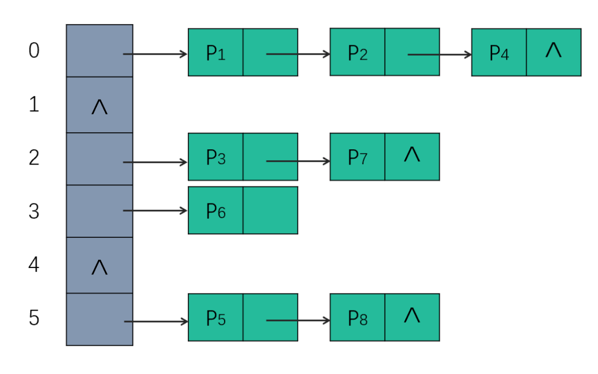

# 牛客网面试题库
由于牛客网C端网页改版，导致在C端访问面试题库时只有按公司分类的真题，没有以前按知识点分类的面试真题了，因此本文档收录了原牛客网的所有按知识点分类的[面试题库](https://www.nowcoder.com/exam/interview?order=0)。（如有侵权，请联系我，我立刻删除。）
### 一、数据库
##### 1. 请你说说MySQL索引，以及它们的好处和坏处
**得分点**： 检索效率、存储资源、索引维护
**标准回答**： 索引就像指向表行的指针,是一种允许查询操作快速确定哪些行符合`WHERE`子句中的条件,并检索到这些行的其他列值的数据结构； 索引主要有普通索引、唯一索引、主键索引、外键索引、全文索引、复合索引几种； 在大数据量的查询中,合理使用索引的优点非常明显,不仅能大幅提高匹配`WHERE`条件的检索效率,还能用于排序和分组操作的加速。 当然索引如果使用不当也有比较大的坏处：比如索引必定会增加存储资源的消耗；同时也增大了插入、更新和删除操作的维护成本,因为每个增删改操作后相应列的索引都必须被更新。
**加分回答**： 只要创建了索引,就一定会走索引吗？ 不一定。 比如,在使用组合索引的时候,如果没有遵从“最左前缀”的原则进行搜索,则索引是不起作用的。 举例,假设在`id、name、age`字段上已经成功建立了一个名为`MultiIdx`的组合索引。索引行中按`id、name、age`的顺序存放,索引可以搜索`id、(id,name)、(id, name, age)`字段组合。如果列不构成索引最左面的前缀,那么MySQL不能使用局部索引,如`(age)`或者`(name,age)`组合则不能使用该索引查询。
##### 2. 请你说说乐观锁和悲观锁
**得分点**： 乐观锁、悲观锁定义及使用场景
**标准回答**： **乐观锁**：乐观锁总是假设最好的情况,每次去拿数据的时候都认为别人不会修改,所以不会上锁,但是在更新的时候会判断一下在此期间别人有没有去更新这个数据,可以使用版本号机制和CAS算法实现。乐观锁适用于多读的应用类型,这样可以提高吞吐量,像数据库提供的类似于`write_condition`机制,其实都是提供的乐观锁。 **悲观锁**：悲观锁总是假设最坏的情况,每次去拿数据的时候都认为别人会修改,所以每次在拿数据的时候都会上锁,这样别人想拿这个数据就会阻塞直到它拿到锁（共享资源每次只给一个线程使用,其它线程阻塞,用完后再把资源转让给其它线程）。传统的关系型数据库里边就用到了很多这种锁机制,比如行锁,表锁等,读锁,写锁等,都是在做操作之前先上锁。
**加分回答**: 两种锁的使用场景 乐观锁： `git, svn, cvs`等代码版本控制管理器,就是一个乐观锁使用很好的场景,例如：A、B程序员,同时从SVN服务器上下载了`code.html`文件,当A完成提交后,此时B再提交,那么会报版本冲突,此时需要B进行版本处理合并后,再提交到服务器。这其实就是乐观锁的实现全过程。如果此时使用的是悲观锁,那么意味者所有程序员都必须一个一个等待操作提交完,才能访问文件,这是难以接受的。 悲观锁： 悲观锁的好处在于可以减少并发,但是当并发量非常大的时候,由于锁消耗资源、锁定时间过长等原因,很容易导致系统性能下降,资源消耗严重。因此一般我们可以在并发量不是很大,并且出现并发情况导致的异常用户和系统都很难以接受的情况下,会选择悲观锁进行。
##### 3. 请你说说MySQL的事务隔离级别
**得分点**： 未提交读、已提交读、可重复读、可串行化
**标准回答**： $SQL$标准定义了四种隔离级别,这四种隔离级别分别是：读未提交(`READ UNCOMMITTED`)；读提交(`READ COMMITTED`)；可重复读(`REPEATABLE READ`)；串行化(`SERIALIZABLE`)。 事务隔离是为了解决脏读、不可重复读、幻读问题,下表展示了 4 种隔离级别对这三个问题的解决程度：
| 隔离级别 | 脏读 | 不可重复读 | 幻读 |
| ----- | ----- | ----- | ----- |
| READ UNCOMMITTED | 可能 | 可能 | 可能 |
| READ COMMITTED | 不可能 | 可能 | 可能 |
| REPEATABLE READ | 不可能 | 不可能 | 可能 |
| SERIALIZABLE | 不可能 | 不可能 | 不可能 |
上述4种隔离级别$MySQL$都支持,并且$InnoDB$存储引擎默认的支持隔离级别是`REPEATABLE READ`,但是与标准$SQL$不同的是, $InnoDB$存储引擎在`REPEATABLE READ`事务隔离级别下,使用$Next-Key Lock$的锁算法,因此避免了幻读的产生。所以, $InnoDB$存储引擎在默认的事务隔离级别下已经能完全保证事务的隔离性要求,即达到$SQL$标准的`SERIALIZABLE`隔离级别；
**加分回答**： `READ UNCOMMITTED`： 它是性能最好、也最野蛮的方式,因为它压根儿就不加锁,所以根本谈不上什么隔离效果,可以理解为没有隔离。 `SERIALIZABLE`： 读的时候加共享锁,其他事务可以并发读,但是不能写。写的时候加排它锁,其他事务不能并发写也不能并发读。 `REPEATABLE READ & READ COMMITTED`： 为了解决不可重复读,$MySQL$采用了$MVCC$(多版本并发控制) 的方式。 我们在数据库表中看到的一行记录可能实际上有多个版本,每个版本的记录除了有数据本身外,还要有一个表示版本的字段,记为`row trx_id`,而这个字段就是使其产生的事务的`id`,事务`ID`记为`transaction id`,它在事务开始的时候向事务系统申请,按时间先后顺序递增。
##### 4. 请你说说聚簇索引和非聚簇索引
**得分点**： 索引即数据、二次查询
**标准回答**： 两者主要区别是数据和索引是否分离。聚簇索引是将数据与索引存储到一起,找到索引也就找到了数据；而非聚簇索引是将数据和索引存储分离开,索引树的叶子节点存储了数据行的地址。 在$InnoDB$中,一个表有且仅有一个聚簇索引（因为原始数据只留一份,而数据和聚簇索引在一起）,并且该索引是建立在主键上的,即使没有指定主键,也会特殊处理生成一个聚簇索引；其他索引都是辅助索引,使用辅助索引访问索引外的其他字段时都需要进行二次查找。 而在$MyISAM$中,所有索引都是非聚簇索引,叶子节点存储着数据的地址,对于主键索引和普通索引在存储上没有区别。
**加分回答**: 在$InnoDB$存储引擎中,可以将B+树索引分为聚簇索引和辅助索引（非聚簇索引）。无论是何种索引,每个页的大小都为$16KB$,且不能更改。 聚簇索引是根据主键创建的一棵B+树,聚簇索引的叶子节点存放了表中的所有记录。辅助索引是根据索引键创建的一棵B+树,与聚簇索引不同的是,其叶子节点仅存放索引键值,以及该索引键值指向的主键。也就是说,如果通过辅助索引来查找数据,那么当找到辅助索引的叶子节点后,很有可能还需要根据主键值查找聚簇索引来得到数据,这种查找方式又被称为书签查找。因为辅助索引不包含行记录的所有数据,这就意味着每页可以存放更多的键值,因此其高度一般都要小于聚簇索引。
##### 5. 数据库为什么不用红黑树而用B+树
**得分点**： 磁盘IO
**标准回答**： 首先,红黑树是一种近似平衡二叉树（不完全平衡）,结点非黑即红的树,它的树高最高不会超过$2log(n)$,因此查找的时间复杂度为$O(log(n))$,无论是增删改查,它的性能都十分稳定； 但是,红黑树本质还是二叉树,在数据量非常大时,需要访问判断的节点数还是会比较多,同时数据是存在磁盘上的,访问需要进行磁盘IO,导致效率较低； 而B+树是多叉的,可以有效减少磁盘IO次数；同时B+树增加了叶子结点间的连接,能保证范围查询时找到起点和终点后快速取出需要的数据。
**加分回答**： 红黑树做索引底层数据结构的缺陷 试想一下,以红黑树作为底层数据结构在面对在些表数据动辄数百万数千万的场景时,创建的索引它的树高得有多高？ 索引从根节点开始查找,而如果我们需要查找的数据在底层的叶子节点上,那么树的高度是多少,就要进行多少次查找,数据存在磁盘上,访问需要进行磁盘IO,这会导致效率过低； 那么红黑树作为索引数据结构的弊端即是：树的高度过高导致查询效率变慢。
##### 6. 请你说说$InnoDB$和$MyISAM$的区别
**得分点**： 事务、锁、读写性能、存储结构
**标准回答**： InnoDB是具有事务、回滚和崩溃修复能力的事务安全型引擎,它可以实现行级锁来保证高性能的大量数据中的并发操作；MyISAM是具有默认支持全文索引、压缩功能及较高查询性能的非事务性引擎。具体来说,可以在以下角度上形成对比：
| 引擎 | InnoDB | MyISAM |
|-----| -----  | -----  |
| 事务 | 支持    | 不支持  |
| 数据锁| 行级锁 | 表级锁 |
| 读写性能| 增删改更优 | 查询更优|
| 全文索引 | 不支持（可通过插件支持）| 默认支持|
| 外键 | 支持 | 不支持|
| 存储结构 | 一个文件 | 三个文件（表定义、数据、索引）|
| 存储空间 | 需要更多内存和存储 | 静态表（默认）、动态表、压缩表|
| 移植 | 数据量小时可通过拷贝数据文件、备份`binlog`、`mysqldump`工具移植 | 可单独对某个表通过拷贝表文件移植|
| 崩溃恢复 | 有崩溃恢复机制 | 无 |
默认推荐：InnoDB是`MySQL5.5`之后的默认引擎。
**加分回答**： InnoDB中行级锁是怎么实现的？ InnoDB行级锁是通过给索引上的索引项加锁来实现的。只有通过索引条件检索数据,InnoDB才使用行级锁,否则,InnoDB将使用表锁。 当表中锁定其中的某几行时,不同的事务可以使用不同的索引锁定不同的行。另外,不论使用主键索引、唯一索引还是普通索引,InnoDB都会使用行锁来对数据加锁。
##### 7. 请你说说索引怎么实现的B+树,为什么选这个数据结构
**得分点**： B+树、叶子节点建立连接
**标准回答**： 索引本质上就是通过预排序+树型结构来加快检索的效率,而MySQL中使用InnoDB和MyISAM引擎时都使用了B+树实现索引。 它是一棵平衡多路查找树,是在二叉查找树基础上的改进数据结构。在二叉查找树上查找一个数据时,最坏情况的查找次数为树的深度,当数据量很大时,查询次数可能还是很大,造成大量的磁盘IO,从而影响查询效率； 为了减少磁盘IO的次数,必须降低树的深度,因此在二叉查找树基础上将树改成了多叉加上一些限制条件,就形成了B树； B+树中所有叶子节点值的总集就是全部关键字集合；B+树为所有叶子节点增加了链接,从而实现了快速的范围查找； 在B+树中,所有记录节点都是按键值的大小顺序存放在同一层的叶子节点上,由各叶子节点指针进行连接。在数据库中,B+树的高度一般都在2～4层,这也就是说查找某一键值的行记录时最多只需要2到4次IO。这很不错,因为当前一般的机械磁盘每秒至少可以做$100$次IO,2～4次的IO意味着查询时间只需$0.02～0.04$秒。 在数据库中,B+树索引还可以分为聚集索引和辅助索引,但不管是聚集索引还是辅助索引,其内部都是B+树的,即高度平衡的,叶子节点存放着所有的数据。聚集索引与辅助索引不同的是,叶子节点存放的是否是一整行的信息。
##### 8. 请你说说数据库引擎有哪些,各自有什么区别
**得分点**： InnoDB、MyISAM、Memory
**标准回答**： InnoDB 引擎是 MySQL 的事务安全（ACID 兼容）存储引擎,具有提交、回滚和崩溃恢复功能来保护用户数据；行级锁定读取增加了多用户并发性和性能；将用户数据存储在聚集索引中,以减少基于主键的常见查询的I/O；还支持 `FOREIGN KEY `维护数据完整性。 MyISAM引擎的表占用空间较小,表级锁定限制了读/写工作负载的性能,因此它通常用于只读或以读取为主的场景。 Memory引擎是将所有数据存储在 RAM 中,以便在需要快速查找非关键数据的环境中进行快速访问,以前被称为 HEAP 引擎。 Archive引擎非常适合存储大量的独立的,作为历史记录的数据,因为它们不经常被读取。它 拥有高效的插入速度,但其对查询的支持相对较差。 Cluster/NDB是高冗余的存储引擎,用多台数据机器联合提供服务以提高整体性能和安全性。适合数据量大,安全和性能要求高的应用。 Federated引擎提供连接单独的 MySQL 服务器,从多个物理服务器创建一个逻辑数据库的能力,非常适合分布式或数据集市环境。
##### 9. 请你说说数据库索引的底层数据结构
**得分点**： B+树
**标准答案**： 索引可选的底层数据机构包括：二叉树、红黑树、`hash`、`B-tree`. 但mysql索引的底层用的并不是二叉树和红黑树。因为二叉树和红黑树在某些场景下都会暴露出一些缺陷。 首先,二叉树在某些场景下会退化成链表,而链表的查找需要从头部开始遍历,而这就失去了加索引的意义。 不使用红黑树的原因是：红黑树作为底层数据结构在面对在些表数据动辄数百万数千万的场景时,会导致索引树的层数很高。索引从根节点开始查找,而如果我们需要查找的数据在底层的叶子节点上,那么树的高度是多少,就要进行多少次查找,数据存在磁盘上,访问需要进行磁盘IO,这会导致效率过低； 而B+树由B树和索引顺序访问方法演化而来,它是为磁盘或其他直接存取辅助设备设计的一种平衡查找树,在B+树中,所有记录节点都是按键值的大小顺序存放在同一层的叶子节点,各叶子节点通过指针进行链接。 B+树索引在数据库中的一个特点就是高扇出性,例如在InnoDB存储引擎中,每个页的大小为$16KB$。在数据库中,B+树的高度一般都在2～4层,这意味着查找某一键值最多只需要2到4次IO操作,这还不错。因为现在一般的磁盘每秒至少可以做$100$次IO操作,2～4次的IO操作意味着查询时间只需$0.02～0.04$秒。
##### 10. 请你讲讲B树和B+树
**得分点**： 平衡多路查找树、磁盘IO
**标准回答**： 它们都是平衡多路查找树,是在二叉查找树基础上的改进数据结构。在二叉查找树上查找一个数据时,最坏情况的查找次数为树的深度,当数据量很大时,查询次数可能还是很大,造成大量的磁盘IO,从而影响查询效率； 为了减少磁盘IO的次数,必须降低树的深度,因此在二叉查找树基础上将树改成了多叉加上一些限制条件,就形成了B树； B+树是B树的变种,区别主要是：对于$k$阶的B树,每个中间节点只存$k-1$个值$k$个指针,而B+树存$k$个值和$k$个指针；B树中所有节点中值的总集是全部关键字集合,而B+树中所有叶子节点值的总集就是全部关键字集合；B+树为所有叶子节点增加了链接,从而实现了快速的范围查找；
**加分回答**： B+树由B树和索引顺序访问方法演化而来,它是为磁盘或其他直接存取辅助设备设计的一种平衡查找树,在B+树中,所有记录节点都是按键值的大小顺序存放在同一层的叶子节点,各叶子节点通过指针进行链接。 B+树索引在数据库中的一个特点就是高扇出性,例如在InnoDB存储引擎中,每个页的大小为$16KB$。在数据库中,B+树的高度一般都在2～4层,这意味着查找某一键值最多只需要2到4次IO操作,这还不错。因为现在一般的磁盘每秒至少可以做$100$次IO操作,2～4次的IO操作意味着查询时间只需$0.02～0.04$秒。
##### 11. MySQL主从同步是如何实现的
**标准答案**： 复制（replication）是MySQL数据库提供的一种高可用高性能的解决方案,一般用来建立大型的应用。总体来说,replication的工作原理分为以下3个步骤： 1. 主服务器（master）把数据更改记录到二进制日志（binlog）中。 2. 从服务器（slave）把主服务器的二进制日志复制到自己的中继日志（relay log）中。 3. 从服务器重做中继日志中的日志,把更改应用到自己的数据库上,以达到数据的最终一致性。 复制的工作原理并不复杂,其实就是一个完全备份加上二进制日志备份的还原。不同的是这个二进制日志的还原操作基本上实时在进行中。这里特别需要注意的是,复制不是完全实时地进行同步,而是异步实时。这中间存在主从服务器之间的执行延时,如果主服务器的压力很大,则可能导致主从服务器延时较大。
##### 12. 请你介绍一下数据库的ACID
**得分点**： 原子性、一致性、隔离性、持久性
**标准回答**： 事务可由一条非常简单的`SQL`语句组成,也可以由一组复杂的`SQL`语句组成。在事务中的操作,要么都执行修改,要么都不执行,这就是事务的目的,也是事务模型区别于文件系统的重要特征之一。 事务需遵循ACID四个特性：
- $A$（$atomicity$）,原子性。原子性指整个数据库事务是不可分割的工作单位。只有使事务中所有的数据库操作都执行成功,整个事务的执行才算成功。事务中任何一个`SQL`语句执行失败,那么已经执行成功的`SQL`语句也必须撤销,数据库状态应该退回到执行事务前的状态。
- $C$（$consistency$）,一致性。一致性指事务将数据库从一种状态转变为另一种一致的状态。在事务开始之前和事务结束以后,数据库的完整性约束没有被破坏。
- $I$（$isolation$）,隔离性。事务的隔离性要求每个读写事务的对象与其他事务的操作对象能相互分离,即该事务提交前对其他事务都不可见,这通常使用锁来实现。
- $D$（$durability$） ,持久性。事务一旦提交,其结果就是永久性的,即使发生宕机等故障,数据库也能将数据恢复。持久性保证的是事务系统的高可靠性,而不是高可用性。

**加分回答**： 事务可以分为以下几种类型：
- 扁平事务：是事务类型中最简单的一种,而在实际生产环境中,这可能是使用最为频繁的事务。在扁平事务中,所有操作都处于同一层次,其由`BEGIN WORK`开始,由`COMMIT WORK`或`ROLLBACK WORK`结束。处于之间的操作是原子的,要么都执行,要么都回滚。
- 带有保存点的扁平事务：除了支持扁平事务支持的操作外,允许在事务执行过程中回滚到同一事务中较早的一个状态,这是因为可能某些事务在执行过程中出现的错误并不会对所有的操作都无效,放弃整个事务不合乎要求,开销也太大。保存点（savepoint）用来通知系统应该记住事务当前的状态,以便以后发生错误时,事务能回到该状态。
- 链事务：可视为保存点模式的一个变种。链事务的思想是：在提交一个事务时,释放不需要的数据对象,将必要的处理上下文隐式地传给下一个要开始的事务。注意,提交事务操作和开始下一个事务操作将合并为一个原子操作。这意味着下一个事务将看到上一个事务的结果,就好像在一个事务中进行的。
- 嵌套事务：是一个层次结构框架。有一个顶层事务（top-level transaction）控制着各个层次的事务。顶层事务之下嵌套的事务被称为子事务（subtransaction）,其控制每一个局部的变换。
- 分布式事务：通常是一个在分布式环境下运行的扁平事务,因此需要根据数据所在位置访问网络中的不同节点。对于分布式事务,同样需要满足ACID特性,要么都发生,要么都失效。

对于MySQL的InnoDB存储引擎来说,它支持扁平事务、带有保存点的扁平事务、链事务、分布式事务。对于嵌套事务,MySQL数据库并不是原生的,因此对于有并行事务需求的用户来说MySQL就无能为力了,但是用户可以通过带有保存点的事务来模拟串行的嵌套事务。
##### 13. 请你说说数据库的索引是什么结构,为什么不用哈希表
**得分点**: B+树、内存资源
**标准回答**: MySQL中的索引B+树实现的； 哈希表的查询效率的确最高,时间复杂度$O(1)$,但是它要求将所有数据载入内存,而数据库存储的数据量级可能会非常大,全部载入内存基本上是不可能实现的； B+树可以分段加载需要的节点数据,可以在内存资源有限的前提下,极大提高查询效率
##### 14. 请你说说InnoDB的MVCC
**得分点**： 无锁并发
**标准回答**： 全称 Multi-Version Concurrency Control ,即多版本并发控制,逻辑是维持一个数据的多个版本,使得读写操作没有冲突。MVCC主要是为了提高数据库并发性能,用更好的方式去处理读-写冲突,做到即使有读写冲突时,也能做到不加锁,非阻塞并发读。 它是一种用来解决读-写冲突的无锁并发控制机制。在并发读写数据库时,可以做到在读操作时不用阻塞写操作,写操作也不用阻塞读操作,提高了数据库并发读写的性能,还可以解决脏读、幻读、不可重复读等事务隔离问题,但不能解决更新丢失问题。
**加分回答**： InnoDB默认的隔离级别是RR（`REPEATABLE READ`）,RR解决脏读、不可重复读、幻读等问题,使用的是MVCC。MVCC全称Multi-Version Concurrency Control,即多版本的并发控制协议。它最大的优点是读不加锁,因此读写不冲突,并发性能好。InnoDB实现MVCC,多个版本的数据可以共存,主要基于以下技术及数据结构：
1. 隐藏列：InnoDB中每行数据都有隐藏列,隐藏列中包含了本行数据的事务id、指向undo log的指针等。
2. 基于`undo log`的版本链：每行数据的隐藏列中包含了指向`undo log`的指针,而每条`undo log`也会指向更早版本的`undo log`,从而形成一条版本链。
3. `ReadView`：通过隐藏列和版本链,MySQL可以将数据恢复到指定版本。但是具体要恢复到哪个版本,则需要根据`ReadView`来确定。所谓`ReadView`,是指事务（记做事务A）在某一时刻给整个事务系统（`trx_sys`）打快照,之后再进行读操作时,会将读取到的数据中的事务`id`与`trx_sys`快照比较,从而判断数据对该ReadView是否可见,即对事务A是否可见。

### 设计模式
##### 1. 设计模式了解么
**得分点**： 单例模式、工厂模式
**标准回答**： 创建型包括：单例模式、工厂方法模式、抽象工厂模式、建造者模式和原型模式； 结构型包括：代理模式、装饰模式、适配器模式、组合模式、桥梁模式、外观模式和享元模式； 行为型包括：模板方法模式、命令模式、责任链模式、策略模式、迭代器模式、中介者模式、观察者模式、备忘录模式、访问者模式、状态模式和解释器模式。 面试中不要求23种设计模式全部了解,但至少应掌握单例模式和工厂模式。
**加分回答**： 可以说出知道的框架所用到的设计模式或底层设计模式,例如Spring中的单例模式、工厂模式,AQS的模板模式等等。
##### 2. 请你讲讲单例模式、请你手写一下单例模式
**得分点**： 饿汉式单例模式、懒汉式单例模式、线程安全的懒汉式单例模式
**标准回答**： 单例模式（Singleton Pattern）是最简单的创建型设计模式。它会确保一个类只有一个实例存在。单例模式最重要的特点就是构造函数私有,从而避免外界直接使用构造函数直接实例化该类的对象。 单例模式在`Java`中通常有两种表现形式：
- 饿汉式：类加载时就进行对象实例化
- 懒汉式：第一次引用类时才进行对象实例化

饿汉式单例模式：（分别采用了C++和Java实现）
```cpp
class Singleton {
private:
    static Singleton* instance;
    Singleton() {} // 私有构造函数，防止外部创建对象

public:
    static Singleton* getInstance() {
        if (instance == nullptr) {
            instance = new Singleton();
        }
        return instance;
    }
};

Singleton* Singleton::instance = nullptr; // 初始化静态成员变量

int main() {
    Singleton* obj1 = Singleton::getInstance();
    Singleton* obj2 = Singleton::getInstance();

    if (obj1 == obj2) {
        std::cout << "obj1 and obj2 are the same instance." << std::endl;
    } else {
        std::cout << "obj1 and obj2 are different instances." << std::endl;
    }

    return 0;
}
```
```java
public class Singleton {
    private static Singleton instance = new Singleton(); // 静态私有成员变量，直接创建实例对象

    private Singleton() {} // 私有构造函数，防止外部创建对象

    public static Singleton getInstance() {
        return instance;
    }
}

public class Main {
    public static void main(String[] args) {
        Singleton obj1 = Singleton.getInstance();
        Singleton obj2 = Singleton.getInstance();

        if (obj1 == obj2) {
            System.out.println("obj1 and obj2 are the same instance.");
        } else {
            System.out.println("obj1 and obj2 are different instances.");
        }
    }
}
```
懒汉式单例模式：
```cpp
class Singleton {
private:
    static Singleton* instance;
    Singleton() {} // 私有构造函数，防止外部创建对象

public:
    static Singleton* getInstance() {
        if (instance == nullptr) {
            instance = new Singleton();
        }
        return instance;
    }
};

Singleton* Singleton::instance = nullptr; // 初始化静态成员变量

int main() {
    Singleton* obj1 = Singleton::getInstance();
    Singleton* obj2 = Singleton::getInstance();

    if (obj1 == obj2) {
        std::cout << "obj1 and obj2 are the same instance." << std::endl;
    } else {
        std::cout << "obj1 and obj2 are different instances." << std::endl;
    }

    return 0;
}
```
```java
public class Singleton {
    private static Singleton instance;

    private Singleton() {} // 私有构造函数，防止外部创建对象

    public static synchronized Singleton getInstance() {
        if (instance == null) {
            instance = new Singleton();
        }
        return instance;
    }
}

public class Main {
    public static void main(String[] args) {
        Singleton obj1 = Singleton.getInstance();
        Singleton obj2 = Singleton.getInstance();

        if (obj1 == obj2) {
            System.out.println("obj1 and obj2 are the same instance.");
        } else {
            System.out.println("obj1 and obj2 are different instances.");
        }
    }
}
```

**加分回答**： 单例模式的优点：
- 在一个对象需要频繁的销毁、创建,而销毁、创建性能又无法优化时,单例模式的优势尤其明显
- 在一个对象的产生需要比较多资源时,如读取配置、产生其他依赖对象时,则可以通过在启用时直接产生一个单例对象,然后用永久驻留内存的方式来解决
- 单例模式可以避免对资源的多重占用,因为只有一个实例,避免了对一个共享资源的并发操作
- 单例模式可以在系统设置全局的访问点,优化和共享资源访问

单例模式的缺点：
- 单例模式无法创建子类,扩展困难,若要扩展,除了修改代码基本上没有第二种途径可以实现
- 单例模式对测试不利。在并行开发环境中,如果采用单例模式的类没有完成,是不能进行测试的
- 单例模式与单一职责原则有冲突。一个类应该只实现一个逻辑,而不关心它是否是单例的,是不是要用单例模式取决于环境

##### 3. 请你讲讲工厂模式，手写实现工厂模式
**得分点**： 简单工厂、工厂方法、抽象工厂
**标准回答**： 工厂模式（Factory Method Pattern）也叫虚拟构造函数模式或多态性工厂模式,其用意是定义一个创建产品对象的工厂接口,将实际创建性工作推迟到子类中。 工厂模式可以分为简单工厂、工厂方法和抽象工厂模式
- 简单工厂模式严格来讲并不算是一种设计模式,更多的时候是一种编程习惯。简单工厂的实现思路是,定义一个工厂类,根据传入的参数不同返回不同的实例,被创建的实例具有共同的父类或接口。简单工厂适用于需要创建的对象较少或客户端不关心对象的创建过程的情况。代码如下：
```cpp
// 抽象产品类
class Product {
public:
    virtual void operation() = 0;
};

// 具体产品类A
class ConcreteProductA : public Product {
public:
    void operation() override {
        std::cout << "ConcreteProductA::operation()" << std::endl;
    }
};

// 具体产品类B
class ConcreteProductB : public Product {
public:
    void operation() override {
        std::cout << "ConcreteProductB::operation()" << std::endl;
    }
};

// 简单工厂类
class SimpleFactory {
public:
    // 静态方法，根据传入的参数创建对应的产品对象
    static Product* createProduct(int productType) {
        if (productType == 1) {
            return new ConcreteProductA();
        } else if (productType == 2) {
            return new ConcreteProductB();
        } else {
            return nullptr;
        }
    }
};

int main() {
    // 使用简单工厂创建具体产品对象
    Product* productA = SimpleFactory::createProduct(1);
    Product* productB = SimpleFactory::createProduct(2);

    // 调用产品对象的操作方法
    productA->operation();
    productB->operation();

    // 释放内存
    delete productA;
    delete productB;

    return 0;
}
```
```java
// 抽象产品类
interface Product {
    void operation();
}

// 具体产品类A
class ConcreteProductA implements Product {
    public void operation() {
        System.out.println("ConcreteProductA::operation()");
    }
}

// 具体产品类B
class ConcreteProductB implements Product {
    public void operation() {
        System.out.println("ConcreteProductB::operation()");
    }
}

// 简单工厂类
class SimpleFactory {
    // 根据传入的参数创建对应的产品对象
    public static Product createProduct(int productType) {
        if (productType == 1) {
            return new ConcreteProductA();
        } else if (productType == 2) {
            return new ConcreteProductB();
        } else {
            return null;
        }
    }
}

public class Main {
    public static void main(String[] args) {
        // 使用简单工厂创建具体产品对象
        Product productA = SimpleFactory.createProduct(1);
        Product productB = SimpleFactory.createProduct(2);

        // 调用产品对象的操作方法
        productA.operation();
        productB.operation();
    }
}
```
- 工厂方法模式：工厂方法模式具有良好的封装性,代码结构清晰,一个对象创建是有条件约束的,如果一个调用者需要一个具体的产品对象,只要知道这个产品的类名或约束字符串即可,不用知道创建对象的过程如何,降低了模块间的耦合。工厂模式还拥有优秀的可扩展性,在增加产品类的情况下,只要适当地修改具体的工厂类或扩展一个工厂类,就可以适应变化。工厂方法模式是典型的解耦框架,高层模块只需要知道产品的抽象类或接口,其他的实现类都不用关心。代码如下：
```cpp
// 抽象产品类
class Product {
public:
    virtual void operation() = 0;
};

// 具体产品类A
class ConcreteProductA : public Product {
public:
    void operation() override {
        std::cout << "Concrete Product A" << std::endl;
    }
};

// 具体产品类B
class ConcreteProductB : public Product {
public:
    void operation() override {
        std::cout << "Concrete Product B" << std::endl;
    }
};

// 抽象工厂类
class Factory {
public:
    virtual Product* createProduct() = 0;
};

// 具体工厂类A
class ConcreteFactoryA : public Factory {
public:
    Product* createProduct() override {
        return new ConcreteProductA();
    }
};

// 具体工厂类B
class ConcreteFactoryB : public Factory {
public:
    Product* createProduct() override {
        return new ConcreteProductB();
    }
};

// 客户端
int main() {
    Factory* factoryA = new ConcreteFactoryA();
    Product* productA = factoryA->createProduct();
    productA->operation();

    Factory* factoryB = new ConcreteFactoryB();
    Product* productB = factoryB->createProduct();
    productB->operation();

    delete factoryA;
    delete productA;
    delete factoryB;
    delete productB;

    return 0;
}
```
```java
interface Product {
    void operation();
}

class ConcreteProductA implements Product {
    @Override
    public void operation() {
        System.out.println("Concrete Product A");
    }
}

class ConcreteProductB implements Product {
    @Override
    public void operation() {
        System.out.println("Concrete Product B");
    }
}

interface Factory {
    Product createProduct();
}

class ConcreteFactoryA implements Factory {
    @Override
    public Product createProduct() {
        return new ConcreteProductA();
    }
}

class ConcreteFactoryB implements Factory {
    @Override
    public Product createProduct() {
        return new ConcreteProductB();
    }
}

public class Client {
    public static void main(String[] args) {
        Factory factoryA = new ConcreteFactoryA();
        Product productA = factoryA.createProduct();
        productA.operation();

        Factory factoryB = new ConcreteFactoryB();
        Product productB = factoryB.createProduct();
        productB.operation();
    }
}
`
- 抽象工厂模式（Abstract Factory Pattern）是一种比较常用的模式。为创建一组相关或相互依赖的对象提供一个接口,而且无须指定它们的具体类。抽象工厂模式是工厂方法模式的升级版本。在有多个业务品种、业务分类时,通过抽象工厂模式产生需要的对象是一种非常好的解决方式,抽象方法适用于下和工厂方法一样客户端不需要知道它所创建的对象的类,需要一组对象共同完成某种功能,可能存在多组对象完成不同功能以及系统结构稳定,不会频繁的增加对象的情况。代码如下：
```cpp
// 抽象产品A
class AbstractProductA {
public:
    virtual void operationA() = 0;
};

// 具体产品A1
class ConcreteProductA1 : public AbstractProductA {
public:
    void operationA() override {
        std::cout << "Concrete Product A1" << std::endl;
    }
};

// 具体产品A2
class ConcreteProductA2 : public AbstractProductA {
public:
    void operationA() override {
        std::cout << "Concrete Product A2" << std::endl;
    }
};

// 抽象产品B
class AbstractProductB {
public:
    virtual void operationB() = 0;
};

// 具体产品B1
class ConcreteProductB1 : public AbstractProductB {
public:
    void operationB() override {
        std::cout << "Concrete Product B1" << std::endl;
    }
};

// 具体产品B2
class ConcreteProductB2 : public AbstractProductB {
public:
    void operationB() override {
        std::cout << "Concrete Product B2" << std::endl;
    }
};

// 抽象工厂类
class AbstractFactory {
public:
    virtual AbstractProductA* createProductA() = 0;
    virtual AbstractProductB* createProductB() = 0;
};

// 具体工厂类1
class ConcreteFactory1 : public AbstractFactory {
public:
    AbstractProductA* createProductA() override {
        return new ConcreteProductA1();
    }

    AbstractProductB* createProductB() override {
        return new ConcreteProductB1();
    }
};

// 具体工厂类2
class ConcreteFactory2 : public AbstractFactory {
public:
    AbstractProductA* createProductA() override {
        return new ConcreteProductA2();
    }

    AbstractProductB* createProductB() override {
        return new ConcreteProductB2();
    }
};

// 客户端
int main() {
    AbstractFactory* factory1 = new ConcreteFactory1();
    AbstractProductA* productA1 = factory1->createProductA();
    AbstractProductB* productB1 = factory1->createProductB();
    productA1->operationA();
    productB1->operationB();

    AbstractFactory* factory2 = new ConcreteFactory2();
    AbstractProductA* productA2 = factory2->createProductA();
    AbstractProductB* productB2 = factory2->createProductB();
    productA2->operationA();
    productB2->operationB();

    delete factory1;
    delete productA1;
    delete productB1;
    delete factory2;
    delete productA2;
    delete productB2;

    return 0;
}
```
```java
interface AbstractProductA {
    void operationA();
}

class ConcreteProductA1 implements AbstractProductA {
    @Override
    public void operationA() {
        System.out.println("Concrete Product A1");
    }
}

class ConcreteProductA2 implements AbstractProductA {
    @Override
    public void operationA() {
        System.out.println("Concrete Product A2");
    }
}

interface AbstractProductB {
    void operationB();
}

class ConcreteProductB1 implements AbstractProductB {
    @Override
    public void operationB() {
        System.out.println("Concrete Product B1");
    }
}

class ConcreteProductB2 implements AbstractProductB {
    @Override
    public void operation B() {
        System.out.println("Concrete Product B2");
    }
}

interface AbstractFactory {
    AbstractProductA createProductA();
    AbstractProductB createProductB();
}

class ConcreteFactory1 implements AbstractFactory {
    @Override
    public AbstractProductA createProductA() {
        return new ConcreteProductA1();
    }

    @Override
    public AbstractProductB createProductB() {
        return new ConcreteProductB1();
    }
}

class ConcreteFactory2 implements AbstractFactory {
    @Override
    public AbstractProductA createProductA() {
        return new ConcreteProductA2();
    }

    @Override
    public AbstractProductB createProductB() {
        return new ConcreteProductB2();
    }
}

public class Client {
    public static void main(String[] args) {
        AbstractFactory factory1 = new ConcreteFactory1();

        AbstractProductA productA1 = factory1.createProductA();
        AbstractProductB productB1 = factory1.createProductB();

        productA1.operationA();
        productB1.operationB();

        AbstractFactory factory2 = new ConcreteFactory2();

        AbstractProductA productA2 = factory2.createProductA();
        AbstractProductB productB2 = factory2.createProductB();

        productA2.operationA();
        productB2.operationB();
    }
}
```

### 三、计算机网络
##### 1. 请你说说TCP和UDP的区别
**得分点**： TCP 提供面向连接的可靠传输，UDP 提供面向无连接的不可靠传输。UDP 在很多实时性要求高的场景有很好的表现，而TCP在要求数据准确、对速度没有硬性要求的场景有很好的表现。
**标准回答**： 首先 UDP 协议和 TCP 协议都是运输层协议，都是为应用层程序服务，都具有复用（不同的应用层协议可以共用 UDP 协议和 TCP 协议）和分用（将数据报解析之后分发给不同的应用层程序）的功能。UDP 提供面向无连接基于数据报的不可靠传输，TCP 提供面向连接基于字节流的可靠传输。UDP 在很多实时性要求高的场景有很好的表现，而 TCP 在要求数据准确、对速度没有硬性要求的场景有很好的表现。
**加分回答**： 具体的区别详细描述可以是：
- UDP协议：面向无连接（不需要三次握手和四次挥手）、尽最大努力交付、面向报文（每次收发都是一整个报文段）、没有拥塞控制不可靠（只管发不管过程和结果）、支持一对一、一对多、多对一和多对多的通信方式、首部开销很小（8字节）。优点是快，没有TCP各种机制，少了很多首部信息和重复确认的过程，节省了大量的网络资源。缺点是不可靠不稳定，只管数据的发送不管过程和结果，网络不好的时候很容易造成数据丢失。又因为网络不好的时候不会影响到主机数据报的发送速率，这对很多实时的应用程序很重要，因为像语音通话、视频会议等要求源主机要以恒定的速率发送数据报，允许网络不好的时候丢失一些数据，但不允许太大的延迟，UDP很适合这种要求。
- TCP协议：是TCP/IP体系中非常复杂的一个协议，面向连接（需要三次握手四次挥手）、单播（只能端对端的连接）、可靠交付（有大量的机制保护TCP连接数据的可靠性）、全双工通讯（允许双方同时发送信息，也是四次挥手的原由）、面向字节流（不保留数据报边界的情况下以字节流的方式进行传输，这也是长连接的由来。）、头部开销大（最少20字节）。优点是可靠、稳定，有确认、窗口、重传、拥塞控制机制，在数据传完之后，还会断开连接用来节约系统资源。缺点是慢，效率低，占用系统资源高，在传递数据之前要先建立连接，这会消耗时间，而且在数据传递时，确认机制、重传机制、拥塞机制等都会消耗大量的时间，而且要在每台设备上维护所有的传输连接。在要求数据准确、对速度没有硬性要求的场景有很好的表现，比如在FTP（文件传输）、HTTP/HTTPS（超文本传输），TCP很适合这种要求。
##### 2. 请你说说 TCP 三次握手四次挥手过程
**得分点**：第一、二次分别包含数据通讯初始序号。第三次是必须的，为了防止已经失效的连接请求报文突然又被传送给了服务器端，然后产生错误。TCP是全双工通讯，客户端和服务器端都需要释放连接和接受确认，所以必须是四次挥手。
**标准回答**： 三次握手过程：
- 第一次握手：客户端向服务器端发送连接请求报文段，包含自身数据通讯初始序号，进入`SYN-SENT`状态。
- 第二次握手：服务器端收到连接请求报文段后，如果同意，发送应答，包含自身数据通讯初始序号，进入`SYN-RECEIVED`状态。
- 第三次握手：客户端收到应答，最后向服务器端发送确认报文，进入`ESTABLISHED`状态，此时成功建立长连接。

四次挥手过程：
- 第一次挥手：客户端认为数据发送完毕，需要向服务器端发送连接释放请求。
- 第二次挥手：服务器收到连接释放请求，告诉应用层释放TCP连接。然后发送ACK包，进入`CLOSE-WT`状态，此时表明客户端到服务器端的连接已经释放，不再接受客户端的数据。因为TCP是全双工的，所以服务器仍可以发送数据。
- 第三次挥手：当服务器端数据发送完毕，向客户端发送连接释放请求，进入`LAST-ACK`状态。
- 第四次挥手：客户端收到连接释放请求，向服务器端发送确认应答报文，此时客户端进入`TIME-WT`状态，持续2倍的MSL（最长报文段寿命），若期间没有收到服务器端的数据报文，进入`CLOSED`状态。服务器端收到确认应答后，也进入`CLOSED`状态。

**加分回答**： 以下是客户端向服务器端发起TCP连接的详细过程：
1. 客户端和服务器端刚开始都是处于`CLOSED`（关闭）状态。
2. 要注意的是客户端主动打开连接，而服务器端是被动打开连接的。
3. 服务器端的进程先创建TCB（传输控制块）准备接受客户端的连接请求。
4. 客户端的进程也是先创建TCB（传输控制块），然后向服务器端发出连接请求报文段，这个报文段中的同步位SYN置为1，同时选择一个初始序号`seq=x`。TCP协议规定了`SYN=1`的报文段不可以携带数据，但是要消耗掉一个序号。这个时候客户端进入`SYN-SENT`状态。
5. 服务器端收到连接请求报文之后，如果同意连接，就给客户端发送确认响应。在确认报文中应该将同步位`SYN`和`ACK`都置为1，而确认号是`ACK+1`。这时候服务器端也需要给自己选一个初始序号`seq=y`。值得注意的是这个确认报文也不能携带数据，同样要消耗掉一个序号。这时服务器端进入`SYN-RECEIVED`状态。
6. 客户端进程收到服务器端的确认报文，最后还要向服务器端给出确认。确认报文段的`ACK`置为1，确认号是`y+1`，而自己的序号`seq=x+1`。TCP标准规定，ACK报文段可以携带数据，但是如果不携带数据就不消耗序号。在这个情况下，下一个数据报文的序号仍然是`seq=x+1`。到这时，TCP连接已经成功建立，A进入`ESTABLISHED`（已建立连接）状态。 到此TCP连接三次握手的过程就全部结束了。

***但是为什么一定要三次握手而不是两次，为什么客户端最后还需要发送一次确认报文呢？***
其实主要是为了防止已经失效的连接请求报文突然又被传送给了服务器端，然后产生错误。假设现在有一种情况，客户端发出的第一个连接请求报文段并没有丢失而是在某些网络节点上被滞留了，直到客户端和服务器端的新连接已经释放后的某个时间点，第一个连接请求报文段才到了服务器端，这时候服务器端以为客户端又发起了一次请求，于是服务器端向客户端发起了确认连接报文段，同意连接。假设不采用三次握手，这时候连接已经建立了，但是客户端并不知道这个情况，服务器端会一直等待客户端的数据报文，这样服务器端的资源就会被浪费，占用大量的资源。所以采用三次握手可以防止这种现象，保护网络和系统资源。
TCP连接释放的过程比较复杂，客户端和服务器端都可以主动释放连接。下面是从客户端主动释放连接为例讲解四次挥手的详细过程：
1. 客户端的应用进程先向TCP发出一个连接释放报文段，然后停止发送数据报，主动关闭TCP连接。客户端需要将连接释放报文段首部的终止控制`FIN`置为1，序号设置为u，u相当于前面传输的数据报文段的最后一个字节的序号加1。这时候客户端进入`FIN-WT-1`（终止等待1）状态，等待服务器端的确认。需要注意的是，FIN报文段也是即使不携带数据，它也消耗一个序号。
2. 服务器在收到客户端发来的连接释放报文段请求之后就发出确认，确认号`ack=u+1`，这个报文段自己的序号是v，v相当于之前已经传送出去的最后一个报文段的序号加1。这时候服务器端进入`CLOSE-WT`（关闭等待）状态，这时候服务器端的TCP进程就要通知应用进程，客户端到服务器端的连接已经关闭了。需要注意的是，这个时候的TCP连接就处于一个半关闭（half-close）的状态，尽管客户端已经没有数据要发送了，但是服务器端还是可以向客户端发送数据的，服务器端到客户端的连接并没有被释放掉。
3. 如果服务器端也没有数据要发送给客户端了，那么应用进程就通知TCP释放连接。这时候服务器端发出的连接释放报文段请求的终止指令`FIN`也置为1。这时候服务器端的序号已经是w了，因为在半关闭状态服务器端可能又发送了一些数据，服务器也必须重复上次已经发送过的确认号`ack=u+1`。这时候服务器端进入`LAST-ACK`（最后确认）状态，等待客户端的确认。
4. 客户端收到服务器端的连接释放请求报文段之后，必须发出确认。在确认报文段中把ACK置为1，确认号`ack=w+1`，而自己的序号是`seq=u+1`（根据TCP标准，`FIN`消耗了一个序号），然后进入`TIME-WT`（时间等待）状态，这时候连接并没有释放掉，必须等到2倍的MSL（最长报文段寿命）之后，连接才会释放。

##### 3. 请你说说 GET 和 POST 的区别
**得分点**： 用法不一样、参数显隐式、参数长度。
**标准回答**： get主要用来获取数据，而post是提交或修改数据。get有长度限制（2048字节）而post没有。get的参数是显式的，而post是隐式的。
**加分回答**：
- get主要用来获取数据，post主要用来提交数据。
- get的参数有长度限制，最长2048字节，而post没有限制。
- get的参数会附加在url之 ，以 "?"分割url和传输数据，多个参数用 "&"连接，而post会把参数放在http请求体中。
- get是明文传输，可以直接通过url看到参数信息，post是放在请求体中，除非用工具才能看到。
- get请求会保存在浏览器历史记录中，也可以保存在web服务器日志中。
- get在浏览器回退时是无害的，而post会再次提交请求。 - get请求会被浏览器主动缓存，而post不会，除非手动设置。
- get请求只能进行url编码，而post支持多种编码方式。
- get请求的参数数据类型只接受ASCII字符，而post没有限制。

##### 4. 浏览器从输入 URL 开始到页面显示内容，中间发生了什么？
**得分点**：DNS解析、TCP握手、HTTP缓存、重定向、服务器状态码、渲染引擎和JS引擎互斥、渲染过程、浏览器进程、网络进程、渲染进程
**标准回答**:
1. DNS解析：浏览器首先需要将URL中的主机名解析为IP地址，这个过程叫做DNS解析。浏览器会先从自己的缓存中查找IP地址，如果没有找到，就会向本地DNS服务器发出请求，如果本地DNS服务器也没有该域名对应的IP地址，就会向根DNS服务器查询。
2. 建立TCP连接：一旦浏览器获得了服务器的IP地址，就会向该IP地址的服务器发送一个TCP连接请求。建立TCP连接需要经历三次握手过程。
3. 发送HTTP请求：一旦TCP连接建立成功，浏览器就会向服务器发送一个HTTP请求。HTTP请求中包含请求头和请求体，请求头包含请求方式（GET、POST等）、请求路径、请求参数等信息。
4. 服务器处理请求并返回HTTP响应：服务器接收到浏览器发送的HTTP请求后，会根据请求的内容进行相应的处理，并将处理结果以HTTP响应的形式返回给浏览器。HTTP响应中包含响应头和响应体，响应头包含响应状态码、响应头信息等。
5. 浏览器渲染页面：一旦浏览器收到HTTP响应，就会根据响应中的`HTML、CSS、JavaScript`等内容解析出网页的结构和样式，并开始渲染页面。
6. 断开TCP连接：一旦页面渲染完成，浏览器会向服务器发送一个TCP连接释放请求，服务器收到释放请求后，会向浏览器发送一个TCP连接释放响应，从而断开TCP连接。
7. 渲染过程就是先将HTML转换成dom树，再将CSS样式转换成stylesheet，根据dom树和stylesheet创建布局树，对布局树进行分层，为每个图层生成绘制列表，再将图层分成图块，紧接着光栅化将图块转换成位图，最后合成绘制生成页面。

##### 5. 请你说说HTTP状态码极其含义
**得分点**：1xx、2xx、3xx、4xx、5xx。
**标准回答**：HTTP状态码有：1xx代表服务器端已经接受了请求。2xx代表请求已经被服务器端成功接收，最常见的有200、201状态码。3xx代表路径被服务器端重定向到了一个新的URL，最常见的有301、302状态码。4xx代表客户端的请求发生了错误，最常见的有401、404状态码。5xx代表服务器端的响应出现了错误。
**加分回答**：
- 1xx：指定客户端相应的某些动作，代表请求已被接受，需要继续处理。由于 HTTP/1.0 协议中没有定义任何 1xx 状态码，所以除非在某些试验条件下，服务器禁止向此类客户端发送 1xx 响应。
- 2xx：代表请求已成功被服务器接收、理解、并接受。这系列中最常见的有200、201状态码。
    - 200（成功）：服务器已成功处理了请求。 通常，这表示服务器提供了请求的网页。
    - 201（已创建）：请求成功并且服务器创建了新的资源。
    - 202（已接受）：服务器已接受请求，但尚未处理。
    - 203（非授权信息）：服务器已成功处理了请求，但返回的信息可能来自另一来源。
    - 204（无内容）：服务器成功处理了请求，但没有返回任何内容。
    - 205（重置内容）：服务器成功处理了请求，但没有返回任何内容。
    - 206（部分内容）：服务器成功处理了部分 GET 请求。
- 3xx：代表需要客户端采取进一步的操作才能完成请求，这些状态码用来重定向，后续的请求地址（重定向目标）在响应头Location字段中指明。这系列中最常见的有301、302状态码。
    - 300（多种选择）：针对请求，服务器可执行多种操作。 服务器可根据请求者 (user agent) 选择一项操作，或提供操作列表供请求者选择。
    - 301（永久移动）：请求的网页已永久移动到新位置。 服务器返回此响应（对 GET 或 HEAD 请求的响应）时，会自动将请求者转到新位置。
    - 302（临时移动）：服务器目前从不同位置的网页响应请求，但请求者应继续使用原有位置来进行以后的请求。
    - 303（查看其他位置）：请求者应当对不同的位置使用单独的 GET 请求来检索响应时，服务器返回此代码。
    - 304（未修改）：自从上次请求后，请求的网页未修改过。 服务器返回此响应时，不会返回网页内容。
    - 305（使用代理）：请求者只能使用代理访问请求的网页。 如果服务器返回此响应，还表示请求者应使用代理。
    - 307（临时重定向）：服务器目前从不同位置的网页响应请求，但请求者应继续使用原有位置来进行以后的请求。
- 4xx：表示请求错误。代表了客户端看起来可能发生了错误，妨碍了服务器的处理。常见有：401、404状态码。
    - 400（错误请求）：服务器不理解请求的语法。
    - 401（未授权）：请求要求身份验证。 对于需要登录的网页，服务器可能返回此响应。
    - 403（禁止）：服务器拒绝请求。
    - 404（未找到）：服务器找不到请求的网页。
    - 405（方法禁用）：禁用请求中指定的方法。
    - 406（不接受）：无法使用请求的内容特性响应请求的网页。
    - 407（需要代理授权）：此状态代码与 401（未授权）类似，但指定请求者应当授权使用代理。
    - 408（请求超时）：服务器等候请求时发生超时。
    - 409（冲突）：服务器在完成请求时发生冲突。 服务器必须在响应中包含有关冲突的信息。
    - 410（已删除）：如果请求的资源已永久删除，服务器就会返回此响应。
    - 411（需要有效长度）：服务器不接受不含有效内容长度标头字段的请求。
    - 412（未满足前提条件）：服务器未满足请求者在请求中设置的其中一个前提条件。
    - 413（请求实体过大）：服务器无法处理请求，因为请求实体过大，超出服务器的处理能力。
    - 414（请求的 URI 过长）：请求的 URI（通常为网址）过长，服务器无法处理。
    - 415（不支持的媒体类型）：请求的格式不受请求页面的支持。
    - 416（请求范围不符合要求）：如果页面无法提供请求的范围，则服务器会返回此状态代码。
    - 417 （未满足期望值）：服务器未满足"期望"请求标头字段的要求。
- 5xx：代表了服务器在处理请求的过程中有错误或者异常状态发生，也有可能是服务器意识到以当前的软硬件资源无法完成对请求的处理。常见有500、503状态码。
    - 500（服务器内部错误）：服务器遇到错误，无法完成请求。
    - 501（尚未实施）：服务器不具备完成请求的功能。 例如，服务器无法识别请求方法时可能会返回此代码。
    - 502（错误网关）：服务器作为网关或代理，从上游服务器收到无效响应。
    - 503（服务不可用）：服务器目前无法使用（由于超载或停机维护）。 通常，这只是暂时状态。
    - 504（网关超时）：服务器作为网关或代理，但是没有及时从上游服务器收到请求。
    - 505（HTTP 版本不受支持）：服务器不支持请求中所用的 HTTP 协议版本。

##### 6. 请你说说HTTP和HTTPS的区别
**得分点**： 协议、连接方式、耗时、端口、安全性皆不同
**标准回答**： 由于HTTP简单快速的特性，当客户端向服务器端请求数据的时候，只需要传送请求方法和路径就可以取到结果，基于TCP，默认端口号为80，耗时可以简略计算为1RTT，传递的数据全部是明文传输，几乎没有安全性。 HTTPS是基于TLS的，而TLS又基于TCP，当客户端向服务器端请求数据的时候，服务器大概率会将客户端重定向到该服务器的443端口，进行新的TCP连接，此时服务器会返回一个证书文件，而不是响应报文体。此时客户端验证证书文件紧接创建对称密钥，之后重新和服务器建立TLS连接，当服务器返回ACK确认之后，连接正式建立，此时上方整个过程耗时为3RTT，并且之后和服务器的通信数据都是通过对称密钥加密过的，几乎无法破解。
HTTP和HTTPS的不同点总结如下：
- HTTP是基于TCP的，而HTTPS是基于TLS的
- HTTP的往返时间为1RTT，而HTTPS的往返时间为3RTT
- HTTP只需要创建一次TCP连接，而HTTPS需要创建两次TCP连接
- HTTP的默认端口号为80，而HTTPS的默认端口号为443
- HTTP的安全性很差，而HTTPS的安全性很强

**加分回答**： HTTPS虽然在安全方面有很大的优势，但是缺点也很明显，如下：
- HTTPS握手阶段耗费时间，几乎是HTTP的数倍，会延长页面的首次绘制时间和增加耗电
- HTTPS的效率没有HTTP高，如果部分数据内容实际上并不需要加密，会平白浪费计算机资源
- HTTPS的证书需要购买，功能越强大的证书价格更高
- HTTPS的加密并不能阻止某些网络攻击，如黑客攻击、拒绝服务攻击等

##### 7. 请你说说 TCP 如何实现可靠传输
**得分点**： 序列号、检验和、确认应答信号、重发机制、连接管理、窗口控制、流量控制、拥塞控制
**标准回答**： 可靠传输就是通过TCP连接传送的数据是没有差错、不会丢失、不重复并且按序到达的。TCP是通过序列号、检验和、确认应答信号、重发机制、连接管理、窗口控制、流量控制、拥塞控制一起保证TCP传输的可靠性的。
**加分回答**： 可靠传输的具体实现是：
- 应用层的数据会被分割成TCP认为最适合发送的数据块。
- 序列号：TCP给发送的每一个包都进行编号，接收方对数据包进行排序，把有序数据传送给应用层，TCP的接收端会丢弃重复的数据。
- 检验和：TCP将保持它首部和数据的检验和。这是一个端到端的检验和，目的是检测数据在传输过程中的任何变化。
- 确认应答：如果收到的数据报报文段的检验和没有差错，就确认收到，如果有差错，TCP就丢弃这个报文段和不确认收到此报文段。
- 流量控制：TCP 连接的每一方都有固定大小的缓冲空间，TCP的接收端只允许发送端发送接收端缓冲区能接纳的数据。当接收方来不及处理发送方的数据，能提示发送方降低发送的速率，防止包丢失。TCP 使用的流量控制协议是可变大小的滑动窗口协议。
- 拥塞控制：当网络拥塞时，减少数据的发送。
- 停止等待协议：它的基本原理就是每发完一个分组就停止发送，等待对方确认。在收到确认后再发下一个分组。
- 超时重传： 当 TCP 发出一个段后，它启动一个定时器，等待目的端确认收到这个报文段。如果不能及时收到一个确认，将重发这个报文段。

##### 8. 请你说说`TIME_WAIT`
**得分点**： 四次挥手结束，主动方进入TIME_WT状态。
**标准回答**： TCP连接第四次挥手结束时，主动发起连接释放请求的一方进入`TIME_WT`状态，此时主动发起连接释放请求的一方会等待2MSL（最大报文生存期）才会回到初始状态`CLOSED`。
**加分回答**： 产生`TIME_WT`的原因主要是为了实现TCP全双工连接的可靠释放，当主动发起连接释放请求的一方最后发送`ACK`确认数据包在网络中丢失时，由于TCP的重传机制，被动关闭的一方会重新发送`FIN`，在`FIN`到达主动关闭的一方之前，主动关闭的一方需要维持这条连接，也就是主动的一方TCP资源不可以释放，直到被动关闭一方的`FIN`到达之后，主动关闭方重新发送`ACK`确认数据包，经过2MSL时间周期没有再收到被动关闭一方的`FIN`之后，才会恢复到`CLOSED`状态，如果没有`TIME_WT`这个状态，当`FIN`到达时，主动方会用`RST`来响应，在被动关闭的一方看来似乎是一个错误，实际上是正常的连接释放过程。

##### 9. 请你说说拥塞控制机制
**得分点**： 防止太多的数据进入到网络中，四个算法：慢开始、拥塞避免、快重传、快恢复。
**标准回答**： 拥塞控制就是防止太多的数据进入到网络中，这样可以使网络中的路由器或者链路不会过载，首先要求当前的网络可以承受住现有的网络负荷，它是一个全局性的过程，拥塞控制的算法有以下四种：慢开始、拥塞避免、快重传、快恢复。
**加分回答**： 在计算机网络中，宽带、每个路由器节点中的缓存和处理机等，都是网络资源。当在某个时间段中，某一个网络资源的需求量超过了这个资源所能提供的量，网络性能就会变差，这种情况就是拥塞。网络拥塞是由许许多多的因素引起的，比如当某个节点的缓存容量太小时、或者处理机处理的速率太慢等，如果只是简单的扩大缓存和提高处理及处理速率，虽然可以暂时的解决部分问题，但是整个网络生态的瓶颈却无法突破。只有整个网络所有的部分都平衡加强，问题才能解决。拥塞控制就是防止太多的数据进入到网络中，这样可以使网络中的路由器或者链路不会过载，首先要求当前的网络可以承受住现有的网络负荷，它是一个全局性的过程。
拥塞控制的算法有以下四种：
- 慢启动（slow-start）：当客户端发送数据的时候，如果一次性把大量的数据字节发送到网络中，就有可能引起网络拥塞，因为并不清楚网络的负荷状态。所以较好的方法是先探测一下，由小到大逐渐增大发送窗口，也就是慢慢地增大窗口数值。通常刚开始发送报文段时先把拥塞窗口cwnd设置为一个最大报文段MSS的值，每收到一对新的报文段确认后，把拥塞窗口的数值再加一个MSS。
- 拥塞避免（congestion avoidance）：让拥塞窗口cwnd缓缓地增大，即每经过一个往返时间RTT就把发送方的拥塞窗口cwnd加1，而不是加倍，让拥塞窗口按照线性规律慢慢增长，比慢开始算法的拥塞窗口增长速率慢很多。
- 快重传（fast retransmit）：要求接收方每收到一个失序的报文段之后就立即发出重复确认而不是等待自己发送数据时捎带确认，为的就是让发送方能尽早地知道有报文段没有到达接收方。
- 快恢复（fast recovery）：两个要点，一是当发送方连续收到三个重复确认时，就执行”乘法减小“算法，把慢开始门限ssthresh减半，这是为了预防网络发生拥塞。二是发送方认为网络很可能没有发生阻塞，因此不会执行慢开始算法，而是把cwnd值设置成慢开始门限ssthresh减半之后的数值，然后执行拥塞避免算法，使拥塞窗口呈线性增长。

##### 10. 请你说说TCP/IP五层模型
**得分点**： 协议栈自上而下依次为：应用层、运输层、网络层、数据链路层、物理层。
**标准回答**： 五层协议体系结构结合了OSI模型和TCP/IP模型的优点，既简洁又能将每一层描述清楚。在计算机网络中要做到正确的数据交换，就必须提前约定好相应的规则。它是一个协议栈，就是为了统一计算机网络标准，方便数据的交换。它自上而下依次为：应用层，定义是应用进程间通信和交互的规则。运输层，负责给两个计算机进程的通信提供传输服务。网络层，任务是负责为网络上不同的主机提供通信服务。数据链路层，将网络层交下来的数据报组装成帧。物理层，最底层的数据传输，以比特流的形式进行。
**加分回答**： 五层协议体系结构结合了OSI模型和TCP/IP模型的优点，既简洁又能将每一层描述清楚。在计算机网络中要做到正确的数据交换，就必须提前约定好相应的规则。它是一个协议栈，就是为了统一计算机网络标准，方便数据的交换。
它自上而下依次为：
1. 应用层：应用层是体系结构中的最高层，定义了应用进程间通信和交互的规则。本层任务就是通过应用进程间的信息数据流通完成特定的网络应用（软件、Web应用等）。因为不同的应用程序都需要不同的应用层协议，所以应用层协议较多，如万维网应用的HTTP协议、电子邮件的SMTP协议、文件传送的DTP协议等。请将应用层交互的数据称为报文，以免产生概念的混淆。 协议：HTTP、HTTPS、FTP、TFTP、SMTP等
2. 运输层：运输层的任务是负责向两个计算机中进程之间的通信提供一种通用的数据传输服务，应用层通过运输层可以传输报文。通用是指不会针对特定的应用层协议进行详细的划分，多种应用层协议公用同一个运输层服务，所以运输层有复用的功能。当然也有分发的功能，指将接受到的信息分别交付到应用层不同的进程中。 协议：UDP、TCP
3. 网络层：网络层的任务是负责为网络上不同的主机提供通信服务。在发送数据时，网络层将运输层产生的报文段或者用户数据报封装成分组或者包（packet）进行传送。由于网络层使用IP协议，所以分组或包（packet）也叫IP数据报，简称数据报。网络层还需要寻找合适的路由路线，让源主机运输层发送下来的数据报能通过路由器找到目的主机。 协议：ICMP、IGMP、IP（IPv4、IPv6）、ARP、RARP
4. 数据链路层：数据链路层简称链路层。两个节点传输数据时，链路层将网络层交下来的数据报组装成帧，在链路上传送帧。每一帧都包括数据和控制信息（同步信息、地址信息、差错控制等）。
5. 物理层：物理层上数据的单位是Bit比特，数据的传输都是通过0（或1）比特流来实现的，而0（或1）比特流与电压的高低有关。物理层中比特流的传输不再加控制信息，需要注意的是比特流应从首部开始传送。

##### 11. 请你说说TCP粘包
**得分点**： TCP基于字节流，无法判断发送方报文段边界
**标准回答**： 多个数据包被连续存储于连续的缓存中，在对数据包进行读取时由于无法确定发生方的发送边界，而采用某一估测值大小来进行数据读出，若发送方发送数据包的长度和接收方在缓存中读取的数据包长度不一致，就会发生粘包，发送端可能堆积了两次数据，每次100字节一共在发送缓存堆积了200字节的数据，而接收方在接收缓存中一次读取120字节的数据，这时候接收端读取的数据中就包括了下一个报文段的头部，造成了粘包。
解决粘包的方法：
1. 发送方关闭`Nagle`算法，使用`TCP_NODELAY`选项关闭`Nagle`功能
2. 发送定长的数据包。每个数据包的长度一样，接收方可以很容易区分数据包的边界
3. 数据包末尾加上`\r\n`标记，模仿FTP协议，但问题在于如果数据正文中也含有`\r\n`，则会误判为消息的边界
4. 数据包头部加上数据包的长度。数据包头部定长4字节，可以存储数据包的整体长度
5. 应用层自定义规则

**加分回答**： 造成粘包的因素有很多，有可能是发送方造成的，也有可能是接收方造成的。比如接收方在接收缓存中读取数据不及时，在下一个数据包到达之前没有读取上一个，可能也会造成读取到超过一个数据包的情况。

##### 12. 请你说说滑动窗口
**得分点**： 流量控制中的窗口长度会持续的向前滑动，因此这个窗口被称为滑动窗口。
**标准回答**： 在流量控制中那些已经被客户端发送但是还未被确认的分组的许可序号范围可以被看成是一个在序号范围内长度为N的窗口，随着TCP协议的运行、数据的运输，这个窗口在序号空间向前滑动，因此这个窗口被称为滑动窗口。
**加分回答**： 定义一个基序号（base）为最早未确认分组的序号，将下一个序号（nextseqnum）定义为最小的未使用序号（即下一个待分发的分组），那么就可以将整个报文段分为四组，即：
- 已被确认的分组
- 已发送但未被确认的分组
- 下一个可以分发的分组
- 超出窗口长度之后的待使用的分组

##### 13. 请你说说OSI七层模型
**得分点**： 协议栈自上而下依次为：应用层、表示层、会话层、传输层、网络层、数据链路层、物理层。
**标准回答**： 在计算机网络中要做到正确的数据交换，就必须提前约定好相应的规则。OSI七层模型是一个协议栈，就是为了统一计算机网络标准，方便数据的交换。它自上而下依次为：应用层，管理应用进程间的通信规则。表示层，对数据进行处理。会话层，用来管理进程。传输层，提供数据的传输服务。网络层，进行逻辑地址的查询。数据链路层，建立节点的连接和信息校验。物理层，负责最底层的数据传输。
**加分回答**： 在计算机网络中要做到正确的数据交换，就必须提前约定好相应的规则。OSI七层模型是一个协议栈，就是为了统一计算机网络标准，方便数据的交换。它自上而下依次为：
1. 应用层：应用层是体系结构中的最高层，是应用进程间通信和交互的规则，进程指计算机中运行的程序。也是用户与应用程序之间的一个接口，操作程序（软件，Web应用），进而触发更下层的服务。 协议：HTTP、HTTPS、FTP、TFTP、SMTP等
2. 表示层：对从应用层获取到的数据报文数据进行格式处理、安全处理和压缩处理。 格式：JPEG、ASCll、加密格式等
3. 会话层：对当前主机进程和目标主机进程会话的建立、管理和终止行为。
4. 传输层：对两台主机进程也就是应用层提供数据传输服务。定义了传输数据的进程端口号，负责数据包的排序、差错检验和流量控制等。 协议：UDP、TCP
5. 网络层：主要进行逻辑地址的查询。 协议： ICMP、IGMP、IP（IPv4、IPv6）
6. 数据链路层：建立相邻节点的逻辑连接，进行逻辑地址寻址、差错校验等。 协议：ARP、RARP、PPP 等
7. 物理层：物理层上数据的单位是Bit比特，数据的传输都是通过0（或1）比特流来实现的，而0（或1）比特流与电压的高低有关。负责了最底层数据传输的建立、传输和断开。

##### 14. 请你说说TCP和UDP的使用场景
**得分点**： UDP：语音、视频、寻址、游戏、广播。TCP：邮件、远程登陆、超文本、文件、身份信息、重要内容
**标准回答**: UDP的优点是快，没有TCP各种机制，少了很多首部信息和重复确认的过程，节省了大量的网络资源。缺点是不可靠不稳定，只管数据的发送不管过程和结果，网络不好的时候很容易造成数据丢失。又因为网络不好的时候不会影响到主机数据报的发送速率，这对很多实时的应用程序很重要，因为像语音通话、视频会议等要求源主机要以恒定的速率发送数据报，允许网络不好的时候丢失一些数据，但不允许太大的延迟。DNS和ARP协议也是基于UDP实现的，要求快速获取IP、MAC地址，如果基于TCP那么对整个因特网的资源占用过大且速度慢。还有游戏应用程序也是通过UDP来传输报文段，允许出现丢帧导致的卡顿，但是对游戏的整体体验不会产生严重的影响。所以UDP在语音、视频、寻址、游戏、广播方面有很好的应用前景，实时性高，允许部分的数据丢失。 TCP的优点是面向连接提供可靠交付，即对数据有保证、无差错的进行运输。当需要数据准确无误的运输给对方时，如浏览器中需要获取服务器资源使用的HTTP/HTTPS协议，需要保证文件准确、无差错，邮件服务器中使用的SMTP协议，保证邮件内容准确无误的传递给对方，或者是大型应用程序文件，这些都要保证文件的准确、无差错的运输给对方，所以一定要基于TCP来运输，而不是UDP。
**加分回答**: UDP的应用场景是根据它的部分特性决定的，如下：
- 面向无连接 - 尽最大努力交付
- 面向报文
- 一对多

TCP的应用场景是根据它的部分特性决定的，如下：
- 面向连接
- 单播，一对一
- 可靠交付（确认机制、重传机制、流量控制、拥塞控制等）

##### 15. 请你说说 DNS 解析过程以及 DNS 劫持
**得分点**： 接收到错误的IP地址
**标准回答**： DNS查询的过程简单描述就是：主机向本地域名服务器发起某个域名的DNS查询请求，如果本地域名服务器查询到对应IP，就返回结果，否则本地域名服务器直接向根域名服务器发起DNS查询请求，要么返回结果，要么告诉本地域名服务器下一次的请求服务器IP地址，下一次的请求服务器可能是顶级域名服务器也可能还是根域名服务器，然后继续查询。循环这样的步骤直到查询到结果，本地域名服务器拿到结果返回给主机。 在完成整个域名解析的过程之后，并没有收到本该收到的IP地址，而是接收到了一个错误的IP地址。比如输入的网址是百度，但是却进入了奇怪的网址，并且地址栏依旧是百度。在这个过程中，攻击者一般是修改了本地路由器的DNS地址，从而访问了一个伪造的DNS服务器，这个伪造的服务器解析域名的时候返回了一个攻击者精心设计的网站，这个网站可能和目标网站一模一样，当用户输入个人账户时，数据会发送给攻击者，从而造成个人财产的丢失。
**加分回答**： 预防DNS劫持可以通过以下几种方法：
1. 准备多个域名，当某个域名被劫持时，暂时使用另一个
2. 手动修改DNS，在地址栏输入[http://192.168.1.1](http://192.168.1.1)，进入路由器配置，填写主DNS服务器为114.114.114.114，填写备用DNS服务器为8.8.8.8
3. 修改路由器密码，
4. 给运营商打投诉电话，讲明被劫持的情况

##### 16. 请你说说TCP的流量控制
**得分点**： 流量控制就是让发送方的发送速率不要过快，让接收方来得及接收所有的数据。
**标准回答**： 如果发送方把数据发送得过快，接收方可能就来不及接受到所有的数据，中间可能会丢失数据报。流量控制就是让发送方的发送速率不要过快，让接收方来得及接收所有的数据。
**加分回答**： 一般都希望数据能传输得越快越好，但是如果发送方把数据发送得过快，接收方可能就来不及接受到所有的数据，中间可能会丢失数据报。而流量控制就是让发送方的发送速率不要过快，让接收方来得及接收所有的数据，利用滑动窗口这个机制可以很方便的实现在TCP连接上控制对方发送数据报的速率。例如：客户端和服务器端建立TCP连接的时候，客户端告诉服务器`“我的接收窗口，rwnd= 400”`，这时候服务器端的发送窗口发送的数据报总大小不能超过客户端给出的接收窗口的数值，这里要注意的是，这个数值的单位是字节，而不是报文段。当客户端可以继续接收新的数据报时，发送`ACK=1, ack=（上一个报文段序号）+1, rwnd = 100`，再接收100个字节的数据报。

##### 17. 请你说说ARP协议，协议是怎么实现的，是怎么找到MAC地址的
**得分点**: IP地址获取MAC地址、ARP查询分组、广播
**标准回答**: 地址解析协议，即ARP（Address Resolution Protocol），是根据IP地址获取物理地址的一个TCP/IP协议。主机发送信息时将包含目标IP地址的ARP请求广播到局域网络上的所有主机，并接收返回消息，以此确定目标的物理地址。收到返回消息后将该IP地址和物理地址存入本机ARP缓存中并保留一定时间，下次请求时直接查询ARP缓存以节约资源。
**加分回答**: ARP提供了将IP地址转换为链路层地址的机制，而且只为在同一个子网上的主机和路由器接口解析IP地址。
ARP寻址的具体过程如下：
1. 发送数据到子网中，每台主机都有一个IP对应MAC地址的映射表，每个映射都有一个TTL值，即寿命。
2. 主机发送一个数据报，该数据报要IP寻址到本子网上另一台主机或路由器。发送主机需要获得给定IP地址的目的主机的MAC地址。如果发送方的ARP表具有该目的结点的表现，这个任务是很容易完成的。如果ARP表中当前没有该目的主机的表项，在这种情况下，发送方用ARP协议来解析这个地址。首先，发送方构造一个称为ARP分组（ARP packet）的特殊分组。一个ARP分组有几个字段，包括发送和接收IP地址及MAC地址。ARP查询分组和响应分组都具有相同的格式。ARP查询分组的目的是询问子网上所有其他主机和路由器，以确定对应于要解析的IP地址的那个MAC地址。
3. 主机向它的适配器传递一个ARP查询分组，并且指示适配器应该用MAC广播地址（即FF-FF-FF-FF-FF-FF）来发送这个分组。适配器在链路层帧中封装这个ARP分组，用广播地址作为帧的目的地址，并将该帧传输进子网中。包含该ARP查询的帧能被子网上的所有其他适配器接收到，并且（由于广播地址）每个适配器都把在该帧中的ARP分组向上传递给ARP模块。这些ARP模块中的每个都检查它的IP地址是否与ARP分组中的目的IP地址相匹配。与之匹配的一个给查询主机发送回一个带有所希望映射的响应ARP分组。然后查询主机能够更新它的ARP表，并发送它的IP数据报，该数据报封装在一个链路层帧中，并且该帧的目的MAC就是对先前ARP请求进行响应的主机或路由器的MAC地址。

##### 18. 请你说说`CLOSE_WT`
**得分点**： TCP连接中对方释放连接，自身未发送FIN时。
**标准回答**： 在TCP四次挥手阶段，当对方提出连接释放请求时，自身给予响应`ACK`确认应答，但是TCP连接是全双工的，也需要自身发送连接释放请求，即`FIN`。但是自身并没有立即发送`FIN`，进入`CLOSE_WT`状态。
**加分回答**： 产生`CLOSE_WT`的原因一般是对方关闭了连接，但是自身还在读取数据或者传输数据，没有关闭连接。需要查看代码是否书写规范，是否向对方发送了`FIN`，一般是出现`CLOSE_WT`的一方出现问题。

##### 19. 请你说说对称加密和非对称加密
**得分点**： 密钥、公钥、私钥
**标准回答**：
- 对称加密：对称加密指的就是加密和解密使用同一个秘钥，所以叫做对称加密。对称加密只有一个秘钥，作为私钥。常见的对称加密算法有：DES、AES、3DES等。
- 非对称加密：非对称加密指的是：加密和解密使用不同的秘钥，一把作为公开的公钥，另一把作为私钥。公钥加密的信息，只有私钥才能解密。私钥加密的信息，只有公钥才能解密。常见的非对称加密算法：RSA，ECC等。

**加分回答**： 对称加密和非对称加密相比安全性低，因为加密和解密是同一个密钥，数据包被拦截之后不安全。而非对称加密中，公钥用来加密，私钥用来解密。公钥可以公开给任何用户进行加密，私钥永远在服务器或某个客户端手里，非常安全，数据被拦截也没用，因为私钥未公开就永远无法打开数据包。

##### 20. 请你说说HTTPS
**得分点**： HTTP的基础上加入了TLS/SSL，特点：内容加密、身份验证、数据完整性。
**标准回答**： HTTPS（Hyper Text Transfer Protocol over SecureSocket Layer），是以安全为目标的HTTP通道，在HTTP的基础上通过身份认证和传输加密阶段保证了传输过程的安全性。HTTPS 在HTTP 的基础下加入TLS（Transport Layer Security 安全传输层协议）/SSL（Secure Sockets Layer 安全套接层协议），HTTPS 的安全基础是 TLS/SSL，因此加密就需要TLS/ SSL。HTTPS的特点是：内容加密、身份验证、数据完整性。
**加分回答**： HTTPS（Hyper Text Transfer Protocol over SecureSocket Layer），是以安全为目标的HTTP通道，在HTTP的基础上通过身份认证和传输加密阶段保证了传输过程的安全性。HTTPS 在HTTP 的基础下加入TLS（Transport Layer Security 安全传输层协议）/SSL（Secure Sockets Layer 安全套接层协议），HTTPS 的安全基础是 TLS/SSL，因此加密就需要TLS/ SSL。 SSL的全称为Secure Sockets Layer，安全套接层协议。是为网络通信提供安全及数据完整性的一种安全协议。SSL协议在1994年被Netscape发明，后来各个浏览器均支持SSL。 TLS的全称是Transport Layer Security，安全传输层协议。是SSL3.0的后续版本。在TLS与SSL3.0之间存在着显著的差别，主要是它们所支持的加密算法不同，所以TLS与SSL3.0不能互操作。虽然TLS与SSL3.0在加密算法上不同，但是在我们理解HTTPS的过程中，我们可以把SSL和TLS看做是同一个协议。 在HTTPS数据传输的过程中，需要用TLS/SSL对数据进行加密，然后通过HTTP对加密后的密文进行传输，可以看出HTTPS的通信是由HTTP和TLS/SSL配合完成的。 HTTPS的特点：
1. 内容加密：混合加密方式，对称加密和非对称加密。
2. 验证身份：通过证书认证客户端访问的是正确的服务器。
3. 数据完整性：防止传输的数据被中间人篡改。

##### 21. 请你说说TCP超时重传机制，时间是多少
**得分点**： $RTO$、$RTT$、$RTTs$、$RTTd$
**标准回答**： TCP可靠性中最重要的一个机制是处理数据超时和重传。TCP协议要求在发送端每发送一个报文段，就启动一个定时器并等待确认信息。接收端成功接收新数据后返回确认信息。若在定时器超时前数据未能被确认，TCP就认为报文段中的数据已丢失或损坏，需要对报文段中的数据重新组织和重传。
**加分回答**： 影响超时重传机制协议效率的一个关键参数是重传超时时间$（RTO）$。$RTO$的值被设置过大过小都会对协议造成不利影响。如果$RTO$设置过大将会使发送端经过较长时间的等待才能发现报文段丢失，降低了连接数据传输的吞吐量。另一方面，若$RTO$过小，发送端尽管可以很快地检测出报文段的丢失，但也可能将一些延迟大的报文段误认为是丢失，造成不必要的重传，浪费了网络资源。 TCP协议使用自适应算法以适应互联网分组传输时延的变化。这种算法的基本要点是TCP监视每个连接的性能（即传输时延），由此每一个TCP连接推算出合适的$RTO$值，当连接时延性能变化时，TCP也能够相应地自动修改$RTO$的设定，以适应这种网络的变化。 TCP协议采用自适应算法记录数据包的往返时延，并根据往返时延设定$RTO$的取值。一般来说，$RTO$的取值会略大于RTT以保证数据包的正常传输。`RFC[2988]`中建议$RTO$的计算方式为： $RTO = RTTs + 4 \times RTTd$ 其中$RTTs$为加权平均往返时间，$RTTd$是偏差的加权平均值。 第一次测量往返时间时，$SRTT$值就取所测量到的RTT样本值，但以后每测量到一个新的往返时间样本，就按下面的式子重新计算一次平滑往返时间$SRTT$： $SRTT = α \times（旧SRTT）+（1-α）\times（新RTT）$

##### 22. UDP怎么样可以实现可靠的传输
**得分点**： 将运输层TCP的可靠传输机制在应用层实现。
**标准回答**： UDP不是面向连接的协议，因此资源消耗小，处理速度快的优点，所以通常音频、视频和普通数据在传送时使用UDP较多，因为它们即使偶尔丢失一两个数据包，也不会对接收结果产生太大影响。如果想要使用UDP还要保证数据的可靠传输，就只能通过应用层来做文章。实现的方式可以参考TCP的可靠传输机制，差别就是将TCP传输层功能，如确认机制、重传功能、流量控制、拥塞控制等功能实现在了应用层。
**加分回答**： 在应用层实现可靠传输关键点有两个，从应用层角度考虑分别是：
1. 提供超时重传机制，能避免数据报丢失的问题。
2. 提供确认序列号，保证数据拼接时候的正确排序。

请求端：首先在UDP数据报定义一个首部，首部包含确认序列号和时间戳，时间戳是用来计算RTT(数据报传输的往返时间)，计算出合适的RTO(重传的超时时间)。然后以等-停的方式发送数据报，即收到对端的确认之后才发送下一个的数据报。当时间超时，本端重传数据报，同时RTO扩大为原来的两倍，重新开始计时。 响应端：接受到一个数据报之后取下该数据报首部的时间戳和确认序列号，并添加本端的确认数据报首部之后发送给对端。根据此序列号对已收到的数据报进行排序并丢弃重复的数据报。

##### 23. 请你说说 HTTP1.x 和 HTTP2.0 的区别是什么？
**得分点**： HTTP2.0特点：二进制、多路复用、头部压缩、服务器推送。
**标准回答**： HTTP1.x和HTTP2.0主要的区别主要HTTP2.0使用了二进制的数据传输方式、多路复用机制、头部缓存和服务器推送特点。
**加分回答**：HTTP1.x和HTTP2.0主要的区别主要有以下四点：
- 二进制格式（Binary Format）：HTTP1.x的解析是基于文本，但是基于文本协议的格式解析存在天然缺陷。文本的表现形式应该具有多样性，要做到健壮性考虑的场景必然很多，二进制则不同，只认0和1的组合。基于这种考虑HTTP2.0的协议解析决定采用二进制格式，实现方便且健壮。
- 多路复用（MultiPlexing）：连接共享，每一个请求都是是用作连接共享机制的。一个请求对应一个id，这样一个连接上可以有多个请求，每个连接的请求可以随机的混杂在一起，接收方可以根据请求的 id将请求再归属到各自不同的服务端请求里面。
- 头部压缩：HTTP1.x的头部带有大量信息，而且每次都要重复发送，HTTP2.0使用encoder来减少需要传输的头部大小，通讯双方各自缓存一份头部表，既避免了重复头部的传输，又减小了需要传输的大小。
- 服务端推送（server push）：如果请求了`index.html`文件，服务器端会主动将它的依赖文件一起返回。

##### 24. 请你说说 HTTPS 加解密的过程是怎么样的？
**得分点**： 对数据进行对称加密，对称加密所要使用的密钥通过非对称加密传输。
**标准回答**： HTTPS数据加解密过程中数据进行对称加密，对称加密所要使用的密钥通过非对称加密传输。HTTPS协议加密的过程可以分为两个阶段，分别是：
- 证书的认证阶段：使用非对称加解密算法对数据传送阶段的对称加解密密钥进行加密和解密。
- 数据传送阶段：通过证书认证阶段获取到目标服务器的对称加解密密钥，对数据进行加密传送给服务器。

**加分回答**： HTTPS为了兼顾安全与效率，同时使用了对称加密和非对称加密。数据是被对称加密传输的，对称加密过程需要客户端的一个密钥，为了确保能把该密钥安全传输到服务器端，采用非对称加密对该密钥进行加密传输。总的来说，对数据进行对称加密，对称加密所要使用的密钥通过非对称加密传输。 在整个HTTPS数据传输的过程中一共会涉及到四个密钥：
1. CA机构的公钥，用来验证数字证书是否可信任
2. 服务器端的公钥
3. 服务器端的私钥
4. 客户端生成的随机密钥

一个HTTPS请求可以分为两个阶段，证书认证阶段和数据传送阶段。又可以细分为六个步骤：
1. 客户端第一次向服务器发起HTTPS请求，连接到服务器的443（默认）端口。
2. 服务器端有一个密钥对，公钥和私钥。用来进行非对称加密使用，服务器端保存私钥，不能泄露，公钥可以发送给任何人。服务器将自己的数字证书（包含公钥）发送给客户端。
3. 客户端收到服务器端的数字证书之后，会对数字证书进行检查，验证合法性。如果发现数字证书有问题，那么HTTPS传输就中断。如果数字证书合格，那么客户端生成一个随机值，这个随机值是数据传输阶段时给数据对称加密的密钥，然后用数字证书中的公钥加密这个随机值密钥，这样就生成了加密数据使用的密钥的密文。到这时，HTTPS中的第一次HTTP请求就结束了。
4. 客户端第二次向服务器发起HTTP请求，将对称加密密钥的密文发送给服务器。
5. 服务器接收到客户端发来的密文之后，通过使用非对称加密中的私钥解密密文，得到数据传送阶段使用的对称加密密钥。然后对需要返回给客户端的数据通过这个对称加密密钥加密，生成数据密文，最后将这个密文发送给客户端。
6. 客户端收到服务器端发送过来的密文，通过本地密钥对密文进行解密，得到数据明文。到这时，HTTPS中的第二次HTTP请求结束，整个HTTPS传输完成。

### 四、操作系统
##### 1. 请你介绍一下死锁，产生的必要条件，产生的原因，怎么预防死锁
**得分点**： 争夺共享资源、相互等待、互斥条件、请求和保持条件、不剥夺条件、环路等待条件、竞争资源、进程间推进顺序非法、有序资源分配法、银行家算法
**标准回答**：
1. 死锁 两个或两个以上的进程在执行过程中，因争夺共享资源而造成的一种互相等待的现象，若无外力作用，它们都将无法推进下去。此时称系统处于死锁状态或系统产生了死锁。这些永远在互相等待的进程称为死锁进程。
2. 产生死锁的必要条件 虽然进程在运行过程中，可能发生死锁，但死锁的发生也必须具备一定的条件，死锁的发生必须具备以下四个必要条件：
    - 互斥条件：指进程对所分配到的资源进行排它性使用，即在一段时间内某资源只由一个进程占用。如果此时还有其它进程请求资源，则请求者只能等待，直至占有资源的进程用毕释放；
    - 请求和保持条件：指进程已经保持至少一个资源，但又提出了新的资源请求，而该资源已被其它进程占有，此时请求进程阻塞，但又对自己已获得的其它资源保持不放；
    - 不剥夺条件：指进程已获得的资源，在未使用完之前，不能被剥夺，只能在使用完时由自己释放；
    - 环路等待条件：指在发生死锁时，必然存在一个进程——资源的环形链，即进程集合 {P0，P1，P2，···，Pn} 中的 P0 正在等待一个 P1 占用的资源；P1 正在等待 P2 占用的资源，……，Pn 正在等待已被 P0 占用的资源。
3. 产生死锁的原因 - 竞争资源 - 进程间推进顺序非法
4. 预防死锁 - 有序资源分配法 - 银行家算法

##### 2. 说一说进程有哪些通信方式
**得分点**： 管道、命名管道、信号、消息队列、共享内存、内存映射、信号量、Socket
**标准回答**： 进程间通信主要包括：管道、命名管道、信号、消息队列、共享内存、内存映射、信号量、Socket
1. 管道 管道也叫无名（匿名）管道，它是是 UNIX 系统 IPC（进程间通信）的最古老形式，所有的 UNIX 系统都支持这种通信机制。管道本质其实是内核中维护的一块内存缓冲区，Linux 系统中通过 pipe() 函数创建管道，会生成两个文件描述符，分别对应管道的读端和写端。无名管道只能用于具有亲缘关系的进程间的通信。
2. 命名管道 匿名管道由于没有名字，只能用于亲缘关系的进程间通信。为了克服这个缺点，提出了有名管道（FIFO），也叫命名管道、FIFO文件。有名管道（FIFO）不同于匿名管道之处在于它提供了一个路径名与之关联，以 FIFO 的文件形式存在于文件系统中，并且其打开方式与打开一个普通文件是一样的，这样即使与 FIFO 的创建进程不存在亲缘关系的进程，只要可以访问该路径，就能够彼此通过 FIFO 相互通信，因此，通过 FIFO 不相关的进程也能交换数据。
3. 信号 信号是 Linux 进程间通信的最古老的方式之一，是事件发生时对进程的通知机制，有时也称之为软件中断，它是在软件层次上对中断机制的一种模拟，是一种异步通信的方式。信号可以导致一个正在运行的进程被另一个正在运行的异步进程中断，转而处理某一个突发事件。
4. 消息队列 消息队列就是一个消息的链表，可以把消息看作一个记录，具有特定的格式以及特定的优先级，对消息队列有写权限的进程可以向消息队列中按照一定的规则添加新消息，对消息队列有读权限的进程则可以从消息队列中读走消息，消息队列是随内核持续的。
5. 共享内存 共享内存允许两个或者多个进程共享物理内存的同一块区域（通常被称为段）。由于一个共享内存段会称为一个进程用户空间的一部分，因此这种 IPC 机制无需内核介入。所有需要做的就是让一个进程将数据复制进共享内存中，并且这部分数据会对其他所有共享同一个段的进程可用。与管道等要求发送进程将数据从用户空间的缓冲区复制进内核内存和接收进程将数据从内核内存复制进用户空间的缓冲区的做法相比，这种 IPC 技术的速度更快。
6. 内存映射 内存映射（Memory-mapped I/O）是将磁盘文件的数据映射到内存，用户通过修改内存就能修改磁盘文件。
7. 信号量 信号量主要用来解决进程和线程间并发执行时的同步问题，进程同步是并发进程为了完成共同任务采用某个条件来协调它们的活动。对信号量的操作分为 P 操作和 V 操作，P 操作是将信号量的值减 1，V 操作是将信号量的值加 1。当信号量的值小于等于 0 之后，再进行 P 操作时，当前进程或线程会被阻塞，直到另一个进程或线程执行了 V 操作将信号量的值增加到大于 0 之时。
8. Socket 套接字（Socket），就是对网络中不同主机上的应用进程之间进行双向通信的端点的抽象。一个套接字就是网络上进程通信的一端，提供了应用层进程利用网络协议交换数据的机制。Socket 一般用于网络中不同主机上的进程之间的通信。
##### 3. 请你说说进程和线程的区别
**得分点**： 地址空间、开销、并发性、内存
**标准回答**：进程和线程的主要差别在于它们是不同的操作系统资源管理方式。
1. 进程有独立的地址空间，线程有自己的堆栈和局部变量，但线程之间没有单独的地址空间；
2. 进程和线程切换时，需要切换进程和线程的上下文，进程的上下文切换时间开销远远大于线程上下文切换时间，耗费资源较大，效率要差一些；
3. 进程的并发性较低，线程的并发性较高；
4. 每个独立的进程有一个程序运行的入口、顺序执行序列和程序的出口，但是线程不能够独立执行，必须依存在应用程序中，由应用程序提供多个线程执行控制；
5. 系统在运行的时候会为每个进程分配不同的内存空间；而对线程而言，除了 CPU 外，系统不会为线程分配内存（线程所使用的资源来自其所属进程的资源），线程组之间只能共享资源；
6. 一个进程崩溃后，在保护模式下不会对其他进程产生影响，但是一个线程崩溃整个进程都死掉。所以多进程要比多线程健壮。

##### 4. 说一说 epoll 的原理
**得分点**： `epoll_create`、`epoll_ctrl`、`epoll_wt`、红黑树、双向链表、epoll的两种工作模式
**标准回答**： epoll 是一种更加高效的 IO 复用技术，epoll 的使用步骤及原理如下：
1. 调用 `epoll_create()` 会在内核中创建一个 `eventpoll` 结构体数据，称之为 epoll 对象，在这个结构体中有 2 个比较重要的数据成员，一个是需要检测的文件描述符的信息 `struct_root rbr`（红黑树），还有一个是就绪列表`struct list_head rdlist`，存放检测到数据发送改变的文件描述符信息（双向链表）；
2. 调用 `epoll_ctrl()` 可以向 epoll 对象中添加、删除、修改要监听的文件描述符及事件；
3. 调用 `epoll_wt()` 可以让内核去检测就绪的事件，并将就绪的事件放到就绪列表中并返回，通过返回的事件数组做进一步的事件处理。

epoll 的两种工作模式：
1. LT 模式（水平触发） LT（Level - Triggered）是缺省的工作方式，并且同时支持 Block 和 Nonblock Socket。在这种做法中，内核检测到一个文件描述符就绪了，然后可以对这个就绪的 fd 进行 IO 操作，如果不作任何操作，内核还是会继续通知。
2. ET 模式（边沿触发） ET（Edge - Triggered）是高速工作方式，只支持 Nonblock socket。在这种模式下，当描述符从未就绪变为就绪时，内核通过 epoll 检测到。然后它会假设你知道文件描述符已经就绪，并且不会再为那个文件描述符发送更多的就绪通知，直到你做了某些操作导致那个文件描述符不再为就绪状态了。但是请注意，如果一直不对这个 fd 进行 IO 操作（从而导致它再次变成未就绪），内核不会发送更多的通知（only once）。 ET 模式在很大程度上减少了 epoll 事件被重复触发的次数，因此效率要比 LT 模式高。epoll 工作在 ET 模式的时候，必须使用非阻塞套接口，以避免由于一个文件描述符的阻塞读/阻塞写操作把处理多个文件描述符的任务饿死。
##### 5. 说一说常用的 Linux 命令
**标准回答**： 常用的 Linux 命令有： `cd`：切换当前目录 `ls`：查看当前文件与目录 `grep`：通常与管道命令一起使用，用于对一些命令的输出进行筛选加工 `cp`：复制文件或文件夹 `mv`：移动文件或文件夹 `rm`：删除文件或文件夹 `ps`：查看进程情况 `kill`：向进程发送信号 `tar`：对文件进行打包 `cat`：查看文件内容 `top`：查看操作系统的信息，如进程、CPU占用率、内存信息等（实时） `free`：查看内存使用情况 `pwd`：显示当前工作目录

##### 6. 说一说进程有多少种状态，如何转换
**得分点**：创建、就绪、执行、阻塞、终止
**标准回答**：
1. 进程有五种状态：创建、就绪、执行、阻塞、终止：
    - 创建：一个进程启动，首先进入创建状态，需要获取系统资源创建进程管理块（PCB：Process Control Block）完成资源分配。
    - 就绪状态：在创建状态完成之后，进程已经准备好，处于就绪状态，但是还未获得处理器资源，无法运行。
    - 运行状态：获取处理器资源，被系统调度，当具有时间片开始进入运行状态。如果进程的时间片用完了就进入就绪状态。
    - 阻塞状态：在运行状态期间，如果进行了阻塞的操作，此时进程暂时无法操作就进入到了阻塞状态，在这些操作完成后就进入就绪状态。等待再次获取处理器资源，被系统调度，当具有时间片就进入运行状态。
    - 终止状态：进程结束或者被系统终止，进入终止状态。
2. 进程状态转换图

##### 7. 说一说 select 的原理以及缺点
**得分点**： `fd_set`、`select`、用户态和内核态切换及数据拷贝、支持的文件描述符数为1024、遍历
**标准回答**： select 是 一种 IO 多路复用技术
它的主旨思想是：
1. 首先要构造一个关于文件描述符的列表，将要监听的文件描述符添加到该列表中，这个文件描述符的列表数据类型为 `fd_set`，它是一个整型数组，总共是 1024 个比特位，每一个比特位代表一个文件描述符的状态。比如当需要 select 检测时，这一位为 0 就表示不检测对应的文件描述符的事件，为 1 表示检测对应的文件描述符的事件。
2. 调用 `select()` 系统调用，监听该列表中的文件描述符的事件，这个函数是阻塞的，直到这些描述符中的一个或者多个进行 I/O 操作时，该函数才返回，并修改文件描述符的列表中对应的值，0 表示没有检测到该事件，1 表示检测到该事件。函数对文件描述符的检测的操作是由内核完成的。
3. `select()` 返回时，会告诉进程有多少描述符要进行 I/O 操作，接下来遍历文件描述符的列表进行 I/O 操作。

select 的缺点：
1. 每次调用select，都需要把 `fd` 集合从用户态拷贝到内核态，这个开销在 fd 很多时会很大；
2. 同时每次调用 select 都需要在内核遍历传递进来的所有 ``fd``，这个开销在 fd 很多时也很大；
3. select 支持的文件描述符数量太小了，默认是 1024（由 fd_set 决定）；
4. 文件描述符集合不能重用，因为内核每次检测到事件都会修改，所以每次都需要重置；
5. 每次 select 返回后，只能知道有几个 `fd` 发生了事件，但是具体哪几个还需要遍历文件描述符集合进一步判断。
##### 8. 请你介绍一下 I/O 多路复用
**得分点**： 概念、select、poll、epoll
**标准回答**： I/O 多路复用是一种使得程序能同时监听多个文件描述符的技术，从而提高程序的性能。I/O 多路复用能够在单个线程中，通过监视多个 I/O 流的状态来同时管理多个 I/O 流，一旦检测到某个文件描述符上我们关心的事件发生（就绪），能够通知程序进行相应的处理（读写操作）。 Linux 下实现 I/O 复用的系统调用主要有 select、poll 和 epoll。
##### 9. 简述一下堆和栈的区别
**得分点**： 管理方式、空间大小、是否产生内存碎片、生长方向、分配方式、分配效率
**标准回答**： 堆和栈主要有如下几点区别：管理方式、空间大小、是否产生内存碎片、生长方向、分配方式、分配效率。
1. 管理方式 对于栈来讲，是由编译器自动管理，无需手动控制；对于堆来说，分配和释放都是由程序员控制的。
2. 空间大小 总体来说，栈的空间是要小于堆的。堆内存几乎是没有什么限制的；但是对于栈来讲，一般是有一定的空间大小的。
3. 碎片问题 对于堆来讲，由于分配和释放是由程序员控制的（利用new/delete 或 malloc/free），频繁的操作势必会造成内存空间的不连续，从而造成大量的内存碎片，使程序效率降低。对于栈来讲，则不会存在这个问题，因为栈是先进后出的数据结构，在某一数据弹出之前，它之前的所有数据都已经弹出。
4. 生长方向 对于堆来讲，生长方向是向上的，也就是沿着内存地址增加的方向，对于栈来讲，它的生长方式是向下的，也就是沿着内存地址减小的方向增长。
5. 分配方式 堆都是动态分配的，没有静态分配的堆。栈有两种分配方式：静态分配和动态分配，静态分配是编译器完成的，比如局部变量的分配；动态分配由alloca函数进行分配，但是栈的动态分配和堆是不同的，它的动态分配是由编译器实现的，无需我们手工实现。
6. 分配效率 栈是机器系统提供的数据结构，计算机会在底层对栈提供支持，分配专门的寄存器存放栈的地址，压栈出栈都有专门的指令执行，这就决定了栈的效率很高。堆则是 C/C++ 函数提供的，它的机制是很复杂的，例如为了分配一块内存，库函数会按照一定的算法在堆内存中搜索可用的足够大小的空间，如果没有足够大小的空间（可能是由于碎片太多），就有可能调用系统功能去增加程序数据段的内存空间，这样就有机会分到足够大小的内存，然后进行返回。显然，堆的效率要比栈底的多。
##### 10. 请你说说线程和协程的区别
**标准回答**：线程和协程的区别如下：
1. 线程是操作系统的资源，线程的创建、切换、停止等都非常消耗资源，而创建协程不需要调用操作系统的功能，编程语言自身就能完成，所以协程也被称为用户态线程，协程比线程轻量很多；
2. 线程在多核环境下是能做到真正意义上的并行，而协程是为并发而产生的；
3. 一个具有多个线程的程序可以同时运行几个线程，而协同程序却需要彼此协作的运行；
4. 线程进程都是同步机制，而协程则是异步；
5. 线程是抢占式，而协程是非抢占式的，所以需要用户自己释放使用权来切换到其他协程，因此同一时间其实只有一个协程拥有运行权，相当于单线程的能力；
6. 操作系统对于线程开辟数量限制在千的级别，而协程可以达到上万的级别。
##### 11. 简述一下GDB常见的调试命令
**得分点**：gdb 常见的调试命令
**标准回答**： gdb 常见的调试命令如下： 启动和退出：`gdb 可执行程序 quit/q` 给程序设置参数/获取设置参数：`set args 10 20 show args` GDB 使用帮助：`help` 查看当前文件代码：`list/l` （从默认位置显示）`list/l 行号` （从指定的行显示）`list/l 函数名`（从指定的函数显示） 查看非当前文件代码：`list/l 文件名:行号` `list/l 文件名:函数名` 设置显示的行数：`show list/listsize set list/listsize 行数` 设置断点：`b/break 行号` `b/break 函数名` `b/break 文件名:行号` `b/break 文件名:函数` 查看断点：`i/info b/break` 删除断点：`d/del/delete 断点编号` 设置断点无效：`dis/disable 断点编号` 设置断点生效：`ena/enable 断点编号` 设置条件断点（一般用在循环的位置） `b/break 10 if i==5` 运行GDB程序：`start`（程序停在第一行） `run`（遇到断点才停） 继续运行，到下一个断点停：`c/continue` 向下执行一行代码（不会进入函数体）：`n/next` 变量操作：`p/print 变量名`（打印变量值） `ptype` 变量名（打印变量类型） 向下单步调试（遇到函数进入函数体）：`s/step finish`（跳出函数体） 自动变量操作：`display 变量名`（自动打印指定变量的值） `i/info display undisplay 编号` 查看 `follow-fork-mode mode` 选项的值：`show follow-fork-mode` 查看 detach-on-fork 选项的值：`show detach-on-fork` 设置 `follow-fork-mode mode` 选项的值：`set follow-fork-mode [parent \ child]` 设置 `detach-on-fork` 选项的值：`show detach-on-fork [on \ off]` 查看当前调试环境中有多少个进程：`info inferiors` 切换到指定 ID 编号的进程对其进行调试：`inferior id` 其它操作：`set var 变量名=变量值` （循环中用的较多） `until` （跳出循环）
##### 12. 说一说进程调度算法有哪些
**得分点**：先来先服务（FCFS）调度算法、短作业优先（SJF）调度算法、优先级调度算法、高响应比优先调度算法、时间片轮转调度算法、多级反馈队列调度算法
**标准回答**： 调度算法是指根据系统的资源分配策略所规定的资源分配算法。常见的进程调度算法有：
1. 先来先服务（FCFS）调度算法 先来先去服务调度算法是一种最简单的调度算法，也称为先进先出或严格排队方案。每次调度都是从后备作业（进程）队列中选择一个或多个最先进入该队列的作业（进程），将它们调入内存，为它们分配资源、创建进程，当每个进程就绪后，它加入就绪队列。当前正运行的进程停止执行，选择在就绪队列中存在时间最长的进程运行。
2. 短作业优先（SJF）调度算法 短作业优先（SJF）的调度算法是从后备队列中选择一个或若干个估计运行时间最短的作业（进程），将它们调入内存运行，短进程优先（SPF）调度算法从就绪队列中选择一个估计运行时间最短的进程，将处理机分配给它，使之立即执行，直到完成或者发生某件事而阻塞时，才释放处理机。
3. 优先级调度算法 优先级调度算法又称优先权调度算法，该算法既可以用于作业调度，也可以用于进程调度，该算法中的优先级用于描述作业运行的紧迫程度。在作业调度中，优先级调度算法每次从后备作业队列中选择优先级最髙的一个或几个作业，将它们调入内存，分配必要的资源，创建进程并放入就绪队列；在进程调度中，优先级调度算法每次从就绪队列中选择优先级最高的进程，将处理机分配给它，使之投入运行。 4. 高响应比优先调度算法 高响应比优先调度算法主要用于作业调度，该算法是对 FCFS 调度算法和 SJF 调度算法的一种综合平衡，同时考虑每个作业的等待时间和估计的运行时间。在每次进行作业调度时，先计算后备作业队列中每个作业的响应比，从中选出响应比最高的作业投入运行。
5. 时间片轮转调度算法 时间片轮转调度算法主要适用于分时系统。每次调度时，把 CPU 分配给队首进程，并令其执行一个时间片。时间片的大小从几 ms 到几百 ms。当执行的时间片用完时，由一个计时器发出时钟中断请求，调度程序便据此信号来停止该进程的执行，并将它送往就绪队列的末尾；然后，再把处理机分配给就绪队列中新的队首进程，同时也让它执行一个时间片。
6. 多级反馈队列调度算法 多级反馈队列调度算法是时间片轮转调度算法和优先级调度算法的综合和发展，通过动态调整进程优先级和时间片大小，多级反馈队列调度算法可以兼顾多方面的系统目标。
##### 13. 说一说什么是内存泄露，如何检测
**得分点**： 概念、避免内存泄露、检测
**标准回答**：
1. 内存泄漏（Memory Leak）是指程序中已动态分配的堆内存由于某种原因程序未释放或无法释放，造成系统内存的浪费，导致程序运行速度减慢甚至系统崩溃等严重后果。
2. 避免内存泄露的方法主要就是要有良好的编码习惯，动态开辟内存空间，及时释放内存。也可以采用智能指针来避免内存泄露。
3. 可以采用静态分析技术、源代码插装技术等进行检测。常见的一些检测工作有：LCLink、ccmalloc、Dmalloc、Electric Fence、Leaky、LeakTracer、MEMWATCH、Valgrind、KCachegrind等等。

##### 14. 请你说说线程的通信方式
**得分点**： 信号、互斥锁、读写锁、自旋锁、条件变量、信号量
**标准回答**：线程间无需特别的手段进行通信，因为线程间可以共享一份全局内存区域，其中包括初始化数据段、未初始化数据段，以及堆内存段等，所以线程之间可以方便、快速地共享信息。只需要将数据复制到共享（全局或堆）变量中即可。
不过，要考虑线程的同步和互斥，应用到的技术有：
1. 信号 Linux 中使用 `pthread_kill()` 函数对线程发信号。
2. 互斥锁、读写锁、自旋锁 互斥锁确保同一时间只能有一个线程访问共享资源，当锁被占用时试图对其加锁的线程都进入阻塞状态（释放 CPU 资源使其由运行状态进入等待状态），当锁释放时哪个等待线程能获得该锁取决于内核的调度。 读写锁当以写模式加锁而处于写状态时任何试图加锁的线程（不论是读或写）都阻塞，当以读状态模式加锁而处于读状态时“读”线程不阻塞，“写”线程阻塞。读模式共享，写模式互斥。 自旋锁上锁受阻时线程不阻塞而是在循环中轮询查看能否获得该锁，没有线程的切换因而没有切换开销，不过对 CPU 的霸占会导致 CPU 资源的浪费。 所以自旋锁适用于并行结构（多个处理器）或者适用于锁被持有时间短而不希望在线程切换产生开销的情况。
3. 条件变量 条件变量可以以原子的方式阻塞进程，直到某个特定条件为真为止。对条件的测试是在互斥锁的保护下进行的，条件变量始终与互斥锁一起使用。
4. 信号量 信号量实际上是一个非负的整数计数器，用来实现对公共资源的控制。在公共资源增加的时候，信号量就增加；公共资源减少的时候，信号量就减少；只有当信号量的值大于0的时候，才能访问信号量所代表的公共资源。

##### 15. 请你说一说虚拟内存与物理内存
**标准回答**: 操作系统有虚拟内存与物理内存的概念。
1. 物理内存 以前，还没有虚拟内存概念的时候，程序寻址用的都是物理地址。程序能寻址的范围是有限的，这取决于 CPU 的地址线条数。比如在 32 位平台下，寻址的范围是 2^32 也就是 4G。并且这是固定的，如果没有虚拟内存，且每次开启一个进程都给 4G 物理内存，就可能会出现很多问题：
    - 因为物理内存是有限的，当有多个进程要执行的时候，都要给 4G 内存，很显然内存不够，这很快就分配完了，于是没有得到分配资源的进程就只能等待。当一个进程执行完了以后，再将等待的进程装入内存。这种频繁的装入内存的操作效率很低
    - 由于指令都是直接访问物理内存的，那么任何进程都可以修改其他进程的数据，甚至会修改内核地址空间的数据，这是不安全的
2. 虚拟内存 由于物理内存有很多问题，所以出现了虚拟内存。虚拟内存是计算机系统内存管理的一种技术。它使得应用程序认为它拥有连续的可用的内存（一个连续完整的地址空间），而实际上，它通常是被分隔成多个物理内存碎片，还有部分暂时存储在外部磁盘存储器上，在需要时进行数据交换。

##### 16. 请你说说分段和分页
**得分点**：分段、分页、段页式
**标准回答**：
1. 分段
将用户程序地址空间分成若干个大小不等的段，每段可以定义一组相对完整的逻辑信息。存储分配时，以段为单位，段与段在内存中可以不相邻接，实现了离散分配。分段主要是为了使程序和数据可以被划分为逻辑上独立的地址空间并且有助于共享和保护。
2. 分页
用户程序的地址空间被划分成若干固定大小的区域，称为“页”，相应地，内存空间分成若干个物理块，页和块的大小相等。可将用户程序的任一页放在内存的任一块中，实现了离散分配。分页主要用于实现虚拟内存，从而获得更大的地址空间。
3. 段页式
页式存储管理能有效地提高内存利用率（解决内存碎片），而分段存储管理能反映程序的逻辑结构并有利于段的共享。将这两种存储管理方法结合起来，就形成了段页式存储管理方式。
段页式存储管理方式即先将用户程序分成若干个段，再把每个段分成若干个页，并为每一个段赋予一个段名。在段页式系统中，为了实现从逻辑地址到物理地址的转换，系统中需要同时配置段表和页表，利用段表和页表进行从用户地址空间到物理内存空间的映射。
系统为每一个进程建立一张段表，每个分段有一张页表。段表表项中至少包括段号、页表长度和页表始址，页表表项中至少包括页号和块号。在进行地址转换时，首先通过段表查到页表始址，然后通过页表找到页帧号，最终形成物理地址。

##### 17. 什么是孤儿进程，什么是僵尸进程，如何解决僵尸进程
**得分点**： 父进程先结束、占用系统资源、`wt()`、`wtpid()`
**标准回答**：
1. 孤儿进程 孤儿进程是指一个父进程退出后，而它的一个或多个子进程还在运行，那么这些子进程将成为孤儿进程。孤儿进程将被 init 进程（进程号为1）所收养，并且由 init 进程对它们完整状态收集工作，孤儿进程一般不会产生任何危害。
2. 僵尸进程 僵尸进程是指一个进程使用 `fork()` 函数创建子进程，如果子进程退出，而父进程并没有调用 `wt()` 或者`wtpid()` 系统调用取得子进程的终止状态，那么子进程的进程描述符仍然保存在系统中，占用系统资源，这种进程称为僵尸进程。
3. 解决僵尸进程 一般，为了防止产生僵尸进程，在 `fork()` 子进程之后我们都要及时在父进程中使用 `wt()` 或者 `wtpid()` 系统调用，等子进程结束后，父进程回收子进程 PCB 的资源。 同时，当子进程退出的时候，内核都会给父进程一个 `SIGCHLD` 信号，所以可以建立一个捕获 `SIGCHLD` 信号的信号处理函数，在函数体中调用 `wt()` 或 `wtpid()`，就可以清理退出的子进程以达到防止僵尸进程的目的。

##### 18. 说一说什么是大端、小端，如何判断大端和小端
**得分点**：字节序
**标准回答**：大端和小端指的是字节序，顾名思义字节的顺序，就是大于一个字节类型的数据在内存中的存放顺序。字节序分为大端字节序（Big-Endian） 和小端字节序（Little-Endian）。
1. 大端字节序：是指一个整数的最高位字节（23 ~ 31 bit）存储在内存的低地址处，低位字节（0 ~ 7 bit）存储在内存的高地址处
2. 小端字节序：是指整数的高位字节存储在内存的高地址处，而低位字节则存储在内存的低地址处
3. 如何判断大端还是小端：可以定义一个联合体，联合体中有一个 short 类型的数据，有一个 char 类型的数组，数组大小为 short 类型的大小。给 short 类型成员赋值一个十六进制数 0x0102，然后输出根据数组第一个元素和第二个元素的结果来判断是大端还是小端。

###### 19. 请你说说共享内存
**得分点**： 原理、优点、缺点
**标准回答**：
1. 什么是共享内存 共享内存是进程间通信的一种方式。不同进程之间共享的内存通常为同一段物理内存，进程可以将同一段物理内存连接到他们自己的地址空间中，所有的进程都可以访问共享内存中的地址。如果某个进程向共享内存写入数据，所做的改动将立即影响到可以访问同一段共享内存的任何其他进程。
2. 共享内存的优点 因为所有进程共享同一块内存，共享内存在各种进程间通信方式中具有最高的效率。访问共享内存区域和访问进程独有的内存区域一样快，并不需要通过系统调用或者其它需要切入内核的过程来完成。同时它也避免了对数据的各种不必要的复制。
3. 共享内存的缺点 共享内存没有提供同步机制，这使得我们在使用共享内存进行进程之间的通信时，往往需要借助其他手段来保证进程之间的同步工作。

##### 20. 请你说说写时拷贝
**标准回答**：写时拷贝顾名思义就是“写的时候才分配内存空间”，这实际上是一种拖延战术。传统的 `fork()` 系统调用直接把所有的资源复制给新创建的进程，这种实现过于简单并且效率低下，因为它拷贝的数据或许可以共享，或者有时候 `fork()` 创建新的子进程后，子进程往往要调用一种 `exec` 函数以执行另一个程序。而 `exec` 函数会用磁盘上的一个新程序替换当前子进程的正文段、数据段、堆段和栈段，如果之前 `fork()` 时拷贝了内存，则这时被替换了，这是没有意义的。 Linux 的 `fork()` 使用写时拷贝（Copy-on-write）页实现。写时拷贝是一种可以推迟甚至避免拷贝数据的技术。内核此时并不复制整个进程的地址空间，而是让父子进程共享同一个地址空间。只用在需要写入的时候才会复制地址空间，从而使各个进行拥有各自的地址空间。也就是说，资源的复制是在需要写入的时候才会进行，在此之前，只有以只读方式共享。这种技术使地址空间上的页的拷贝被推迟到实际发生写入的时候，大大提高了效率。
##### 21. 请你说说互斥锁和自旋锁
**标准回答**：
1. 互斥锁 互斥锁也称为互斥量（Mutex），是一种用来保护临界区的特殊变量， 它可以处于锁定（locked） 状态， 也可以处于解锁（unlocked） 状态：
    - 如果互斥锁是锁定的， 就是某个特定的线程正持有这个互斥锁
    - 如果没有线程持有这个互斥锁，那么这个互斥锁就处于解锁状态

    每个互斥锁内部有一个线程等待队列，用来保存等待该互斥锁的线程。当互斥锁处于解锁状态时， 如果某个线程试图获取这个互斥锁， 那么这个线程就可以得到这个互斥锁而不会阻塞；当互斥锁处于锁定状态时， 如果某个线程试图获取这个互斥锁， 那么这个线程将阻塞在互斥锁的等待队列内。

2. 自旋锁 自旋锁与互斥锁类似，但它不是通过休眠使进程阻塞，而是在获取锁之前一直处于忙等（自旋）阻塞状态。自旋锁可以用于以下情况：锁被持有的时间短，而且线程并不希望在重新调度上花费太多的成本。 自旋锁最多只能被一个可执行线程持有，如果一个执行线程试图获得一个已经被持有的自旋锁，那么该线程就会一直进行忙循环
    - 旋转
    - 等待锁重新可用。

##### 22. 请你说说动态库静态库的区别和优缺点
**得分点**： 命名方式、链接、内存、更新
**标准回答**： 静态库和动态库的区别：
1. 命令方式不同
    - 静态库命名
    Linux : libxxx.a lib : 前缀（固定） xxx : 库的名字，自己起 .a : 后缀（固定）
    Windows : libxxx.lib
    - 动态库命名
    Linux : libxxx.so lib : 前缀（固定） xxx : 库的名字，自己起 .so : 后缀（固定）
    Windows : libxxx.dll
2. 链接时间和方式不同
    - 静态库的链接是将整个函数库的所有数据在编译时都整合进了目标代码
    - 动态库的链接是程序执行到哪个函数链接哪个函数的库

静态库和动态库的优缺点：
1. 静态库优缺点
    - 优点：发布程序时无需提供静态库，移植方便，运行速度相对快些
    - 缺点：静态链接生成的可执行文件体积较大，消耗内存，如果所使用的静态库发生更新改变，程序必须重新编译，更新麻烦。
2. 动态库优缺点
    - 优点：更加节省内存并减少页面交换，动态库改变并不影响使用的程序，动态函数库升级比较方便
    - 缺点：发布程序时需要提供动态库

##### 23. 请你说说条件变量
**得分点**：线程同步、阻塞、唤醒
**标准回答**：条件变量是利用线程间共享的全局变量进行同步的一种机制，主要包括两个动作：一个线程等待"条件变量的条件成立"而挂起；另一个线程使"条件成立"（给出条件成立信号）。为了防止竞争，条件变量的使用总是和一个互斥锁结合在一起。 使用条件变量可以以原子方式阻塞线程，直到某个特定条件为真为止。条件变量始终与互斥锁一起使用，对条件的测试是在互斥锁（互斥）的保护下进行的。如果条件为假，线程通常会基于条件变量阻塞，并以原子方式释放等待条件变化的互斥锁。如果另一个线程更改了条件，该线程可能会向相关的条件变量发出信号，从而使一个或多个等待的线程执行以下操作： 唤醒 再次获取互斥锁 重新评估条件

### 五、语言特性
#### （一） C/C++
##### 1. 请你说说 new 的实现原理，new 和 malloc 的区别
**标准回答**：
1. new 的实现原理： 如果是简单类型，则直接调用 `operator new()`，在 `operator new()` 函数中会调用 `malloc()` 函数，如果调用 `malloc()` 失败会调用 `_callnewh()`，如果 `_callnewh()` 返回 0 则抛出 `bad_alloc` 异常，返回非零则继续分配内存。 如果是复杂类型，先调用 `operator new()`函数，然后在分配的内存上调用构造函数。
2. new 和 malloc 的区别
    - new 是操作符，而 malloc 是函数；
    - 使用 new 操作符申请内存分配时无须指定内存块的大小，编译器会根据类型信息自行计算，而 malloc 则需要显式地指出所需内存的尺寸；
    - new 分配失败的时候会直接抛出异常，malloc 分配失败会返回 NULL；
    - 对于非简单类型，new 在分配内存后，会调用构造函数，而 malloc 不会；
    - new 分配成功后会返回对应类型的指针，而 malloc 分配成功后会返回 void * 类型；
    - malloc 可以分配任意字节，new 只能分配实例所占内存的整数倍数大小；
    - new 可以被重载，而 malloc 不能被重载；
    - new 操作符从自由存储区上分配内存空间，而 malloc 从堆上动态分配内存；
    - 使用 malloc 分配的内存后，如果在使用过程中发现内存不足，可以使用 realloc 函数进行内存重新分配实现内存的扩充，new 没有这样直观的配套设施来扩充内存。
##### 2. 请你说说 malloc 的实现原理
**得分点**：隐式链表，显示空闲链表
**标准回答**：`malloc()` 的整体思想是先向操作系统申请一块大小适当的内存，然后自己管理，即内存池。 `malloc()` 分配空间有一个数据结构，允许它来区分边界，区分已分配和空闲的空间，数据结构中包含一个头部信息和有效载荷，有效载荷的首地址就是 `malloc()` 返回的地址，可能在尾部还有填充，为了保持内存对齐。头部相当于该数据结构的元数据，其中包含了块大小和是否是空闲空间的信息，这样可以根据头地址和块大小的地址推出下一个内存块的地址，这就是隐式链表。 `malloc()` 基本的实现原理就是维护一个内存空闲链表，当申请内存空间时，搜索内存空闲链表，找到适配的空闲内存空间，然后将空间分割成两个内存块，一个变成分配块，一个变成新的空闲块。如果没有搜索到，那么就会调用 `sbrk()` 推进 brk 指针来申请内存空间。搜索空闲块最常见的算法有：首次适配，下一次适配，最佳适配。
- 首次适配：第一次找到足够大的内存块就分配，这种方法会产生很多的内存碎片。
- 下一次适配：也就是说等第二次找到足够大的内存块就分配，这样会产生比较少的内存碎片。
- 最佳适配：对堆进行彻底的搜索，从头开始遍历所有块，使用数据区大小大于 size 且差值最小的块作为此次分配的块。

在释放内存块后，如果不进行合并，那么相邻的空闲内存块还是相当于两个内存块，会形成一种假碎片。所以当释放内存后，需要将两个相邻的内存块进行合并。 还有一种实现方式则是采用显示空闲链表，这个是真正的链表形式。在之前的有效载荷中加入了前驱和后驱的指针，也可以称为双向链表。维护空闲链表的的方式第一种是用后进先出（LIFO），将新释放的块放置在链表的开始处。另一种方法是按照地址的顺序来维护。
##### 3. 请你说说 delete 和 free 的区别
**标准回答**： delete 和 free 的区别：
1. delete 是操作符，而 free 是函数；
2. delete 用于释放 new 分配的空间，free 有用释放 malloc 分配的空间；
3. free 会不会调用对象的析构函数，而 delete 会调用对象的析构函数；
4. 调用 free 之前需要检查要释放的指针是否为 NULL，使用 delete 释放内存则不需要检查指针是否为 NULL；
##### 4. 简述 C++ 的内存管理
**得分点**：代码区、未初始化数据区（BSS）、已初始化数据区（DATA）、栈区（Stack）、堆区（Heap）
**标准回答**：C++ 的内存分区主要有：代码区、未初始化数据区（BSS）、已初始化数据区（DATA）、栈区（Stack）、堆区（Heap）
1. 代码区 加载的是可执行文件代码段，所有的可执行代码都加载到代码区，这块内存是不可以在运行期间修改的。
2. 未初始化数据区 加载的是可执行文件 BSS 段，位置可以分开也可以紧靠数据段，存储于数据段的数据（全局未初始化，静态未初始化数据）的生存周期为整个程序运行过程。
3. 已初始化数据区（全局初始化数据区/静态数据区） 加载的是可执行文件数据段，存储于数据段（全局初始化，静态初始化数据，文字常量(只读)）的数据的生存周期为整个程序运行过程。
4. 栈区 栈是一种先进后出的内存结构，由编译器自动分配释放，存放函数的参数值、返回值、局部变量等。在程序运行过程中实时加载和释放，因此，局部变量的生存周期为申请到释放该段栈空间。
5. 堆区 堆是一个大容器，它的容量要远远大于栈，但没有栈那样先进后出的顺序，用于动态内存分配。堆在内存中位于BSS区和栈区之间。一般由程序员分配和释放，若程序员不释放，程序结束时由操作系统回收。
##### 5. 简述一下 C++ 中的内存对齐
**得分点**：什么是内存对齐、内存对齐的原因、内存对齐的规则
**标准回答**：
1. 什么是内存对齐 现代计算机中内存空间都是按照 字节（byte）划分的，从理论上讲似乎对任何类型的变量的访问可以从任何地址开始，但是实际的计算机系统对基本类型数据在内存中存放的位置有限制，它们会要求这些数据的首地址的值是某个数 k（通常它为4或8）的倍数，这就是所谓的内存对齐。
2. 内存对齐的原因
    - 平台原因（移植原因）：不是所有的硬件平台都能访问任意地址上的任意数据的。某些硬件平台只能在某些地址处取某些特定类型的数据，否则抛出硬件异常。
    - 性能原因：数据结构（尤其是栈）应该尽可能地在自然边界上对齐。原因在于，为了访问未对齐的内存，处理器需要作两次内存访问，而对齐的内存访问仅需要一次访问。
3. 内存对齐的规则
    - 每个特定平台上的编译器都有自己的默认“对齐系数”（也叫对齐模数）。可以通过预编译命令 `#pragma pack(n)`，`n = 1,2,4,8,16` 来改变这一系数。
    - 有效对其值：是给定值 `#pragma pack(n)` 和结构体中最长数据类型长度中较小的那个，有效对齐值也叫对齐单位。
    - 结构体第一个成员的偏移量（offset）为0，以后每个成员相对于结构体首地址的 offset 都是该成员大小与有效对齐值中较小那个的整数倍，如有需要编译器会在成员之间加上填充字节。
    - 结构体的总大小为有效对齐值的整数倍，如有需要编译器会在最末一个成员之后加上填充字节。
##### 6. 简述一下 C++ 中的多态
**得分点**：静态多态、动态多态、多态的实现原理、虚函数、虚函数表
**标准回答**：在现实生活中，多态是同一个事物在不同场景下的多种形态。在面向对象中，多态是指通过基类的指针或者引用，在运行时动态调用实际绑定对象函数的行为，与之相对应的编译时绑定函数称为静态绑定。所以多态分为静态多态和动态多态。
1. 静态多态 静态多态是编译器在编译期间完成的，编译器会根据实参类型来选择调用合适的函数，如果有合适的函数就调用，没有的话就会发出警告或者报错。静态多态有函数重载、运算符重载、泛型编程等。
2. 动态多态 动态多态是在程序运行时根据基类的引用（指针）指向的对象来确定自己具体该调用哪一个类的虚函数。当父类指针（引用）指向 父类对象时，就调用父类中定义的虚函数；即当父类指针（引用）指向 子类对象时，就调用子类中定义的虚函数。

**加分回答**：
1. 动态多态行为的表现效果为：同样的调用语句在实际运行时有多种不同的表现形态。
2. 实现动态多态的条件：
    - 要有继承关系
    - 要有虚函数重写（被 virtual 声明的函数叫虚函数）
    - 要有父类指针（父类引用）指向子类对象
3. 动态多态的实现原理 当类中声明虚函数时，编译器会在类中生成一个虚函数表，虚函数表是一个存储类虚函数指针的数据结构， 虚函数表是由编译器自动生成与维护的。virtual 成员函数会被编译器放入虚函数表中，存在虚函数时，每个对象中都有一个指向虚函数表的指针（vptr 指针）。在多态调用时, vptr 指针就会根据这个对象在对应类的虚函数表中查找被调用的函数，从而找到函数的入口地址。
##### 7. 简述一下什么是面向对象
**得分点**： 面向过程的思想、面向对象的思想、面向对象三大特征：封装、继承、多态
**标准回答**： 面向对象思想是基于面向过程思想的，要说面向对象思想，先说说面向过程思想。
1. 面向过程思想 完成一个需求的步骤：首先是搞清楚要做什么，然后再分析怎么做，最后再通过代码体现。一步一步去实现，而具体的每一步都需要我们去实现和操作。这些步骤相互调用和协作，从而完成需求。在上面的每一个具体步骤中我们都是参与者，并且需要面对具体的每一个步骤和过程，这就是面向过程最直接的体现。 面向过程编程，其实就是面向着具体的每一个步骤和过程，把每一个步骤和过程完成，然后由这些功能函数相互调用，完成需求。
2. 面向对象思想 面向对象的思想是尽可能模拟人类的思维方式，使得软件的开发方法与过程尽可能接近人类认识世界、解决现实问题的方法和过程，把客观世界中的实体抽象为问题域中的对象。面向对象以对象为核心，该思想认为程序由一系列对象组成。
面向对象思想的特点：
    - 是一种更符合人类思维习惯的思想
    - 可以将复杂的问题简单化
    - 将我们从执行者变成了指挥者
3. 面向对象的三大特征：封装、继承、多态
    - 封装：将事物属性和行为封装到一起，也就是 C++ 中的类，便于管理，提高代码的复用性。事物的属性和行为分别对应类中的成员变量和成员方法。
    - 继承：继承使类与类之间产生关系，能够提高代码的复用性以及可维护性。
    - 多态：多态意味着调用成员函数时，会根据调用方法的对象的类型来执行不同的函数。

**加分回答**： 面向过程和面向对象解决问题举例：以洗衣服为例。
1. 面向过程：接水到盆中 —— 放入衣服 —— 加入洗衣粉 —— 浸泡 —— 搓衣服 —— 过水 —— 拧干 —— 晾干
2. 面向对象：将衣服放入洗衣机 —— 加入洗衣粉 —— 开启 —— 晾干

通过例子可以发现面向对象的方式解决问题更加简单一些，但是面向对象还是基于面向过程的。
##### 8. 简述一下面向对象的三大特征
**得分点**： 封装、继承、多态
**标准回答**： 面向对象的三大特征是：封装、继承、多态。
1. 封装 将数据和操作数据的方法进行有机结合，隐藏对象的属性和实现细节，仅对外公开接口来和对象进行交互。封装本质上是一种管理：比如景区，如果人人都能随意进来，那么很容易造成问题，比如损坏公物。所以我们需要建一堵围墙将景区围起来，但是我们的目的不是不让别人进去，所以开放了售票通道，可以买票在合理的监管机制下进去游玩。 C++通过 ```private、protected、public``` 三个关键字来控制成员变量和成员函数的访问权限，它们分别表示公有的、受保护的、私有的，被称为成员访问限定符。
    - `private` 修饰的成员只能在本类中访问
    - `protected` 表示受保护的权限，修饰的成员只能在本类或者子类中访问
    - `public` 修饰的成员是公共的，哪儿都可用访问。 封装的好处：隐藏实现细节，提供公共的访问方式；提高了代码的复用性；提高了安全性。
2. 继承 C++最重要的特征是代码重用，通过继承机制可以利用已有的数据类型来定义新的数据类型，新的类不仅拥有旧类的成员，还拥有新定义的成员。一个 B 类继承于 A 类，或称从类 A 派生类 B。这样的话，类 A 成为基类（父类）， 类 B 成为派生类（子类）。派生类中的成员，包含两大部分：一类是从基类继承过来的，一类是自己增加的成员。从基类继承过过来的表现其共性，而新增的成员体现了其个性。 继承的好处：提高代码的复用性；提高代码的拓展性；是多态的前提。
3. 多态 在面向对象中，多态是指通过基类的指针或者引用，在运行时动态调用实际绑定对象函数的行为。多态是在程序运行时根据基类的引用（指针）指向的对象来确定自己具体该调用哪一个类的虚函数。当父类指针（引用）指向 父类对象时，就调用父类中定义的虚函数；即当父类指针（引用）指向 子类对象时，就调用子类中定义的虚函数。多态性改善了代码的可读性和组织性，同时也使创建的程序具有可扩展性。
##### 9. 简述一下浅拷贝和深拷贝
**得分点**: 浅拷贝的问题、深拷贝的实现
**标准回答**：浅拷贝和深拷贝最根本的区别在于是否真正获取一个对象的复制实体，而不是“引用”。浅拷贝和深拷贝一般在拷贝构造函数和赋值运算符重载函数中涉及到。
1. 浅拷贝 浅拷贝又称为值拷贝，将源对象的值拷贝到目标对象中，如果对象中有某个成员是指针类型数据，并且是在堆区创建，则使用浅拷贝仅仅拷贝的是这个指针变量的值，也就是在目标对象中该指针类型数据和源对象中的该成员指向的是同一块堆空间。这样会带来一个问题，就是在析构函数中释放该堆区数据，会被释放多次。默认的拷贝构造函数和默认的赋值运算符重载函数都是浅拷贝。
2. 深拷贝 深拷贝在拷贝的时候先开辟出和源对象大小一样的空间，然后将源对象里的内容拷贝到目标对象中去，这样指针成员就指向了不同的内存位置。并且里面的内容是一样的，这样不但达到了拷贝的目的，还不会出现问题，两个对象先后去调用析构函数，分别释放自己指针成员所指向的内存。即为每次增加一个指针，便申请一块新的内存，并让这个指针指向新的内存，深拷贝情况下，不会出现重复释放同一块内存的错误。
##### 10. 请你说说三种智能指针实现原理和使用场景，以及其线程安全
**标准回答**：
1. 智能指针实现原理 建立所有权（ownership）概念，对于特定的对象，只能有一个智能指针可拥有它，这样只有拥有对象的智能指针的析构函数会删除该对象。然后，让赋值操作转让所有权。这就是用于 `auto_ptr` 和 `unique_ptr` 的策略，但 `unique_ptr` 的策略更严格，`unique_ptr` 能够在编译期识别错误。 跟踪引用特定对象的智能指针计数，这称为引用计数（reference counting）。例如，赋值时，计数将加 1，而指针过期时，计数将减 1. 仅当最后一个指针过期时，才调用 `delete`。这是 `shared_ptr` 采用的策略。
2. 使用场景 如果程序要使用多个指向同一个对象的指针，应该选择 `shared_ptr`； 如果程序不需要多个指向同一个对象的指针，则可以使用 `unique_ptr`; 如果使用 `new []` 分配内存，应该选择 `unique_ptr`; 如果函数使用 new 分配内存，并返回指向该内存的指针，将其返回类型声明为 `unique_ptr` 是不错的选择。
3. 线程安全 `shared_ptr `智能指针的引用计数在手段上使用了 `atomic` 原子操作，只要 `shared_ptr` 在拷贝或赋值时增加引用，析构时减少引用就可以了。首先原子是线程安全的，所有 `shared_ptr` 智能指针在多线程下引用计数也是安全的，也就是说 `shared_ptr` 智能指针在多线程下传递使用时引用计数是不会有线程安全问题的。 但是指向对象的指针不是线程安全的，使用 `shared_ptr` 智能指针访问资源不是线程安全的，需要手动加锁解锁。智能指针的拷贝也不是线程安全的。
##### 11. 请你说说 C++11、C++14、C++17、C++20 都有什么新特性
**标准回答**:
1. C++11 新特性
    - `static_assert` 编译时断言
    - 新增加类型 `long long`， `unsigned long long`， `char16_t`， `char32_t`，原始字符串
    - `auto`
    - `decltype`
    - 委托构造函数
    - `constexpr`
    - 模板别名
    - `alignas`
    - `alignof`
    - 原子操作库
    - `nullptr`
    - 显示转换运算符
    - 继承构造函数
    - 变参数模板
    - 列表初始化
    - 右值引用
    - Lambda 表达式
    - `override、final`
    - `unique_ptr、shared_ptr`
    - `initializer_list`
    - `array、unordered_map、unordered_set`
    - 线程支持库
2. C++14 新特性
    - 二进制字面量
    - 泛型 Lambda 表达式
    - 带初始化/泛化的 Lambda 捕获
    - 变量模板
    - `[[deprecated]]`属性
    - `std::make_unique`
    - `std::shared_timed_mutex、std::shared_lock`
    - `std::quoted`
    - `std::integer_sequence`
    - `std::exchange`
3. C++17 新特新
    - 构造函数模板推导
    - 结构化绑定
    - 内联变量
    - 折叠表达式
    - 字符串转换
    - `std::shared_mutex`
4. C++20 新特新
    - 允许 Lambda 捕获 `[=, this]`
    - 三路比较运算符
    - `char8_t`
    - 立即函数（`consteval`）
    - 协程
    - `constinit`
##### 12. 说一说 STL 中有哪些常见的容器
**得分点**: 顺序容器、关联式容器、容器适配器
**标准回答**：STL 中容器分为顺序容器、关联式容器、容器适配器三种类型，三种类型容器特性分别如下：
1. 顺序容器 容器并非排序的，元素的插入位置同元素的值无关，包含 `vector`、`deque`、`list`。
    - `vector`：动态数组 元素在内存连续存放。随机存取任何元素都能在常数时间完成。在尾端增删元素具有较佳的性能。
    - `deque`：双向队列 元素在内存连续存放。随机存取任何元素都能在常数时间完成（仅次于 `vector` ）。在两端增删元素具有较佳的性能（大部分情况下是常数时间）。
    - `list`：双向链表 元素在内存不连续存放。在任何位置增删元素都能在常数时间完成。不支持随机存取。
2. 关联式容器 元素是排序的；插入任何元素，都按相应的排序规则来确定其位置；在查找时具有非常好的性能；通常以平衡二叉树的方式实现，包含`set`、`multiset`、`map`、`multimap`。
    - `set/multiset` `set`中不允许相同元素，`multiset` 中允许存在相同元素。
    - `map/multimap` `map` 与 `set` 的不同在于 `map` 中存放的元素有且仅有两个成员变量，一个名为 `first`，另一个名为 `second`，`map` 根据 `first` 值对元素从小到大排序，并可快速地根据 `first` 来检索元素。`map` 和`multimap`的不同在于是否允许相同 `first` 值的元素。
3. 容器适配器 封装了一些基本的容器，使之具备了新的函数功能，包含 `stack`、`queue`、`priority_queue`。
    - `stack`：栈 栈是项的有限序列，并满足序列中被删除、检索和修改的项只能是最进插入序列的项（栈顶的项），后进先出。
    - `queue`：队列 插入只可以在尾部进行，删除、检索和修改只允许从头部进行，先进先出。
    - `priority_queue`：优先队列 内部维持某种有序，然后确保优先级最高的元素总是位于头部，最高优先级元素总是第一个出列。
##### 13. STL 容器用过哪些，查找的时间复杂度是多少，为什么？
**标准回答**： STL 中常用的容器有 `vector、deque、list、map、set、multimap、multiset、unordered_map、unordered_set` 等。容器底层实现方式及时间复杂度分别如下：
1. `vector` 采用一维数组实现，元素在内存连续存放，不同操作的时间复杂度为： 插入: $O(N)$ 查看: $O(1)$ 删除: $O(N)$
2. `deque` 采用双向队列实现，元素在内存连续存放，不同操作的时间复杂度为： 插入: $O(N)$ 查看: $O(1)$ 删除: $O(N)$
3. `list` 采用双向链表实现，元素存放在堆中，不同操作的时间复杂度为： 插入: $O(1)$ 查看: $O(N)$ 删除: $O(1)$
4. `map、set、multimap、multiset` 上述四种容器采用红黑树实现，红黑树是平衡二叉树的一种。不同操作的时间复杂度近似为: 插入: $O(logN)$ 查看: $O(logN)$ 删除: $O(logN)$
5. `unordered_map、unordered_set、unordered_multimap、 unordered_multiset` 上述四种容器采用哈希表实现，不同操作的时间复杂度为： 插入: $O(1)$，最坏情况$O(N)$ 查看: $O(1)$，最坏情况$O(N)$ 删除: $O(1)$，最坏情况$O(N)$ 注意：容器的时间复杂度取决于其底层实现方式。
##### 14. 简述一下 C++ 的重载和重写
**得分点**：概念、应用、区别
**标准回答**：
1. 重载
    - 重载是指不同的函数使用相同的函数名，但是函数的参数个数或类型不同（参数列表不同）。调用的时候根据函数的参数来区别不同的函数，函数重载跟返回值无关。
    - 重载的规则
        - 函数名相同
        - 必须具有不同的参数列表
        - 可以有不同的访问修饰符
    - 重载用来实现静态多态（函数名相同，功能不一样）。
    - 重载是多个函数或者同一个类中方法之间的关系，是平行关系。
2. 重写
    - 重写（也叫覆盖）是指在派生类中重新对基类中的虚函数重新实现。即函数名和参数都一样，只是函数的实现体不一样。
    - 重写的规则：
        - 方法声明必须完全与父类中被重写的方法相同
        - 访问修饰符的权限要大于或者等于父类中被重写的方法的访问修饰符
        - 子类重写的方法可以加`virtual`，也可以不加
    - 重写用来实现动态多态（根据调用方法的对象的类型来执行不同的函数）。
    - 重写是父类和子类之间的关系，是垂直关系。

**加分回答**:
1. C++中重载的实现 采用命名倾轧（name mangling）技术，编译时会将同名的函数或方法根据某种规则生成不同的函数或方法名（因为函数或方法的特征标不一样）。
2. C++中重写的实现 C++中重写可以用来实现动态多态，父类中需要重写的方法要加上 virtual 关键字。 虚函数实现的原理是采用虚函数表，多态中每个对象内存中都有一个指针，被称为虚函数指针，这个指针指向虚函数表，表中记录的是该类的所有虚函数的入口地址，所以对象能够根据它自身的类型调用不同的函数。

##### 15. 请你说说重载，复写，隐藏的区别
**得分点**
定义、作用域、有无 virtual、函数名、形参列表、返回值类型

**标准回答**
重载、重写、隐藏在定义、作用域、有无 virtual、函数名、形参列表、返回值类型等方面有区别。
1. 重载：在同一作用域中，同名函数的形式参数（参数个数、类型或者顺序）不同时，构成函数重载，与返回值类型无关。
2. 重写：指不同作用域中定义的同名函数构成隐藏（不要求函数返回值和函数参数类型相同）。比如派生类成员函数隐藏与其同名的基类成员函数、类成员函数隐藏全局外部函数。
隐藏的实质是：在函数查找时，名字查找先于类型检查。如果派生类中成员和基类中的成员同名，就隐藏掉。编译器首先在相应作用域中查找函数，如果找到名字一样的则停止查找。
3. 派生类中与基类同返回值类型、同名和同参数的虚函数重定义，构成虚函数覆盖，也叫虚函数重写。

|  | 作用域 | 有无`virtual` | 函数名 | 形参列表 | 返回值类型 |
| ----- | ----- | ----- | ----- | ----- | -----|
| 重载 | 相同 | 无 | 相同 | 不同 | 无关 |
| 重写 | 不同 | 有 | 相同 | 相同 | 相同 |
| 隐藏 | 不同 | 无关| 相同 | 无关 | 无关 |

##### 16. 简述一下虚函数的实现原理
**得分点**： 多态、虚函数表、虚函数表指针
**标准回答**：
1. 虚函数的作用 C++ 中的虚函数的作用主要是实现了动态多态的机制。动态多态，简单的说就是用父类型的指针指向其子类的实例，然后通过父类的指针调用实际子类的成员函数。这种技术可以让父类的指针有“多种形态”，这是一种泛型技术。
2. 虚函数实现原理 编译器处理虚函数时，给每个对象添加一个隐藏的成员。隐藏的成员是一个指针类型的数据，指向的是函数地址数组，这个数组被称为虚函数表（virtual function table，vtbl）。虚函数表中存储的是类中的虚函数的地址。如果派生类重写了基类中的虚函数，则派生类对象的虚函数表中保存的是派生类的虚函数地址，如果派生类没有重写基类中的虚函数，则派生类对象的虚函数表中保存的是父类的虚函数地址。

**加分回答**： 使用虚函数时，对于内存和执行速度方面会有一定的成本：
1. 每个对象都会变大，变大的量为存储虚函数表指针；
2. 对于每个类，编译器都会创建一个虚函数表；
3. 对于每次调用虚函数，都需要额外执行一个操作，就是到表中查找虚函数地址。
##### 17. 为什么将析构函数设置成虚函数
**得分点**： 概念、防止内存泄露
**标准回答**：
1. 概念 虚析构函数，是将基类的析构函数声明为`virtual`
2. 作用 虚析构函数的主要作用是为了防止遗漏资源的释放，防止内存泄露。如果基类中的析构函数没有声明为虚函数，基类指针指向派生类对象时，则当基类指针释放时不会调用派生类对象的析构函数，而是调用基类的析构函数，如果派生类析构函数中做了某些释放资源的操作，则这时就会造成内存泄露。
##### 18. 请你说说导致哈希冲突的原因和影响因素，哈希冲突的解决方法
**标准回答**:
1. 哈希冲突产生的原因 哈希是通过对数据进行再压缩，提高效率的一种解决方法。但由于通过哈希函数产生的哈希值是有限的，而数据可能比较多，导致经过哈希函数处理后仍然有不同的数据对应相同的值，这时候就产生了哈希冲突。
2. 产生哈希冲突的影响因素 装填因子（装填因子=数据总数 / 哈希表长）、哈希函数、处理冲突的方法
3. 哈希冲突的解决方法
    - 开放地址方法
    - 链式地址法
    - 建立公共溢出区
    - 再哈希法
##### 19. 说一说 vector 和 list 的区别，分别适用于什么场景？
**得分点**： 底层数据结构、内存顺序、是否支持随机访问
**标准回答**：
1. 区别
    - vector 底层实现是数组，list 是双向链表
    - vector 支持随机访问，list 不支持
    - vector 是顺序内存，list 不是
    - vector 在中间节点进行插入删除会导致内存拷贝，list 不会
    - vector 一次性分配好内存，不够时才进行扩容，list 每次插入新节点都会进行内存申请
    - vector 随机访问性能好，插入删除性能差，list 随机访问性能差，插入删除性能好
2. 适用场景
    - vector拥有一段连续的内存空间，因此支持随机访问，如果需要高效的随即访问，而不在乎插入和删除的效率，使用 vector。
    - list 拥有一段不连续的内存空间，如果需要高效的插入和删除，而不关心随机访问，则应使用list。
##### 20. 请你说说 map，unordered_map 的区别
**得分点**： 头文件、原理
**标准回答**： map、unordered_map 是 C++ STL 中的两个容器，它们的区别有：
1. 导入的头文件 map：`#include <map>` unordered_map：`#include <unordered_map>`
2. 原理及特点 map：内部实现了一个红黑树，该结构具有自动排序的功能，因此 map 内部的所有元素都是有序的，红黑树的每一个节点都代表着 map 的一个元素，因此，对于 map 进行的查找，删除，添加等一系列的操作都相当于是对红黑树进行这样的操作，故红黑树的效率决定了 map 的效率。 unordered_map：内部实现了一个哈希表，因此其元素的排列顺序是杂乱的，无序的
##### 21. 请你说说红黑树的特性，为什么要有红黑树
**标准回答**: 虽然平衡树解决了二叉查找树退化为近似链表的缺点，能够把查找时间控制在 $O(logn)$，不过却不是最佳的，因为平衡树要求每个节点的左子树和右子树的高度差至多等于1，这个要求实在是太严了，导致每次进行插入/删除节点的时候，几乎都会破坏平衡树的第二个规则，进而我们都需要通过左旋和右旋来进行调整，使之再次成为一颗符合要求的平衡树。显然，如果在那种插入、删除很频繁的场景中，平衡树需要频繁着进行调整，这会使平衡树的性能大打折扣，为了解决这个问题，于是有了红黑树，红黑树具有如下特点：
1. 具有二叉查找树的特点；
2. 根节点是黑色的；
3. 每个叶子节点都是黑色的空节点（`nil`），也就是说，叶子节点不存数据；
4. 任何相邻的节点都不能同时为红色，也就是说，红色节点是被黑色节点隔开的；
5. 每个节点，从该节点到达其可达的叶子节点是所有路径，都包含相同数目的黑色节点。
##### 22. 请你说说 vector 的扩容机制，扩容以后，它的内存地址会变化吗？
**得分点**： 申请空间、拷贝数据、释放旧空间
**标准回答**： 当 vector 的大小和容量相等（size==capacity）也就是满载时，如果再向其添加元素，那么 vector 就需要扩容。vector 容器扩容的过程需要经历以下 3 步：
1. 完全弃用现有的内存空间，重新申请更大的内存空间；
2. 将旧内存空间中的数据，按原有顺序移动到新的内存空间中；
3. 最后将旧的内存空间释放。 因为 vector 扩容需要申请新的空间，所以扩容以后它的内存地址会发生改变。vector 扩容是非常耗时的，为了降低再次分配内存空间时的成本，每次扩容时 vector 都会申请比用户需求量更多的内存空间（这也就是 vector 容量的由来，即 capacity>=size），以便后期使用。
##### 23. 请你说说 unordered_map 实现原理
**得分点**：哈希表、链地址法
**标准回答**：unordered_map 容器和 map 容器一样，以键值对（pair类型）的形式存储数据，存储的各个键值对的键互不相同且不允许被修改。但由于 unordered_map 容器底层采用的是哈希表存储结构，该结构本身不具有对数据的排序功能，所以此容器内部不会自行对存储的键值对进行排序。底层采用哈希表实现无序容器时，会将所有数据存储到一整块连续的内存空间中，并且当数据存储位置发生冲突时，解决方法选用的是“链地址法”（又称“开链法”）。整个存储结构如下图（其中，Pi 表示存储的各个键值对）：

可以看到，当使用无序容器存储键值对时，会先申请一整块连续的存储空间，但此空间并不用来直接存储键值对，而是存储各个链表的头指针，各键值对真正的存储位置是各个链表的节点。

不仅如此，在 C++ STL 标准库中，将图中的各个链表称为桶（bucket），每个桶都有自己的编号（从 0 开始）。当有新键值对存储到无序容器中时，整个存储过程分为如下几步：
1. 将该键值对中键的值带入设计好的哈希函数，会得到一个哈希值（一个整数，用 $H$ 表示）；
2. 将 $H$ 和无序容器拥有桶的数量 $n$ 做整除运算（即 $H \% n$），该结果即表示应将此键值对存储到的桶的编号；
3. 建立一个新节点存储此键值对，同时将该节点链接到相应编号的桶上。
另外，哈希表存储结构还有一个重要的属性，称为负载因子（load factor）。该属性同样适用于无序容器，用于衡量容器存储键值对的空/满程序，即负载因子越大，意味着容器越满，即各链表中挂载着越多的键值对，这无疑会降低容器查找目标键值对的效率；反之，负载因子越小，容器肯定越空，但并不一定各个链表中挂载的键值对就越少。如果设计的哈希函数不合理，使得各个键值对的键带入该函数得到的哈希值始终相同（所有键值对始终存储在同一链表上）。这种情况下，即便增加桶数是的负载因子减小，该容器的查找效率依旧很差。无序容器中，负载因子的计算方法为：负载因子 = 容器存储的总键值对 / 桶数

默认情况下，无序容器的最大负载因子为 1.0。如果操作无序容器过程中，使得最大复杂因子超过了默认值，则容器会自动增加桶数，并重新进行哈希，以此来减小负载因子的值。需要注意的是，此过程会导致容器迭代器失效，但指向单个键值对的引用或者指针仍然有效。这也就解释了，为什么我们在操作无序容器过程中，键值对的存储顺序有时会“莫名”的发生变动。
##### 24. 请你说说 unique_ptr 的实现原理及使用场景
**得分点**: 所有权、`private`、`delete`
**标准回答**:
1. 实现原理 建立所有权（ownership）概念，对于特定的对象，只能有一个智能指针可拥有它，这样只有拥有对象的智能指针的析构函数会删除该对象。然后，让赋值操作转让所有权，这就是用于 `unique_ptr` 的策略。 `unique_ptr` 中把拷贝构造函数和拷贝赋值声明为 `private` 或 `delete`，这样就不可以对指针指向进行拷贝了，也就不能产生指向同一个对象的指针。
2. 使用场景 如果程序不需要多个指向同一个对象的指针，则可以使用 `unique_ptr`; 如果使用 `new []` 分配内存，应该选择 `unique_ptr`; 如果函数使用 `new` 分配内存，并返回指向该内存的指针，将其返回类型声明为 `unique_ptr` 是不错的选择。
##### 25. 请你说说 C++ Lambda 表达式用法及实现原理
**标准回答**: Lambda 表达式语法： `[外部变量访问方式说明符] (参数) mutable noexcept/throw() -> 返回值类型 { 函数体; };` 其中各部分的含义分别为：
1. `[外部变量方位方式说明符]` `[ ]` 方括号用于向编译器表明当前是一个Lambda 表达式，其不能被省略。在方括号内部，可以注明当前 Lambda 函数的函数体中可以使用哪些“外部变量”。所谓外部变量，指的是和当前 lambda 表达式位于同一作用域内的所有局部变量。`[外部变量]`的定义方式： 外部变量格式：功能 `[]` ：空方括号表示当前 lambda 匿名函数中不导入任何外部变量。 `[=]`：只有一个 = 等号，表示以值传递的方式导入所有外部变量； `[&]`：只有一个 & 符号，表示以引用传递的方式导入所有外部变量； `[val1,val2,...]` ：表示以值传递的方式导入 val1、val2 等指定的外部变量，同时多个变量之间没有先后次序； `[&val1,&val2,...]`：表示以引用传递的方式导入 val1、val2等指定的外部变量，多个变量之间没有前后次序； `[val,&val2,...]` ：以上 2 种方式还可以混合使用，变量之间没有前后次序。 `[=,&val1,...]`：表示除 val1 以引用传递的方式导入外，其它外部变量都以值传递的方式导入。 `[this]` ： 表示以值传递的方式导入当前的 this 指针。
2. (参数) 和普通函数的定义一样，Lambda 匿名函数也可以接收外部传递的多个参数。和普通函数不同的是，如果不需要传递参数，可以连同 () 小括号一起省略；
3. `mutable` 此关键字可以省略，如果使用则之前的 () 小括号将不能省略（参数个数可以为 0）。默认情况下，对于以值传递方式引入的外部变量，不允许在 Lambda 表达式内部修改它们的值（可以理解为这部分变量都是 const 常量）。而如果想修改它们，就必须使用 `mutable` 关键字。对于以值传递方式引入的外部变量，Lambda 表达式修改的是拷贝的那一份，并不会修改真正的外部变量。
4. `noexcept/throw()` 可以省略，如果使用，在之前的 () 小括号将不能省略（参数个数可以为 0）。默认情况下，Lambda 函数的函数体中可以抛出任何类型的异常。而标注 `noexcept` 关键字，则表示函数体内不会抛出任何异常；使用 `throw()` 可以指定 Lambda 函数内部可以抛出的异常类型。
5. `->` 返回值类型 指明 Lambda 匿名函数的返回值类型。如果 Lambda 函数体内只有一个 `return` 语句，或者该函数返回 `void`，则编译器可以自行推断出返回值类型，此情况下可以直接省略 `->` 返回值类型。
6. 函数体 和普通函数一样，Lambda 匿名函数包含的内部代码都放置在函数体中。该函数体内除了可以使用指定传递进来的参数之外，还可以使用指定的外部变量以及全局范围内的所有全局变量。

编译器实现 Lambda 表达式大致分为一下几个步骤：
1. 创建一个未命名的类，实现构造函数，使用 Lambda 表达式的函数体重载 `operator()`（所以 Lambda 表达式 也叫匿名函数对象）
2. 创建未命名的类的对象
3. 通过对象调用 `operator()`
##### 26. 什么是纯虚函数，有什么作用
**得分点**： 概念、格式、特点、抽象类
**标准回答**：
1. 概念、格式 纯虚函数是一种特殊的虚函数，它的格式是：虚函数不给出具体的实现，也就是后面没有大括号实现体，而在后面加上 "=0" `class 类名 { virtual 返回值类型 函数名(参数列表) = 0; }`
2. 作用 很多情况下，在基类中不能对虚函数给出具体的有意义的实现，就可以把它声明为纯虚函数，它的实现留给该基类的派生类去做。例如猫类和狗类的基类是动物类，动物类中有一个吃饭的函数 `eat()`，那这个 `eat()` 函数可以是纯虚函数，因为并不能够确定动物吃的东西是什么，具体吃的内容由不同的派生类去实现。
3. 特点 如果一个类中有纯虚函数，那么这个类也被称为抽象类。这种类不能实例化对象，也就是不能创建该类的对象。除非在派生类中完全实现基类中所有的纯虚函数，否则派生类也是抽象类，不能实例化对象。

##### 27. 请你说说虚函数和纯虚函数的区别
**得分点**： 定义格式、特点、作用
**标准回答**：
1. 格式 虚函数的定义格式为：`virtual 返回值类型 函数名(参数列表) {}` 纯虚函数的定义格式为：`virtual 返回值类型 函数名(参数列表) = 0;`
2. 特点 虚函数可以有具体的实现，纯虚函数没有具体的实现。 对于虚函数来说，父类和子类都有各自的版本，由多态方式调用的时候动态绑定。 有纯虚函数的类称为抽象类，有纯虚函数的类不能实例化，派生类必须实现纯虚函数才可以实例化，否则也是抽象类。
3. 作用 虚函数是 C++ 中用于实现动态多态的机制。 很多情况下，在基类中不能对虚函数给出具体的有意义的实现，就可以把它声明为纯虚函数，它的实现留给该基类的派生类去做。

##### 28. 简述 vector 的实现原理
**得分点**： 动态数组、连续存储空间、扩容
**标准回答**： vector 是一种动态数组，在内存中具有连续的存储空间，支持快速随机访问，由于具有连续的存储空间，所以在插入和删除操作方面，效率比较慢。 当 vector 的大小和容量相等（size==capacity）也就是满载时，如果再向其添加元素，那么 vector 就需要扩容。
vector 容器扩容的过程需要经历以下 3 步：
1. 完全弃用现有的内存空间，重新申请更大的内存空间；
2. 将旧内存空间中的数据，按原有顺序移动到新的内存空间中；
3. 最后将旧的内存空间释放。 vector 扩容是非常耗时的。为了降低再次分配内存空间时的成本，每次扩容时 vector 都会申请比用户需求量更多的内存空间（这也就是 vector 容量的由来，即 capacity>=size），以便后期使用。

##### 29. 请你说说 deque 的实现原理
**得分点**：分段连续内存、中控器
**标准回答**：
deque 是由一段一段的定量的连续空间构成。一旦有必要在 deque 前端或者尾端增加新的空间，便配置一段连续定量的空间，串接在 deque 的头端或者尾端。deque 最大的工作就是维护这些分段连续的内存空间的整体性的假象，并提供随机存取的接口，避开了重新配置空间，复制，释放的轮回，代价就是复杂的迭代器架构。
既然 deque 是分段连续内存空间，那么就必须有中央控制，维持整体连续的假象，数据结构的设计及迭代器的前进后退操作颇为繁琐。
deque 采取一块所谓的 map（不是 STL 的 map 容器）作为主控，这里所谓的 map 是一小块连续的内存空间，其中每一个元素（此处成为一个结点）都是一个指针，指向另一段连续性内存空间，称作缓冲区。缓冲区才是 deque的存储空间的主体。


##### 30. 请你说说 map 实现原理，各操作的时间复杂度是多少
**得分点**： 红黑树
**标准回答**：
1. map 实现原理 map 内部实现了一个红黑树（红黑树是非严格平衡的二叉搜索树，而 AVL是严格平衡二叉搜索树），红黑树有自动排序的功能，因此 map 内部所有元素都是有序的，红黑树的每一个节点都代表着 map 的一个元素。因此，对于 map 进行的查找、删除、添加等一系列的操作都相当于是对红黑树进行的操作。map 中的元素是按照二叉树（又名二叉查找树、二叉排序树）存储的，特点就是左子树上所有节点的键值都小于根节点的键值，右子树所有节点的键值都大于根节点的键值，使用中序遍历可将键值按照从小到大遍历出来。
2. 各操作的时间复杂度 插入: $O(logN)$ 查看: $O(logN)$ 删除: $O(logN)$

##### 31. shared_ptr 怎么知道跟它共享对象的指针释放了
**得分点**: 引用计数
**标准回答**: share_ptr 底层是采用引用计数的方式实现的。简单的理解，智能指针在申请堆内存空间的同时，会为其配备一个整形值（初始值为 1），每当有新对象使用此堆内存时，该整形值 +1；反之，每当使用此堆内存的对象被释放时，该整形值减 1。当堆空间对应的整形值为 0 时，即表明不再有对象使用它，该堆空间就会被释放掉。仅当最后一个指针过期时，才调用 `delete`。

##### 32. 请你说说 set 的实现原理
**得分点**: 红黑树、排序
**标准回答**: set 底层使用红黑树实现，一种高效的平衡检索二叉树。 set 容器中每一个元素就是二叉树的每一个节点，对于 set 容器的插入删除操作，效率都比较高，原因是二叉树的删除插入元素并不需要进行内存拷贝和内存移动，只是改变了指针的指向。 对 set 进行插入删除操作 都不会引起迭代器的失效，因为迭代器相当于一个指针指向每一个二叉树的节点，对 set的插入删除并不会改变原有内存中节点的改变。 set 中的元素都是唯一的，而且默认情况下会对元素进行升序排列。不能直接改变元素值，因为那样会打乱原本正确的顺序，要改变元素值必须先删除旧元素，再插入新元素。不提供直接存取元素的任何操作函数，只能通过迭代器进行间接存取。

##### 33. 请你回答一下智能指针有没有内存泄露的情况
**得分点**: shared_ptr、循环引用、weak_ptr
**标准回答**: 智能指针有内存泄露的情况：当两个类对象中各自有一个 shared_ptr 指向对方时，会造成循环引用，使引用计数失效，从而导致内存泄露。 为了解决循环引用导致的内存泄漏，引入了弱指针weak_ptr，weak_ptr的构造函数不会修改引用计数的值，从而不会对对象的内存进行管理，其类似一个普通指针，但是不会指向引用计数的共享内存，但是可以检测到所管理的对象是否已经被释放，从而避免非法访问。

##### 34. 请你说说左值、右值、左值引用、右值引用、右值引用的使用场景
**标准回答**:
1. 左值 在 C++ 中可以取地址的、有名字的就是左值 `int a = 10; // 其中 a 就是左值`
2. 右值 不能取地址的、没有名字的就是右值 `int a = 10; // 其中 10 就是右值`
3. 左值引用 左值引用就是对一个左值进行引用。传统的 C++ 引用（现在称为左值引用）使得标识符关联到左值。左值是一个表示数据的表达式（如变量名或解除引用的指针），程序可获取其地址。最初，左值可出现在赋值语句的左边，但修饰符 `const` 的出现使得可以声明这样的标识符，即不能给它赋值，但可获取其地址：
    ```cpp
    int n;
    int * pt = new int;
    const int b = 101;
    int & rn = n;
    int & rt = *pt;
    const int & rb = b;
    const int & rb = 10;
    ```
4. 右值引用 右值引用就是对一个右值进行引用。C++ 11 新增了右值引用（rvalue reference），这种引用可指向右值（即可出现在赋值表达式右边的值），但不能对其应用地址运算符。右值包括字面常量（C-风格字符串除外，它表示地址）、诸如 `x + y` 等表达式以及返回值的函数（条件是该函数返回的不是引用），右值引用使用 && 声明：
    ```cpp
    int x = 10;
    int y = 23;
    int && r1 = 13;
    int && r2 = x + y;
    double && r3 = std::sqrt(2.0);
    ```
5. 右值引用的使用场景 右值引用可以实现移动语义、完美转发。

##### 35. 简述一下 C++ 中的四种类型转换
**得分点**: static_cast、dynamic_cast、const_cast、reinterpret_cast
**标准回答**: 使用 C 风格的类型转换可以把想要的任何东西转换成我们需要的类型，但是这种类型转换太过松散，对于这种松散的情况，C++ 提供了更严格的类型转换，可以提供更好的控制转换过程，并添加 4 个类型转换运算符，使转换过程更规范：static_cast、dynamic_cast、const_cast、reinterpret_cast。
1. static_cast 静态转换 用于类层次结构中基类（父类）和派生类（子类）之间指针或引用的转换 - 进行上行转换（把派生类的指针或引用转换成基类表示）是安全的 - 进行下行转换（把基类指针或引用转换成派生类表示）时，由于没有动态类型检查，所以是不安全的 用于基本数据类型之间的转换，如把 int 转换成 char，把 char 转换成 int。这种转换的安全性也要开发人员来保证
2. dynamic_cast 动态转换 dynamic_cast 主要用于类层次间的上行转换和下行转换 在类层次间进行上行转换时，dynamic_cast 和 static_cast 的效果是一样的 在进行下行转换时，dynamic_cast 具有类型检查的功能，比 static_cast 更安全
3. const_cast 常量转换 该运算符用来修改类型的const属性 常量指针被转化成非常量指针，并且仍然指向原来的对象 常量引用被转换成非常量引用，并且仍然指向原来的对象 注意:不能直接对非指针和非引用的变量使用 const_cast 操作符
4. reinterpret_cast 重新解释转换 这是最不安全的一种转换机制，最有可能出问题 主要用于将一种数据类型从一种类型转换为另一种类型，它可以将一个指针转换成一个整数，也可以将一个整数转换成一个指针

##### 36. weak_ptr 如何解决 shared_ptr 的循环引用问题？
**得分点**: 引用计数
**标准回答**: weak_ptr 是为了配合 shared_ptr 而引入的一种智能指针，它指向一个由 shared_ptr 管理的对象而不影响所指对象的生命周期，也就是将一个 weak_ptr 绑定到一个 shared_ptr 不会改变 shared_ptr 的引用计数，依此特性可以解决 shared_ptr 的循环引用问题。 weak_ptr 没有解引用 `*` 和获取指针`->` 运算符，它只能通过 lock 成员函数去获取对应的 shared_ptr 智能指针对象，从而获取对应的地址和内容。 不论是否有 weak_ptr 指向，一旦最后一个指向对象的 shared_ptr 被销毁，对象就会被释放。

##### 37. 请你说说虚函数可以是内联函数吗
**得分点**: 编译期、运行期
**标准回答**:
1. 虚函数可以是内联函数，内联是可以修饰虚函数的，但是当虚函数表现多态性的时候不能内联。
2. 内联是在编译期建议编译器内联，而虚函数的多态性在运行期，编译器无法知道运行期调用哪个代码，因此虚函数表现为多态性时不可以内联。
3. `inline virtual` 唯一可以内联的时候是：编译器知道所调用的对象是哪个类，这只有在编译器具有实际对象而不是对象的指针或引用时才会发生。

##### 38. 请你说说迭代器失效原因，有哪些情况
**标准回答**: STL 中某些容器调用了某些成员方法后会导致迭代器失效。例如 vector 容器，如果调用 `reserve()` 来增加容器容量，之前创建好的任何迭代器（例如开始迭代器和结束迭代器）都可能会失效，这是因为，为了增加容器的容量，vector 容器的元素可能已经被复制或移到了新的内存地址。
1. 序列式容器迭代器失效 对于序列式容器，例如 vector、deque，由于序列式容器是组合式容器，当当前元素的迭代器被删除后，其后的所有元素的迭代器都会失效，这是因为 vector、deque都是连续存储的一段空间，所以当对其进行 erase 操作时，其后的每一个元素都会向前移一个位置。解决：erase 返回下一个有效的迭代器。
2. 关联式容器迭代器失效 对于关联容器，例如如 map、 set，删除当前的迭代器，仅仅会使当前的迭代器失效，只要在 erase 时，递增当前迭代器即可。这是因为 map 之类的容器，使用了红黑树来实现，插入、删除一个节点不会对其他点造成影响。erase 迭代器只是被删元素的迭代器失效，但是返回值为 void，所以要采用 erase(iter++) 自增方式删除迭代器。

##### 39. 请你说说 auto 和 decltype 如何使用
**标准回答**: C++11 提供了多种简化声明的功能，尤其在使用模板时。
1. auto 实现自动类型推断，要求进行显示初始化，让编译器能够将变量的类型设置为初始值的类型：
    ```cpp
    auto a = 12;
    auto pt = &a;
    double fm(double a, int b) {
        return a + b;
    }
    auto pf = fm;
    ```
    简化模板声明
    ```cpp
    for (std::initializer_list<double>::iterator p = il.begin();p != il.end(); p++)
    for(auto p = il.begin(); p != il.end(); p++)
    ```
2. decltype decltype 将变量的类型声明为表达式指定的类型。
    ```cpp
    decltype(expression) var;
    decltype(x) y; // 让y的类型与x相同，x是一个表达式
    double x;
    int n;
    decltype(x*n) q;
    decltype(&x) pd;
    template<typename t="">
    void ef(T t, U u) {
        decltype(T*U) tu;
    }
    ```

##### 40. 虚析构函数有什么作用
**得分点**: 概念、防止内存泄露
**标准回答**:
1. 概念 虚析构函数，是将基类的析构函数声明为
    ```cpp
    virtual class Base {
        public: Base() { }
        // 虚析构函数
        virtual ~Base() { }
    }
    ```
2. 作用 虚析构函数的主要作用是为了防止遗漏资源的释放，防止内存泄露。如果基类中的析构函数没有声明为虚函数，基类指针指向派生类对象时，则当基类指针释放时不会调用派生类对象的析构函数，而是调用基类的析构函数，如果派生类析构函数中做了某些释放资源的操作，则这时就会造成内存泄露。

##### 41. 请你说说什么情况会调用拷贝构造，什么时候会调用赋值操作
**得分点**: 初始化、函数参数值传递、返回局部对象、赋值
**标准回答**:
1. 拷贝构造函数的调用时机
    - 用一个对象初始化另外一个对象
    - 对象以值传递的方式传递给函数参数
    - 函数局部对象以值传递的方式从函数返回
2. 赋值操作的调用时机
    - 将一个对象赋值给另外一个对象

##### 42. 简述一下 C++11 中的可变参数模板新特性
**得分点**: 概念、语法、模板参数包、展开参数包
**标准回答**: 在 C++11 之前，类模板和函数模板只能含有固定数量的模板参数。C++11 增强了模板功能，它对参数进行了高度泛化，允许模板定义中包含 0 到任意个、任意类型的模板参数，这就是可变参数模板。可变参数模板的加入使得 C++11 的功能变得更加强大，能够很有效的提升灵活性。
1. 可变参数函数模板语法：
    ```cpp
    template<typename... t=""> void fun(T...args) {
        // 函数体
    }
    ```
    模板参数中， typename（或者 class）后跟 ... 就表明 T 是一个可变模板参数，它可以接收多种数据类型，又称模板参数包。`fun()` 函数中，`args` 参数的类型用 T... 表示，表示 `args` 参数可以接收任意个参数，又称函数参数包。
2. 可变参数类模板语法：
`template <typename... types=""> class test;`
3. 展开参数包的方式 - 可变参数函数模板可以采用递归方式、逗号表达式 + 初始化列表的方式展开参数包； - 可变参数类模板可以采用递归+继承的方式展开参数包。 加分回答 C++ 11 标准提供的 tuple 元组类就是一个典型的可变参数模板类，它的定义如下：
`template <typename... types=""> class tuple;`

##### 43. 说说 C++ 中智能指针和指针的区别是什么？
**标准回答**：
1. 智能指针 如果在程序中使用 `new` 从堆（自由存储区）分配内存，等到不需要时，应使用 `delete` 将其释放。C++ 引入了智能指针 `auto_ptr`，以帮助自动完成这个过程。随后的编程体验（尤其是使用STL）表明，需要有更精致的机制。基于程序员的编程体验和 BOOST 库提供的解决方案，C++11 摒弃了 `auto_ptr`，并新增了三种智能指针：`unique_ptr`、`shared_ptr` 和 `weak_ptr`。所有新增的智能指针都能与 STL 容器和移动语义协同工作。
2. 指针 C 语言规定所有变量在使用前必须先定义，指定其类型，并按此分配内存单元。指针变量不同于整型变量和其他类型的变量，它是专门用来存放地址的，所以必须将它定义为“指针类型”。
3. 智能指针和普通指针的区别 智能指针和普通指针的区别在于智能指针实际上是对普通指针加了一层封装机制，区别是它负责自动释放所指的对象，这样的一层封装机制的目的是为了使得智能指针可以方便的管理一个对象的生命期。指针是一种数据类型，用于保存内存地址，而智能指针是类模板。

##### 44. 请你说说指针和引用的区别
**标准回答**： 指针和引用的区别有：
1. 定义和性质不同。指针是一种数据类型，用于保存地址类型的数据，而引用可以看成是变量的别名。指针定义格式为：数据类型 *；而引用的定义格式为：数据类型 &；
2. 引用不可以为空，当被创建的时候必须初始化，而指针变量可以是空值，在任何时候初始化；
3. 指针可以有多级，但引用只能是一级；
4. 引用使用时无需解引用（*），指针需要解引用；
5. 指针变量的值可以是 NULL，而引用的值不可以为 NULL；
6. 指针的值在初始化后可以改变，即指向其它的存储单元，而引用在进行初始化后就不会再改变了；
7. `sizeof` 引用得到的是所指向的变量（对象）的大小，而 `sizeof` 指针得到的是指针变量本身的大小；
8. 指针作为函数参数传递时传递的是指针变量的值，而引用作为函数参数传递时传递的是实参本身，而不是拷贝副本；
9. 指针和引用进行++运算意义不一样。

##### 45. 说一说 C++ 和 C 中 struct 的区别以及和 class 的区别
**得分点**: 成员、权限、使用、用途
**标准回答**: C++ 和 C 中 struct 的区别：
1. C 的结构体不允许有函数存在，C++ 的结构体允许有内部成员函数，并且允许该函数是虚函数
2. C 的结构体内部成员不能加权限，默认是 public，而 C++ 的结构体内部成员权限可以是 public、protected、private，默认 public
3. C 的结构体是不可以继承，C++ 的结构体可以从其它的结构体或者类继承
4. C 中的结构体不能直接初始化数据成员，C++ 中可以
5. C 中使用结构体需要加上 `struct` 关键字，或者对结构体使用 `typedef` 取别名后直接使用，而 C++ 中使用结构体可以省略 `struct` 关键字直接使用
    ```cpp
    struct student{
        int age;
        string name;
    };
    typedef struct student student2; //C中取别名
    struct student stu1; // C 中正常使用
    student2 stu2; // C 中通过取别名的使用
    student stu3; // C++ 中使用,C 中直接使用编译不通过
    ```
struct 和 class 的区别：
1. struct 一般用于描述一个数据结构集合，而 class 是对一个对象数据的封装
2. struct 中默认访问控制权限是 public，而 class 中默认的访问控制权限是 private
    ```cpp
    struct A {
        int iNum; // 默认访问控制权限是 public
    };
    class B {
        int iNum; // 默认访问控制权限是 private
    };
    ```
3. 在继承关系中，struct 默认是公有继承，而 class 是私有继承
4. class 关键字可以用于定义模板参数，而 struct 不能
    ```cpp
    template<class t="">
    int func(const T& t, const Y& y) { }
    ```
##### 46. 请你说说各数据类型 sizeof 是多少，sizeof 指针是多少，sizeof 原理
标准回答
1. 各数据类型 `sizeof` 的结果其实就是该数据类型的字节数，不同类型的数据 `sizeof` 的结果是不一样的，并且不同的操作系统和编译器下同一数据类型的 `sizeof` 的结果也不一样，具体看编译器是如何实现的。以下是Microsoft C++ 中对常见内置类型 sizeof 的代码：
    ```cpp
    #include <iostream>
    using namespace std;
    int main() {
        cout << sizeof(bool) << endl;
        cout << sizeof(char) << endl;
        cout << sizeof(short) << endl;
        cout << sizeof(int) << endl;
        cout << sizeof(long) << endl;
        cout << sizeof(long long) << endl;
        return 0;
    }
    ```
    在64位系统中的运行结果： `1 1 2 4 4 8`

2. 对指针变量进行 `sizeof` 运算，获得的是指针变量的大小，而无论是什么类型的指针，在同一平台下结果都是一样的。在 32 位平台下是 4 个字节，在 64 位平台下是 8 个字节。
3. `sizeof` 的原理：`sizeof `是在编译的时候，查找符号表，判断类型，然后根据基础类型来取值。如果 `sizeof` 运算符的参数是一个不定长数组，则该需要在运行时计算数组长度。

##### 47. 请你说说 C 语言里面 volatile，可以和 const 同时使用吗
**标准回答**: `volatile` 限定符是用来告诉计算机，所修饰的变量的值随时都会进行修改的。用于防止编译器对该代码进行优化。通俗的讲就是编译器在用到这个变量时必须每次都小心地从内存中重新读取这个变量的值，而不是使用保存在寄存器里的备份。 `const` 和 `volatile` 可以一起使用，`volatile` 的含义是防止编译器对该代码进行优化，这个值可能变掉的。而 `const` 的含义是在代码中不能对该变量进行修改。因此，它们本来就不是矛盾的。

##### 48. 说一说 static 关键字的作用
**得分点**： 关键字、作用域、生命周期、共享数据
**标准回答**： static 是一个关键字，可以用来修饰局部变量、全局变量、成员变量、函数和成员方法。主要作用有：限制数据的作用域、延长数据的生命周期、修饰成员可以被该类所有对象共享。
1. 限制数据的作用域（隐藏） 所有没有加 static 的全局变量和函数都具有全局可见性，其它源文件中也可以访问。被 static 修饰的全局变量和函数只能在当前源文件中访问，其它源文件访问不了，利用这个特性可以在不同的文件中定义同名变量和同名函数，而不必担心命名冲突。
2. 延长数据的生命周期 普通的局部变量出了作用域就会释放，而静态变量存储在静态区，知道程序运行结束才会释放。
3. 静态成员被该类所有对象共享 static 关键字可以修饰类中的成员变量和成员方法，被称为静态成员变量和静态成员方法，静态成员拥有一块单独的存储区，不管创建多少个该类的对象，所有对象都共享这一块内存。静态成员本质上属于类，可以通过类名直接访问。

**加分回答**：
1. 静态变量默认初始化值为0，如果没有显示初始化静态变量或者初始化为0的静态变量会存储在BSS段，而初显示初始化的静态变量存储在DATA段。
2. 静态成员函数中不能访问普通的成员变量，只能访问静态成员变量，并且在静态成员函数中没有 `this` 指针。

##### 49. 说一说什么是野指针，怎么产生的，如何避免
**得分点**: 未知内存、未初始化、置为`nullptr`
**标准回答**:
1. 什么是野指针 野指针是指指向的位置是随机的、不可知的、不正确的。
2. 野指针产生的原因
    - 指针变量未初始化或者随便赋值：指针变量没有初始化，其值是随机的，也就是指针变量指向的是不确定的内存，如果对它解除引用，结果是不可知的。
    - 指针释放后未置空：有时候指针在释放后没有复制为 nullptr，虽然指针变量指向的内存被释放掉了，但是指针变量中的值还在，这时指针变量就是指向一个未知的内存，如果对它解除引用，结果是不可知的。
    - 指针操作超出了变量的作用域：函数中返回了局部变量的地址或者引用，因为局部变量出了作用域就释放了，这时候返回的地址指向的内存也是未知的。
3. 如何避免野指针
    - 指针变量一定要初始化，可以初始化为 `nullptr`，因为 `nullptr` 明确表示空指针，对 `nullptr` 操作也不会有问题。
    - 释放后置为 `nullptr`。

##### 50. 说说 const 和 define 的区别
**得分点**: 作用、编译阶段、预处理阶段、简单替换、类型检查、内存
**标准回答**: const 在 C 语言中表示只读，编译器禁止对它修饰的变量进行修改，在 C++ 中增加了常量的语义。而 define 用于定义宏，而宏也可以用于定义常量。它们的区别有：
1. const 生效于编译阶段，而 define 生效于预处理阶段；
2. define只是简单的字符串替换，没有类型检查，而 const 有对应的数据类型，编译器要进行判断的，可以避免一些低级的错误；
3. 用 define 定义的常量是不可以用指针变量去指向的，用 const 定义的常量是可以用指针去指向该常量的地址的；
4. define 不分配内存，给出的是立即数，有多少次使用就进行多少次替换，在内存中会有多个拷贝，消耗内存大，const 在静态存储区中分配空间，在程序运行过程中内存中只有一个拷贝；
5. 可以对 const 常量进行调试，但是不能对宏常量进行调试。

##### 51. 请你说说 extern 的作用，extern变量在哪个数据段，为什么要 `extern "C"`
**得分点**: 声明外部变量和函数、静态存储区（全局区）、BSS、DATA、C/C++ 混合开发
**标准回答** extern 的作用有：
1. extern 可以置于变量声明或者函数声明前，以表示变量或者函数的定义在别的文件中，提示编译器遇到此变量和函数时在其它文件中寻找其定义。
2. extern 变量表示声明一个变量，表示该变量是一个外部变量，也就是全局变量，所以 extern 修饰的变量保存在静态存储区（全局区），全局变量如果没有显示初始化，会默认初始化为 0，或者显示初始化为 0 ，则保存在程序的 BSS 段，如果初始化不为 0 则保存在程序的 DATA 段。
3. `extern "C"` 的作用是为了能够正确的实现 C++ 代码调用 C 语言代码。加上 `extern "C"` 后，会指示编译器这部分代码按照 C 语言（而不是 C++）的方式进行编译。由于 C++ 支持函数重载，因此编译器编译函数的过程中会将函数的参数类型也加到编译后的代码中，而不仅仅是函数名；而C语言并不支持函数重载，因此编译 C 语言代码的函数时不会带上函数的参数类型，一般只包括函数名。 这个功能十分有用处，因为在 C++ 出现以前，很多代码都是 C 语言写的，而且很底层的库也是 C 语言写的，为了更好的支持原来的 C 代码和已经写好的 C 语言库，需要在 C++ 中尽可能的支持 C，而 `extern "C"` 就是其中的一个策略。

##### 52. 说说 C 语言和 C++ 语言的区别
**得分点**: 面向对象和面向过程、重载、void、struct、函数参数默认值、内联函数、引用、动态内存分配、作用域
**标准回答**: C 语言和 C++ 语言的区别如下：
1. C 语言是面向过程的语言，而 C++ 支持面向对象，所以 C 语言自然没有面向对象的封装、继承、多态等特性，也不支持面向对象的一些语法；
2. C++ 支持函数重载，C 语言不支持；
3. C 程序中如果函数没有任何参数需要将参数定义为 void 以此来限定函数不可传递任何参数，如果不进行限定让参数表默认为空其意义是可以传递任何参数，在 C++ 中，不带参数的函数表示函数不能传递任何参数；
4. C 语言 `struct` 中不能有函数，而 C++ 语言 `struct` 中可以有函数；
5. C 语言函数参数不支持默认值，而 C++ 语言支持参数默认值；
6. C++ 语言支持内联函数，而 C 语言不支持；
7. C++ 语言支持引用，而 C 语言不支持；
8. C 语言采用 `malloc` 和 `free` 函数动态申请和释放内存，而 C++ 使用 `new` 和 `delete` 运算符；
9. C 语言中只有局部和全局两个作用域，而 C++ 中有局部、全局、类、名称空间作用域。

##### 53. 请你说说 const 的用法
**得分点**: 变量、指针、函数参数、成员、成员方法
**标准回答**： const 的用法有很多：
1. 用在变量身上，表示该变量只读，不能对它的值进行修改
    ```cpp
    const int a = 10; a = 20; // 编译会报错，因为 a 只读，不能对它进行修改
    ```
2. 结合指针一起使用
    ```cpp
    const int * p; // 常量指针
    int * const p; // 指针常量
    const int * const p;
    ```
    `const int * p` 是常量指针，表示指针变量 p 所指向的内容不能修改，指针变量 p 的内容可以修改； `int * const p` 是指针常量，表示指针变量 p 的内容不能修改，指针变量 p 所指向的内容可以修改； `const int * const p` 表示指针变量 p 的内容和所指向的内容都不可以修改。
3. const 用于函数参数
    ```cpp
    void foo(const int * p);
    void foo(const int & p);
    ```
    const 用于形参时说明形参在函数内部不能被改变，这是非常有用的，有时候函数参数传递指针或者引用，在函数内部不希望对指针和引用指向的数据进行修改，可以加上 const。
4. 在类中修饰成员方法，防止在方法中修改非 static 成员
    ```cpp
    class A {
    public:
        int a;
        void fun() const {
            a = 20; // 错误，const 修饰的成员方法中不能修改非静态成员变量
        }
    }
    ```
5. const 修饰类的成员变量
    ```cpp
    class T {
    public:
        T() : a(10) {}
    private:
        const int a;
        static const int b;
    };
    const int T::b = 20;
    ```
    类的成员变量可以分为静态的和非静态的，如果 const 修饰的是静态的成员变量，可以在构造函数中对该变量进行初始化；如果 const 修饰的是静态的成员变量，则需要在类外对该变量进行初始化。

##### 54. 请你说说C++引用的概念
**得分点**: 什么是引用、基本语法、注意事项、本质、应用
**标准回答**:
1. 引用（Reference）是 C++ 相对于 C 语言的一个扩充。引用可以看做是数据的一个别名，通过这个别名和原来的名字都能够找到这份数据。引用类似于 Windows 中的快捷方式，一个可执行程序可以有多个快捷方式，通过这些快捷方式和可执行程序本身都能够运行程序；引用还类似于人的绰号（笔名），使用绰号（笔名）和本名都能表示一个人。
2. 基本语法 `typename & ref = varname;`
3. 使用引用的注意事项：
    - 引用必须引用合法的内存空间
    - 引用在定义时必须初始化
    - 引用一旦初始化后，就不能再引用其它数据
    - 引用在定义时需要加上 &，在使用时不能加 &，使用时加 & 表示取地址
    - 函数中不要返回局部变量的引用
4. 引用的本质是指针，底层的实现还是指针。

##### 55. 说说内联函数和函数的区别，内联函数的作用
**得分点**: `inline`、函数调用开销、寻址、展开代码、提高效率、宏定义
**标准回答**:
1. 内联函数和函数的区别：
    - 内联函数比普通函数多了关键字 `inline`；
    - 内联函数避免了函数调用的开销；普通函数有调用的开销；
    - 普通函数在被调用的时候，需要寻址（函数入口地址）；内联函数不需要寻址；
    - 内联函数有一定的限制，内联函数体要求代码简单，不能包含复杂的结构控制语句，如果内联函数函数体过于复杂，编译器将自动把内联函数当成普通函数来执行；普通函数没有这个要求。
2. 内联函数的作用： 因为函数调用时候需要创建时间、参数传入传递等操作，造成了时间和空间的额外开销。通过编译器预处理，在调用内联函数的地方将内联函数内的语句复制到调用函数的地方，也就是直接展开代码执行，从而提高了效率，减少了一些不必要的开销。同时内联函数还能解决宏定义的问题。